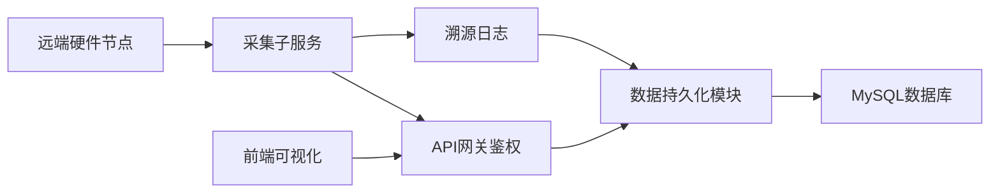
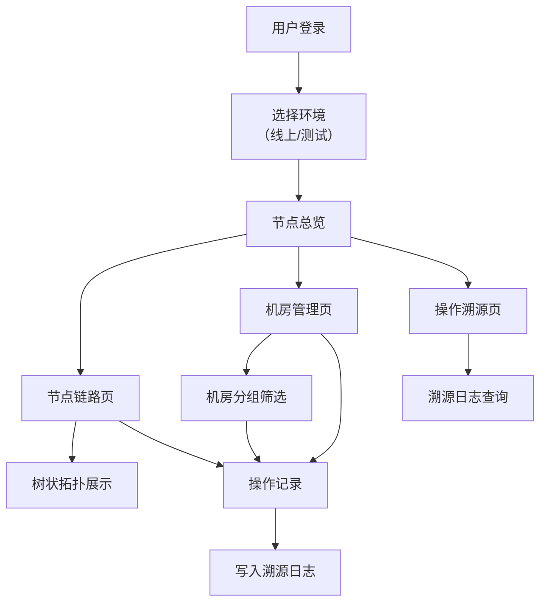

## 1. 产品概述

跨机房分布式节点状态溯源系统，用于实时监控多机房分布式硬件节点的运行状态，并支持操作日志溯源。解决大规模集群节点状态分散、故障定位难、操作不可追溯等问题。面向运维工程师、系统管理员提供一站式可视化监控平台。

核心价值：实现跨机房节点统一监控、链路拓扑可视化、操作全链路溯源，提升故障排查效率 80%。

---

## 2. 核心功能

### 2.1 用户角色

| 角色 | 登录方式 | 核心权限 |
|------|----------|----------|
| 系统管理员 | 账号密码登录 | 全功能权限、用户管理、系统配置 |
| 运维工程师 | 账号密码登录 | 节点监控、日志查询、机房管理 |
| 只读用户 | 账号密码登录 | 节点状态查看、报表导出 |

### 2.2 功能模块

1. **节点总览页**：全局状态统计、告警概览、节点分布地图
2. **节点链路页**：树状拓扑展示、节点详情钻取、链路状态追踪
3. **机房管理页**：机房分组筛选、机房信息管理、批量操作
4. **操作溯源页**：日志查询、操作审计、溯源链展示
5. **系统配置页**：用户管理、环境切换、告警规则配置

### 2.3 页面详情

| 页面名称 | 模块名称 | 功能描述 |
|----------|----------|----------|
| 登录页 | 身份认证 | 账号密码登录、环境切换（线上/测试）、记住登录态 |
| 节点总览页 | 状态大盘 | 节点在线率统计、CPU/内存使用率趋势、告警级别分布、机房健康度评分 |
| 节点链路页 | 拓扑展示 | 可折叠树状节点链路、节点状态颜色标识、点击钻取详情、节点关系连线 |
| 机房管理页 | 分组筛选 | 机房列表展示、按地域/状态筛选、批量启停采集、机房详情面板 |
| 操作溯源页 | 日志审计 | 操作日志列表、多条件组合查询、溯源链路可视化、日志详情弹窗 |
| 系统配置页 | 配置管理 | 用户权限配置、采集频率设置、告警阈值配置、环境参数配置 |

---

## 3. 核心流程

### 3.1 数据采集流程

采集子服务定时从远端硬件节点拉取运行数据，经网关鉴权后写入数据库，同时记录操作溯源日志。前端通过网关接口查询数据并可视化展示。

### 3.2 用户操作流程

用户登录系统后，可通过多级路由切换不同功能模块，在节点链路页查看树状拓扑，使用机房筛选面板过滤数据，所有操作均记录溯源日志。

---

## 4. 用户界面设计

### 4.1 设计风格

- **主色调**：深空蓝 `#1E3A5F` 作为主色，科技感青 `#00D4FF` 作为强调色
- **辅助色**：成功绿 `#00C853`、警告黄 `#FFD600`、危险红 `#FF1744`
- **背景色**：深灰 `#0F1419` 背景，营造运维监控系统的专业科技感
- **按钮风格**：扁平化设计，微圆角 `4px`，悬停时有轻微发光效果
- **字体**：主字体使用 `JetBrains Mono` 等宽字体（数据展示区），正文字体使用 `PingFang SC`
- **布局风格**：左侧导航栏 + 顶部状态栏 + 主内容区，卡片式模块布局
- **图标风格**：线性图标，统一 24px 尺寸，状态图标使用鲜明色彩区分

### 4.2 页面设计概览

| 页面名称 | 模块名称 | UI 元素 |
|----------|----------|----------|
| 登录页 | 登录表单 | 深色科技背景、渐变登录框、环境切换 Tab、动效输入框 |
| 节点总览页 | 状态大盘 | 数据卡片网格、趋势折线图、告警环形图、机房健康度进度条 |
| 节点链路页 | 拓扑展示 | 可折叠树状图、节点状态圆点、连线动画、详情侧边栏 |
| 机房管理页 | 筛选面板 | 左侧筛选抽屉、机房卡片网格、批量操作工具栏、状态标签 |
| 操作溯源页 | 日志列表 | 高级筛选表单、时间轴展示、溯源链路图、详情弹窗 |
| 系统配置页 | 配置表单 | Tab 切换、分组表单、开关组件、保存提示动效 |

### 4.3 响应式设计

- 桌面端优先设计，最小支持 1366px 宽度
- 导航栏在窄屏时自动折叠为图标模式
- 数据表格在小屏时转为卡片式展示
- 拓扑图支持自适应缩放，保证节点可见性

### 4.4 动效设计

- 页面切换采用左右滑动过渡动画
- 节点状态变化时有呼吸灯闪烁效果
- 数据加载时使用骨架屏占位
- 树状图展开/折叠带有平滑过渡动画
- 告警信息有脉冲提示动效
