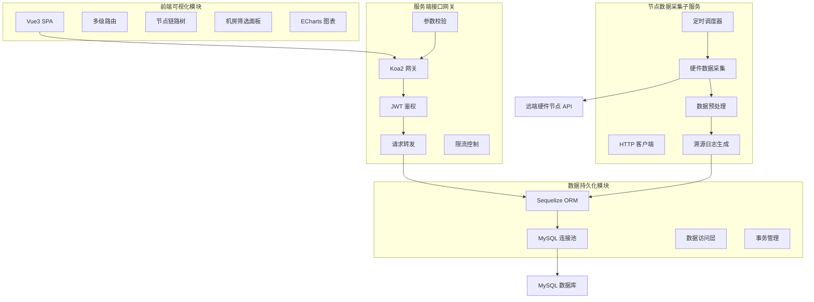
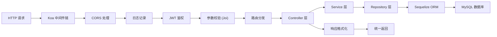
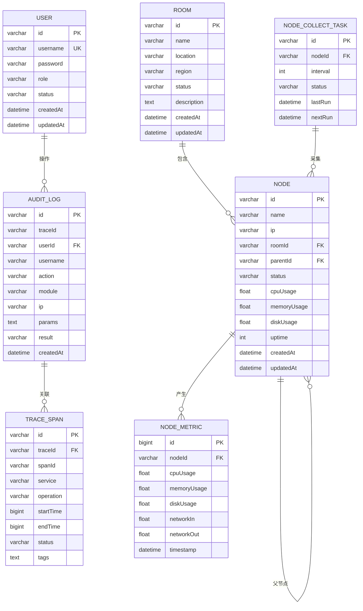

## 1. 系统架构设计

系统采用前后端分离的分布式架构，分为四大核心模块：前端可视化模块、服务端接口网关、节点数据采集子服务、数据持久化模块。



---

## 2. 技术选型

### 2.1 技术栈说明

| 层级 | 技术选型 | 版本 | 说明 |
|------|----------|------|------|
| 前端框架 | Vue | 3.4.x | Composition API + `<script setup>` |
| 构建工具 | Vite | 5.0.x | 极速开发体验 |
| 路由管理 | Vue Router | 4.3.x | 多级嵌套路由 |
| 状态管理 | Pinia | 2.1.x | 轻量级状态管理 |
| UI 框架 | Element Plus | 2.7.x | 企业级组件库 |
| 图表库 | ECharts | 5.5.x | 可视化图表 |
| HTTP 客户端 | Axios | 1.7.x | 请求拦截与响应 |
| 后端框架 | Koa | 2.15.x | 轻量级 Node.js 框架 |
| 网关框架 | koa-router | 12.0.x | 路由管理 |
| ORM | Sequelize | 6.37.x | MySQL ORM 框架 |
| 数据库 | MySQL | 8.0+ | 关系型数据库 |
| 鉴权 | jsonwebtoken | 9.0.x | JWT 令牌 |
| 参数校验 | joi | 17.13.x | 参数校验库 |
| 定时任务 | node-cron | 3.0.x | Cron 定时调度 |
| 日志 | winston | 3.13.x | 日志框架 |
| 环境管理 | dotenv | 16.4.x | 环境变量 |

### 2.2 环境配置

支持线上（production）和测试（development）双环境，通过环境变量区分：

| 配置项 | 测试环境 | 线上环境 |
|--------|----------|----------|
| 数据库端口 | 3306 | 3306 |
| 数据库名 | `node_trace_dev` | `node_trace_prod` |
| 网关端口 | 3000 | 8080 |
| 采集服务端口 | 3001 | 8081 |
| JWT 过期时间 | 24h | 2h |
| 采集频率 | 30秒 | 5分钟 |
| 日志级别 | debug | info |

---

## 3. 路由定义

### 3.1 前端路由

| 路由路径 | 页面名称 | 权限要求 | 说明 |
|----------|----------|----------|------|
| `/login` | 登录页 | 公开 | 登录表单、环境切换 |
| `/dashboard` | 节点总览页 | 需要登录 | 状态大盘、数据统计 |
| `/topology` | 节点链路页 | 需要登录 | 树状拓扑展示 |
| `/topology/:id` | 节点详情页 | 需要登录 | 嵌套路由，节点详情 |
| `/rooms` | 机房管理页 | 需要登录 | 机房列表、筛选面板 |
| `/rooms/:id` | 机房详情页 | 需要登录 | 嵌套路由，机房详情 |
| `/audit` | 操作溯源页 | 需要登录 | 日志列表、溯源链 |
| `/settings` | 系统配置页 | 管理员 | 用户管理、参数配置 |
| `/settings/users` | 用户管理 | 管理员 | 嵌套路由 |
| `/settings/alarm` | 告警配置 | 管理员 | 嵌套路由 |

### 3.2 后端 API 路由

| 方法 | 路径 | 模块 | 鉴权 | 说明 |
|------|------|------|------|------|
| POST | `/api/auth/login` | 网关 | 否 | 用户登录 |
| GET | `/api/nodes` | 网关 | 是 | 获取节点列表 |
| GET | `/api/nodes/:id` | 网关 | 是 | 获取节点详情 |
| GET | `/api/nodes/tree` | 网关 | 是 | 获取节点树状数据 |
| GET | `/api/nodes/metrics` | 网关 | 是 | 获取节点指标数据 |
| GET | `/api/rooms` | 网关 | 是 | 获取机房列表 |
| GET | `/api/rooms/:id/nodes` | 网关 | 是 | 获取机房下节点 |
| GET | `/api/audit/logs` | 网关 | 是 | 获取操作日志 |
| GET | `/api/audit/trace/:traceId` | 网关 | 是 | 获取溯源链路 |
| POST | `/api/collector/report` | 采集服务 | 是 | 采集数据上报 |
| GET | `/api/collector/status` | 采集服务 | 是 | 采集服务状态 |

---

## 4. API 定义

### 4.1 TypeScript 类型定义

```typescript
// 节点信息
interface NodeInfo {
  id: string;
  name: string;
  ip: string;
  roomId: string;
  parentId: string | null;
  status: 'online' | 'offline' | 'warning' | 'error';
  cpuUsage: number;
  memoryUsage: number;
  diskUsage: number;
  uptime: number;
  createdAt: string;
  updatedAt: string;
}

// 机房信息
interface RoomInfo {
  id: string;
  name: string;
  location: string;
  region: string;
  status: 'active' | 'maintenance' | 'offline';
  nodeCount: number;
  onlineCount: number;
  description: string;
}

// 节点树结构
interface TreeNode extends NodeInfo {
  children: TreeNode[];
}

// 操作日志
interface AuditLog {
  id: string;
  traceId: string;
  userId: string;
  username: string;
  action: string;
  module: string;
  ip: string;
  params: Record<string, any>;
  result: 'success' | 'failed';
  createdAt: string;
}

// 溯源链路
interface TraceLink {
  traceId: string;
  spans: TraceSpan[];
}

interface TraceSpan {
  spanId: string;
  service: string;
  operation: string;
  startTime: number;
  endTime: number;
  status: 'success' | 'error';
  tags: Record<string, any>;
}

// 登录请求
interface LoginRequest {
  username: string;
  password: string;
  environment: 'production' | 'development';
}

// 分页查询
interface PageQuery {
  page: number;
  pageSize: number;
  keyword?: string;
  status?: string;
  roomId?: string;
  startTime?: string;
  endTime?: string;
}

// 统一响应
interface ApiResponse<T> {
  code: number;
  message: string;
  data: T;
  timestamp: number;
}
```

### 4.2 请求/响应示例

**登录请求：**
```json
{
  "username": "admin",
  "password": "admin123",
  "environment": "development"
}
```

**登录响应：**
```json
{
  "code": 200,
  "message": "success",
  "data": {
    "token": "eyJhbGciOiJIUzI1NiIsInR5cCI6IkpXVCJ9...",
    "user": {
      "id": "1",
      "username": "admin",
      "role": "admin",
      "environment": "development"
    }
  },
  "timestamp": 1716892800000
}
```

---

## 5. 服务端架构



### 5.1 目录结构说明

```
backend/
├── gateway/                    # 服务端接口网关
│   ├── src/
│   │   ├── middleware/         # 中间件
│   │   │   ├── auth.js         # JWT 鉴权
│   │   │   ├── logger.js       # 请求日志
│   │   │   └── validator.js    # 参数校验
│   │   ├── controller/         # 控制器
│   │   ├── service/            # 业务逻辑
│   │   ├── router/             # 路由定义
│   │   ├── utils/              # 工具函数
│   │   ├── config/             # 配置文件
│   │   └── app.js              # 入口文件
│   └── package.json
├── collector/                  # 数据采集子服务
│   ├── src/
│   │   ├── scheduler/          # 定时任务
│   │   ├── collector/          # 数据采集器
│   │   ├── processor/          # 数据处理器
│   │   ├── reporter/           # 数据上报
│   │   ├── config/             # 配置
│   │   └── app.js              # 入口
│   └── package.json
└── persistence/                # 数据持久化模块
    ├── src/
    │   ├── models/             # 数据模型
    │   ├── repository/         # 数据访问层
    │   ├── migrations/         # 数据库迁移
    │   ├── seeders/            # 数据种子
    │   ├── config/             # 配置
    │   └── index.js            # 导出
    └── package.json
```

---

## 6. 数据模型

### 6.1 ER 图



### 6.2 DDL 语句

```sql
-- 用户表
CREATE TABLE `user` (
  `id` varchar(36) NOT NULL,
  `username` varchar(50) NOT NULL,
  `password` varchar(255) NOT NULL,
  `role` varchar(20) NOT NULL DEFAULT 'user',
  `status` varchar(20) NOT NULL DEFAULT 'active',
  `createdAt` datetime NOT NULL DEFAULT CURRENT_TIMESTAMP,
  `updatedAt` datetime NOT NULL DEFAULT CURRENT_TIMESTAMP ON UPDATE CURRENT_TIMESTAMP,
  PRIMARY KEY (`id`),
  UNIQUE KEY `uk_username` (`username`)
) ENGINE=InnoDB DEFAULT CHARSET=utf8mb4;

-- 机房表
CREATE TABLE `room` (
  `id` varchar(36) NOT NULL,
  `name` varchar(100) NOT NULL,
  `location` varchar(200) NOT NULL,
  `region` varchar(50) NOT NULL,
  `status` varchar(20) NOT NULL DEFAULT 'active',
  `description` text,
  `createdAt` datetime NOT NULL DEFAULT CURRENT_TIMESTAMP,
  `updatedAt` datetime NOT NULL DEFAULT CURRENT_TIMESTAMP ON UPDATE CURRENT_TIMESTAMP,
  PRIMARY KEY (`id`),
  KEY `idx_region` (`region`)
) ENGINE=InnoDB DEFAULT CHARSET=utf8mb4;

-- 节点表
CREATE TABLE `node` (
  `id` varchar(36) NOT NULL,
  `name` varchar(100) NOT NULL,
  `ip` varchar(45) NOT NULL,
  `roomId` varchar(36) NOT NULL,
  `parentId` varchar(36),
  `status` varchar(20) NOT NULL DEFAULT 'offline',
  `cpuUsage` float DEFAULT 0,
  `memoryUsage` float DEFAULT 0,
  `diskUsage` float DEFAULT 0,
  `uptime` int DEFAULT 0,
  `createdAt` datetime NOT NULL DEFAULT CURRENT_TIMESTAMP,
  `updatedAt` datetime NOT NULL DEFAULT CURRENT_TIMESTAMP ON UPDATE CURRENT_TIMESTAMP,
  PRIMARY KEY (`id`),
  KEY `idx_room` (`roomId`),
  KEY `idx_parent` (`parentId`),
  KEY `idx_status` (`status`),
  CONSTRAINT `fk_node_room` FOREIGN KEY (`roomId`) REFERENCES `room` (`id`),
  CONSTRAINT `fk_node_parent` FOREIGN KEY (`parentId`) REFERENCES `node` (`id`)
) ENGINE=InnoDB DEFAULT CHARSET=utf8mb4;

-- 节点指标历史表
CREATE TABLE `node_metric` (
  `id` bigint NOT NULL AUTO_INCREMENT,
  `nodeId` varchar(36) NOT NULL,
  `cpuUsage` float NOT NULL,
  `memoryUsage` float NOT NULL,
  `diskUsage` float NOT NULL,
  `networkIn` float DEFAULT 0,
  `networkOut` float DEFAULT 0,
  `timestamp` datetime NOT NULL DEFAULT CURRENT_TIMESTAMP,
  PRIMARY KEY (`id`),
  KEY `idx_node_time` (`nodeId`, `timestamp`),
  CONSTRAINT `fk_metric_node` FOREIGN KEY (`nodeId`) REFERENCES `node` (`id`)
) ENGINE=InnoDB DEFAULT CHARSET=utf8mb4;

-- 操作审计日志表
CREATE TABLE `audit_log` (
  `id` varchar(36) NOT NULL,
  `traceId` varchar(36) NOT NULL,
  `userId` varchar(36) NOT NULL,
  `username` varchar(50) NOT NULL,
  `action` varchar(100) NOT NULL,
  `module` varchar(50) NOT NULL,
  `ip` varchar(45) NOT NULL,
  `params` text,
  `result` varchar(20) NOT NULL,
  `createdAt` datetime NOT NULL DEFAULT CURRENT_TIMESTAMP,
  PRIMARY KEY (`id`),
  KEY `idx_trace` (`traceId`),
  KEY `idx_user` (`userId`),
  KEY `idx_time` (`createdAt`)
) ENGINE=InnoDB DEFAULT CHARSET=utf8mb4;

-- 调用链 Span 表
CREATE TABLE `trace_span` (
  `id` varchar(36) NOT NULL,
  `traceId` varchar(36) NOT NULL,
  `spanId` varchar(36) NOT NULL,
  `service` varchar(50) NOT NULL,
  `operation` varchar(100) NOT NULL,
  `startTime` bigint NOT NULL,
  `endTime` bigint NOT NULL,
  `status` varchar(20) NOT NULL,
  `tags` text,
  PRIMARY KEY (`id`),
  KEY `idx_trace` (`traceId`),
  KEY `idx_span` (`spanId`)
) ENGINE=InnoDB DEFAULT CHARSET=utf8mb4;

-- 采集任务表
CREATE TABLE `node_collect_task` (
  `id` varchar(36) NOT NULL,
  `nodeId` varchar(36) NOT NULL,
  `interval` int NOT NULL DEFAULT 30000,
  `status` varchar(20) NOT NULL DEFAULT 'active',
  `lastRun` datetime,
  `nextRun` datetime,
  `createdAt` datetime NOT NULL DEFAULT CURRENT_TIMESTAMP,
  `updatedAt` datetime NOT NULL DEFAULT CURRENT_TIMESTAMP ON UPDATE CURRENT_TIMESTAMP,
  PRIMARY KEY (`id`),
  UNIQUE KEY `uk_node` (`nodeId`),
  CONSTRAINT `fk_task_node` FOREIGN KEY (`nodeId`) REFERENCES `node` (`id`)
) ENGINE=InnoDB DEFAULT CHARSET=utf8mb4;
```

### 6.3 初始化数据

```sql
-- 初始化管理员账号 (密码: admin123)
INSERT INTO `user` (`id`, `username`, `password`, `role`, `status`) VALUES
('u_001', 'admin', '$2b$10$8WQdXs3vNqCqG0eJZ8wXUOvH1LhJ8bK2e7x6z5v4b3n2m1l0k9j8i7', 'admin', 'active'),
('u_002', 'operator', '$2b$10$8WQdXs3vNqCqG0eJZ8wXUOvH1LhJ8bK2e7x6z5v4b3n2m1l0k9j8i7', 'operator', 'active'),
('u_003', 'viewer', '$2b$10$8WQdXs3vNqCqG0eJZ8wXUOvH1LhJ8bK2e7x6z5v4b3n2m1l0k9j8i7', 'viewer', 'active');

-- 初始化机房数据
INSERT INTO `room` (`id`, `name`, `location`, `region`, `status`, `description`) VALUES
('r_001', '北京机房-A', '北京市朝阳区', 'north', 'active', '北京主数据中心A区'),
('r_002', '北京机房-B', '北京市海淀区', 'north', 'active', '北京主数据中心B区'),
('r_003', '上海机房', '上海市浦东新区', 'east', 'active', '上海容灾数据中心'),
('r_004', '深圳机房', '深圳市南山区', 'south', 'maintenance', '深圳数据中心（维护中）'),
('r_005', '成都机房', '成都市高新区', 'west', 'active', '西部数据中心');
```
