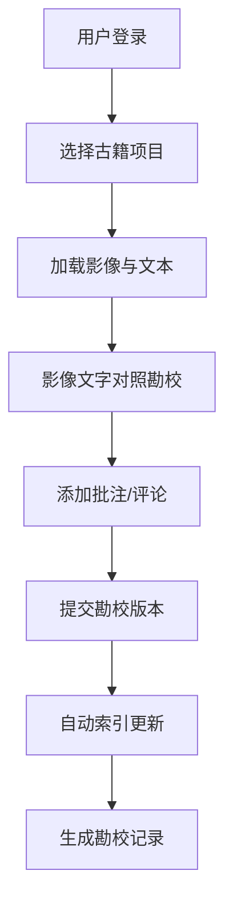
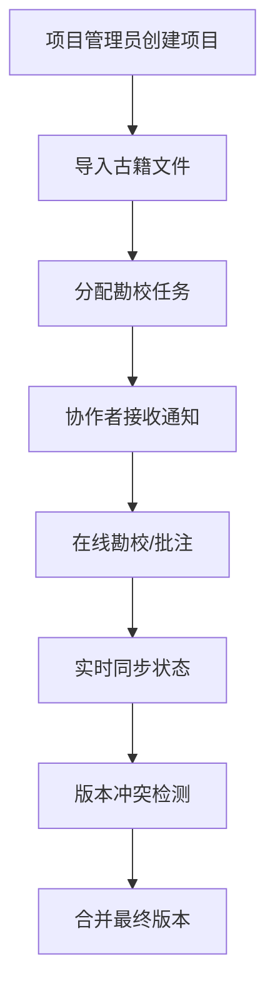

## 1. 产品概述

古籍数字化勘校全栈协作平台，旨在解决传统古籍整理效率低下、协作困难、检索不便等问题，为古籍研究人员、图书馆、文化机构提供集影像对照、在线勘校、多人批注、全文检索于一体的数字化协作解决方案。

- 核心价值：实现古籍数字化保护与学术研究的深度融合，支持跨地域、跨机构的协同工作
- 目标用户：古籍研究学者、图书馆馆员、文化遗产保护工作者、高校师生

## 2. 核心功能

### 2.1 用户角色

| 角色 | 注册方式 | 核心权限 |
|------|----------|----------|
| 超级管理员 | 系统初始化 | 用户管理、角色分配、系统配置、数据备份 |
| 项目管理员 | 管理员邀请 | 项目创建、成员管理、权限配置、版本管理 |
| 勘校员 | 项目邀请 | 文本勘校、批注添加、版本对比、数据导出 |
| 普通用户 | 自主注册 | 浏览公开项目、全文检索、查看批注 |

### 2.2 功能模块

1. **登录认证模块**：用户登录、角色权限验证、Token管理
2. **项目管理模块**：项目创建、古籍导入、成员管理、版本控制
3. **文本勘校模块**：影像与文字对照、OCR识别结果修正、多版本对比
4. **批注协作模块**：在线批注、实时通知、批注回复、历史追溯
5. **全文检索模块**：关键词检索、高级检索、检索结果高亮、相关推荐
6. **文件管理模块**：大文件上传、断点续传、分布式存储、文件预览
7. **系统管理模块**：用户管理、角色权限、系统日志、数据统计

### 2.3 页面详情

| 页面名称 | 模块名称 | 功能描述 |
|----------|----------|----------|
| 登录页 | 认证模块 | 账号密码登录、Token自动刷新、权限跳转 |
| 工作台 | 项目管理 | 项目列表、最近访问、任务统计、快捷入口 |
| 勘校工作台 | 文本勘校 | 左右分栏（影像/文字）、文字编辑、版本切换、快捷键支持 |
| 批注协作 | 批注模块 | 批注列表、实时评论、@提及、通知中心 |
| 全文检索 | 检索模块 | 搜索框、筛选条件、结果列表、高亮预览 |
| 文件管理 | 存储模块 | 文件上传、进度显示、文件列表、批量操作 |
| 用户管理 | 系统管理 | 用户列表、角色分配、权限配置、操作日志 |
| 系统设置 | 系统管理 | 个人信息、密码修改、通知设置 |

## 3. 核心流程

### 3.1 古籍勘校主流程

用户登录系统后，进入项目列表选择目标古籍项目，系统加载古籍影像与对应OCR识别文本，用户在左右分栏界面进行对照勘校，可添加批注与其他协作者讨论，完成后提交版本，系统自动索引更新。

### 3.2 多人协作流程

## 4. 用户界面设计

### 4.1 设计风格

- **主色调**：古籍风格的暖色系，以米白色(#F5F0E6)为背景，深棕色(#5D4E37)为主色，朱砂红(#C84C3B)为强调色
- **按钮风格**：圆角矩形，微浮雕效果，hover时有轻微阴影变化
- **字体**：标题使用宋体/思源宋体，正文使用思源黑体，兼顾传统韵味与现代可读性
- **布局风格**：左右分栏为主，卡片式模块布局，大量留白营造学术氛围
- **图标风格**：线性图标，配合古籍元素（印章、书签、卷轴等）装饰

### 4.2 页面设计概览

| 页面名称 | 模块名称 | UI元素 |
|----------|----------|--------|
| 登录页 | 认证模块 | 古籍纹理背景、居中登录卡片、品牌标识、简洁表单 |
| 工作台 | 项目管理 | 顶部导航、侧边栏、项目卡片网格、统计数据面板 |
| 勘校工作台 | 文本勘校 | 左右50:50分栏、影像缩放控制、文本编辑区、工具栏、版本时间轴 |
| 批注协作 | 批注模块 | 右侧抽屉式批注面板、评论气泡、@提及下拉框、实时提示 |
| 全文检索 | 检索模块 | 顶部搜索栏、筛选侧边栏、结果卡片列表、高亮预览片段 |
| 文件管理 | 存储模块 | 上传拖拽区、进度条、文件列表表格、批量操作工具栏 |
| 用户管理 | 系统管理 | 数据表格、角色标签、权限矩阵、操作日志时间线 |

### 4.3 响应式设计

- 桌面端优先设计，适配1920×1080及以上分辨率
- 平板端：侧边栏可收起，分栏比例自动调整
- 移动端：单列布局，核心功能优先展示，影像查看支持全屏模式

## 5. 非功能需求

### 5.1 性能要求

- 页面首屏加载时间 ≤ 3秒
- 古籍影像加载支持懒加载，单页响应时间 ≤ 1秒
- 全文检索响应时间 ≤ 500毫秒（百万级数据量）
- 支持1000+并发用户在线协作

### 5.2 安全要求

- 基于JWT的无状态认证
- 细粒度RBAC权限控制
- 接口请求签名验证
- 敏感数据加密存储
- 操作日志全记录

### 5.3 可扩展性

- 微服务架构，各模块独立部署
- 支持分布式文件存储横向扩展
- Elasticsearch集群化部署
- WebSocket实时通信支持
