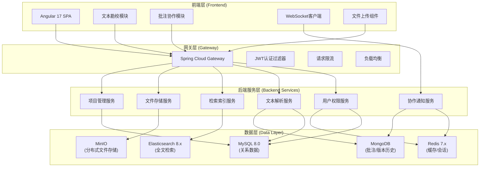
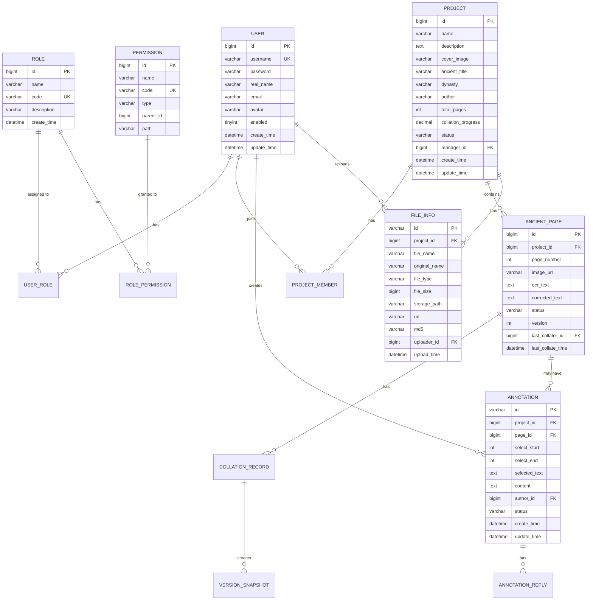

## 1. 架构设计



## 2. 技术描述

### 2.1 前端技术栈
- **框架**: Angular 17.0.0 + Standalone Components
- **UI组件库**: Angular Material 17.0.0 + PrimeNG 17.0.0
- **状态管理**: NgRx Signals + RxJS
- **构建工具**: Vite 5.0.0
- **样式**: Sass + CSS变量主题系统
- **实时通信**: Socket.IO Client
- **富文本编辑**: TipTap Editor
- **影像查看**: OpenSeadragon (支持古籍影像缩放、旋转)
- **TypeScript**: 5.2.0

### 2.2 后端技术栈
- **核心框架**: Spring Boot 3.2.0 + Spring Cloud 2023.0.0
- **安全认证**: Spring Security 6.2.0 + JWT + OAuth2
- **ORM**: Spring Data JPA + MyBatis-Plus 3.5.5
- **全文检索**: Spring Data Elasticsearch 5.2.0
- **缓存**: Spring Data Redis + Redisson
- **消息队列**: RabbitMQ 3.12 (异步处理、通知推送)
- **文件存储**: MinIO Java SDK + FastDFS
- **实时协作**: Spring WebSocket + STOMP
- **API文档**: SpringDoc OpenAPI 2.3.0
- **工具库**: Lombok + Hutool + MapStruct

### 2.3 数据库技术
- **关系型数据库**: MySQL 8.0 (用户、权限、项目、文本内容)
- **全文检索**: Elasticsearch 8.11.0 (古籍全文索引)
- **缓存数据库**: Redis 7.2 (会话、热点数据、分布式锁)
- **文档数据库**: MongoDB 7.0 (批注历史、版本快照、操作日志)
- **分布式存储**: MinIO RELEASE.2023-12-20 (古籍影像、PDF文件)

## 3. 前端路由定义

| 路由路径 | 页面组件 | 权限要求 | 说明 |
|----------|----------|----------|------|
| `/login` | LoginComponent | 公开 | 用户登录页 |
| `/dashboard` | DashboardComponent | 已登录 | 工作台首页 |
| `/projects` | ProjectListComponent | 已登录 | 项目列表 |
| `/projects/:id` | ProjectDetailComponent | 项目成员 | 项目详情 |
| `/collation/:projectId/:pageId` | CollationWorkbenchComponent | 勘校员 | 勘校工作台 |
| `/annotations/:projectId` | AnnotationPanelComponent | 项目成员 | 批注协作 |
| `/search` | SearchComponent | 已登录 | 全文检索 |
| `/files/:projectId` | FileManagerComponent | 项目成员 | 文件管理 |
| `/admin/users` | UserManagementComponent | 管理员 | 用户管理 |
| `/admin/roles` | RoleManagementComponent | 超级管理员 | 角色权限 |
| `/profile` | UserProfileComponent | 已登录 | 个人中心 |
| `**` | NotFoundComponent | 公开 | 404页面 |

## 4. API接口定义

### 4.1 认证模块

```typescript
// 请求类型
interface LoginRequest {
  username: string;
  password: string;
  captcha?: string;
}

interface TokenRefreshRequest {
  refreshToken: string;
}

// 响应类型
interface LoginResponse {
  accessToken: string;
  refreshToken: string;
  tokenType: string;
  expiresIn: number;
  user: UserInfo;
}

interface UserInfo {
  id: number;
  username: string;
  realName: string;
  email: string;
  avatar?: string;
  roles: string[];
  permissions: string[];
}

// API接口
POST /api/auth/login
POST /api/auth/refresh
POST /api/auth/logout
GET  /api/auth/me
```

### 4.2 项目管理模块

```typescript
interface Project {
  id: number;
  name: string;
  description: string;
  coverImage?: string;
  ancientBookTitle: string;
  dynasty: string;
  author: string;
  totalPages: number;
  collationProgress: number;
  status: 'DRAFT' | 'IN_PROGRESS' | 'COMPLETED' | 'ARCHIVED';
  createTime: string;
  updateTime: string;
  managerId: number;
  members: ProjectMember[];
}

interface ProjectMember {
  userId: number;
  username: string;
  realName: string;
  role: 'ADMIN' | 'COLLATOR' | 'VIEWER';
  joinTime: string;
}

// API接口
GET    /api/projects
GET    /api/projects/:id
POST   /api/projects
PUT    /api/projects/:id
DELETE /api/projects/:id
POST   /api/projects/:id/members
DELETE /api/projects/:id/members/:userId
GET    /api/projects/:id/progress
```

### 4.3 文本勘校模块

```typescript
interface AncientPage {
  id: number;
  projectId: number;
  pageNumber: number;
  imageUrl: string;
  ocrText: string;
  correctedText: string;
  status: 'UNCHECKED' | 'CHECKING' | 'CHECKED' | 'CONFLICT';
  version: number;
  lastCollatorId?: number;
  lastCollateTime?: string;
}

interface CollationRecord {
  id: number;
  pageId: number;
  beforeText: string;
  afterText: string;
  collatorId: number;
  collatorName: string;
  collateTime: string;
  remark?: string;
}

// API接口
GET    /api/collation/projects/:projectId/pages
GET    /api/collation/pages/:id
PUT    /api/collation/pages/:id
GET    /api/collation/pages/:id/history
POST   /api/collation/pages/:id/submit
GET    /api/collation/pages/:id/compare?version1=v1&version2=v2
```

### 4.4 批注协作模块

```typescript
interface Annotation {
  id: string;
  projectId: number;
  pageId?: number;
  textSelection?: {
    start: number;
    end: number;
    text: string;
  };
  content: string;
  authorId: number;
  authorName: string;
  authorAvatar?: string;
  status: 'OPEN' | 'RESOLVED' | 'CLOSED';
  mentions: number[];
  createTime: string;
  updateTime: string;
  replies: AnnotationReply[];
}

interface AnnotationReply {
  id: string;
  annotationId: string;
  content: string;
  authorId: number;
  authorName: string;
  createTime: string;
}

// API接口
GET    /api/annotations/projects/:projectId
POST   /api/annotations
PUT    /api/annotations/:id
DELETE /api/annotations/:id
POST   /api/annotations/:id/replies
PUT    /api/annotations/:id/status

// WebSocket实时通知
STOMP /topic/annotations/{projectId}
STOMP /topic/notifications/{userId}
```

### 4.5 全文检索模块

```typescript
interface SearchRequest {
  keyword: string;
  projectIds?: number[];
  dynasties?: string[];
  authors?: string[];
  page: number;
  pageSize: number;
  highlight: boolean;
}

interface SearchResult {
  id: string;
  projectId: number;
  projectName: string;
  pageId: number;
  pageNumber: number;
  ancientTitle: string;
  author: string;
  dynasty: string;
  content: string;
  highlight?: {
    content: string[];
  };
  score: number;
}

interface SearchResponse {
  total: number;
  page: number;
  pageSize: number;
  results: SearchResult[];
  aggregations?: {
    dynasties: { [key: string]: number };
    authors: { [key: string]: number };
    projects: { [key: string]: number };
  };
}

// API接口
POST /api/search
GET  /api/search/suggest?keyword=xxx
GET  /api/search/advanced/filters
```

### 4.6 文件存储模块

```typescript
interface FileUploadRequest {
  projectId: number;
  fileType: 'IMAGE' | 'PDF' | 'TEXT' | 'OTHER';
  description?: string;
}

interface FileInfo {
  id: string;
  projectId: number;
  fileName: string;
  originalName: string;
  fileType: string;
  fileSize: number;
  storagePath: string;
  url: string;
  uploaderId: number;
  uploadTime: string;
  md5: string;
  status: 'UPLOADING' | 'COMPLETED' | 'FAILED';
}

interface ChunkUploadRequest {
  uploadId: string;
  chunkNumber: number;
  totalChunks: number;
  chunkSize: number;
  file: File;
}

// API接口
POST   /api/files/init
POST   /api/files/chunk
POST   /api/files/merge
GET    /api/files/projects/:projectId
DELETE /api/files/:id
GET    /api/files/:id/download
GET    /api/files/:id/preview
```

### 4.7 用户权限模块

```typescript
interface User {
  id: number;
  username: string;
  realName: string;
  email: string;
  phone?: string;
  avatar?: string;
  enabled: boolean;
  roles: Role[];
  createTime: string;
}

interface Role {
  id: number;
  name: string;
  code: string;
  description: string;
  permissions: Permission[];
}

interface Permission {
  id: number;
  name: string;
  code: string;
  type: 'MENU' | 'BUTTON' | 'API';
  parentId?: number;
}

// API接口
GET    /api/admin/users
POST   /api/admin/users
PUT    /api/admin/users/:id
DELETE /api/admin/users/:id
PUT    /api/admin/users/:id/password
GET    /api/admin/roles
POST   /api/admin/roles
PUT    /api/admin/roles/:id
DELETE /api/admin/roles/:id
GET    /api/admin/permissions
PUT    /api/admin/roles/:id/permissions
```

## 5. 后端服务架构

```mermaid
graph TD
    subgraph "Controller层"
        A1["AuthController"]
        A2["ProjectController"]
        A3["CollationController"]
        A4["AnnotationController"]
        A5["SearchController"]
        A6["FileController"]
        A7["AdminController"]
    end

    subgraph "Service层"
        B1["AuthService"]
        B2["ProjectService"]
        B3["CollationService"]
        B4["AnnotationService"]
        B5["SearchService"]
        B6["FileStorageService"]
        B7["UserService"]
        B8["RoleService"]
        B9["PermissionService"]
        B10["NotificationService"]
        B11["TextParserService"]
    end

    subgraph "Repository/DAO层"
        C1["UserRepository"]
        C2["ProjectRepository"]
        C3["PageRepository"]
        C4["AnnotationRepository"]
        C5["RoleRepository"]
        C6["FileInfoRepository"]
        C7["ElasticsearchRepository"]
        C8["RedisRepository"]
    end

    subgraph "数据存储"
        D1["MySQL"]
        D2["Elasticsearch"]
        D3["MongoDB"]
        D4["Redis"]
        D5["MinIO"]
    end

    A1 --> B1 --> C1 --> D1
    A2 --> B2 --> C2 --> D1
    A3 --> B3 --> C3 --> D1
    A3 --> B11
    A4 --> B4 --> C4 --> D3
    A5 --> B5 --> C7 --> D2
    A6 --> B6 --> C6 --> D1
    A6 --> B6 --> D5
    A7 --> B7 --> C1 --> D1
    A7 --> B8 --> C5 --> D1
    A7 --> B9 --> C5 --> D1

    B3 --> C8 --> D4
    B4 --> B10 --> D4
    B5 --> C8 --> D4
```



## 6. 数据模型

### 6.1 实体关系图



### 6.2 DDL 脚本

```sql
-- 用户表
CREATE TABLE `sys_user` (
  `id` bigint NOT NULL AUTO_INCREMENT,
  `username` varchar(50) NOT NULL COMMENT '用户名',
  `password` varchar(255) NOT NULL COMMENT '密码',
  `real_name` varchar(50) NOT NULL COMMENT '真实姓名',
  `email` varchar(100) DEFAULT NULL COMMENT '邮箱',
  `phone` varchar(20) DEFAULT NULL COMMENT '手机号',
  `avatar` varchar(255) DEFAULT NULL COMMENT '头像',
  `enabled` tinyint(1) NOT NULL DEFAULT '1' COMMENT '是否启用',
  `create_time` datetime NOT NULL DEFAULT CURRENT_TIMESTAMP,
  `update_time` datetime NOT NULL DEFAULT CURRENT_TIMESTAMP ON UPDATE CURRENT_TIMESTAMP,
  PRIMARY KEY (`id`),
  UNIQUE KEY `uk_username` (`username`)
) ENGINE=InnoDB DEFAULT CHARSET=utf8mb4 COLLATE=utf8mb4_unicode_ci COMMENT='用户表';

-- 角色表
CREATE TABLE `sys_role` (
  `id` bigint NOT NULL AUTO_INCREMENT,
  `name` varchar(50) NOT NULL COMMENT '角色名称',
  `code` varchar(50) NOT NULL COMMENT '角色编码',
  `description` varchar(255) DEFAULT NULL COMMENT '描述',
  `create_time` datetime NOT NULL DEFAULT CURRENT_TIMESTAMP,
  PRIMARY KEY (`id`),
  UNIQUE KEY `uk_role_code` (`code`)
) ENGINE=InnoDB DEFAULT CHARSET=utf8mb4 COLLATE=utf8mb4_unicode_ci COMMENT='角色表';

-- 权限表
CREATE TABLE `sys_permission` (
  `id` bigint NOT NULL AUTO_INCREMENT,
  `name` varchar(50) NOT NULL COMMENT '权限名称',
  `code` varchar(100) NOT NULL COMMENT '权限编码',
  `type` varchar(20) NOT NULL COMMENT '权限类型: MENU/BUTTON/API',
  `parent_id` bigint DEFAULT NULL COMMENT '父权限ID',
  `path` varchar(255) DEFAULT NULL COMMENT '路由路径',
  PRIMARY KEY (`id`),
  UNIQUE KEY `uk_permission_code` (`code`)
) ENGINE=InnoDB DEFAULT CHARSET=utf8mb4 COLLATE=utf8mb4_unicode_ci COMMENT='权限表';

-- 用户角色关联表
CREATE TABLE `sys_user_role` (
  `id` bigint NOT NULL AUTO_INCREMENT,
  `user_id` bigint NOT NULL,
  `role_id` bigint NOT NULL,
  `create_time` datetime NOT NULL DEFAULT CURRENT_TIMESTAMP,
  PRIMARY KEY (`id`),
  UNIQUE KEY `uk_user_role` (`user_id`,`role_id`),
  KEY `fk_role` (`role_id`),
  CONSTRAINT `fk_user_role_user` FOREIGN KEY (`user_id`) REFERENCES `sys_user` (`id`),
  CONSTRAINT `fk_user_role_role` FOREIGN KEY (`role_id`) REFERENCES `sys_role` (`id`)
) ENGINE=InnoDB DEFAULT CHARSET=utf8mb4 COLLATE=utf8mb4_unicode_ci COMMENT='用户角色关联表';

-- 角色权限关联表
CREATE TABLE `sys_role_permission` (
  `id` bigint NOT NULL AUTO_INCREMENT,
  `role_id` bigint NOT NULL,
  `permission_id` bigint NOT NULL,
  `create_time` datetime NOT NULL DEFAULT CURRENT_TIMESTAMP,
  PRIMARY KEY (`id`),
  UNIQUE KEY `uk_role_permission` (`role_id`,`permission_id`),
  CONSTRAINT `fk_role_permission_role` FOREIGN KEY (`role_id`) REFERENCES `sys_role` (`id`),
  CONSTRAINT `fk_role_permission_permission` FOREIGN KEY (`permission_id`) REFERENCES `sys_permission` (`id`)
) ENGINE=InnoDB DEFAULT CHARSET=utf8mb4 COLLATE=utf8mb4_unicode_ci COMMENT='角色权限关联表';

-- 项目表
CREATE TABLE `project` (
  `id` bigint NOT NULL AUTO_INCREMENT,
  `name` varchar(100) NOT NULL COMMENT '项目名称',
  `description` text COMMENT '项目描述',
  `cover_image` varchar(255) DEFAULT NULL COMMENT '封面图片',
  `ancient_title` varchar(200) NOT NULL COMMENT '古籍名称',
  `dynasty` varchar(50) DEFAULT NULL COMMENT '朝代',
  `author` varchar(100) DEFAULT NULL COMMENT '作者',
  `total_pages` int NOT NULL DEFAULT '0' COMMENT '总页数',
  `collation_progress` decimal(5,2) NOT NULL DEFAULT '0.00' COMMENT '勘校进度',
  `status` varchar(20) NOT NULL DEFAULT 'DRAFT' COMMENT '状态: DRAFT/IN_PROGRESS/COMPLETED/ARCHIVED',
  `manager_id` bigint NOT NULL COMMENT '项目管理员ID',
  `create_time` datetime NOT NULL DEFAULT CURRENT_TIMESTAMP,
  `update_time` datetime NOT NULL DEFAULT CURRENT_TIMESTAMP ON UPDATE CURRENT_TIMESTAMP,
  PRIMARY KEY (`id`),
  KEY `idx_manager` (`manager_id`),
  KEY `idx_status` (`status`),
  CONSTRAINT `fk_project_manager` FOREIGN KEY (`manager_id`) REFERENCES `sys_user` (`id`)
) ENGINE=InnoDB DEFAULT CHARSET=utf8mb4 COLLATE=utf8mb4_unicode_ci COMMENT='项目表';

-- 项目成员表
CREATE TABLE `project_member` (
  `id` bigint NOT NULL AUTO_INCREMENT,
  `project_id` bigint NOT NULL,
  `user_id` bigint NOT NULL,
  `role` varchar(20) NOT NULL COMMENT '角色: ADMIN/COLLATOR/VIEWER',
  `join_time` datetime NOT NULL DEFAULT CURRENT_TIMESTAMP,
  PRIMARY KEY (`id`),
  UNIQUE KEY `uk_project_member` (`project_id`,`user_id`),
  KEY `fk_member_user` (`user_id`),
  CONSTRAINT `fk_member_project` FOREIGN KEY (`project_id`) REFERENCES `project` (`id`),
  CONSTRAINT `fk_member_user` FOREIGN KEY (`user_id`) REFERENCES `sys_user` (`id`)
) ENGINE=InnoDB DEFAULT CHARSET=utf8mb4 COLLATE=utf8mb4_unicode_ci COMMENT='项目成员表';

-- 古籍书页表
CREATE TABLE `ancient_page` (
  `id` bigint NOT NULL AUTO_INCREMENT,
  `project_id` bigint NOT NULL,
  `page_number` int NOT NULL COMMENT '页码',
  `image_url` varchar(500) NOT NULL COMMENT '影像URL',
  `ocr_text` longtext COMMENT 'OCR识别文本',
  `corrected_text` longtext COMMENT '勘校后文本',
  `status` varchar(20) NOT NULL DEFAULT 'UNCHECKED' COMMENT '状态: UNCHECKED/CHECKING/CHECKED/CONFLICT',
  `version` int NOT NULL DEFAULT '1' COMMENT '版本号',
  `last_collator_id` bigint DEFAULT NULL COMMENT '最后勘校人ID',
  `last_collate_time` datetime DEFAULT NULL COMMENT '最后勘校时间',
  `create_time` datetime NOT NULL DEFAULT CURRENT_TIMESTAMP,
  `update_time` datetime NOT NULL DEFAULT CURRENT_TIMESTAMP ON UPDATE CURRENT_TIMESTAMP,
  PRIMARY KEY (`id`),
  UNIQUE KEY `uk_project_page` (`project_id`,`page_number`),
  KEY `idx_status` (`status`),
  CONSTRAINT `fk_page_project` FOREIGN KEY (`project_id`) REFERENCES `project` (`id`),
  CONSTRAINT `fk_page_collator` FOREIGN KEY (`last_collator_id`) REFERENCES `sys_user` (`id`)
) ENGINE=InnoDB DEFAULT CHARSET=utf8mb4 COLLATE=utf8mb4_unicode_ci COMMENT='古籍书页表';

-- 勘校记录表
CREATE TABLE `collation_record` (
  `id` bigint NOT NULL AUTO_INCREMENT,
  `page_id` bigint NOT NULL,
  `before_text` longtext COMMENT '修改前文本',
  `after_text` longtext COMMENT '修改后文本',
  `collator_id` bigint NOT NULL,
  `remark` varchar(500) DEFAULT NULL COMMENT '备注',
  `create_time` datetime NOT NULL DEFAULT CURRENT_TIMESTAMP,
  PRIMARY KEY (`id`),
  KEY `idx_page` (`page_id`),
  KEY `idx_collator` (`collator_id`),
  CONSTRAINT `fk_record_page` FOREIGN KEY (`page_id`) REFERENCES `ancient_page` (`id`),
  CONSTRAINT `fk_record_collator` FOREIGN KEY (`collator_id`) REFERENCES `sys_user` (`id`)
) ENGINE=InnoDB DEFAULT CHARSET=utf8mb4 COLLATE=utf8mb4_unicode_ci COMMENT='勘校记录表';

-- 文件信息表
CREATE TABLE `file_info` (
  `id` varchar(64) NOT NULL COMMENT '文件ID',
  `project_id` bigint NOT NULL,
  `file_name` varchar(255) NOT NULL COMMENT '存储文件名',
  `original_name` varchar(255) NOT NULL COMMENT '原始文件名',
  `file_type` varchar(50) NOT NULL COMMENT '文件类型',
  `file_size` bigint NOT NULL COMMENT '文件大小(字节)',
  `storage_path` varchar(500) NOT NULL COMMENT '存储路径',
  `url` varchar(500) NOT NULL COMMENT '访问URL',
  `md5` varchar(32) DEFAULT NULL COMMENT '文件MD5',
  `uploader_id` bigint NOT NULL,
  `upload_time` datetime NOT NULL DEFAULT CURRENT_TIMESTAMP,
  `status` varchar(20) NOT NULL DEFAULT 'COMPLETED',
  PRIMARY KEY (`id`),
  KEY `idx_project` (`project_id`),
  KEY `idx_uploader` (`uploader_id`),
  KEY `idx_md5` (`md5`),
  CONSTRAINT `fk_file_project` FOREIGN KEY (`project_id`) REFERENCES `project` (`id`),
  CONSTRAINT `fk_file_uploader` FOREIGN KEY (`uploader_id`) REFERENCES `sys_user` (`id`)
) ENGINE=InnoDB DEFAULT CHARSET=utf8mb4 COLLATE=utf8mb4_unicode_ci COMMENT='文件信息表';

-- 初始化数据
INSERT INTO `sys_permission` (`name`, `code`, `type`, `path`) VALUES
('登录', 'auth:login', 'API', '/api/auth/login'),
('刷新令牌', 'auth:refresh', 'API', '/api/auth/refresh'),
('查看项目列表', 'project:list', 'API', '/api/projects'),
('创建项目', 'project:create', 'API', '/api/projects'),
('编辑项目', 'project:edit', 'API', '/api/projects/{id}'),
('删除项目', 'project:delete', 'API', '/api/projects/{id}'),
('查看勘校页面', 'collation:view', 'API', '/api/collation/pages/{id}'),
('提交勘校', 'collation:submit', 'API', '/api/collation/pages/{id}/submit'),
('添加批注', 'annotation:create', 'API', '/api/annotations'),
('查看批注', 'annotation:view', 'API', '/api/annotations'),
('全文检索', 'search:query', 'API', '/api/search'),
('上传文件', 'file:upload', 'API', '/api/files'),
('下载文件', 'file:download', 'API', '/api/files/{id}/download'),
('用户管理', 'admin:user:manage', 'API', '/api/admin/users'),
('角色管理', 'admin:role:manage', 'API', '/api/admin/roles');

INSERT INTO `sys_role` (`name`, `code`, `description`) VALUES
('超级管理员', 'SUPER_ADMIN', '拥有所有权限'),
('项目管理员', 'PROJECT_ADMIN', '管理项目和成员'),
('勘校员', 'COLLATOR', '文本勘校和批注'),
('普通用户', 'VIEWER', '浏览和检索');

INSERT INTO `sys_user` (`username`, `password`, `real_name`, `email`) VALUES
('admin', '$2a$10$N.zmdr9k7uOCQb376NoUnuTJ8iAt6Z5EHsM8lE9lBOsl7iKTV.7di', '系统管理员', 'admin@ancient.com');

INSERT INTO `sys_user_role` (`user_id`, `role_id`) VALUES (1, 1);
```

### 6.3 Elasticsearch 索引映射

```json
{
  "mappings": {
    "properties": {
      "projectId": { "type": "long" },
      "projectName": { "type": "keyword" },
      "pageId": { "type": "long" },
      "pageNumber": { "type": "integer" },
      "ancientTitle": {
        "type": "text",
        "analyzer": "ik_max_word",
        "search_analyzer": "ik_smart"
      },
      "author": { "type": "keyword" },
      "dynasty": { "type": "keyword" },
      "content": {
        "type": "text",
        "analyzer": "ik_max_word",
        "search_analyzer": "ik_smart"
      },
      "ocrText": {
        "type": "text",
        "analyzer": "ik_max_word",
        "search_analyzer": "ik_smart"
      },
      "correctedText": {
        "type": "text",
        "analyzer": "ik_max_word",
        "search_analyzer": "ik_smart"
      },
      "status": { "type": "keyword" },
      "createTime": { "type": "date", "format": "yyyy-MM-dd HH:mm:ss" },
      "updateTime": { "type": "date", "format": "yyyy-MM-dd HH:mm:ss" }
    }
  },
  "settings": {
    "number_of_shards": 3,
    "number_of_replicas": 2,
    "analysis": {
      "analyzer": {
        "ik_max_word": {
          "type": "custom",
          "tokenizer": "ik_max_word"
        },
        "ik_smart": {
          "type": "custom",
          "tokenizer": "ik_smart"
        }
      }
    }
  }
}
```

### 6.4 MongoDB 文档结构

```javascript
// 批注文档
{
  "_id": ObjectId(),
  "projectId": NumberLong(1),
  "pageId": NumberLong(100),
  "textSelection": {
    "start": 120,
    "end": 150,
    "text": "文本片段"
  },
  "content": "批注内容",
  "authorId": NumberLong(1),
  "authorName": "张三",
  "authorAvatar": "url",
  "status": "OPEN",
  "mentions": [NumberLong(2), NumberLong(3)],
  "replies": [
    {
      "_id": ObjectId(),
      "content": "回复内容",
      "authorId": NumberLong(2),
      "authorName": "李四",
      "createTime": ISODate()
    }
  ],
  "createTime": ISODate(),
  "updateTime": ISODate()
}

// 版本快照文档
{
  "_id": ObjectId(),
  "pageId": NumberLong(100),
  "version": 3,
  "content": "当时的文本内容",
  "collatorId": NumberLong(1),
  "collatorName": "张三",
  "createTime": ISODate(),
  "diffFromPrevious": {
    "type": "unified",
    "content": "diff内容"
  }
}

// 操作日志文档
{
  "_id": ObjectId(),
  "userId": NumberLong(1),
  "username": "admin",
  "operation": "UPDATE_PAGE",
  "targetType": "ANCIENT_PAGE",
  "targetId": "100",
  "ip": "192.168.1.100",
  "userAgent": "Mozilla/5.0...",
  "params": {},
  "result": "SUCCESS",
  "errorMessage": null,
  "createTime": ISODate()
}
```
