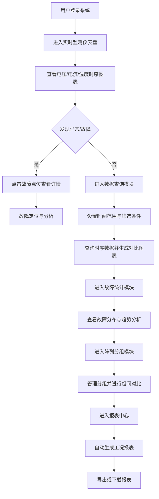

## 1. 产品概述

本系统是基于ECharts + Python FastAPI + VictoriaMetrics构建的光伏阵列工况时序数据分析可视化平台，旨在对全域光伏组件的电压、电流、温度等时序数据进行实时监测、分析与可视化展示。系统解决光伏电站运维中故障定位难、数据量大难以分析、工况统计效率低等核心问题，为运维人员、管理人员提供直观的数据洞察和决策支持。

## 2. 核心功能

### 2.1 用户角色
| 角色 | 注册方式 | 核心权限 |
|------|----------|----------|
| 运维人员 | 系统分配账号 | 查看实时监测、故障定位、工况报表 |
| 管理人员 | 系统分配账号 | 查看统计分析、分组管理、导出报表 |
| 系统管理员 | 系统分配账号 | 全功能权限、用户管理、系统配置 |

### 2.2 功能模块
1. **实时监测仪表盘**：多维度图表展示、关键指标概览、故障告警
2. **数据查询分析**：时序数据检索、多维度筛选、自定义时间范围
3. **故障统计分析**：故障点位可视化、故障类型统计、趋势分析
4. **阵列分组管理**：分组配置、组内统计、组间对比
5. **工况报表中心**：自动生成报表、多格式导出、报表历史

### 2.3 页面详情
| 页面名称 | 模块名称 | 功能描述 |
|---------|----------|----------|
| 实时监测仪表盘 | 指标概览卡片 | 展示总发电量、当前功率、效率、在线率等关键指标 |
| 实时监测仪表盘 | 电压电流趋势图 | 多组件电压电流实时曲线，支持大数据量加载 |
| 实时监测仪表盘 | 温度热力图 | 组件温度分布热力图，异常点位高亮 |
| 实时监测仪表盘 | 故障告警面板 | 实时故障推送、告警级别标识、快速定位 |
| 数据查询分析 | 时序数据查询 | 按时间范围、阵列、组件查询电压/电流/温度数据 |
| 数据查询分析 | 多维度筛选 | 支持按阵列、组串、故障状态等多条件筛选 |
| 数据查询分析 | 数据对比 | 多组件数据叠加对比分析 |
| 故障统计分析 | 故障点位地图 | 光伏阵列布局图，故障点位标记与详情 |
| 故障统计分析 | 故障类型统计 | 按故障类型、发生时间、严重程度统计 |
| 故障统计分析 | 故障趋势分析 | 故障发生频率趋势、故障率预测 |
| 阵列分组管理 | 分组配置 | 创建/编辑/删除阵列分组，分配组件 |
| 阵列分组管理 | 组内统计 | 分组内发电量、效率、故障统计 |
| 阵列分组管理 | 组间对比 | 多分组关键指标对比图表 |
| 工况报表中心 | 报表生成 | 自动生成日/周/月/年度工况报表 |
| 工况报表中心 | 报表预览 | 在线预览报表内容，支持交互 |
| 工况报表中心 | 报表导出 | 导出PDF/Excel格式报表 |

## 3. 核心流程

## 4. 用户界面设计

### 4.1 设计风格
- **主色调**：科技蓝 (#1677ff) 作为主色，代表电力与科技感
- **辅助色**：能源绿 (#52c41a) 代表正常运行，警示橙 (#faad14) 代表预警，危险红 (#ff4d4f) 代表故障
- **中性色**：深灰 (#1f1f1f) 背景，浅灰 (#f0f0f0) 卡片，白色文字 (#ffffff)
- **按钮风格**：圆角8px，带有微妙阴影，hover时有背景色过渡效果
- **字体**：标题使用 "PingFang SC" 粗体，正文使用 "Microsoft YaHei" 常规
- **布局风格**：深色科技风仪表盘布局，左侧导航栏，顶部状态栏，主内容区卡片式布局
- **图标风格**：使用线性图标，状态图标使用填充式增强辨识度

### 4.2 页面设计概述
| 页面名称 | 模块名称 | UI元素 |
|---------|----------|--------|
| 实时监测仪表盘 | 指标概览卡片 | 渐变背景卡片、数据动画、状态指示灯、趋势箭头 |
| 实时监测仪表盘 | 趋势图表 | 深色背景ECharts图表、数据缩放滑块、图例交互、悬浮提示 |
| 实时监测仪表盘 | 温度热力图 | 颜色渐变映射、网格布局、异常闪烁动画、点击弹窗 |
| 实时监测仪表盘 | 故障告警面板 | 滚动列表、级别徽章、时间戳、快速定位按钮 |
| 数据查询分析 | 查询表单 | 日期范围选择器、下拉筛选、搜索框、重置/查询按钮 |
| 数据查询分析 | 图表展示区 | 可折叠图表容器、切换标签页、全屏按钮、数据导出 |
| 故障统计分析 | 故障点位图 | 阵列拓扑图、节点标记、连线关系、缩放平移 |
| 故障统计分析 | 统计图表 | 柱状图/饼图/折线图组合、数据钻取、时间筛选 |
| 阵列分组管理 | 分组列表 | 树形结构、拖拽排序、编辑/删除操作、统计徽标 |
| 阵列分组管理 | 对比图表 | 雷达图/柱状图对比、分组选择器、指标切换 |
| 工况报表中心 | 报表列表 | 卡片式列表、生成状态、创建时间、操作按钮 |
| 工况报表中心 | 报表预览 | 分页预览、目录导航、打印样式 |

### 4.3 响应式设计
- **桌面优先**：针对1920x1080及以上分辨率优化，支持多窗口布局
- **平板适配**：1024px断点，导航栏折叠为抽屉式，图表自适应缩放
- **移动端**：768px断点，单列布局，关键指标优先展示，图表简化显示
- **触摸优化**：增大可点击区域至44x44px，支持手势缩放图表

### 4.4 数据可视化规范
- **时序数据**：折线图展示趋势，采样点支持千万级数据量，启用数据降采样
- **故障分布**：散点图+热力图组合，不同故障类型使用不同颜色标记
- **统计分析**：柱状图对比分组，饼图展示占比，雷达图多维度评估
- **实时更新**：数据刷新动画，新数据平滑过渡，避免突兀跳动
- **大数据优化**：启用ECharts大数据模式，使用Canvas渲染，按需加载数据
