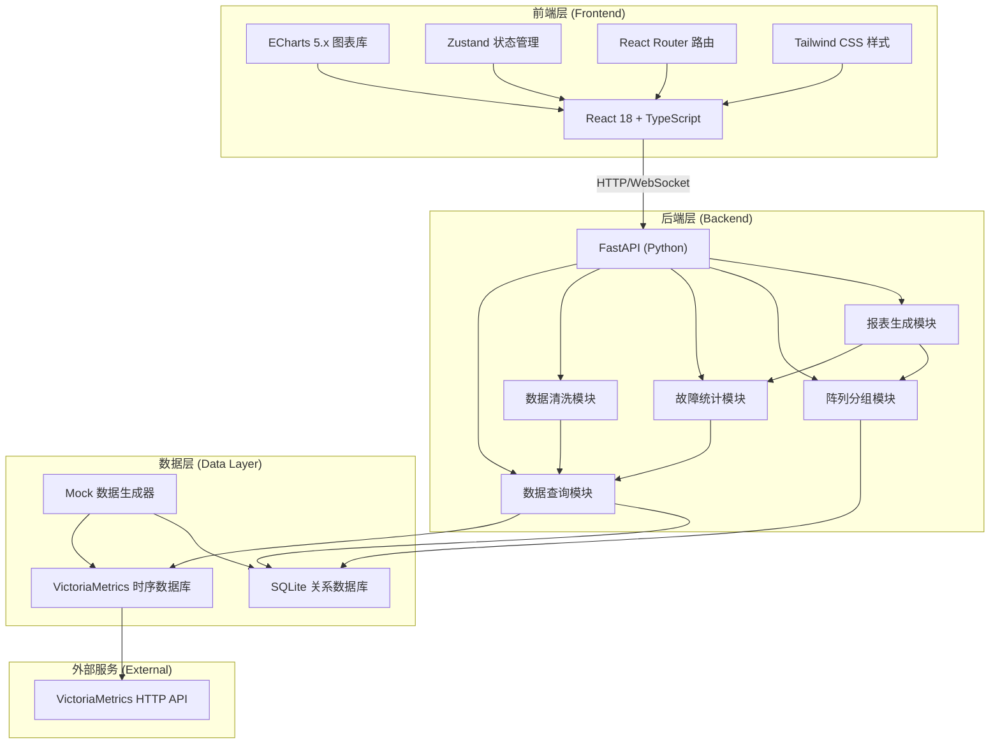
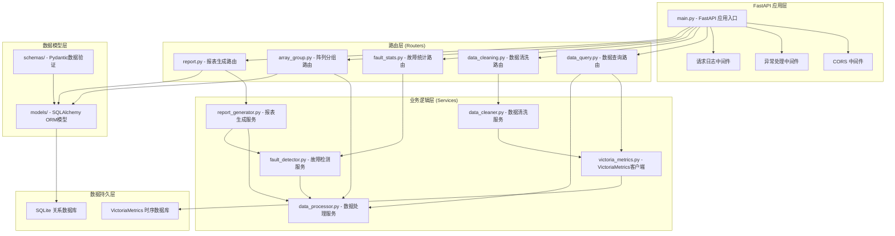
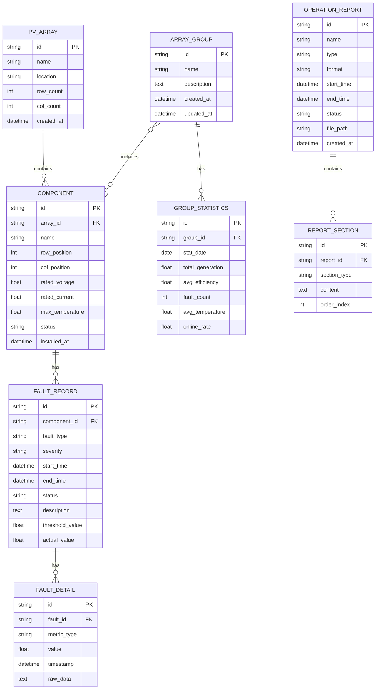

## 1. 架构设计



## 2. 技术描述

### 2.1 前端技术栈
- **框架**: React 18 + TypeScript
- **构建工具**: Vite 5.x
- **图表库**: ECharts 5.5.x (支持大数据量渲染)
- **状态管理**: Zustand 4.x
- **路由**: React Router DOM 6.x
- **样式**: Tailwind CSS 3.x
- **UI组件**: Ant Design 5.x (深色主题)
- **图标**: Lucide React
- **HTTP客户端**: Axios
- **数据处理**: Lodash, Day.js

### 2.2 后端技术栈
- **Web框架**: FastAPI (Python 3.11+)
- **ASGI服务器**: Uvicorn
- **时序数据库**: VictoriaMetrics
- **关系数据库**: SQLite (存储配置、分组、报表元数据)
- **ORM**: SQLAlchemy 2.x + Alembic
- **数据处理**: Pandas, NumPy
- **报表生成**: openpyxl (Excel), reportlab (PDF)
- **API文档**: Swagger UI / ReDoc (自动生成)

### 2.3 目录结构
```
project/
├── frontend/                    # 前端项目
│   ├── src/
│   │   ├── components/          # 可复用组件
│   │   │   ├── charts/          # ECharts图表组件
│   │   │   ├── layout/          # 布局组件
│   │   │   └── common/          # 通用组件
│   │   ├── pages/               # 页面组件
│   │   │   ├── Dashboard/       # 实时监测仪表盘
│   │   │   ├── DataQuery/       # 数据查询分析
│   │   │   ├── FaultAnalysis/   # 故障统计分析
│   │   │   ├── ArrayGroup/      # 阵列分组管理
│   │   │   └── ReportCenter/    # 工况报表中心
│   │   ├── hooks/               # 自定义Hooks
│   │   ├── store/               # Zustand状态管理
│   │   ├── services/            # API服务
│   │   ├── utils/               # 工具函数
│   │   ├── types/               # TypeScript类型定义
│   │   └── assets/              # 静态资源
│   ├── package.json
│   ├── vite.config.ts
│   ├── tsconfig.json
│   └── tailwind.config.js
│
├── backend/                     # 后端项目
│   ├── app/
│   │   ├── main.py              # FastAPI应用入口
│   │   ├── config.py            # 配置管理
│   │   ├── database.py          # 数据库连接
│   │   ├── models/              # SQLAlchemy模型
│   │   ├── schemas/             # Pydantic数据模型
│   │   ├── routers/             # API路由
│   │   │   ├── data_query.py    # 数据查询模块
│   │   │   ├── data_cleaning.py # 数据清洗模块
│   │   │   ├── fault_stats.py   # 故障统计模块
│   │   │   ├── array_group.py   # 阵列分组模块
│   │   │   └── report.py        # 报表生成模块
│   │   ├── services/            # 业务逻辑层
│   │   │   ├── victoria_metrics.py  # VictoriaMetrics客户端
│   │   │   ├── data_processor.py    # 数据处理服务
│   │   │   ├── fault_detector.py    # 故障检测服务
│   │   │   └── report_generator.py  # 报表生成服务
│   │   └── mock/                # Mock数据生成
│   ├── requirements.txt
│   └── alembic/                 # 数据库迁移
│
├── shared/                      # 前后端共享类型
│   └── types.ts
│
├── .trae/
│   └── documents/               # 项目文档
│
└── README.md
```

## 3. 路由定义

### 3.1 前端路由
| 路由路径 | 页面名称 | 说明 |
|---------|---------|------|
| / | 实时监测仪表盘 | 系统首页，展示关键指标和实时图表 |
| /dashboard | 实时监测仪表盘 | 同上 |
| /data-query | 数据查询分析 | 时序数据查询与多维度分析 |
| /fault-analysis | 故障统计分析 | 故障点位可视化与统计分析 |
| /array-group | 阵列分组管理 | 阵列分组配置与对比分析 |
| /report-center | 工况报表中心 | 报表生成、预览与导出 |

### 3.2 后端API路由
| 路由前缀 | 模块 | 说明 |
|---------|------|------|
| /api/data | 数据查询模块 | 时序数据查询接口 |
| /api/cleaning | 数据清洗模块 | 数据清洗与预处理接口 |
| /api/fault | 故障统计模块 | 故障检测与统计接口 |
| /api/group | 阵列分组模块 | 分组管理与统计接口 |
| /api/report | 报表生成模块 | 报表生成与导出接口 |

## 4. API定义

### 4.1 TypeScript类型定义

```typescript
// 时序数据点
interface TimeSeriesPoint {
  timestamp: number;
  value: number;
}

// 组件数据
interface ComponentData {
  componentId: string;
  arrayId: string;
  groupId?: string;
  voltage: TimeSeriesPoint[];
  current: TimeSeriesPoint[];
  temperature: TimeSeriesPoint[];
}

// 故障记录
interface FaultRecord {
  id: string;
  componentId: string;
  faultType: 'voltage_abnormal' | 'current_abnormal' | 'temperature_high' | 'offline' | 'short_circuit';
  severity: 'low' | 'medium' | 'high' | 'critical';
  startTime: number;
  endTime?: number;
  status: 'active' | 'resolved' | 'ignored';
  description: string;
  location: { row: number; col: number };
}

// 阵列分组
interface ArrayGroup {
  id: string;
  name: string;
  description?: string;
  arrayIds: string[];
  componentIds: string[];
  createdAt: number;
  updatedAt: number;
}

// 工况报表
interface OperationReport {
  id: string;
  name: string;
  type: 'daily' | 'weekly' | 'monthly' | 'yearly' | 'custom';
  startTime: number;
  endTime: number;
  status: 'generating' | 'completed' | 'failed';
  format: 'pdf' | 'excel';
  downloadUrl?: string;
  createdAt: number;
}

// 关键指标
interface KeyMetrics {
  totalGeneration: number;
  currentPower: number;
  efficiency: number;
  onlineRate: number;
  faultCount: number;
  temperatureAvg: number;
}

// API响应
interface ApiResponse<T> {
  code: number;
  message: string;
  data: T;
  timestamp: number;
}
```

### 4.2 API接口定义

```typescript
// 数据查询模块
interface DataQueryAPI {
  getTimeSeriesData(params: {
    componentIds: string[];
    metrics: ('voltage' | 'current' | 'temperature')[];
    startTime: number;
    endTime: number;
    step?: string;
    downsample?: boolean;
  }): Promise<ApiResponse<Record<string, ComponentData>>>;

  getComponentList(params?: {
    arrayId?: string;
    groupId?: string;
    status?: 'normal' | 'fault' | 'offline';
  }): Promise<ApiResponse<Component[]>>;

  getKeyMetrics(params?: {
    timeRange?: '1h' | '24h' | '7d' | '30d';
    groupId?: string;
  }): Promise<ApiResponse<KeyMetrics>>;
}

// 故障统计模块
interface FaultAPI {
  getFaultList(params: {
    startTime?: number;
    endTime?: number;
    severity?: FaultRecord['severity'][];
    faultType?: FaultRecord['faultType'][];
    status?: FaultRecord['status'][];
    componentId?: string;
    page?: number;
    pageSize?: number;
  }): Promise<ApiResponse<{ list: FaultRecord[]; total: number }>>;

  getFaultStatistics(params: {
    startTime: number;
    endTime: number;
    groupBy: 'type' | 'severity' | 'component' | 'time';
  }): Promise<ApiResponse<FaultStatistics>>;

  getFaultHeatmap(params: {
    startTime: number;
    endTime: number;
  }): Promise<ApiResponse<FaultHeatmapData>>;
}

// 阵列分组模块
interface GroupAPI {
  getGroups(): Promise<ApiResponse<ArrayGroup[]>>;

  createGroup(data: {
    name: string;
    description?: string;
    componentIds: string[];
  }): Promise<ApiResponse<ArrayGroup>>;

  updateGroup(id: string, data: Partial<ArrayGroup>): Promise<ApiResponse<ArrayGroup>>;

  deleteGroup(id: string): Promise<ApiResponse<void>>;

  getGroupStatistics(groupId: string, params: {
    startTime: number;
    endTime: number;
  }): Promise<ApiResponse<GroupStatistics>>;

  compareGroups(params: {
    groupIds: string[];
    startTime: number;
    endTime: number;
    metrics: string[];
  }): Promise<ApiResponse<GroupComparison[]>>;
}

// 报表模块
interface ReportAPI {
  generateReport(data: {
    name: string;
    type: OperationReport['type'];
    format: OperationReport['format'];
    startTime: number;
    endTime: number;
    groupIds?: string[];
  }): Promise<ApiResponse<OperationReport>>;

  getReportList(params?: {
    status?: OperationReport['status'][];
    type?: OperationReport['type'][];
  }): Promise<ApiResponse<OperationReport[]>>;

  downloadReport(id: string): Promise<Blob>;
}
```

## 5. 服务器架构图



## 6. 数据模型

### 6.1 数据模型定义



### 6.2 数据定义语言

```sql
-- 光伏阵列表
CREATE TABLE pv_array (
    id VARCHAR(36) PRIMARY KEY,
    name VARCHAR(100) NOT NULL,
    location VARCHAR(255),
    row_count INTEGER NOT NULL DEFAULT 10,
    col_count INTEGER NOT NULL DEFAULT 20,
    created_at TIMESTAMP NOT NULL DEFAULT CURRENT_TIMESTAMP
);

-- 光伏组件表
CREATE TABLE component (
    id VARCHAR(36) PRIMARY KEY,
    array_id VARCHAR(36) NOT NULL,
    name VARCHAR(100) NOT NULL,
    row_position INTEGER NOT NULL,
    col_position INTEGER NOT NULL,
    rated_voltage FLOAT NOT NULL DEFAULT 36.5,
    rated_current FLOAT NOT NULL DEFAULT 9.5,
    max_temperature FLOAT NOT NULL DEFAULT 85.0,
    status VARCHAR(20) NOT NULL DEFAULT 'normal',
    installed_at TIMESTAMP,
    FOREIGN KEY (array_id) REFERENCES pv_array(id)
);

-- 阵列分组表
CREATE TABLE array_group (
    id VARCHAR(36) PRIMARY KEY,
    name VARCHAR(100) NOT NULL,
    description TEXT,
    created_at TIMESTAMP NOT NULL DEFAULT CURRENT_TIMESTAMP,
    updated_at TIMESTAMP NOT NULL DEFAULT CURRENT_TIMESTAMP
);

-- 分组-组件关联表
CREATE TABLE group_component (
    group_id VARCHAR(36) NOT NULL,
    component_id VARCHAR(36) NOT NULL,
    created_at TIMESTAMP NOT NULL DEFAULT CURRENT_TIMESTAMP,
    PRIMARY KEY (group_id, component_id),
    FOREIGN KEY (group_id) REFERENCES array_group(id),
    FOREIGN KEY (component_id) REFERENCES component(id)
);

-- 故障记录表
CREATE TABLE fault_record (
    id VARCHAR(36) PRIMARY KEY,
    component_id VARCHAR(36) NOT NULL,
    fault_type VARCHAR(50) NOT NULL,
    severity VARCHAR(20) NOT NULL DEFAULT 'medium',
    start_time TIMESTAMP NOT NULL,
    end_time TIMESTAMP,
    status VARCHAR(20) NOT NULL DEFAULT 'active',
    description TEXT,
    threshold_value FLOAT,
    actual_value FLOAT,
    FOREIGN KEY (component_id) REFERENCES component(id)
);

-- 故障详情表
CREATE TABLE fault_detail (
    id VARCHAR(36) PRIMARY KEY,
    fault_id VARCHAR(36) NOT NULL,
    metric_type VARCHAR(50) NOT NULL,
    value FLOAT NOT NULL,
    timestamp TIMESTAMP NOT NULL,
    raw_data TEXT,
    FOREIGN KEY (fault_id) REFERENCES fault_record(id)
);

-- 分组统计表
CREATE TABLE group_statistics (
    id VARCHAR(36) PRIMARY KEY,
    group_id VARCHAR(36) NOT NULL,
    stat_date DATE NOT NULL,
    total_generation FLOAT NOT NULL DEFAULT 0,
    avg_efficiency FLOAT NOT NULL DEFAULT 0,
    fault_count INTEGER NOT NULL DEFAULT 0,
    avg_temperature FLOAT NOT NULL DEFAULT 0,
    online_rate FLOAT NOT NULL DEFAULT 100,
    FOREIGN KEY (group_id) REFERENCES array_group(id),
    UNIQUE(group_id, stat_date)
);

-- 工况报表表
CREATE TABLE operation_report (
    id VARCHAR(36) PRIMARY KEY,
    name VARCHAR(255) NOT NULL,
    type VARCHAR(20) NOT NULL,
    format VARCHAR(20) NOT NULL,
    start_time TIMESTAMP NOT NULL,
    end_time TIMESTAMP NOT NULL,
    status VARCHAR(20) NOT NULL DEFAULT 'generating',
    file_path VARCHAR(500),
    created_at TIMESTAMP NOT NULL DEFAULT CURRENT_TIMESTAMP
);

-- 索引优化
CREATE INDEX idx_component_array_id ON component(array_id);
CREATE INDEX idx_component_status ON component(status);
CREATE INDEX idx_fault_component ON fault_record(component_id);
CREATE INDEX idx_fault_type ON fault_record(fault_type);
CREATE INDEX idx_fault_severity ON fault_record(severity);
CREATE INDEX idx_fault_time ON fault_record(start_time, end_time);
CREATE INDEX idx_fault_status ON fault_record(status);
CREATE INDEX idx_stat_date ON group_statistics(stat_date);
CREATE INDEX idx_report_type ON operation_report(type);
CREATE INDEX idx_report_status ON operation_report(status);

-- 初始化数据
INSERT INTO pv_array (id, name, location, row_count, col_count) VALUES
('array_001', 'A区阵列', '屋顶东区', 10, 20),
('array_002', 'B区阵列', '屋顶西区', 8, 25),
('array_003', 'C区阵列', '车棚顶', 6, 30);
```

## 7. VictoriaMetrics 数据写入规范

### 7.1 指标命名规范
```
metric名称: pv_{metric_type}
标签:
  - component_id: 组件ID
  - array_id: 阵列ID
  - group_id: 分组ID(可选)
  - location: 位置描述

示例:
pv_voltage{component_id="comp_001", array_id="array_001", group_id="group_001"}
pv_current{component_id="comp_001", array_id="array_001", group_id="group_001"}
pv_temperature{component_id="comp_001", array_id="array_001", group_id="group_001"}
pv_power{component_id="comp_001", array_id="array_001", group_id="group_001"}
```

### 7.2 PromQL查询示例
```sql
-- 查询单个组件电压
pv_voltage{component_id="comp_001"}

-- 查询多个组件电流
pv_current{component_id=~"comp_001|comp_002|comp_003"}

-- 计算分组平均温度
avg(pv_temperature{group_id="group_001"})

-- 时间范围查询（降采样）
avg_over_time(pv_power[5m])

-- 统计故障次数
count_over_time(pv_voltage < 20 [1h])
```
