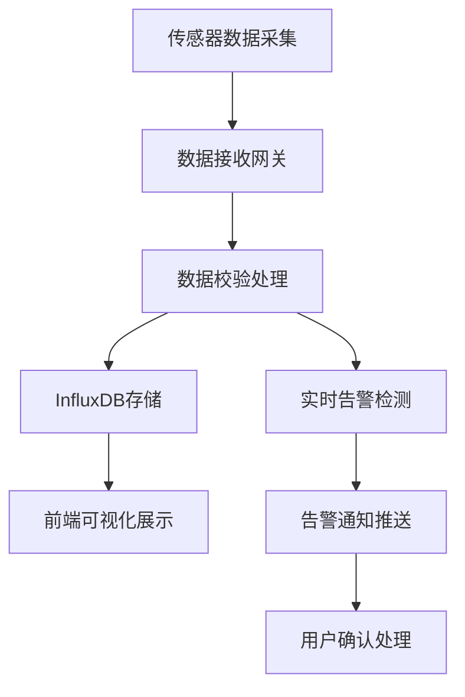

## 1. 产品概述
船舶舱内传感数据联动监控平台，实现船舶多舱室温湿度、液位、压力等传感数据的实时采集、展示与联动控制。支持近海/远海两套部署环境，为船舶安全运营提供数据支撑与智能决策。

## 2. 核心功能

### 2.1 用户角色
| 角色 | 注册方式 | 核心权限 |
|------|---------|---------|
| 船员用户 | 系统分配账号 | 查看舱室数据、接收告警、基础控制 |
| 管理员用户 | 系统管理员创建 | 全部功能、设备管理、参数配置 |

### 2.2 功能模块
1. **舱室可视化模块**: 船舶舱室平面图、实时数据叠加展示
2. **传感数据仪表盘模块**: 多维度数据图表、历史趋势分析
3. **数据接收网关**: 多协议传感数据接入、实时数据处理
4. **多舱室联动控制模块**: 设备远程控制、联动规则配置
5. **数据持久化模块**: InfluxDB时序数据存储、数据归档
6. **设备状态告警模块**: 阈值告警、异常检测、通知推送

### 2.3 页面详情
| 页面名称 | 模块名称 | 功能描述 |
|---------|---------|----------|
| 监控大屏 | 舱室可视化 | 船舶舱室布局图、实时数据叠加、设备状态指示 |
| 数据仪表盘 | 传感数据 | 实时数据概览、历史趋势图、数据对比分析 |
| 设备控制 | 联动控制 | 设备列表、远程控制、联动规则配置 |
| 告警中心 | 告警模块 | 告警列表、告警详情、告警处理记录 |
| 系统配置 | 系统管理 | 部署环境切换、用户管理、参数设置 |

## 3. 核心流程

### 3.1 数据采集与展示流程
传感器采集数据 → 数据接收网关 → 数据校验与处理 → InfluxDB持久化 → WebSocket实时推送 → 前端可视化展示

### 3.2 告警处理流程
数据阈值检测 → 告警触发 → 告警记录存储 → 告警通知推送 → 用户确认处理 → 告警闭环

## 4. 用户界面设计

### 4.1 设计风格
- **主色调**: 深海蓝 (#0A2463)，体现船舶工业感
- **辅助色**: 科技青 (#3E92CC)、告警红 (#D8315B)、正常绿 (#44AF69)
- **按钮风格**: 圆角矩形、悬停微动画、状态指示清晰
- **字体**: 主字体使用 Inter，数字显示使用 JetBrains Mono
- **布局风格**: 卡片式布局、深色主题、数据网格展示
- **图标风格**: Lucide 线性图标，统一风格

### 4.2 页面设计概览
| 页面名称 | 模块名称 | UI元素 |
|---------|---------|--------|
| 监控大屏 | 舱室可视化 | 舱室SVG布局图、实时数据标签、设备状态指示灯、滚动告警条 |
| 数据仪表盘 | 传感数据 | 统计卡片、ECharts折线图/仪表盘、数据表格、时间选择器 |
| 设备控制 | 联动控制 | 设备开关、滑块控制、规则表单、控制日志 |
| 告警中心 | 告警模块 | 告警等级徽章、时间轴、处理状态标签、筛选器 |

### 4.3 响应式
- 桌面端优先设计，适配1920×1080及以上分辨率
- 平板端自适应布局，调整卡片排列方式
- 移动端保留核心数据展示功能，简化操作界面

### 4.4 交互动效
- 数据实时更新时的数值跳动动画
- 告警弹窗滑入效果
- 舱室切换的平滑过渡
- 设备控制的状态反馈动画
