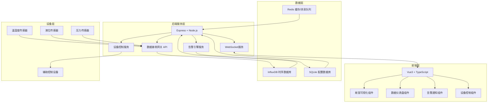
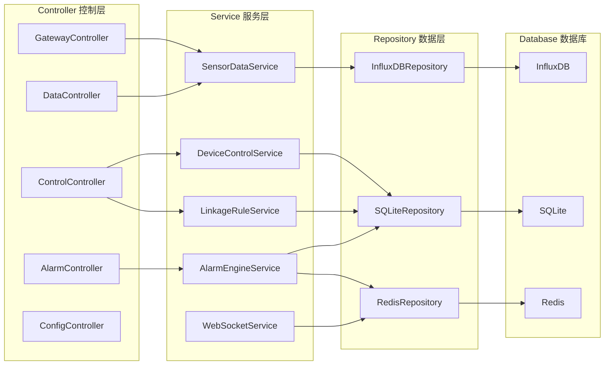
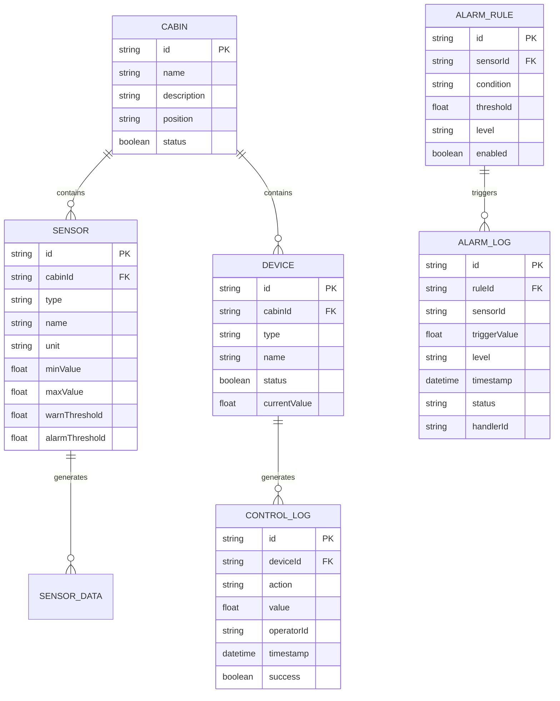

## 1. 架构设计



## 2. 技术描述

### 2.1 技术栈
- **前端**: Vue 3 + TypeScript + Vite + Tailwind CSS 3 + Vue Router + Pinia
- **后端**: Express 4 + Node.js + TypeScript
- **数据库**: 
  - InfluxDB 2.x (时序数据存储)
  - SQLite (配置数据存储)
  - Redis (消息队列/缓存)
- **可视化**: ECharts 5.x
- **实时通信**: Socket.io
- **部署**: Docker Compose

### 2.2 目录结构
```
project/
├── src/                          # 前端源码
│   ├── components/              # 通用组件
│   │   ├── cabin/              # 舱室可视化组件
│   │   ├── dashboard/          # 仪表盘组件
│   │   ├── alarm/              # 告警组件
│   │   └── control/            # 控制组件
│   ├── composables/            # Vue组合式函数
│   ├── pages/                  # 页面组件
│   ├── stores/                 # Pinia状态管理
│   ├── utils/                  # 工具函数
│   ├── api/                    # API请求封装
│   ├── types/                  # TypeScript类型定义
│   └── router/                 # 路由配置
├── api/                         # 后端源码
│   ├── src/
│   │   ├── controllers/        # 控制器
│   │   ├── services/           # 业务服务
│   │   ├── models/             # 数据模型
│   │   ├── routes/             # 路由定义
│   │   ├── middleware/         # 中间件
│   │   ├── gateways/           # 数据接收网关
│   │   └── utils/              # 工具函数
│   └── config/                 # 环境配置
│       ├── nearshore/          # 近海环境配置
│       └── offshore/           # 远海环境配置
├── shared/                      # 前后端共享类型
├── docker/                      # Docker配置
└── .trae/documents/            # 项目文档
```

## 3. 路由定义

| 路由路径 | 页面名称 | 功能描述 |
|---------|---------|----------|
| / | 监控大屏 | 舱室可视化总览、实时数据展示 |
| /dashboard | 数据仪表盘 | 多维度数据分析、历史趋势 |
| /control | 设备控制 | 设备列表、远程控制、规则配置 |
| /alarm | 告警中心 | 告警列表、告警处理 |
| /settings | 系统配置 | 环境切换、用户管理 |

## 4. API 定义

### 4.1 数据接收网关 API

```typescript
// 传感数据类型
interface SensorData {
  cabinId: string;
  sensorId: string;
  sensorType: 'temperature' | 'humidity' | 'level' | 'pressure';
  value: number;
  unit: string;
  timestamp: Date;
}

// 批量数据接收
POST /api/gateway/sensor/batch
Request: { data: SensorData[] }
Response: { success: boolean, received: number }

// 单条数据接收
POST /api/gateway/sensor
Request: SensorData
Response: { success: boolean }
```

### 4.2 设备控制 API

```typescript
interface DeviceControlCommand {
  deviceId: string;
  action: 'turnOn' | 'turnOff' | 'setLevel';
  value?: number;
  operatorId: string;
}

POST /api/control/device
Request: DeviceControlCommand
Response: { success: boolean, message: string }

GET /api/control/devices
Response: { devices: Device[] }
```

### 4.3 数据查询 API

```typescript
// 实时数据
GET /api/data/realtime/:cabinId
Response: { cabinId: string, sensors: SensorData[] }

// 历史数据
GET /api/data/history
Query: { sensorId, startTime, endTime, interval }
Response: { data: Array<{time: Date, value: number}> }
```

## 5. 服务架构图



## 6. 数据模型

### 6.1 数据模型定义



### 6.2 InfluxDB 数据结构

- **Bucket**: `sensor_data`
- **Measurement**: `sensor_reading`
- **Tags**: `cabinId`, `sensorId`, `sensorType`
- **Fields**: `value` (float)
- **Timestamp**: 数据采集时间戳
