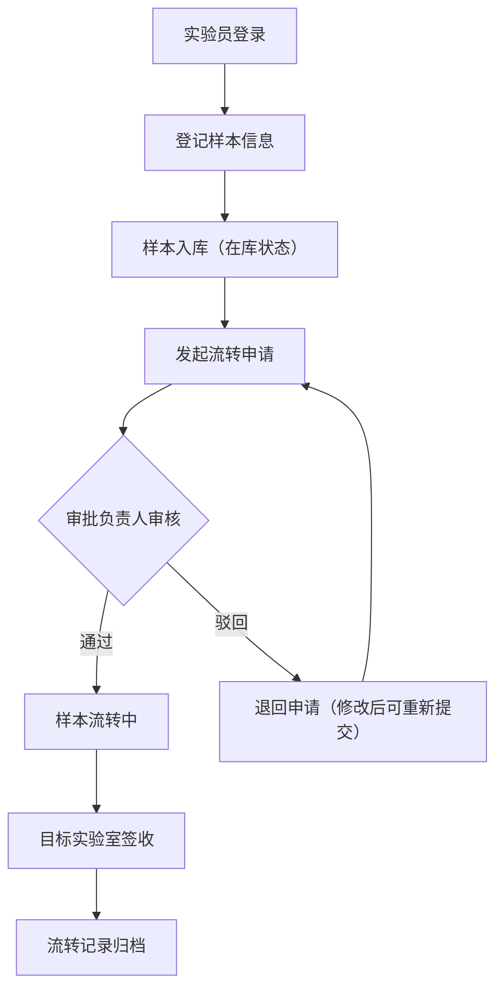
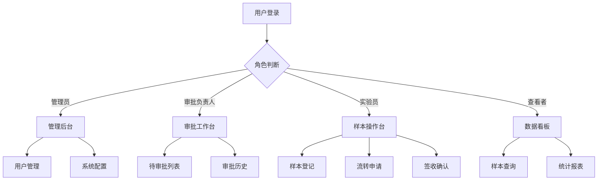

## 1. 产品概述

科研样本流转追踪系统是一套面向科研机构的全栈 Web 应用，旨在实现科研样本从登记入库、跨实验室流转审批、实时位置追踪到历史归档的全生命周期数字化管理，解决传统纸质/Excel管理下的样本去向不明、审批流程混乱、追溯困难等痛点。

- 目标用户：科研院所、高校实验室、生物医药企业的样本管理人员、实验员、审批负责人和系统管理员
- 核心价值：样本全流程可追溯、审批流程透明高效、跨实验室协作零障碍、数据统计驱动管理决策

## 2. 核心功能

### 2.1 用户角色

| 角色 | 注册方式 | 核心权限 |
|------|----------|----------|
| 系统管理员 | 管理员创建 | 用户管理、角色分配、系统配置、全部数据查看 |
| 审批负责人 | 管理员创建 | 流转审批（通过/驳回）、审批记录查看、本实验室样本管理 |
| 实验员 | 管理员创建 | 样本登记、流转申请、位置查看、个人操作记录 |
| 普通查看者 | 管理员创建 | 样本信息查看、流转记录查看、统计数据查看（只读） |

### 2.2 功能模块

1. **登录页**：多级角色账号登录、Token 鉴权
2. **样本录入页**：样本信息登记、二维码生成、批量导入、样本状态管理
3. **流转地图页**：实验室地图可视化、样本实时位置标注、流转路径回放、位置搜索
4. **审批路由页**：流转申请提交、多级审批流程、审批历史追溯、催办提醒
5. **数据统计页**：样本总量/分类统计、流转趋势图、实验室负载分析、审批效率报表

### 2.3 页面详情

| 页面名称 | 模块名称 | 功能描述 |
|----------|----------|----------|
| 登录页 | 登录表单 | 用户名密码登录、角色选择、记住登录状态 |
| 样本录入页 | 样本登记表单 | 填写样本名称、类型、来源、数量、存储条件、所属实验室等信息 |
| 样本录入页 | 样本列表 | 分页浏览已登记样本，支持搜索、筛选、状态标签显示 |
| 样本录入页 | 批量导入 | CSV/Excel 批量导入样本数据 |
| 样本录入页 | 样本详情 | 查看单个样本完整信息、操作历史、当前位置 |
| 流转地图页 | 实验室地图 | 可视化展示各实验室位置分布，支持缩放拖拽 |
| 流转地图页 | 样本位置标注 | 在地图上标注样本当前位置，点击查看详情 |
| 流转地图页 | 流转路径回放 | 动画回放样本历史流转路径 |
| 流转地图页 | 位置搜索 | 按样本名称或编号搜索定位 |
| 审批路由页 | 流转申请 | 填写流转目标实验室、原因、预计时间，提交申请 |
| 审批路由页 | 待审批列表 | 审批负责人查看待处理申请，支持通过/驳回 |
| 审批路由页 | 审批历史 | 查看所有已审批记录，筛选状态和时间 |
| 审批路由页 | 催办提醒 | 对超时未审批的申请发送催办通知 |
| 数据统计页 | 样本统计面板 | 样本总量、按类型/状态/实验室分布的图表 |
| 数据统计页 | 流转趋势 | 折线图展示流转数量随时间变化趋势 |
| 数据统计页 | 实验室负载 | 各实验室样本数量柱状图，负载预警 |
| 数据统计页 | 审批效率 | 平均审批时长、通过率、驳回原因分析 |

## 3. 核心流程

### 样本登记与流转全流程

1. 实验员登录系统，进入样本录入页，填写样本信息并提交登记
2. 样本进入"在库"状态，系统生成唯一编号和二维码
3. 实验员发起流转申请，选择目标实验室并填写流转原因
4. 审批负责人收到待审批通知，审核流转申请
5. 审批通过后，样本状态变为"流转中"，地图页实时更新位置
6. 样本到达目标实验室后，接收方确认签收，状态变为"已签收"
7. 所有流转记录自动归档至历史归档数据库

## 4. 用户界面设计

### 4.1 设计风格

- **主色调**：深蓝靛色（#1E3A5F）+ 青绿色（#0EA5A0）双色调，体现科研严谨与科技活力
- **辅助色**：琥珀橙（#F59E0B）用于警示/待审批，翡翠绿（#10B981）用于成功/已通过
- **背景**：浅灰白（#F8FAFC）主背景 + 白色卡片 + 微妙的蓝灰渐变侧边栏
- **按钮**：圆角（8px），主按钮填充色，次按钮描边，悬停时微阴影上浮
- **字体**：正文使用 Noto Sans SC，标题使用 Source Han Sans / 思源黑体 Bold，数据展示使用 JetBrains Mono 等宽字体
- **布局**：左侧固定导航栏 + 顶部标题栏 + 右侧主内容区，卡片式内容组织
- **图标**：Lucide Icons 线性图标风格，统一尺寸 20px

### 4.2 页面设计概览

| 页面名称 | 模块名称 | UI 元素 |
|----------|----------|---------|
| 登录页 | 登录表单 | 居中卡片布局、深蓝渐变背景、输入框带图标、角色下拉选择、登录按钮带加载动画 |
| 样本录入页 | 样本登记表单 | 左右分栏布局，左侧表单（输入框、下拉选择、日期选择器），右侧预览卡片 |
| 样本录入页 | 样本列表 | 表格布局、状态徽章、搜索栏、筛选标签、分页器、行操作按钮 |
| 流转地图页 | 实验室地图 | 全屏地图画布、SVG 实验室节点、连线表示流转路径、节点悬浮信息弹窗 |
| 流转地图页 | 流转路径回放 | 底部时间轴控件、播放/暂停按钮、速度调节、路径动画渐变色 |
| 审批路由页 | 待审批列表 | 卡片列表布局、申请摘要、操作按钮组（通过/驳回）、倒计时提醒 |
| 审批路由页 | 审批详情 | 弹窗抽屉、样本信息卡片、流转路线图、审批意见输入框 |
| 数据统计页 | 统计面板 | 四宫格指标卡片（带图标动画）、折线图、柱状图、饼图、数据表格 |

### 4.3 响应式

- 桌面优先设计（1920px、1440px、1280px 三个断点）
- 平板适配：侧边栏收窄为图标模式，表格支持横向滚动
- 移动端：侧边栏折叠为底部导航，卡片单列堆叠

### 4.4 3D 场景指导

不适用
