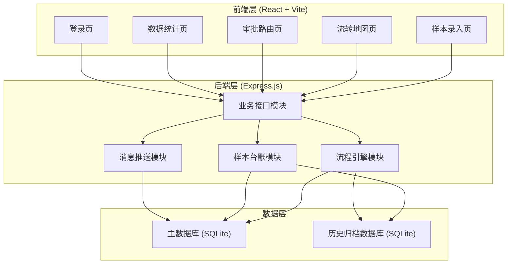
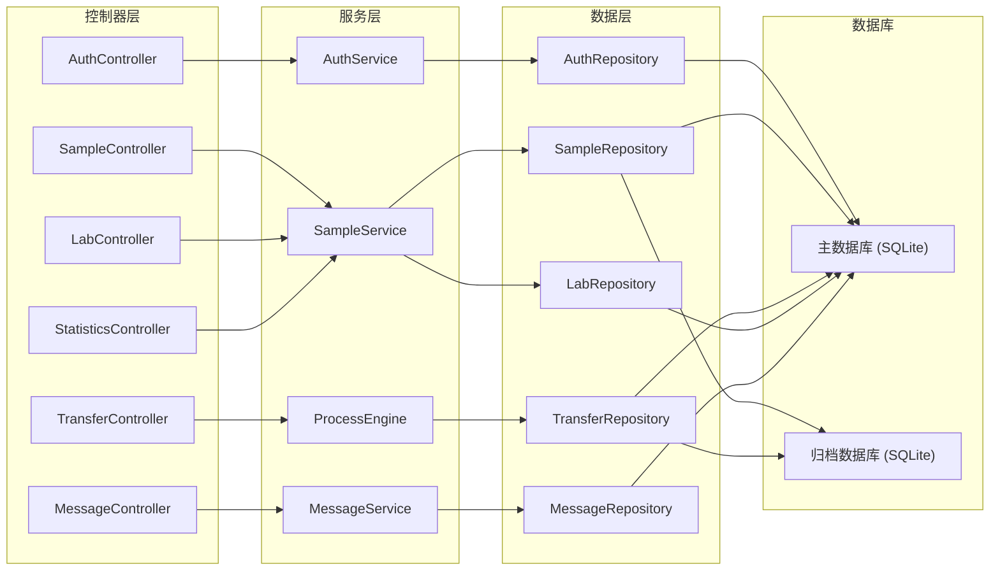
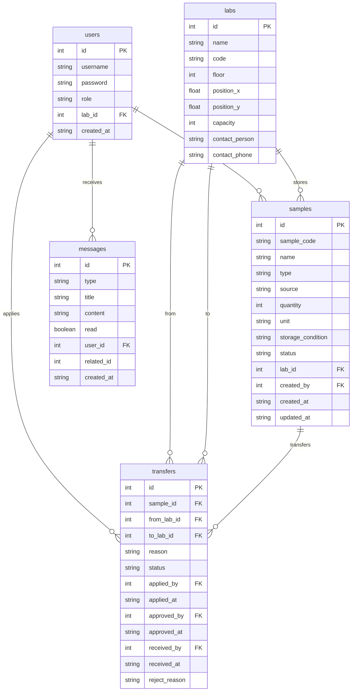

## 1. 架构设计



## 2. 技术说明

- **前端**：React@18 + TypeScript + TailwindCSS@3 + Vite
- **初始化工具**：vite-init (react-express-ts 模板)
- **状态管理**：Zustand
- **路由**：react-router-dom@6
- **图表**：recharts
- **图标**：lucide-react
- **后端**：Express@4 + TypeScript (ESM)
- **数据库**：SQLite (主数据库 + 历史归档数据库)，使用 better-sqlite3
- **认证**：JWT Token 鉴权
- **API 风格**：RESTful

## 3. 路由定义

| 路由 | 用途 |
|------|------|
| /login | 登录页面 |
| /register | 样本录入页（登记表单 + 样本列表） |
| /map | 流转地图页（实验室地图 + 位置追踪） |
| /approval | 审批路由页（流转申请 + 审批处理） |
| /statistics | 数据统计页（统计图表 + 报表） |

## 4. API 定义

### 4.1 认证接口

```typescript
interface LoginRequest {
  username: string;
  password: string;
}

interface LoginResponse {
  token: string;
  user: {
    id: number;
    username: string;
    role: "admin" | "approver" | "experimenter" | "viewer";
    labId: number;
    labName: string;
  };
}
```

### 4.2 样本接口

```typescript
interface Sample {
  id: number;
  sampleCode: string;
  name: string;
  type: "blood" | "tissue" | "cell" | "dna" | "rna" | "protein" | "other";
  source: string;
  quantity: number;
  unit: string;
  storageCondition: string;
  status: "in_stock" | "in_transit" | "received" | "archived" | "discarded";
  labId: number;
  labName: string;
  createdBy: number;
  createdAt: string;
  updatedAt: string;
}

interface CreateSampleRequest {
  name: string;
  type: Sample["type"];
  source: string;
  quantity: number;
  unit: string;
  storageCondition: string;
  labId: number;
}

interface SampleListQuery {
  page?: number;
  pageSize?: number;
  keyword?: string;
  type?: Sample["type"];
  status?: Sample["status"];
  labId?: number;
}

interface PaginatedResponse<T> {
  data: T[];
  total: number;
  page: number;
  pageSize: number;
}
```

### 4.3 流转接口

```typescript
interface Transfer {
  id: number;
  sampleId: number;
  sampleCode: string;
  sampleName: string;
  fromLabId: number;
  fromLabName: string;
  toLabId: number;
  toLabName: string;
  reason: string;
  status: "pending" | "approved" | "rejected" | "in_transit" | "received";
  appliedBy: number;
  appliedAt: string;
  approvedBy?: number;
  approvedAt?: string;
  receivedBy?: number;
  receivedAt?: string;
  rejectReason?: string;
}

interface CreateTransferRequest {
  sampleId: number;
  toLabId: number;
  reason: string;
}

interface ApproveTransferRequest {
  transferId: number;
  approved: boolean;
  comment?: string;
}
```

### 4.4 实验室接口

```typescript
interface Lab {
  id: number;
  name: string;
  code: string;
  floor: number;
  positionX: number;
  positionY: number;
  capacity: number;
  currentCount: number;
  contactPerson: string;
  contactPhone: string;
}
```

### 4.5 统计接口

```typescript
interface StatisticsOverview {
  totalSamples: number;
  inStockCount: number;
  inTransitCount: number;
  receivedCount: number;
  pendingApprovalCount: number;
}

interface TransferTrend {
  date: string;
  count: number;
}

interface LabLoad {
  labId: number;
  labName: string;
  currentCount: number;
  capacity: number;
  utilizationRate: number;
}

interface ApprovalEfficiency {
  averageApprovalHours: number;
  approvalRate: number;
  rejectionRate: number;
  totalApproved: number;
  totalRejected: number;
}
```

### 4.6 消息接口

```typescript
interface Message {
  id: number;
  type: "approval_pending" | "approval_result" | "transfer_received" | "system";
  title: string;
  content: string;
  read: boolean;
  userId: number;
  relatedId?: number;
  createdAt: string;
}
```

## 5. 服务端架构图



## 6. 数据模型

### 6.1 数据模型定义



### 6.2 数据定义语言

#### 主数据库 (main.db)

```sql
CREATE TABLE users (
    id INTEGER PRIMARY KEY AUTOINCREMENT,
    username TEXT NOT NULL UNIQUE,
    password TEXT NOT NULL,
    role TEXT NOT NULL CHECK(role IN ('admin', 'approver', 'experimenter', 'viewer')),
    lab_id INTEGER,
    created_at TEXT NOT NULL DEFAULT (datetime('now')),
    updated_at TEXT NOT NULL DEFAULT (datetime('now')),
    FOREIGN KEY (lab_id) REFERENCES labs(id)
);

CREATE TABLE labs (
    id INTEGER PRIMARY KEY AUTOINCREMENT,
    name TEXT NOT NULL,
    code TEXT NOT NULL UNIQUE,
    floor INTEGER NOT NULL DEFAULT 1,
    position_x REAL NOT NULL DEFAULT 0,
    position_y REAL NOT NULL DEFAULT 0,
    capacity INTEGER NOT NULL DEFAULT 100,
    contact_person TEXT NOT NULL DEFAULT '',
    contact_phone TEXT NOT NULL DEFAULT '',
    created_at TEXT NOT NULL DEFAULT (datetime('now'))
);

CREATE TABLE samples (
    id INTEGER PRIMARY KEY AUTOINCREMENT,
    sample_code TEXT NOT NULL UNIQUE,
    name TEXT NOT NULL,
    type TEXT NOT NULL CHECK(type IN ('blood', 'tissue', 'cell', 'dna', 'rna', 'protein', 'other')),
    source TEXT NOT NULL DEFAULT '',
    quantity INTEGER NOT NULL DEFAULT 1,
    unit TEXT NOT NULL DEFAULT '份',
    storage_condition TEXT NOT NULL DEFAULT '',
    status TEXT NOT NULL DEFAULT 'in_stock' CHECK(status IN ('in_stock', 'in_transit', 'received', 'archived', 'discarded')),
    lab_id INTEGER NOT NULL,
    created_by INTEGER NOT NULL,
    created_at TEXT NOT NULL DEFAULT (datetime('now')),
    updated_at TEXT NOT NULL DEFAULT (datetime('now')),
    FOREIGN KEY (lab_id) REFERENCES labs(id),
    FOREIGN KEY (created_by) REFERENCES users(id)
);

CREATE TABLE transfers (
    id INTEGER PRIMARY KEY AUTOINCREMENT,
    sample_id INTEGER NOT NULL,
    from_lab_id INTEGER NOT NULL,
    to_lab_id INTEGER NOT NULL,
    reason TEXT NOT NULL DEFAULT '',
    status TEXT NOT NULL DEFAULT 'pending' CHECK(status IN ('pending', 'approved', 'rejected', 'in_transit', 'received')),
    applied_by INTEGER NOT NULL,
    applied_at TEXT NOT NULL DEFAULT (datetime('now')),
    approved_by INTEGER,
    approved_at TEXT,
    received_by INTEGER,
    received_at TEXT,
    reject_reason TEXT DEFAULT '',
    FOREIGN KEY (sample_id) REFERENCES samples(id),
    FOREIGN KEY (from_lab_id) REFERENCES labs(id),
    FOREIGN KEY (to_lab_id) REFERENCES labs(id),
    FOREIGN KEY (applied_by) REFERENCES users(id),
    FOREIGN KEY (approved_by) REFERENCES users(id),
    FOREIGN KEY (received_by) REFERENCES users(id)
);

CREATE TABLE messages (
    id INTEGER PRIMARY KEY AUTOINCREMENT,
    type TEXT NOT NULL CHECK(type IN ('approval_pending', 'approval_result', 'transfer_received', 'system')),
    title TEXT NOT NULL,
    content TEXT NOT NULL DEFAULT '',
    read INTEGER NOT NULL DEFAULT 0,
    user_id INTEGER NOT NULL,
    related_id INTEGER,
    created_at TEXT NOT NULL DEFAULT (datetime('now')),
    FOREIGN KEY (user_id) REFERENCES users(id)
);

CREATE INDEX idx_samples_code ON samples(sample_code);
CREATE INDEX idx_samples_status ON samples(status);
CREATE INDEX idx_samples_lab ON samples(lab_id);
CREATE INDEX idx_transfers_status ON transfers(status);
CREATE INDEX idx_transfers_sample ON transfers(sample_id);
CREATE INDEX idx_messages_user ON messages(user_id);
CREATE INDEX idx_messages_read ON messages(read);

-- 初始数据：实验室
INSERT INTO labs (name, code, floor, position_x, position_y, capacity, contact_person, contact_phone) VALUES
('分子生物学实验室', 'LAB-MOL', 1, 150, 100, 200, '张主任', '13800000001'),
('细胞培养实验室', 'LAB-CELL', 1, 400, 100, 150, '李主任', '13800000002'),
('基因测序实验室', 'LAB-GENE', 2, 150, 300, 180, '王主任', '13800000003'),
('蛋白质分析实验室', 'LAB-PROT', 2, 400, 300, 120, '赵主任', '13800000004'),
('药物筛选实验室', 'LAB-DRUG', 3, 150, 500, 160, '钱主任', '13800000005'),
('病理标本实验室', 'LAB-PATH', 3, 400, 500, 100, '孙主任', '13800000006');

-- 初始数据：用户（密码均为 123456 的 bcrypt hash）
INSERT INTO users (username, password, role, lab_id) VALUES
('admin', '$2b$10$EixZaYVK1fsbw1ZfbX3OXePaWxn96p36Kz7aKdBdCkqy5uLbTLyqm', 'admin', NULL),
('zhang_approver', '$2b$10$EixZaYVK1fsbw1ZfbX3OXePaWxn96p36Kz7aKdBdCkqy5uLbTLyqm', 'approver', 1),
('li_approver', '$2b$10$EixZaYVK1fsbw1ZfbX3OXePaWxn96p36Kz7aKdBdCkqy5uLbTLyqm', 'approver', 2),
('wang_experimenter', '$2b$10$EixZaYVK1fsbw1ZfbX3OXePaWxn96p36Kz7aKdBdCkqy5uLbTLyqm', 'experimenter', 1),
('zhao_viewer', '$2b$10$EixZaYVK1fsbw1ZfbX3OXePaWxn96p36Kz7aKdBdCkqy5uLbTLyqm', 'viewer', 3);
```

#### 历史归档数据库 (archive.db)

```sql
CREATE TABLE archived_transfers (
    id INTEGER PRIMARY KEY,
    sample_id INTEGER NOT NULL,
    sample_code TEXT NOT NULL,
    sample_name TEXT NOT NULL,
    from_lab_id INTEGER NOT NULL,
    from_lab_name TEXT NOT NULL,
    to_lab_id INTEGER NOT NULL,
    to_lab_name TEXT NOT NULL,
    reason TEXT NOT NULL DEFAULT '',
    applied_by INTEGER NOT NULL,
    applied_at TEXT NOT NULL,
    approved_by INTEGER,
    approved_at TEXT,
    received_by INTEGER,
    received_at TEXT,
    archived_at TEXT NOT NULL DEFAULT (datetime('now'))
);

CREATE INDEX idx_archived_transfers_sample ON archived_transfers(sample_id);
CREATE INDEX idx_archived_transfers_date ON archived_transfers(archived_at);
```
