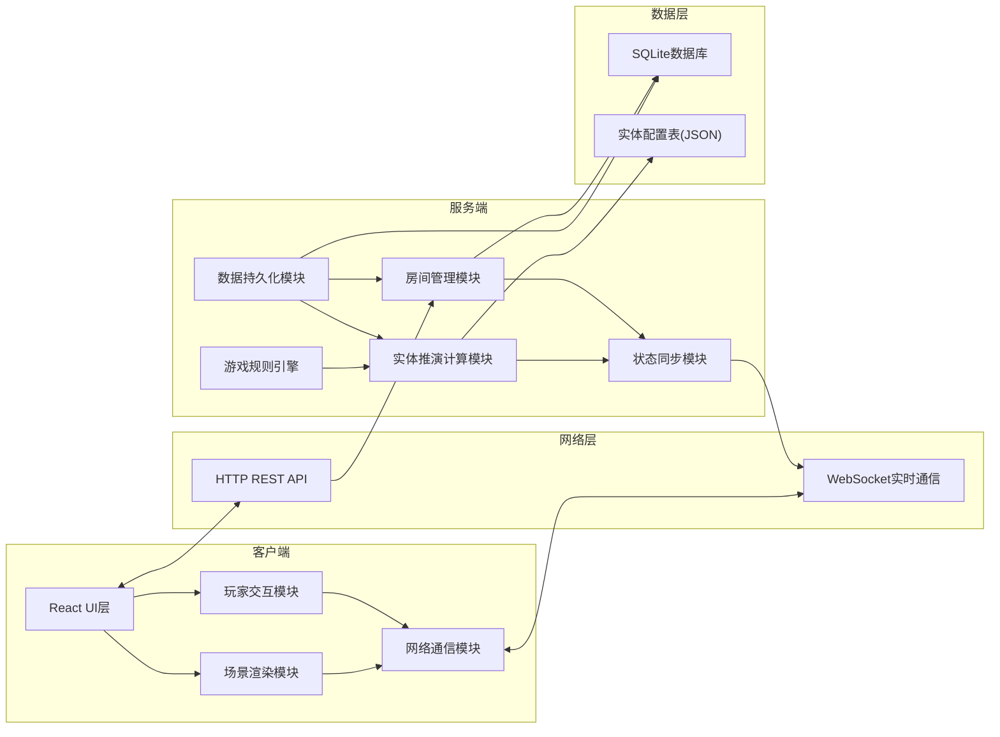
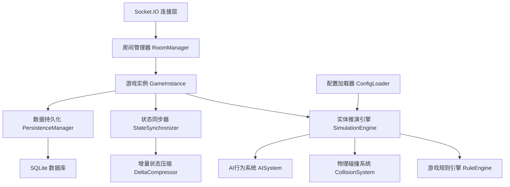
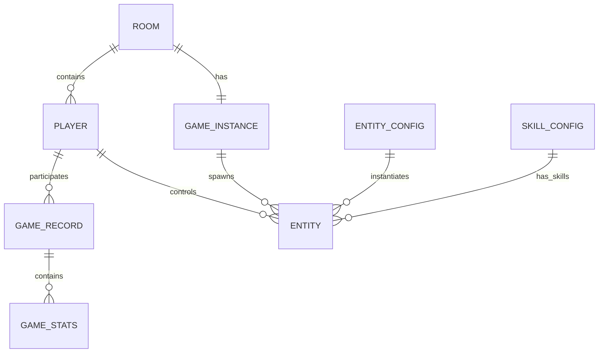

## 1. 架构设计



## 2. 技术描述

- **前端**: React@18 + TypeScript + Vite + TailwindCSS@3 + Zustand + Socket.IO-Client
- **后端**: Express@4 + TypeScript + Socket.IO + better-sqlite3
- **实时通信**: Socket.IO 用于游戏状态实时同步
- **数据库**: SQLite 存储玩家数据、对局记录
- **配置管理**: JSON配置表存储实体属性、技能参数
- **状态管理**: Zustand 管理客户端游戏状态
- **场景渲染**: HTML5 Canvas 2D 渲染引擎

## 3. 项目结构

```
├── src/                          # 前端源码
│   ├── components/               # React组件
│   │   ├── lobby/              # 大厅相关组件
│   │   ├── game/               # 游戏场景组件
│   │   └── common/           # 通用组件
│   ├── pages/                   # 页面组件
│   ├── hooks/                   # 自定义Hooks
│   ├── renderer/                # 场景渲染模块
│   │   ├── SceneRenderer.ts    # 主渲染器
│   │   ├── EntityRenderer.ts   # 实体渲染
│   │   ├── ParticleSystem.ts     # 粒子系统
│   │   └── Camera.ts          # 摄像机控制
│   ├── network/                 # 网络通信模块
│   │   ├── GameSocket.ts       # Socket.IO封装
│   │   └── APIClient.ts       # HTTP API客户端
│   ├── store/                   # 状态管理
│   ├── utils/                   # 工具类
│   └── types/                   # TypeScript类型定义
├── api/                           # 后端源码
│   ├── index.ts                  # 服务入口
│   ├── modules/                 # 核心模块
│   │   ├── room/               # 房间管理模块
│   │   ├── simulation/         # 实体推演计算模块
│   │   ├── sync/               # 状态同步模块
│   │   └── persistence/        # 数据持久化模块
│   ├── services/                # 业务服务
│   ├── config/                 # 配置表
│   │   ├── entities.json       # 实体配置
│   │   ├── skills.json         # 技能配置
│   │   └── maps.json           # 地图配置
│   └── utils/                 # 后端工具类
├── shared/                        # 前后端共享类型
├── migrations/                   # 数据库迁移
└── database/                    # SQLite数据库文件
```

## 4. 路由定义

| 路由 | 页面/用途 |
|-------|-------------|
| / | 登录页面，输入昵称进入 |
| /lobby | 房间大厅，浏览和创建房间 |
| /room/:roomId | 房间等待页面 |
| /game/:roomId | 游戏场景页面 |
| /records | 战绩记录页面 |
| /config | 实体配置页面（管理员） |

## 5. API 定义

### 5.1 HTTP API

```typescript
// 玩家登录
POST /api/auth/login
Request: { nickname: string }
Response: { playerId: string, token: string }

// 获取房间列表
GET /api/rooms
Response: Room[]

// 创建房间
POST /api/rooms
Request: { name: string, maxPlayers: number, mode: string }
Response: Room

// 加入房间
POST /api/rooms/:id/join
Response: { success: boolean, room: Room }

// 离开房间
POST /api/rooms/:id/leave

// 准备状态
POST /api/rooms/:id/ready
Request: { ready: boolean }

// 开始游戏
POST /api/rooms/:id/start

// 获取对局记录
GET /api/records
Response: GameRecord[]

// 获取实体配置
GET /api/config/entities
Response: EntityConfig[]

// 更新实体配置
PUT /api/config/entities/:id
```

### 5.2 Socket.IO 事件

```typescript
// 客户端发送
'player:move'         -> { entityId: string, targetX: number, targetY: number }
'player:skill'      -> { entityId: string, skillId: string, targetX: number, targetY: number }
'player:select'      -> { entityId: string }
'chat:message'      -> { content: string }

// 服务端广播
'state:update'     -> { state: GameState, timestamp: number }
'entity:spawn'    -> { entity: Entity }
'entity:destroy'   -> { entityId: string }
'entity:damage'    -> { entityId: string, damage: number, sourceId: string }
'skill:cast'        -> { skillId: string, casterId: string, x: number, y: number }
'player:joined'      -> { player: Player }
'player:left'       -> { playerId: string }
'chat:message'      -> { playerId: string, content: string, timestamp: number }
'game:start'        -> { initialState: GameState }
'game:end'         -> { winner: string, stats: GameStats }
```

## 6. 服务端架构



## 7. 数据模型

### 7.1 ER 图



### 7.2 数据库表定义

```sql
-- 玩家表
CREATE TABLE players (
    id TEXT PRIMARY KEY,
    nickname TEXT NOT NULL,
    created_at INTEGER NOT NULL,
    total_games INTEGER DEFAULT 0,
    wins INTEGER DEFAULT 0,
    kills INTEGER DEFAULT 0,
    play_time INTEGER DEFAULT 0
);

-- 房间表
CREATE TABLE rooms (
    id TEXT PRIMARY KEY,
    name TEXT NOT NULL,
    owner_id TEXT NOT NULL,
    max_players INTEGER NOT NULL,
    mode TEXT NOT NULL,
    status TEXT NOT NULL,
    map_id TEXT NOT NULL,
    created_at INTEGER NOT NULL
);

-- 对局记录表
CREATE TABLE game_records (
    id TEXT PRIMARY KEY,
    room_id TEXT NOT NULL,
    start_time INTEGER NOT NULL,
    end_time INTEGER,
    winner_id TEXT,
    duration INTEGER
);

-- 玩家对局统计表
CREATE TABLE game_player_stats (
    id TEXT PRIMARY KEY,
    record_id TEXT NOT NULL,
    player_id TEXT NOT NULL,
    kills INTEGER DEFAULT 0,
    deaths INTEGER DEFAULT 0,
    damage_dealt INTEGER DEFAULT 0,
    survived INTEGER DEFAULT 0,
    FOREIGN KEY (record_id) REFERENCES game_records(id)
);

-- 创建索引
CREATE INDEX idx_players_nickname ON players(nickname);
CREATE INDEX idx_game_records_player ON game_player_stats(player_id);
```

### 7.3 核心实体类型定义

```typescript
// 共享类型定义 shared/types.ts

interface Vector2 {
  x: number;
  y: number;
}

interface Entity {
  id: string;
  type: string;
  configId: string;
  ownerId: string;
  position: Vector2;
  velocity: Vector2;
  targetPosition?: Vector2;
  health: number;
  maxHealth: number;
  speed: number;
  rotation: number;
  state: 'idle' | 'moving' | 'attacking' | 'dead';
  skills: SkillInstance[];
  lastUpdate: number;
}

interface SkillInstance {
  id: string;
  configId: string;
  cooldown: number;
  maxCooldown: number;
}

interface Player {
  id: string;
  nickname: string;
  roomId: string;
  controlledEntities: string[];
  isReady: boolean;
  isOwner: boolean;
}

interface Room {
  id: string;
  name: string;
  ownerId: string;
  players: Player[];
  maxPlayers: number;
  mode: string;
  status: 'waiting' | 'playing' | 'ended';
  mapId: string;
  createdAt: number;
}

interface GameState {
  entities: Entity[];
  players: Player[];
  timestamp: number;
  mapId: string;
  isGameOver: boolean;
  winner?: string;
}
```
