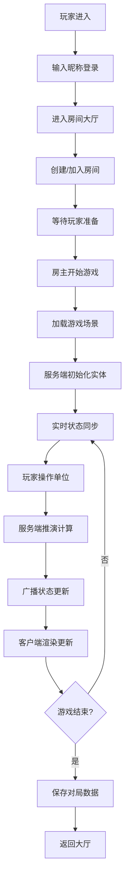

## 1. 产品概述

星际战场是一款服务器驱动的实时多人联机战略推演游戏，支持多名玩家在同一场景内控制动态实体单位进行协同作战或对抗。服务端主导所有游戏规则和实体行为推演，客户端负责场景渲染和玩家交互，前后端通过实时通信同步场景状态。

- 解决传统本地游戏难以实现多人实时协同、数据一致性难以保证的问题
- 目标用户为喜欢实时战略和联机对战的游戏玩家
- 提供高一致性、低延迟的多人联机推演体验，支持可扩展的实体配置系统

## 2. 核心功能

### 2.1 用户角色

| 角色 | 注册方法 | 核心权限 |
|------|----------|----------|
| 玩家 | 昵称快速注册 | 创建/加入房间、控制实体单位、查看对局记录 |
| 管理员 | 后台登录 | 配置实体参数、管理房间、查看统计数据 |

### 2.2 功能模块

1. **房间大厅页面**：房间列表、创建房间、快速加入、在线玩家
2. **游戏场景页面**：Canvas场景渲染、实体控制、状态面板、聊天系统
3. **战绩记录页面**：历史对局、玩家数据统计
4. **实体配置页面**：实体属性配置、技能参数调整（管理员）

### 2.3 页面详情

| 页面名称 | 模块名称 | 功能描述 |
|----------|----------|----------|
| 房间大厅 | 房间列表 | 显示所有开放房间，支持按人数/模式筛选 |
| 房间大厅 | 创建房间 | 设置房间名称、最大人数、游戏模式、地图选择 |
| 房间大厅 | 玩家信息 | 显示当前玩家昵称、在线状态、历史战绩 |
| 游戏场景 | 场景渲染 | Canvas 2D实时渲染地图、实体单位、特效 |
| 游戏场景 | 玩家交互 | 鼠标选择单位、键盘移动、技能释放、视角控制 |
| 游戏场景 | 状态面板 | 显示单位血量、坐标、技能冷却、房间玩家列表 |
| 游戏场景 | 聊天系统 | 房间内实时文字聊天 |
| 战绩记录 | 对局列表 | 显示历史对局时间、参与玩家、胜负结果 |
| 战绩记录 | 数据统计 | 击杀数、存活率、游戏时长等数据图表 |
| 实体配置 | 属性编辑 | 编辑实体移动速度、攻击力、血量等参数 |
| 实体配置 | 技能配置 | 配置技能范围、冷却时间、伤害数值 |

## 3. 核心流程

玩家进入游戏后，输入昵称快速登录，进入房间大厅浏览或创建房间。加入房间后等待玩家准备，房主开始游戏后进入场景。玩家通过鼠标选择己方单位，键盘控制移动和技能释放。服务端实时推演所有实体的移动、碰撞、技能效果，并通过WebSocket推送给所有客户端。游戏结束后保存对局数据到数据库，玩家可在战绩页面查看。

## 4. 用户界面设计

### 4.1 设计风格
- 主色调：深空蓝 `#0a1628`，辅以科技感青蓝 `#00d4ff` 和警告橙 `#ff6b35`
- 按钮风格：棱角分明的科技感矩形按钮，带霓虹发光边框和hover动效
- 字体：标题使用 `Orbitron` 科幻字体，正文使用 `Rajdhani` 现代无衬线字体
- 布局风格：深色主题、网格化布局、HUD风格界面、全息投影质感
- 图标风格：线性科技感图标，使用lucide-react配合发光效果

### 4.2 页面设计概述

| 页面名称 | 模块名称 | UI元素 |
|----------|----------|--------|
| 房间大厅 | 房间列表 | 卡片式布局，悬浮发光效果，显示房间状态标签 |
| 房间大厅 | 创建房间 | 模态对话框，带扫描线动效背景，表单控件科幻风格 |
| 游戏场景 | 场景画布 | 全屏Canvas，网格背景，带雷达扫描效果 |
| 游戏场景 | 状态面板 | 左右两侧固定面板，半透明玻璃质感，实时数据跳动动效 |
| 游戏场景 | 控制区域 | 底部技能栏，圆角按钮，冷却进度环动画 |
| 战绩记录 | 数据统计 | 渐变柱状图，折线图，带动画过渡效果 |
| 实体配置 | 参数面板 | 滑块控件，数字输入框，实时预览效果 |

### 4.3 响应性
- Desktop-first设计，主场景区域自适应屏幕尺寸
- 控制面板在小屏幕上转为可折叠抽屉式布局
- 触摸设备支持虚拟摇杆和点击操作
- Canvas渲染区域保持固定宽高比，支持缩放适配

### 4.4 场景渲染指南
- 环境：深色太空战场背景，带星点粒子效果，网格地平线
- 光照：科技感冷色调，实体单位带发光边缘，技能释放有粒子特效
- 摄像机：2D俯视角，支持鼠标拖拽平移、滚轮缩放
- 构图：中心战场区域，边缘HUD面板，小地图位于右下角
- 交互：选中单位高亮描边，移动路径虚线预览，技能范围指示器
- 后处理：轻微 bloom 发光效果，扫描线滤镜，低饱和度色彩
- 性能：实体数量控制在50以内，粒子效果对象池复用
