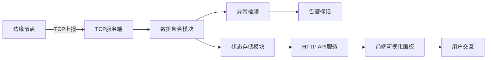

## 1. 产品概述

边缘设备监控系统，实现分布式边缘节点的状态实时采集、数据聚合、异常检测与可视化展示。解决大规模边缘设备运维管理难题，为运维人员提供统一的监控面板，支持异常节点快速定位与告警。

### 目标用户
- 运维工程师：实时监控边缘节点状态，快速响应异常
- 系统管理员：查看整体运行态势，进行容量规划
- 技术支持：排查边缘设备故障，分析历史数据

### 产品价值
- 实时性：TCP长连接实现秒级状态上报
- 可视化：直观的仪表盘展示节点健康状态
- 异常检测：自动标记异常节点，支持告警
- 可追溯：历史数据存储，支持故障回溯

## 2. 核心功能

### 2.1 用户角色

| 角色 | 注册方式 | 核心权限 |
|------|----------|----------|
| 运维人员 | 系统分配 | 实时监控、异常处理、历史查询 |
| 管理员 | 系统分配 | 全部功能、节点管理、系统配置 |

### 2.2 功能模块

1. **实时监控面板**：节点概览、状态统计、实时数据流
2. **节点详情页**：单个节点历史数据、指标趋势图
3. **异常管理**：异常节点列表、告警规则配置
4. **系统配置**：节点管理、TCP服务配置、数据库设置

### 2.3 页面详情

| 页面名称 | 模块名称 | 功能描述 |
|---------|----------|---------|
| 实时监控面板 | 节点概览卡片 | 展示在线/离线/异常节点数量统计 |
| 实时监控面板 | 节点列表 | 表格展示所有节点，异常节点高亮标记 |
| 实时监控面板 | 实时指标图表 | CPU、内存、磁盘使用率趋势图 |
| 实时监控面板 | 系统日志 | 实时滚动展示节点上报日志 |
| 节点详情页 | 基础信息 | 节点IP、位置、版本等信息 |
| 节点详情页 | 历史趋势 | 多维度指标历史曲线图 |
| 异常管理页 | 异常列表 | 展示当前异常节点及异常类型 |
| 异常管理页 | 告警历史 | 历史告警记录查询 |

## 3. 核心流程

### 3.1 边缘节点上报流程
边缘节点启动后，通过TCP协议连接服务端，定时上报CPU、内存、磁盘等状态指标。服务端接收数据后存入数据库，异常检测模块分析数据，若发现异常则标记节点并触发告警。前端通过WebSocket/HTTP轮询获取最新数据，实时更新面板。

### 3.2 Mermaid 流程图

## 4. 用户界面设计

### 4.1 设计风格
- **主题色调**：深色工业风主题，主色为深灰蓝（#1a1f2e），点缀科技蓝（#00d4ff），异常告警色（#ff4757），正常状态色（#2ed573）
- **字体**：JetBrains Mono（等宽字体，科技感）搭配 Inter（正文）
- **布局**：卡片式网格布局，左侧导航栏，顶部状态栏，主内容区自适应
- **视觉效果**：科技感边框、微光效果、数据滚动动画、状态呼吸灯效果
- **图标**：线性简洁图标，状态使用彩色圆点指示器

### 4.2 页面设计概述

| 页面名称 | 模块名称 | UI元素 |
|---------|----------|--------|
| 实时监控面板 | 顶部状态栏 | 系统标题、当前时间、在线节点数、异常告警数 |
| 实时监控面板 | 统计卡片 | 四个统计卡片（在线/离线/异常/总数），带渐变色背景和图标 |
| 实时监控面板 | 节点列表表格 | 斑马纹表格，异常行高亮闪烁，状态列带颜色圆点 |
| 实时监控面板 | 实时图表 | 三个面积图（CPU/内存/磁盘），实时数据从右侧流入 |
| 实时监控面板 | 系统日志区 | 固定高度滚动区域，最新日志在顶部，不同级别不同颜色 |
| 节点详情页 | 信息卡片 | 节点基础信息，带复制按钮 |
| 节点详情页 | 历史图表 | 可切换时间范围的折线图，多指标对比 |

### 4.3 响应式
- 桌面端优先设计，主内容区最小宽度1280px
- 平板端（768-1280px）：左侧导航收起为图标模式，统计卡片2x2布局
- 移动端（<768px）：底部导航，统计卡片单列，图表简化

### 4.4 动效设计
- 页面加载：元素从下往上淡入，统计数字滚动动画
- 实时数据：图表数据平滑滚动，新节点数据高亮闪烁
- 状态变化：节点状态变更时颜色过渡动画
- 异常告警：异常卡片脉冲动画，日志条目滑入效果
