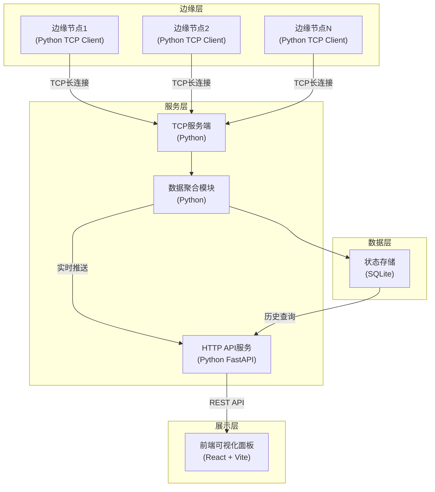
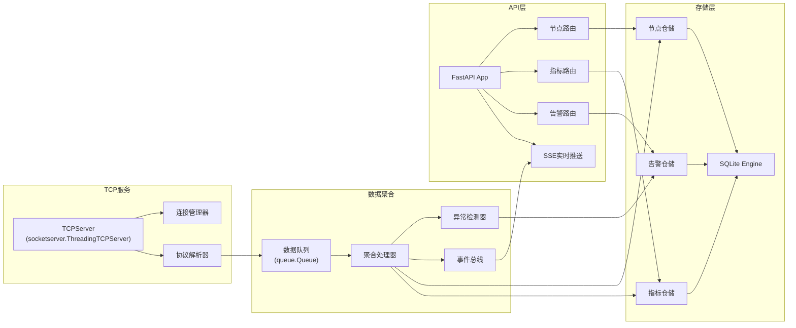
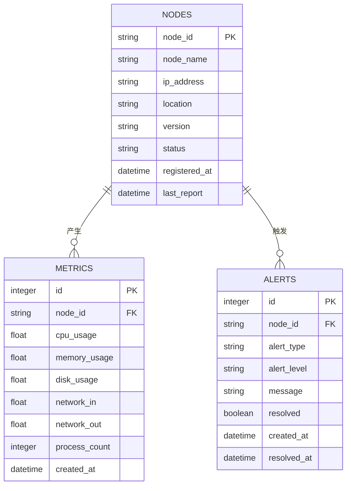

## 1. 架构设计

### 1.1 系统总体架构


### 1.2 模块职责划分

| 模块 | 技术选型 | 核心职责 |
|------|----------|---------|
| 边缘节点通信模块 | Python + socket | 采集系统指标、TCP长连接上报、断线重连 |
| TCP服务端模块 | Python + socketserver | 接收节点连接、解析上报数据、连接管理 |
| 数据聚合模块 | Python | 数据校验、异常检测、实时分发、数据落盘 |
| 状态存储模块 | SQLite | 节点信息存储、历史指标存储、告警记录存储 |
| HTTP API模块 | Python + FastAPI | 提供REST API、支持CORS、实时数据推送 |
| 前端可视化模块 | React 18 + Vite + Chart.js | 实时面板展示、异常标记、交互操作 |

## 2. 技术描述

### 2.1 技术栈选型

| 层级 | 技术 | 版本 | 说明 |
|------|------|------|------|
| 前端 | React | 18.x | UI框架 |
| 前端 | Vite | 5.x | 构建工具 |
| 前端 | Chart.js | 4.x | 图表库 |
| 前端 | react-chartjs-2 | 5.x | React图表封装 |
| 前端 | TailwindCSS | 3.x | CSS框架 |
| 后端 | Python | 3.10+ | 服务端语言 |
| 后端 | FastAPI | 0.109.x | HTTP API框架 |
| 后端 | Uvicorn | 0.27.x | ASGI服务器 |
| 数据库 | SQLite | 内置 | 轻量级关系型数据库 |
| 通信 | TCP Socket | 内置 | 节点上报协议 |

### 2.2 项目目录结构

```
project-root/
├── edge-node/              # 边缘节点通信模块
│   ├── client.py           # TCP客户端主程序
│   ├── metrics.py          # 系统指标采集
│   └── requirements.txt    # 依赖
├── server/                 # 服务端模块
│   ├── tcp_server.py       # TCP服务端
│   ├── data_aggregator.py  # 数据聚合模块
│   ├── api_server.py       # HTTP API服务
│   └── requirements.txt    # 依赖
├── storage/                # 状态存储模块
│   ├── db.py               # 数据库连接与操作
│   ├── models.py           # 数据模型定义
│   └── init.sql            # 初始化DDL
├── frontend/               # 前端可视化模块
│   ├── src/
│   │   ├── components/     # UI组件
│   │   ├── pages/          # 页面组件
│   │   ├── services/       # API调用
│   │   └── App.jsx
│   ├── index.html
│   ├── package.json
│   └── vite.config.js
├── config/                 # 配置文件
│   └── config.json         # 全局配置
└── scripts/                # 启动脚本
    ├── start-all.bat       # Windows一键启动
    └── start-all.sh        # Linux一键启动
```

## 3. API 定义

### 3.1 数据类型定义

```typescript
// 节点状态
interface NodeStatus {
  node_id: string;
  node_name: string;
  ip_address: string;
  status: 'online' | 'offline' | 'abnormal';
  cpu_usage: number;
  memory_usage: number;
  disk_usage: number;
  last_report: string;
  location: string;
  version: string;
}

// 指标数据点
interface MetricPoint {
  timestamp: string;
  cpu_usage: number;
  memory_usage: number;
  disk_usage: number;
}

// 告警记录
interface Alert {
  id: number;
  node_id: string;
  alert_type: string;
  alert_level: 'warning' | 'critical';
  message: string;
  created_at: string;
  resolved: boolean;
}

// TCP上报协议
interface TcpReport {
  node_id: string;
  timestamp: number;
  metrics: {
    cpu: number;
    memory: number;
    disk: number;
    network_in: number;
    network_out: number;
    processes: number;
  };
}
```

### 3.2 REST API 接口

| 方法 | 路径 | 说明 | 请求 | 响应 |
|------|------|------|------|------|
| GET | `/api/nodes` | 获取所有节点列表 | - | `NodeStatus[]` |
| GET | `/api/nodes/:id` | 获取单个节点详情 | - | `NodeStatus` |
| GET | `/api/nodes/:id/metrics` | 获取节点历史指标 | `{start, end}` | `MetricPoint[]` |
| GET | `/api/alerts` | 获取告警列表 | `{resolved, limit}` | `Alert[]` |
| GET | `/api/metrics/realtime` | 获取实时指标数据 | - | `{nodes, metrics}` |
| GET | `/api/stats/summary` | 获取统计概览 | - | `{total, online, offline, abnormal}` |
| POST | `/api/alerts/:id/resolve` | 标记告警已处理 | - | `{success: true}` |

### 3.3 TCP 协议规范

**连接建立**:
- 节点主动连接TCP服务端（默认端口: 8888）
- 首次发送注册包包含节点信息
- 服务端响应ACK确认

**上报周期**:
- 默认每5秒上报一次状态指标
- 异常时立即上报告警信息

**数据包格式（JSON）**:
```json
{
  "type": "register|report|alert|heartbeat",
  "node_id": "node-001",
  "timestamp": 1704067200,
  "data": {
    "cpu": 45.2,
    "memory": 62.8,
    "disk": 73.5,
    "network_in": 1024000,
    "network_out": 512000
  }
}
```

## 4. 服务端架构

### 4.1 服务端内部架构


## 5. 数据模型

### 5.1 ER 图


### 5.2 DDL 语句

```sql
-- 节点表
CREATE TABLE IF NOT EXISTS nodes (
    node_id TEXT PRIMARY KEY,
    node_name TEXT NOT NULL,
    ip_address TEXT NOT NULL,
    location TEXT,
    version TEXT,
    status TEXT NOT NULL DEFAULT 'offline',
    registered_at DATETIME DEFAULT CURRENT_TIMESTAMP,
    last_report DATETIME
);

-- 指标表
CREATE TABLE IF NOT EXISTS metrics (
    id INTEGER PRIMARY KEY AUTOINCREMENT,
    node_id TEXT NOT NULL,
    cpu_usage REAL NOT NULL,
    memory_usage REAL NOT NULL,
    disk_usage REAL NOT NULL,
    network_in REAL DEFAULT 0,
    network_out REAL DEFAULT 0,
    process_count INTEGER DEFAULT 0,
    created_at DATETIME DEFAULT CURRENT_TIMESTAMP,
    FOREIGN KEY (node_id) REFERENCES nodes(node_id)
);

-- 告警表
CREATE TABLE IF NOT EXISTS alerts (
    id INTEGER PRIMARY KEY AUTOINCREMENT,
    node_id TEXT NOT NULL,
    alert_type TEXT NOT NULL,
    alert_level TEXT NOT NULL,
    message TEXT NOT NULL,
    resolved BOOLEAN DEFAULT FALSE,
    created_at DATETIME DEFAULT CURRENT_TIMESTAMP,
    resolved_at DATETIME,
    FOREIGN KEY (node_id) REFERENCES nodes(node_id)
);

-- 索引
CREATE INDEX IF NOT EXISTS idx_metrics_node_id ON metrics(node_id);
CREATE INDEX IF NOT EXISTS idx_metrics_created_at ON metrics(created_at);
CREATE INDEX IF NOT EXISTS idx_alerts_node_id ON alerts(node_id);
CREATE INDEX IF NOT EXISTS idx_alerts_resolved ON alerts(resolved);
```

### 5.3 异常检测规则

| 指标 | 警告阈值 | 严重阈值 | 说明 |
|------|----------|----------|------|
| CPU使用率 | > 80% | > 95% | 持续3个周期 |
| 内存使用率 | > 85% | > 95% | 持续3个周期 |
| 磁盘使用率 | > 90% | > 98% | 单次触发 |
| 心跳超时 | > 30秒 | > 60秒 | 无上报数据 |
