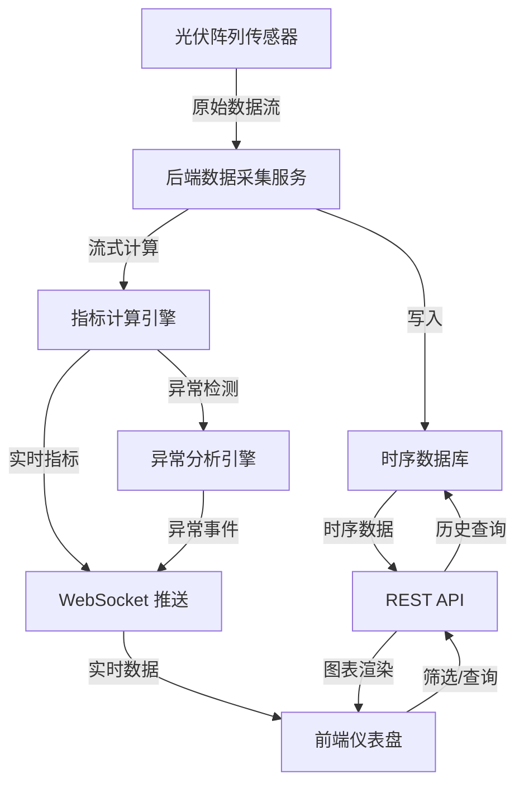

## 1. 产品概述

光伏阵列运行工况实时监控平台——面向光伏电站运维人员，提供实时数据采集、指标计算、异常分析与可视化展示，帮助运维团队快速定位故障、优化发电效率。

- 解决光伏电站数据分散、异常发现滞后、运维效率低下的问题
- 目标用户：光伏电站运维工程师、电站管理者、设备厂商技术支持

## 2. 核心功能

### 2.1 用户角色

| 角色 | 权限说明 |
|------|----------|
| 运维工程师 | 查看实时数据、异常告警、历史查询、筛选分析 |
| 管理者 | 全局概览、性能指标统计、报表导出 |

### 2.2 功能模块

1. **实时监控仪表盘**：光伏阵列实时功率、电流电压曲线、辐照度趋势、电站总览 KPI 卡片
2. **异常分析页面**：异常事件列表、异常分布热力图、异常详情与根因分析
3. **历史数据查询**：时间范围筛选、指标对比、数据导出

### 2.3 页面详情

| 页面名称 | 模块名称 | 功能描述 |
|----------|----------|----------|
| 实时监控仪表盘 | KPI 概览卡片 | 总发电功率、当日发电量、在线逆变器数、当前辐照度，实时刷新 |
| 实时监控仪表盘 | 功率曲线图 | 各阵列实时有功功率折线图，支持选择阵列对比 |
| 实时监控仪表盘 | 电流电压图 | 直流侧电流/电压趋势图，支持单阵列详情展开 |
| 实时监控仪表盘 | 辐照度趋势 | 环境辐照度、温度、湿度的时序曲线 |
| 实时监控仪表盘 | 设备状态面板 | 逆变器/组串在线状态列表，正常绿色/异常红色标识 |
| 异常分析 | 异常事件时间线 | 按时间排列的异常事件，支持按等级（警告/严重/故障）筛选 |
| 异常分析 | 异常分布热力图 | 按阵列位置展示异常密度，快速定位问题区域 |
| 异常分析 | 异常详情面板 | 选中异常后展示相关指标曲线、可能原因、处理建议 |
| 历史数据查询 | 时间范围筛选器 | 日期时间选择器，支持快捷选项（近1小时/今日/近7天/自定义） |
| 历史数据查询 | 指标选择器 | 多选指标（功率/电流/电压/温度/辐照度），动态添加曲线 |
| 历史数据查询 | 对比图表 | 多指标叠加折线图，支持双 Y 轴 |
| 历史数据查询 | 数据表格 | 原始数据表格展示，支持排序和分页 |

## 3. 核心流程

用户登录后进入实时监控仪表盘，通过 WebSocket 实时接收光伏阵列工况数据（功率、电流、电压、温度、辐照度等），后端进行流式计算与异常检测，前端实时更新图表与告警。用户可切换至异常分析页查看异常详情和分布，或进入历史数据查询页按时间与指标筛选对比历史运行数据。

## 4. 用户界面设计

### 4.1 设计风格

- **主色调**：深色工业风——以 `#0a0f1a`（深蓝黑）为背景，`#00e5a0`（科技绿）为主要强调色，`#ff6b35`（警告橙）为告警色
- **辅助色**：`#1a2332`（卡片背景）、`#2d3a4a`（边框）、`#8b95a5`（次要文字）
- **按钮风格**：圆角微立体，主要操作用科技绿填充，次要操作用边框风格
- **字体**：标题使用 `Orbitron`（科技感），正文使用 `Noto Sans SC`（中文可读性）
- **布局**：左侧固定导航栏 + 顶部状态栏 + 主内容区卡片网格布局
- **图标**：线性风格（Lucide Icons），与深色主题统一

### 4.2 页面设计概览

| 页面名称 | 模块名称 | UI 元素 |
|----------|----------|---------|
| 实时监控仪表盘 | KPI 概览卡片 | 深色卡片、大字号数值、迷你趋势线、呼吸灯状态指示 |
| 实时监控仪表盘 | 功率曲线图 | ECharts 深色主题折线图、渐变填充区域、实时滚动 |
| 实时监控仪表盘 | 电流电压图 | ECharts 双 Y 轴折线图、点击展开详情弹窗 |
| 实时监控仪表盘 | 辐照度趋势 | ECharts 面积图、渐变色填充 |
| 实时监控仪表盘 | 设备状态面板 | 网格布局状态卡片、绿色/红色状态灯、hover 展开详情 |
| 异常分析 | 异常事件时间线 | 垂直时间线、颜色编码等级标签、可折叠详情 |
| 异常分析 | 异常分布热力图 | ECharts 热力图、阵列俯视布局、红/橙/绿渐变 |
| 异常分析 | 异常详情面板 | 侧滑抽屉、关联指标曲线、根因分析文字、处理建议标签 |
| 历史数据查询 | 时间范围筛选器 | 日期选择器、快捷按钮组、时间范围高亮 |
| 历史数据查询 | 指标选择器 | 下拉多选、选中项标签、动态添加曲线 |
| 历史数据查询 | 对比图表 | ECharts 多系列折线图、双 Y 轴、图例交互 |
| 历史数据查询 | 数据表格 | 深色条纹表格、排序箭头、分页控件 |

### 4.3 响应式

- 桌面优先设计，最低支持 1280px 宽度
- 在 1920px 以上充分利用宽屏展示多列图表
- 移动端隐藏侧边栏为汉堡菜单，图表自适应缩放

### 4.4 3D 场景

不适用
