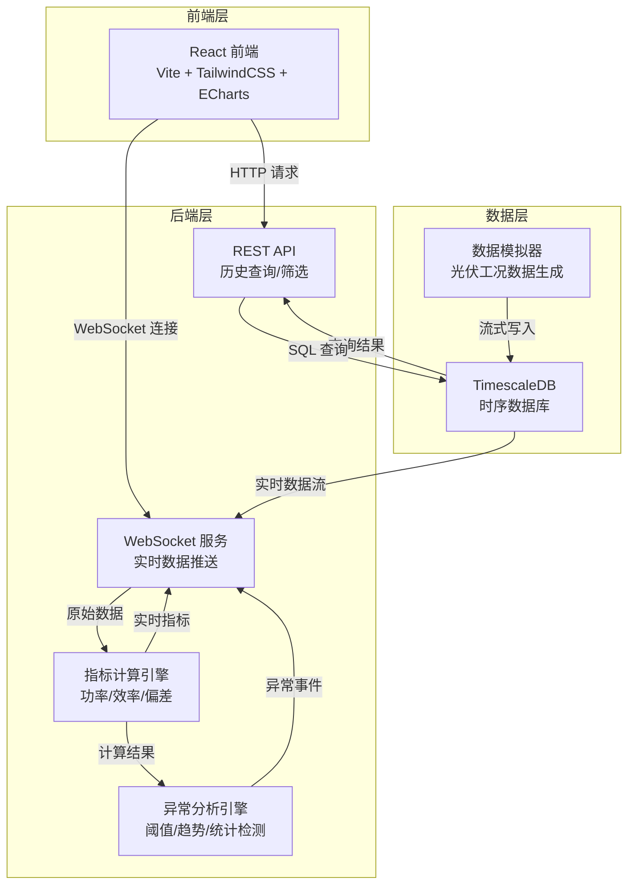
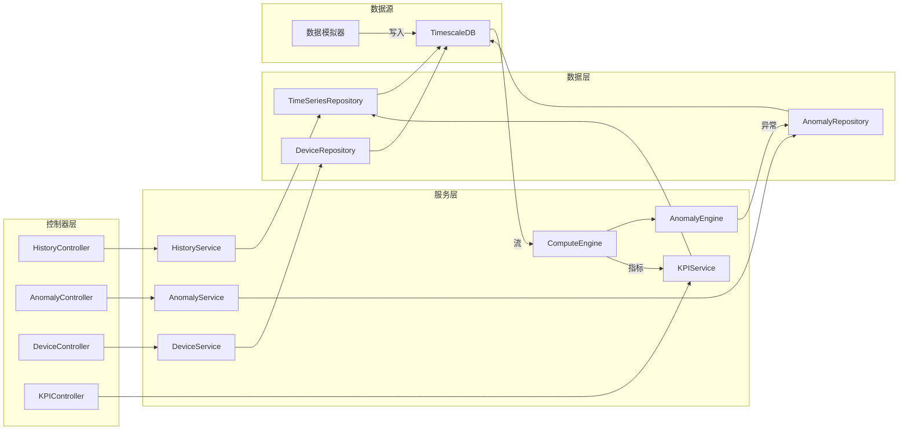
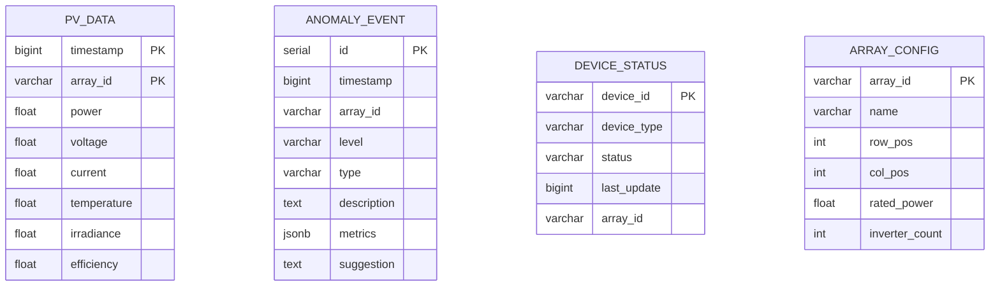

## 1. 架构设计



## 2. 技术说明

- **前端**：React@18 + TailwindCSS@3 + Vite + ECharts@5（图表库）+ Lucide React（图标）
- **初始化工具**：Vite
- **后端**：Express@4 + ws（WebSocket）+ node-cron（定时任务）
- **数据库**：TimescaleDB（PostgreSQL 时序扩展），开发阶段使用 SQLite 模拟时序存储
- **实时通信**：WebSocket（ws 库），前端使用原生 WebSocket API
- **数据模拟**：内置光伏工况数据模拟器，生成逼真的功率/电流/电压/温度/辐照度时序数据

## 3. 路由定义

| 路由 | 用途 |
|------|------|
| `/` | 实时监控仪表盘——KPI 卡片、功率曲线、设备状态 |
| `/anomaly` | 异常分析——异常时间线、热力图、详情面板 |
| `/history` | 历史数据查询——时间筛选、指标对比、数据表格 |

## 4. API 定义

### 4.1 WebSocket 消息协议

```typescript
interface WSMessage {
  type: 'realtime_data' | 'anomaly_event' | 'metric_update' | 'device_status'
  timestamp: number
  payload: RealtimeDataPayload | AnomalyEventPayload | MetricUpdatePayload | DeviceStatusPayload
}

interface RealtimeDataPayload {
  arrayId: string
  power: number
  voltage: number
  current: number
  temperature: number
  irradiance: number
  efficiency: number
}

interface AnomalyEventPayload {
  eventId: string
  arrayId: string
  level: 'warning' | 'critical' | 'fault'
  type: string
  description: string
  metrics: Record<string, number>
  suggestion: string
}

interface MetricUpdatePayload {
  totalPower: number
  dailyEnergy: number
  onlineInverters: number
  currentIrradiance: number
}

interface DeviceStatusPayload {
  deviceId: string
  deviceType: 'inverter' | 'string'
  status: 'online' | 'offline' | 'fault'
  lastUpdate: number
}
```

### 4.2 REST API

```typescript
GET /api/history
  Query: {
    start: string
    end: string
    metrics: string[]
    arrayIds?: string[]
    interval?: '1m' | '5m' | '15m' | '1h'
  }
  Response: {
    timestamps: string[]
    series: { metric: string, arrayId: string, values: number[] }[]
  }

GET /api/anomaly/events
  Query: {
    start: string
    end: string
    level?: string
    type?: string
    page?: number
    pageSize?: number
  }
  Response: {
    total: number
    events: AnomalyEventPayload[]
  }

GET /api/anomaly/heatmap
  Query: {
    date: string
  }
  Response: {
    arrays: { arrayId: string, row: number, col: number, anomalyCount: number }[]
  }

GET /api/devices
  Response: {
    devices: DeviceStatusPayload[]
  }

GET /api/kpi
  Response: MetricUpdatePayload
```

## 5. 服务端架构图



## 6. 数据模型

### 6.1 数据模型定义



### 6.2 数据定义语言

```sql
CREATE TABLE pv_data (
    timestamp BIGINT NOT NULL,
    array_id VARCHAR(32) NOT NULL,
    power FLOAT DEFAULT 0,
    voltage FLOAT DEFAULT 0,
    current FLOAT DEFAULT 0,
    temperature FLOAT DEFAULT 0,
    irradiance FLOAT DEFAULT 0,
    efficiency FLOAT DEFAULT 0,
    PRIMARY KEY (timestamp, array_id)
);

CREATE INDEX idx_pv_data_time ON pv_data (timestamp DESC);
CREATE INDEX idx_pv_data_array ON pv_data (array_id, timestamp DESC);

CREATE TABLE anomaly_event (
    id INTEGER PRIMARY KEY AUTOINCREMENT,
    timestamp BIGINT NOT NULL,
    array_id VARCHAR(32) NOT NULL,
    level VARCHAR(16) NOT NULL,
    type VARCHAR(64) NOT NULL,
    description TEXT,
    metrics TEXT,
    suggestion TEXT
);

CREATE INDEX idx_anomaly_time ON anomaly_event (timestamp DESC);
CREATE INDEX idx_anomaly_array ON anomaly_event (array_id, timestamp DESC);
CREATE INDEX idx_anomaly_level ON anomaly_event (level);

CREATE TABLE device_status (
    device_id VARCHAR(32) PRIMARY KEY,
    device_type VARCHAR(16) NOT NULL,
    status VARCHAR(16) NOT NULL DEFAULT 'online',
    last_update BIGINT NOT NULL,
    array_id VARCHAR(32)
);

CREATE TABLE array_config (
    array_id VARCHAR(32) PRIMARY KEY,
    name VARCHAR(64) NOT NULL,
    row_pos INTEGER NOT NULL,
    col_pos INTEGER NOT NULL,
    rated_power FLOAT NOT NULL,
    inverter_count INTEGER NOT NULL DEFAULT 1
);
```
