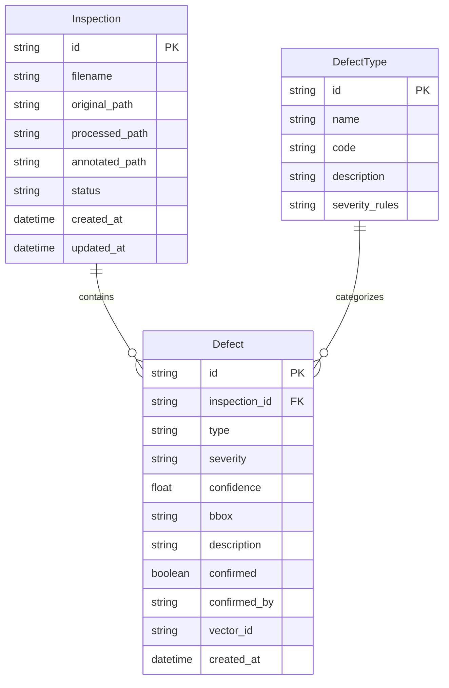

## 1. 架构设计

```mermaid
graph TB
    subgraph "前端层"
        "FE[React 前端应用]"
    end
    subgraph "后端层"
        "API[FastAPI 网关]"
        "PRE[图像预处理模块]"
        "AI[AI 推理模块]"
        "CLS[缺陷分类模块]"
        "VEC[向量库服务]"
        "STORE[数据存储模块]"
    end
    subgraph "数据层"
        "SQLITE[SQLite 数据库]"
        "CHROMA[ChromaDB 向量库]"
        "FS[文件存储]"
    end
    "FE" --> "|HTTP/REST| API"
    "API" --> "PRE"
    "PRE" --> "AI"
    "AI" --> "CLS"
    "CLS" --> "VEC"
    "CLS" --> "STORE"
    "VEC" --> "CHROMA"
    "STORE" --> "SQLITE"
    "PRE" --> "FS"
```

## 2. 技术说明

- **前端**：React@18 + TailwindCSS@3 + Vite + Recharts（图表库）
- **初始化工具**：Vite Init
- **后端**：FastAPI + Uvicorn
- **AI 推理**：使用 ONNX Runtime 加载预训练模型（模拟推理，支持后续替换为真实模型）
- **向量库**：ChromaDB（轻量级嵌入式向量数据库，零配置启动）
- **关系数据库**：SQLite（轻量级，无需额外服务）
- **文件存储**：本地文件系统（上传图片存储）
- **图像处理**：Pillow + OpenCV-python-headless

## 3. 路由定义

| 路由 | 用途 |
|------|------|
| `/` | 巡检工作台页面 - 图片上传与识别结果展示 |
| `/defects` | 缺陷库管理页面 - 分类浏览与向量检索 |
| `/analytics` | 统计分析页面 - 图表与报告 |

## 4. API 定义

### 4.1 图片上传与识别

```typescript
interface UploadRequest {
  files: File[]
}

interface DefectBox {
  x: number
  y: number
  width: number
  height: number
  confidence: number
  label: string
  severity: "low" | "medium" | "high" | "critical"
}

interface InspectionResult {
  id: string
  filename: string
  status: "processing" | "completed" | "failed"
  defects: DefectBox[]
  annotated_image_url: string
  created_at: string
}
```

**POST /api/inspections/upload** — 上传图片并触发识别流程
- Request: `multipart/form-data` 包含图片文件
- Response: `{ task_id: string, status: string }`

**GET /api/inspections/{task_id}** — 查询识别任务状态与结果
- Response: `InspectionResult`

**GET /api/inspections** — 获取识别历史列表
- Query: `page, page_size, status, defect_type`
- Response: `{ items: InspectionResult[], total: number }`

### 4.2 缺陷管理

```typescript
interface DefectRecord {
  id: string
  type: string
  severity: "low" | "medium" | "high" | "critical"
  description: string
  image_url: string
  inspection_id: string
  confirmed: boolean
  confirmed_by: string | null
  vector_id: string
  created_at: string
}
```

**GET /api/defects** — 获取缺陷列表
- Query: `page, page_size, type, severity, confirmed`
- Response: `{ items: DefectRecord[], total: number }`

**GET /api/defects/{id}** — 获取缺陷详情
- Response: `DefectRecord`

**PUT /api/defects/{id}/confirm** — 确认缺陷
- Request: `{ confirmed: boolean, note: string }`
- Response: `DefectRecord`

**POST /api/defects/search** — 向量相似检索
- Request: `{ query: string, image_file?: File, top_k: number }`
- Response: `{ results: (DefectRecord & { similarity: number })[] }`

### 4.3 统计分析

**GET /api/analytics/distribution** — 缺陷分布统计
- Query: `group_by, start_date, end_date`
- Response: `{ labels: string[], values: number[] }`

**GET /api/analytics/trend** — 缺陷趋势统计
- Query: `granularity, start_date, end_date`
- Response: `{ dates: string[], counts: number[] }`

**GET /api/analytics/summary** — 汇总统计
- Response: `{ total_inspections: number, total_defects: number, defect_rate: number, severity_distribution: Record<string, number> }`

## 5. 服务架构图

```mermaid
graph LR
    "Controller[API 控制器层]" --> "Service[业务服务层]"
    "Service" --> "Repository[数据访问层]"
    "Repository" --> "SQLite[(SQLite)]"
    "Service" --> "AIService[AI 服务层]"
    "AIService" --> "ONNX[(ONNX Runtime)]"
    "Service" --> "VectorService[向量服务层]"
    "VectorService" --> "ChromaDB[(ChromaDB)]"
```

## 6. 数据模型

### 6.1 数据模型定义



### 6.2 数据定义语言

```sql
CREATE TABLE inspection (
    id TEXT PRIMARY KEY,
    filename TEXT NOT NULL,
    original_path TEXT NOT NULL,
    processed_path TEXT,
    annotated_path TEXT,
    status TEXT NOT NULL DEFAULT 'processing',
    created_at TIMESTAMP NOT NULL DEFAULT CURRENT_TIMESTAMP,
    updated_at TIMESTAMP NOT NULL DEFAULT CURRENT_TIMESTAMP
);

CREATE TABLE defect_type (
    id TEXT PRIMARY KEY,
    name TEXT NOT NULL,
    code TEXT NOT NULL UNIQUE,
    description TEXT,
    severity_rules TEXT
);

CREATE TABLE defect (
    id TEXT PRIMARY KEY,
    inspection_id TEXT NOT NULL REFERENCES inspection(id),
    type TEXT NOT NULL REFERENCES defect_type(code),
    severity TEXT NOT NULL CHECK(severity IN ('low', 'medium', 'high', 'critical')),
    confidence REAL NOT NULL,
    bbox TEXT NOT NULL,
    description TEXT,
    confirmed BOOLEAN NOT NULL DEFAULT 0,
    confirmed_by TEXT,
    vector_id TEXT,
    created_at TIMESTAMP NOT NULL DEFAULT CURRENT_TIMESTAMP
);

CREATE INDEX idx_defect_inspection ON defect(inspection_id);
CREATE INDEX idx_defect_type ON defect(type);
CREATE INDEX idx_defect_severity ON defect(severity);
CREATE INDEX idx_inspection_status ON inspection(status);
CREATE INDEX idx_inspection_created ON inspection(created_at);

INSERT INTO defect_type (id, name, code, description) VALUES
    ('dt1', '裂纹', 'CRACK', '表面或内部裂纹缺陷'),
    ('dt2', '锈蚀', 'RUST', '金属表面锈蚀腐蚀'),
    ('dt3', '变形', 'DEFORM', '结构变形或弯曲'),
    ('dt4', '缺失', 'MISSING', '部件缺失或脱落'),
    ('dt5', '渗漏', 'LEAK', '液体或气体渗漏痕迹'),
    ('dt6', '磨损', 'WEAR', '表面磨损或消耗'),
    ('dt7', '松动', 'LOOSE', '连接件松动'),
    ('dt8', '异响', 'ABNORMAL', '异常振动或声音相关缺陷');
```
