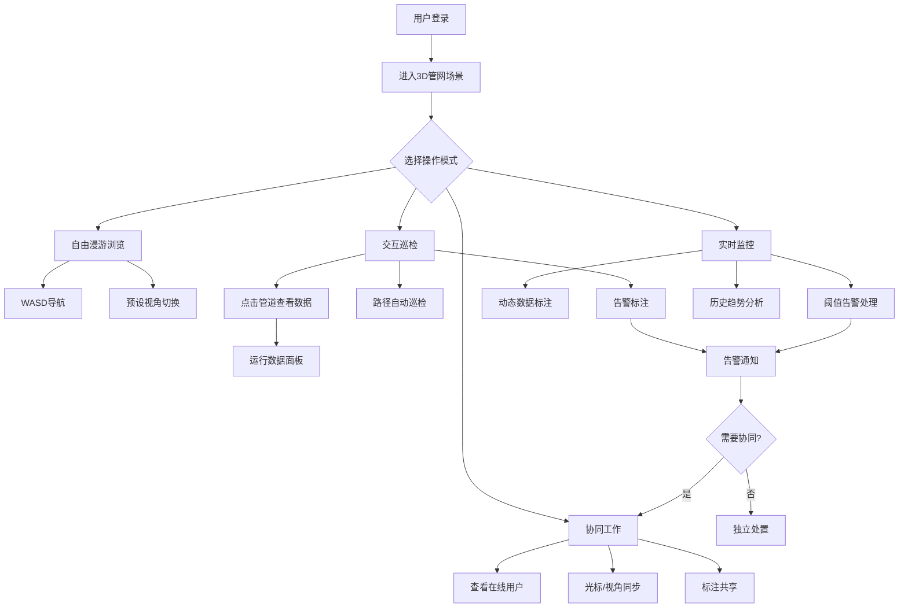

## 1. 产品概述

管网3D智能监控平台——面向城市/工业管网运维的全栈3D可视化系统，实现管网三维加载、交互巡检、多人协同，并实时同步管道压力、流量等运行数据，为运维人员提供沉浸式管网监控与协同决策能力。

- 解决传统管网监控2D视图空间感知弱、多角色协同难、数据延迟高等痛点
- 目标用户：管网运维工程师、调度中心操作员、管理层决策者

## 2. 核心功能

### 2.1 用户角色

| 角色 | 注册方式 | 核心权限 |
|------|----------|----------|
| 运维工程师 | 管理员分配账号 | 3D巡检、标注、告警确认、数据查看 |
| 调度操作员 | 管理员分配账号 | 实时监控、远程操控、告警处理 |
| 管理层 | 管理员分配账号 | 全局概览、报表查看、协同会议 |

### 2.2 功能模块

1. **3D管网场景页**：3D管网模型加载、渲染、漫游导航
2. **交互巡检页**：管道点击选中、运行数据面板、路径自动巡检、告警标注
3. **协同工作页**：在线用户列表、光标/视角同步、标注共享、协同会议
4. **实时监控仪表盘**：管道压力/流量动态标注、阈值告警、历史趋势

### 2.3 页面详情

| 页面名称 | 模块名称 | 功能描述 |
|----------|----------|----------|
| 3D管网场景 | 场景加载器 | 加载GLTF/GLB格式管网3D模型，支持分段加载与LOD优化 |
| 3D管网场景 | 漫游导航 | WASD键盘漫游、鼠标旋转缩放、预设视角快速切换 |
| 3D管网场景 | 管网层级树 | 左侧树形结构展示管网层级（区域→管段→节点），点击定位 |
| 交互巡检 | 管道选中高亮 | 鼠标悬停/点击管道段，高亮显示并弹出数据卡片 |
| 交互巡检 | 运行数据面板 | 侧边面板显示选中管道的压力、流量、温度、状态等实时数据 |
| 交互巡检 | 路径自动巡检 | 设定巡检路径，摄像机沿路径自动飞行，途经节点弹出数据 |
| 交互巡检 | 告警标注 | 管道异常时3D场景内显示告警标记，点击查看详情 |
| 协同工作 | 在线用户 | 右上角显示当前在线用户头像列表 |
| 协同工作 | 光标同步 | 其他用户光标在3D场景中实时可见，附用户名标签 |
| 协同工作 | 标注共享 | 用户在管道上添加的标注实时同步给所有在线用户 |
| 实时监控仪表盘 | 动态数据标注 | 管道上方浮动显示压力/流量数值，颜色随阈值变化 |
| 实时监控仪表盘 | 阈值告警 | 超阈值管道红色闪烁告警，底部告警列表实时更新 |
| 实时监控仪表盘 | 历史趋势 | 选中管道后可查看24h/7d压力/流量趋势曲线 |

## 3. 核心流程

用户登录后进入3D管网场景，可自由漫游浏览管网，点击管道查看实时运行数据；异常管道触发告警，工程师可发起协同巡检，多用户同步视角与标注进行联合诊断；调度员在仪表盘监控全局数据，处理告警并记录处置结果。

## 4. 用户界面设计

### 4.1 设计风格

- **主色调**：深蓝黑(#0a1628)科技背景 + 青色(#00e5ff)管道主色 + 橙色(#ff6b35)告警色
- **按钮风格**：圆角8px、半透明玻璃态按钮、hover发光边框
- **字体**：标题用 Orbitron 科技字体，正文用 Source Han Sans/Noto Sans SC
- **布局**：左侧管网层级树、中间3D场景全屏、右侧数据面板、底部告警条
- **图标**：线性风格 lucide-react 图标
- **动效**：场景加载渐入、数据面板滑入、告警脉冲闪烁、巡检飞行路径线条动画

### 4.2 页面设计概览

| 页面名称 | 模块名称 | UI元素 |
|----------|----------|--------|
| 3D管网场景 | 场景加载器 | 加载进度环形动画、深色背景、百分比数字 |
| 3D管网场景 | 漫游导航 | 底部半透明控制栏(方向键、缩放、速度)、右上角迷你地图 |
| 3D管网场景 | 管网层级树 | 左侧260px宽半透明面板、树形列表、搜索框、折叠展开 |
| 交互巡检 | 管道选中高亮 | 管道青色发光边缘、浮动信息卡片(名称+核心指标) |
| 交互巡检 | 运行数据面板 | 右侧320px面板、实时数据卡片(压力/流量/温度)、状态指示灯 |
| 交互巡检 | 路径自动巡检 | 底部播放控制栏(播放/暂停/进度)、飞行路径虚线预览 |
| 交互巡检 | 告警标注 | 3D空间内红色脉冲圆环、点击弹出告警详情弹窗 |
| 协同工作 | 在线用户 | 右上角头像堆叠(最多5+数字)、点击展开完整列表 |
| 协同工作 | 光标同步 | 3D空间内彩色圆锥光标+用户名标签 |
| 协同工作 | 标注共享 | 管道旁浮动便签式标注、用户头像+文字 |
| 实时监控仪表盘 | 动态数据标注 | 管道上方悬浮数值标签、绿/黄/红三色阈值 |
| 实时监控仪表盘 | 阈值告警 | 底部告警条滚动、红色闪烁边框、告警级别标签 |
| 实时监控仪表盘 | 历史趋势 | 弹出式折线图面板(Recharts)、时间范围选择器 |

### 4.3 响应式设计

- 桌面端优先（1920×1080），3D场景占满可用空间
- 平板端（1024×768）：侧边面板改为可折叠抽屉
- 移动端暂不支持3D场景，仅提供告警推送

### 4.4 3D场景指引

- **环境/HDRI**：深色工业风夜景环境贴图，微弱环境光营造管道轮廓
- **灯光**：方向光(冷白)模拟顶部照明 + 点光源(青色)标记关键节点 + 环境光(深蓝)
- **摄像机**：透视相机、FOV 60°、近裁面0.1、远裁面2000、默认俯视45°角
- **构图**：管道网络为主体、地面网格辅助定位、关键节点用发光球体标记
- **交互**：OrbitControls旋转缩放、射线检测管道点击、巡检路径动画插值
- **后处理**：Bloom发光(告警脉冲)、SSAO环境遮蔽(管道深度感)、FXAA抗锯齿
- **性能预算**：60fps目标、管道实例化渲染、LOD分级、视锥体剔除
