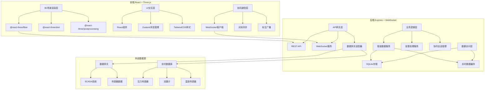
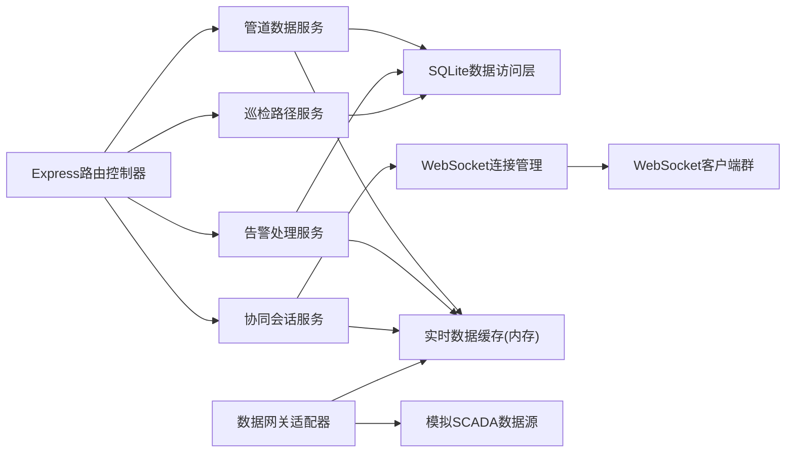
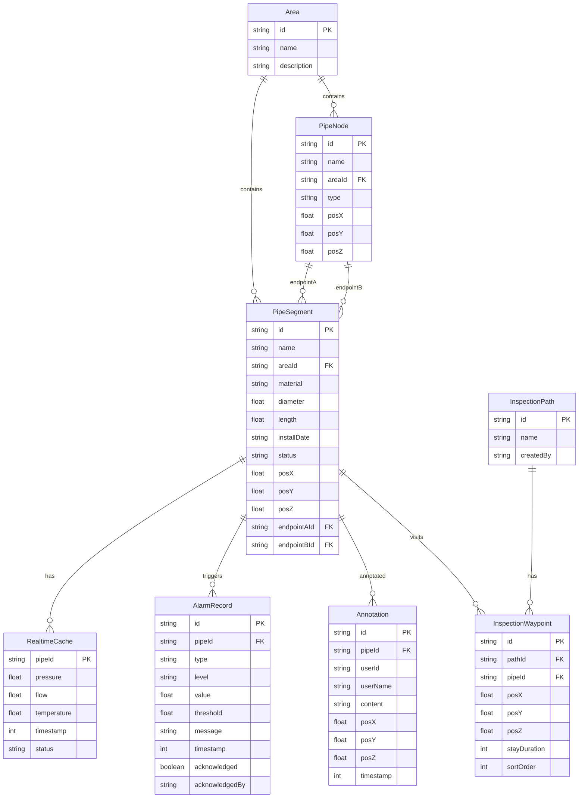

## 1. 架构设计



## 2. 技术说明

- **前端**：React@18 + TypeScript + Vite + TailwindCSS@3 + Zustand
- **3D渲染**：three.js + @react-three/fiber + @react-three/drei + @react-three/postprocessing
- **图表**：Recharts（历史趋势曲线）
- **初始化工具**：vite-init
- **后端**：Express@4 + TypeScript + ws（WebSocket）
- **数据库**：SQLite（better-sqlite3）存储管道元数据与配置，内存缓存实时运行数据
- **数据网关适配**：后端通过定时轮询模拟对接SCADA/传感器数据网关，提供标准化数据接口

## 3. 路由定义

| 路由 | 用途 |
|------|------|
| / | 3D管网主场景页（场景加载+漫游+层级树） |
| /inspect | 交互巡检页（管道选中+数据面板+路径巡检） |
| /collab | 协同工作页（在线用户+光标同步+标注共享） |
| /monitor | 实时监控仪表盘（动态标注+告警+趋势） |

## 4. API定义

### 4.1 数据类型定义

```typescript
interface PipeSegment {
  id: string;
  name: string;
  area: string;
  material: string;
  diameter: number;
  length: number;
  installDate: string;
  status: 'normal' | 'warning' | 'alarm';
  position: { x: number; y: number; z: number };
  endpoints: [string, string];
}

interface RealtimeData {
  pipeId: string;
  pressure: number;
  flow: number;
  temperature: number;
  timestamp: number;
  status: 'normal' | 'warning' | 'alarm';
}

interface AlarmRecord {
  id: string;
  pipeId: string;
  type: 'pressure_high' | 'pressure_low' | 'flow_abnormal' | 'temperature_high';
  level: 'info' | 'warning' | 'critical';
  value: number;
  threshold: number;
  message: string;
  timestamp: number;
  acknowledged: boolean;
  acknowledgedBy?: string;
}

interface CollaborationUser {
  id: string;
  name: string;
  role: 'engineer' | 'operator' | 'manager';
  color: string;
  cursor?: { x: number; y: number; z: number };
  cameraPosition?: { x: number; y: number; z: number };
  cameraTarget?: { x: number; y: number; z: number };
}

interface Annotation {
  id: string;
  pipeId: string;
  userId: string;
  userName: string;
  content: string;
  position: { x: number; y: number; z: number };
  timestamp: number;
}

interface InspectionPath {
  id: string;
  name: string;
  waypoints: {
    pipeId: string;
    position: { x: number; y: number; z: number };
    stayDuration: number;
  }[];
  createdBy: string;
}
```

### 4.2 REST API

| 方法 | 路径 | 请求体 | 响应 | 说明 |
|------|------|--------|------|------|
| GET | /api/pipes | - | PipeSegment[] | 获取所有管道段元数据 |
| GET | /api/pipes/:id | - | PipeSegment | 获取单个管道段详情 |
| GET | /api/pipes/:id/realtime | - | RealtimeData | 获取管道实时运行数据 |
| GET | /api/pipes/:id/history | ?range=24h\|7d | {timestamps:number[],pressure:number[],flow:number[]} | 获取管道历史数据 |
| GET | /api/alarms | ?acknowledged=false | AlarmRecord[] | 获取告警记录 |
| PUT | /api/alarms/:id/acknowledge | {userId:string} | AlarmRecord | 确认告警 |
| GET | /api/inspections | - | InspectionPath[] | 获取巡检路径列表 |
| POST | /api/inspections | InspectionPath | InspectionPath | 创建巡检路径 |
| GET | /api/annotations | ?pipeId= | Annotation[] | 获取标注列表 |
| POST | /api/annotations | Annotation | Annotation | 创建标注 |
| GET | /api/collab/users | - | CollaborationUser[] | 获取在线用户 |

### 4.3 WebSocket事件

| 事件名 | 方向 | 数据 | 说明 |
|--------|------|------|------|
| realtime:update | 服务端→客户端 | RealtimeData | 实时数据推送(1秒间隔) |
| alarm:new | 服务端→客户端 | AlarmRecord | 新告警推送 |
| collab:join | 服务端→客户端 | CollaborationUser | 用户上线通知 |
| collab:leave | 服务端→客户端 | {userId:string} | 用户下线通知 |
| collab:cursor | 双向 | {userId:string,cursor:{x,y,z}} | 光标位置同步 |
| collab:camera | 双向 | {userId:string,position:{x,y,z},target:{x,y,z}} | 摄像机视角同步 |
| collab:annotation | 双向 | Annotation | 标注实时同步 |

## 5. 服务端架构图



## 6. 数据模型

### 6.1 数据模型定义



### 6.2 数据定义语言

```sql
CREATE TABLE area (
    id TEXT PRIMARY KEY,
    name TEXT NOT NULL,
    description TEXT
);

CREATE TABLE pipe_node (
    id TEXT PRIMARY KEY,
    name TEXT NOT NULL,
    area_id TEXT NOT NULL,
    type TEXT NOT NULL DEFAULT 'junction',
    pos_x REAL NOT NULL,
    pos_y REAL NOT NULL,
    pos_z REAL NOT NULL,
    FOREIGN KEY (area_id) REFERENCES area(id)
);

CREATE TABLE pipe_segment (
    id TEXT PRIMARY KEY,
    name TEXT NOT NULL,
    area_id TEXT NOT NULL,
    material TEXT NOT NULL DEFAULT 'steel',
    diameter REAL NOT NULL,
    length REAL NOT NULL,
    install_date TEXT NOT NULL,
    status TEXT NOT NULL DEFAULT 'normal',
    pos_x REAL NOT NULL,
    pos_y REAL NOT NULL,
    pos_z REAL NOT NULL,
    endpoint_a_id TEXT NOT NULL,
    endpoint_b_id TEXT NOT NULL,
    FOREIGN KEY (area_id) REFERENCES area(id),
    FOREIGN KEY (endpoint_a_id) REFERENCES pipe_node(id),
    FOREIGN KEY (endpoint_b_id) REFERENCES pipe_node(id)
);

CREATE TABLE alarm_record (
    id TEXT PRIMARY KEY,
    pipe_id TEXT NOT NULL,
    type TEXT NOT NULL,
    level TEXT NOT NULL DEFAULT 'info',
    value REAL NOT NULL,
    threshold REAL NOT NULL,
    message TEXT NOT NULL,
    timestamp INTEGER NOT NULL,
    acknowledged INTEGER NOT NULL DEFAULT 0,
    acknowledged_by TEXT,
    FOREIGN KEY (pipe_id) REFERENCES pipe_segment(id)
);

CREATE TABLE annotation (
    id TEXT PRIMARY KEY,
    pipe_id TEXT NOT NULL,
    user_id TEXT NOT NULL,
    user_name TEXT NOT NULL,
    content TEXT NOT NULL,
    pos_x REAL NOT NULL,
    pos_y REAL NOT NULL,
    pos_z REAL NOT NULL,
    timestamp INTEGER NOT NULL,
    FOREIGN KEY (pipe_id) REFERENCES pipe_segment(id)
);

CREATE TABLE inspection_path (
    id TEXT PRIMARY KEY,
    name TEXT NOT NULL,
    created_by TEXT NOT NULL
);

CREATE TABLE inspection_waypoint (
    id TEXT PRIMARY KEY,
    path_id TEXT NOT NULL,
    pipe_id TEXT NOT NULL,
    pos_x REAL NOT NULL,
    pos_y REAL NOT NULL,
    pos_z REAL NOT NULL,
    stay_duration INTEGER NOT NULL DEFAULT 2000,
    sort_order INTEGER NOT NULL,
    FOREIGN KEY (path_id) REFERENCES inspection_path(id),
    FOREIGN KEY (pipe_id) REFERENCES pipe_segment(id)
);

CREATE INDEX idx_pipe_segment_area ON pipe_segment(area_id);
CREATE INDEX idx_alarm_record_pipe ON alarm_record(pipe_id);
CREATE INDEX idx_alarm_record_ack ON alarm_record(acknowledged);
CREATE INDEX idx_annotation_pipe ON annotation(pipe_id);
CREATE INDEX idx_waypoint_path ON inspection_waypoint(path_id);
```
