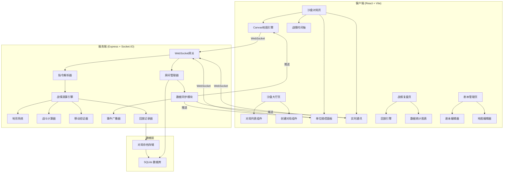
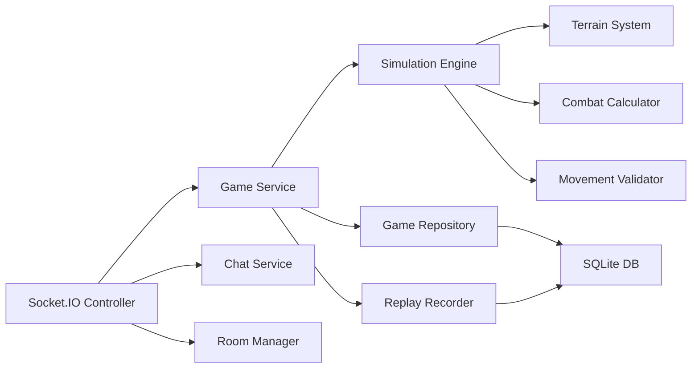
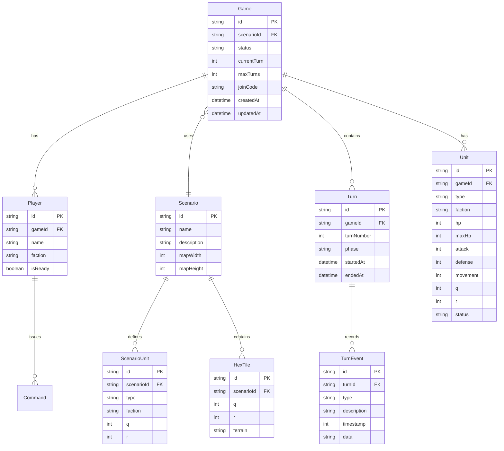

## 1. 架构设计



## 2. 技术说明

- **前端**：React@18 + TypeScript + TailwindCSS@3 + Vite
- **地图渲染**：HTML5 Canvas（自定义六角格引擎）
- **初始化工具**：Vite
- **后端**：Express@4 + TypeScript + Socket.IO
- **数据库**：SQLite（better-sqlite3），无需额外数据库服务
- **实时通信**：Socket.IO（双向 WebSocket）
- **图表**：Recharts
- **项目结构**：Monorepo（client + server 共享类型定义）

## 3. 路由定义

| 路由 | 用途 |
|------|------|
| `/` | 沙盘大厅页，对局列表与入口 |
| `/game/:id` | 沙盘对局页，地图画布与操控面板 |
| `/replay/:id` | 战报复盘页，回放与统计 |
| `/scenario` | 剧本管理页，剧本/地图编辑 |

## 4. API 定义

### 4.1 REST API

```typescript
interface CreateGameRequest {
  scenarioId: string;
  maxTurns: number;
  invitedPlayerId?: string;
}

interface CreateGameResponse {
  gameId: string;
  joinCode: string;
}

interface GameListItem {
  id: string;
  scenarioName: string;
  playerCount: number;
  status: "waiting" | "playing" | "finished";
  currentTurn: number;
  createdAt: string;
}

interface Scenario {
  id: string;
  name: string;
  description: string;
  mapWidth: number;
  mapHeight: number;
  factions: Faction[];
  victoryConditions: VictoryCondition[];
}

interface Unit {
  id: string;
  type: string;
  faction: string;
  hp: number;
  maxHp: number;
  attack: number;
  defense: number;
  movement: number;
  position: HexCoord;
  status: "active" | "damaged" | "destroyed";
}

interface HexCoord {
  q: number;
  r: number;
}

interface BattleResult {
  attackerId: string;
  defenderId: string;
  damageDealt: number;
  damageReceived: number;
  attackerHp: number;
  defenderHp: number;
  defenderDestroyed: boolean;
}

interface TurnResult {
  turn: number;
  phase: "deploy" | "move" | "combat" | "settle";
  movements: MovementAction[];
  battles: BattleResult[];
  events: GameEvent[];
}

interface GameEvent {
  type: "unit_destroyed" | "objective_captured" | "reinforcement_arrived" | "turn_end";
  description: string;
  timestamp: number;
  data?: Record<string, unknown>;
}
```

### 4.2 Socket.IO 事件

```typescript
interface ClientToServerEvents {
  "game:join": (gameId: string) => void;
  "game:leave": (gameId: string) => void;
  "game:command": (command: GameCommand) => void;
  "game:ready": (gameId: string) => void;
  "chat:message": (gameId: string, message: string) => void;
}

interface ServerToClientEvents {
  "game:state": (state: GameState) => void;
  "game:turnResult": (result: TurnResult) => void;
  "game:phaseChange": (phase: string) => void;
  "game:playerJoined": (playerId: string) => void;
  "game:playerLeft": (playerId: string) => void;
  "chat:message": (senderId: string, message: string) => void;
  "game:error": (error: { code: string; message: string }) => void;
}

interface GameCommand {
  type: "move" | "attack" | "wait" | "deploy";
  unitId: string;
  target?: HexCoord;
  targetUnitId?: string;
}
```

## 5. 服务端架构图



## 6. 数据模型

### 6.1 数据模型定义



### 6.2 数据定义语言

```sql
CREATE TABLE games (
  id TEXT PRIMARY KEY,
  scenario_id TEXT NOT NULL REFERENCES scenarios(id),
  status TEXT NOT NULL DEFAULT 'waiting',
  current_turn INTEGER NOT NULL DEFAULT 0,
  max_turns INTEGER NOT NULL DEFAULT 20,
  join_code TEXT NOT NULL UNIQUE,
  created_at TEXT NOT NULL DEFAULT (datetime('now')),
  updated_at TEXT NOT NULL DEFAULT (datetime('now'))
);

CREATE TABLE players (
  id TEXT PRIMARY KEY,
  game_id TEXT NOT NULL REFERENCES games(id) ON DELETE CASCADE,
  name TEXT NOT NULL,
  faction TEXT NOT NULL,
  is_ready INTEGER NOT NULL DEFAULT 0
);

CREATE TABLE units (
  id TEXT PRIMARY KEY,
  game_id TEXT NOT NULL REFERENCES games(id) ON DELETE CASCADE,
  type TEXT NOT NULL,
  faction TEXT NOT NULL,
  hp INTEGER NOT NULL,
  max_hp INTEGER NOT NULL,
  attack INTEGER NOT NULL,
  defense INTEGER NOT NULL,
  movement INTEGER NOT NULL,
  q INTEGER NOT NULL,
  r INTEGER NOT NULL,
  status TEXT NOT NULL DEFAULT 'active'
);

CREATE TABLE turns (
  id TEXT PRIMARY KEY,
  game_id TEXT NOT NULL REFERENCES games(id) ON DELETE CASCADE,
  turn_number INTEGER NOT NULL,
  phase TEXT NOT NULL,
  started_at TEXT NOT NULL,
  ended_at TEXT
);

CREATE TABLE turn_events (
  id TEXT PRIMARY KEY,
  turn_id TEXT NOT NULL REFERENCES turns(id) ON DELETE CASCADE,
  type TEXT NOT NULL,
  description TEXT NOT NULL,
  timestamp INTEGER NOT NULL,
  data TEXT
);

CREATE TABLE scenarios (
  id TEXT PRIMARY KEY,
  name TEXT NOT NULL,
  description TEXT NOT NULL DEFAULT '',
  map_width INTEGER NOT NULL,
  map_height INTEGER NOT NULL
);

CREATE TABLE scenario_units (
  id TEXT PRIMARY KEY,
  scenario_id TEXT NOT NULL REFERENCES scenarios(id) ON DELETE CASCADE,
  type TEXT NOT NULL,
  faction TEXT NOT NULL,
  q INTEGER NOT NULL,
  r INTEGER NOT NULL
);

CREATE TABLE hex_tiles (
  id TEXT PRIMARY KEY,
  scenario_id TEXT NOT NULL REFERENCES scenarios(id) ON DELETE CASCADE,
  q INTEGER NOT NULL,
  r INTEGER NOT NULL,
  terrain TEXT NOT NULL DEFAULT 'plain'
);

CREATE INDEX idx_games_status ON games(status);
CREATE INDEX idx_units_game ON units(game_id);
CREATE INDEX idx_turns_game ON turns(game_id);
CREATE INDEX idx_players_game ON players(game_id);
CREATE INDEX idx_hex_tiles_scenario ON hex_tiles(scenario_id);
```
