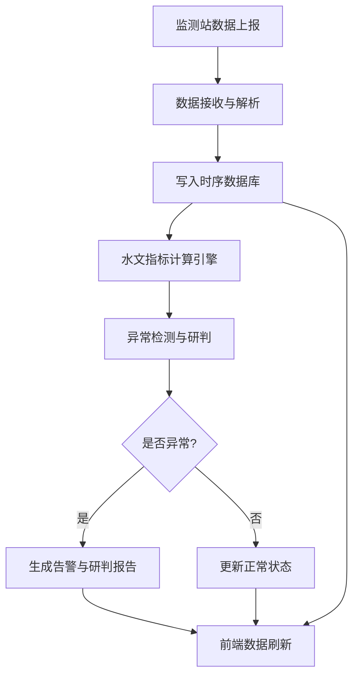
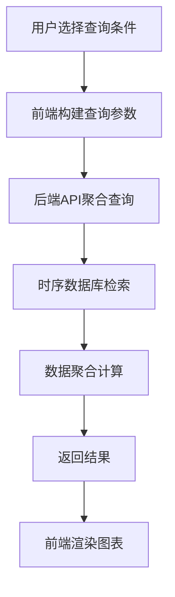

## 1. 产品概述

流域水文监测分析平台——面向水文监测人员与流域管理决策者，提供实时数据采集、水文指标智能计算、异常研判预警与多维可视化分析的一体化解决方案，助力流域水资源科学管理与防洪减灾决策。

- 核心目标：将分散的流域监测站点数据统一汇聚，通过自动化指标计算与异常检测，实现从"数据采集"到"预警研判"的闭环
- 目标用户：水文站监测员、流域管理局调度人员、水利部门决策者

## 2. 核心功能

### 2.1 用户角色

| 角色 | 权限说明 |
|------|----------|
| 监测员 | 查看实时监测数据、接收异常告警、导出数据报表 |
| 管理员 | 配置监测站点、设置告警阈值、管理用户、查看研判报告 |

### 2.2 功能模块

1. **监测总览仪表盘**：流域全景地图、关键指标卡片、实时告警滚动条、趋势迷你图
2. **多维图表分析**：水位/流量/降雨量时序曲线、多站点对比图、指标相关性散点图、降雨-水位联合分析图
3. **数据查询中心**：按站点/时间/指标类型筛选，支持聚合查询（小时/日/月均值），结果可导出
4. **水文指标计算**：水位涨率、洪峰流量、径流系数、降雨强度、重现期计算等
5. **异常研判预警**：基于阈值与统计模型的异常检测，自动生成研判报告，告警分级（蓝/黄/橙/红）
6. **数据接入管理**：监测站数据上报接口配置、数据解析规则管理、接入状态监控

### 2.3 页面详情

| 页面名称 | 模块名称 | 功能描述 |
|----------|----------|----------|
| 监测总览 | 指标卡片组 | 展示当前水位、流量、降雨量、水温等核心指标实时值与趋势方向 |
| 监测总览 | 流域站点地图 | 以地图形式展示各监测站位置与状态（正常/预警/离线） |
| 监测总览 | 实时告警条 | 滚动展示最新异常告警信息，点击可跳转详情 |
| 图表分析 | 时序曲线图 | 多指标时序叠加展示，支持缩放、平移、数据标注 |
| 图表分析 | 站点对比图 | 多站点同一指标对比，或同站点多指标对比 |
| 图表分析 | 降雨-水位联合图 | 双Y轴联合展示降雨量柱状图与水位曲线图 |
| 图表分析 | 指标相关性图 | 散点图展示指标间相关性，支持回归拟合线 |
| 数据查询 | 筛选条件面板 | 站点选择、时间范围、指标类型、聚合粒度等筛选 |
| 数据查询 | 查询结果表格 | 分页展示查询结果，支持排序、导出CSV |
| 异常研判 | 告警列表 | 分级展示当前与历史告警，支持筛选与确认 |
| 异常研判 | 研判报告 | 异常事件详情、指标趋势、研判结论与建议 |
| 数据接入 | 站点管理 | 增删改监测站点配置（名称、位置、协议、数据格式） |
| 数据接入 | 解析规则 | 配置数据解析模板（字段映射、单位转换、有效范围） |
| 数据接入 | 接入状态 | 各站点数据上报状态、最后接收时间、数据质量评分 |

## 3. 核心流程

### 3.1 数据采集与分析流程

监测站通过HTTP接口上报时序数据 → 后端接收并解析数据 → 写入时序数据库 → 触发指标计算引擎 → 异常检测模块评估 → 生成告警与研判报告 → 前端实时刷新展示

### 3.2 查询与分析流程

用户选择查询条件 → 前端构建查询参数 → 后端从时序数据库聚合查询 → 返回结果 → 前端渲染多维图表

## 4. 用户界面设计

### 4.1 设计风格

- **主色调**：深蓝(#0F2B46)为基调，搭配科技青(#00D4AA)作为强调色，传达水文监测的专业与科技感
- **辅助色**：告警采用标准四级色（蓝#3B82F6、黄#F59E0B、橙#F97316、红#EF4444）
- **字体**：标题使用 Source Han Sans（思源黑体），数据使用 JetBrains Mono 等宽字体
- **布局**：左侧导航栏 + 顶部信息栏 + 主内容区，卡片式模块布局
- **风格**：深色科技风大屏设计，数据密度高但层次分明

### 4.2 页面设计概览

| 页面名称 | 模块名称 | UI要素 |
|----------|----------|--------|
| 监测总览 | 指标卡片组 | 深色卡片、数字高亮、趋势箭头、迷你折线图 |
| 监测总览 | 流域站点地图 | SVG流域简图、站点圆点颜色标识状态、悬浮信息弹窗 |
| 监测总览 | 实时告警条 | 底部滚动条、分级颜色标签、闪烁动画 |
| 图表分析 | 时序曲线图 | 深色背景、平滑曲线、面积填充、十字准线 |
| 图表分析 | 降雨-水位联合图 | 双Y轴、柱状+曲线混合图、雨量渐变填充 |
| 图表分析 | 指标相关性图 | 散点图、回归拟合线、气泡大小映射权重 |
| 数据查询 | 筛选面板 | 侧边折叠面板、下拉选择器、日期范围选择器 |
| 数据查询 | 结果表格 | 深色表头、斑马纹行、固定列、导出按钮 |
| 异常研判 | 告警列表 | 级联颜色标签、时间轴布局、确认/忽略操作 |
| 异常研判 | 研判报告 | 报告卡片、指标快照、趋势缩略图、结论标签 |

### 4.3 响应式设计

- 桌面优先设计，支持1920×1080及1440×900分辨率
- 图表组件自适应容器宽度
- 平板端（768px+）简化布局为顶部导航+单列内容
- 移动端仅保留核心指标卡片与告警通知

### 4.4 动效设计

- 页面加载：卡片依次渐入（stagger delay）
- 数据刷新：数字滚动计数动画
- 告警触发：脉冲光晕效果
- 图表切换：平滑过渡动画
- 悬浮交互：卡片微抬起 + 阴影加深
