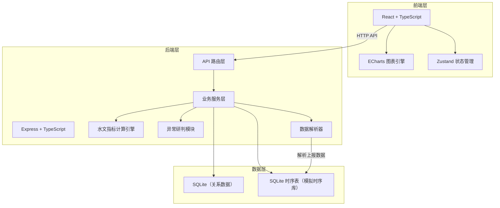
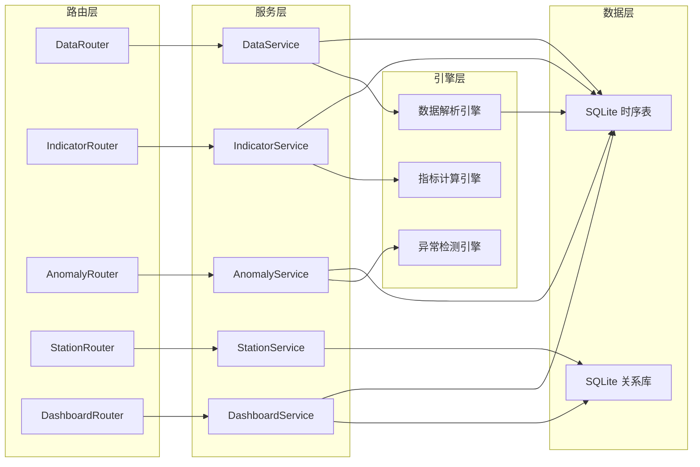

## 1. 架构设计



## 2. 技术说明

- **前端**：React@18 + TypeScript + Tailwind CSS@3 + Vite
- **图表库**：ECharts@5（支持丰富的时序图表与多维可视化）
- **状态管理**：Zustand
- **初始化工具**：vite-init（react-express-ts 模板）
- **后端**：Express@4 + TypeScript（ESM格式）
- **数据库**：SQLite（关系数据存储站点配置、用户信息；时序表模拟时序数据库存储监测数据）
- **时序数据方案**：SQLite + 时间分区索引模拟时序数据库，架构预留 InfluxDB/TDengine 切换接口

## 3. 路由定义

| 路由 | 用途 |
|------|------|
| `/` | 监测总览仪表盘 |
| `/analysis` | 多维图表分析页 |
| `/query` | 数据查询中心 |
| `/anomaly` | 异常研判预警页 |
| `/ingestion` | 数据接入管理页 |

## 4. API 定义

### 4.1 数据上报接口

```typescript
POST /api/data/report
Request: {
  stationId: string
  timestamp: string
  metrics: {
    waterLevel?: number
    flowRate?: number
    rainfall?: number
    waterTemp?: number
    ph?: number
    dissolvedOxygen?: number
  }
}
Response: {
  success: boolean
  message: string
}
```

### 4.2 监测数据查询接口

```typescript
GET /api/data/query
Params: {
  stationIds: string
  startTime: string
  endTime: string
  metrics: string
  aggregation?: "raw" | "hourly" | "daily" | "monthly"
}
Response: {
  data: Array<{
    stationId: string
    timestamp: string
    values: Record<string, number>
  }>
  total: number
}
```

### 4.3 水文指标计算接口

```typescript
GET /api/indicators/calculate
Params: {
  stationId: string
  indicatorType: "riseRate" | "peakFlow" | "runoffCoeff" | "rainfallIntensity" | "returnPeriod"
  startTime: string
  endTime: string
}
Response: {
  indicatorType: string
  value: number
  unit: string
  description: string
  details: Record<string, number>
}
```

### 4.4 异常检测接口

```typescript
GET /api/anomaly/detect
Params: {
  stationId?: string
  level?: "blue" | "yellow" | "orange" | "red"
  startTime?: string
  endTime?: string
  page?: number
  pageSize?: number
}
Response: {
  alerts: Array<{
    id: string
    stationId: string
    stationName: string
    level: "blue" | "yellow" | "orange" | "red"
    metric: string
    value: number
    threshold: number
    message: string
    timestamp: string
    status: "active" | "confirmed" | "ignored"
  }>
  total: number
}
```

### 4.5 异常确认接口

```typescript
POST /api/anomaly/confirm
Request: {
  alertId: string
  action: "confirm" | "ignore"
  comment?: string
}
Response: {
  success: boolean
}
```

### 4.6 站点管理接口

```typescript
GET /api/stations
Response: {
  stations: Array<{
    id: string
    name: string
    location: { lat: number; lng: number }
    river: string
    status: "online" | "offline" | "warning"
    lastReportTime: string
    metrics: string[]
  }>
}

POST /api/stations
Request: {
  name: string
  location: { lat: number; lng: number }
  river: string
  dataFormat: string
  metrics: string[]
}
Response: {
  success: boolean
  stationId: string
}
```

### 4.7 仪表盘概览接口

```typescript
GET /api/dashboard/overview
Response: {
  summary: {
    totalStations: number
    onlineStations: number
    activeAlerts: number
    avgWaterLevel: number
  }
  latestAlerts: Array<{
    id: string
    stationName: string
    level: string
    message: string
    timestamp: string
  }>
  stationStatuses: Array<{
    id: string
    name: string
    status: string
    latestValues: Record<string, number>
  }>
}
```

## 5. 服务端架构图



## 6. 数据模型

### 6.1 数据模型定义

```mermaid
erDiagram
    "stations" {
        string id PK
        string name
        float lat
        float lng
        string river
        string status
        string dataFormat
        datetime createdAt
    }

    "ts_monitor_data" {
        string id PK
        string stationId FK
        datetime timestamp
        float waterLevel
        float flowRate
        float rainfall
        float waterTemp
        float ph
        float dissolvedOxygen
    }

    "alert_rules" {
        string id PK
        string stationId FK
        string metric
        string level
        float threshold
        string operator
        boolean enabled
    }

    "alerts" {
        string id PK
        string stationId FK
        string ruleId FK
        string level
        string metric
        float value
        float threshold
        string message
        string status
        datetime timestamp
        string comment
    }

    "indicator_results" {
        string id PK
        string stationId FK
        string indicatorType
        float value
        string unit
        datetime startTime
        datetime endTime
        datetime calculatedAt
    }

    "stations" ||--o{ "ts_monitor_data" : "产生"
    "stations" ||--o{ "alert_rules" : "配置"
    "stations" ||--o{ "alerts" : "触发"
    "alert_rules" ||--o{ "alerts" : "生成"
    "stations" ||--o{ "indicator_results" : "计算"
```



### 6.2 数据定义语言

```sql
CREATE TABLE stations (
  id TEXT PRIMARY KEY,
  name TEXT NOT NULL,
  lat REAL NOT NULL,
  lng REAL NOT NULL,
  river TEXT NOT NULL,
  status TEXT NOT NULL DEFAULT 'online',
  data_format TEXT NOT NULL DEFAULT 'json',
  created_at TEXT NOT NULL DEFAULT (datetime('now'))
);

CREATE TABLE ts_monitor_data (
  id TEXT PRIMARY KEY,
  station_id TEXT NOT NULL,
  timestamp TEXT NOT NULL,
  water_level REAL,
  flow_rate REAL,
  rainfall REAL,
  water_temp REAL,
  ph REAL,
  dissolved_oxygen REAL,
  FOREIGN KEY (station_id) REFERENCES stations(id)
);

CREATE INDEX idx_ts_data_station_time ON ts_monitor_data(station_id, timestamp);
CREATE INDEX idx_ts_data_timestamp ON ts_monitor_data(timestamp);

CREATE TABLE alert_rules (
  id TEXT PRIMARY KEY,
  station_id TEXT NOT NULL,
  metric TEXT NOT NULL,
  level TEXT NOT NULL CHECK(level IN ('blue','yellow','orange','red')),
  threshold REAL NOT NULL,
  operator TEXT NOT NULL DEFAULT 'gt',
  enabled INTEGER NOT NULL DEFAULT 1,
  FOREIGN KEY (station_id) REFERENCES stations(id)
);

CREATE TABLE alerts (
  id TEXT PRIMARY KEY,
  station_id TEXT NOT NULL,
  rule_id TEXT NOT NULL,
  level TEXT NOT NULL,
  metric TEXT NOT NULL,
  value REAL NOT NULL,
  threshold REAL NOT NULL,
  message TEXT NOT NULL,
  status TEXT NOT NULL DEFAULT 'active',
  timestamp TEXT NOT NULL,
  comment TEXT,
  FOREIGN KEY (station_id) REFERENCES stations(id),
  FOREIGN KEY (rule_id) REFERENCES alert_rules(id)
);

CREATE INDEX idx_alerts_status ON alerts(status);
CREATE INDEX idx_alerts_level ON alerts(level);
CREATE INDEX idx_alerts_timestamp ON alerts(timestamp);

CREATE TABLE indicator_results (
  id TEXT PRIMARY KEY,
  station_id TEXT NOT NULL,
  indicator_type TEXT NOT NULL,
  value REAL NOT NULL,
  unit TEXT NOT NULL,
  start_time TEXT NOT NULL,
  end_time TEXT NOT NULL,
  calculated_at TEXT NOT NULL DEFAULT (datetime('now')),
  FOREIGN KEY (station_id) REFERENCES stations(id)
);

CREATE INDEX idx_indicators_station_type ON indicator_results(station_id, indicator_type);
```
