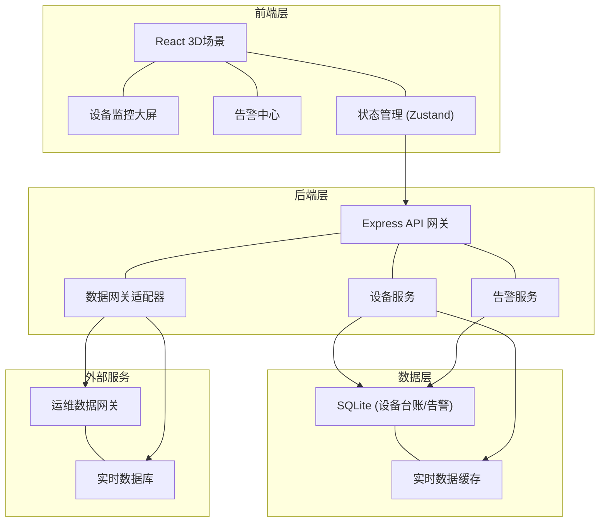
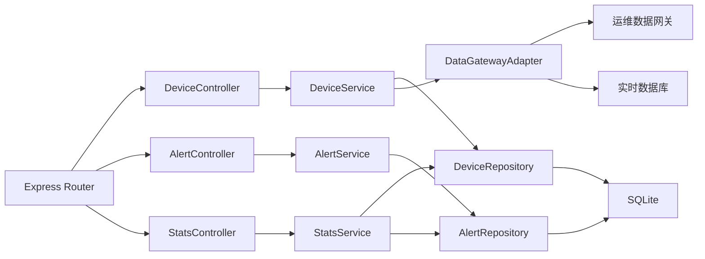
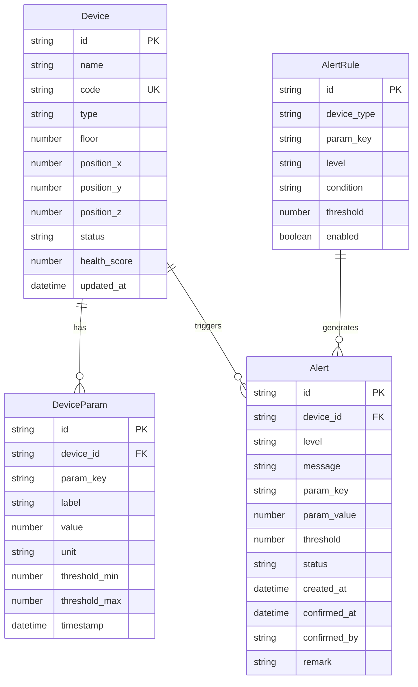

## 1. 架构设计



## 2. 技术说明

- **前端**：React@18 + TypeScript + Tailwind CSS@3 + Vite
- **3D引擎**：Three.js + @react-three/fiber + @react-three/drei + @react-three/postprocessing
- **图表**：Recharts（趋势曲线、统计图表）
- **状态管理**：Zustand
- **初始化工具**：vite-init (react-express-ts 模板)
- **后端**：Express@4 + TypeScript (ESM)
- **数据库**：SQLite (better-sqlite3)——设备台账与告警存储
- **实时通信**：WebSocket (ws库)——设备状态推送
- **数据网关对接**：HTTP/SSE 模拟运维数据网关，定时轮询实时数据库接口

## 3. 路由定义

| 路由 | 用途 |
|------|------|
| `/` | 3D场景总览页，管线模型加载与交互查询 |
| `/dashboard` | 设备监控大屏，实时状态与参数趋势 |
| `/alerts` | 告警中心，告警列表与处理 |

## 4. API 定义

### 4.1 设备相关

```typescript
interface Device {
  id: string;
  name: string;
  code: string;
  type: "hvac" | "plumbing" | "electrical" | "fire";
  floor: number;
  position: { x: number; y: number; z: number };
  status: "online" | "offline" | "alarm";
  healthScore: number;
  params: DeviceParam[];
}

interface DeviceParam {
  key: string;
  label: string;
  value: number;
  unit: string;
  threshold?: { min: number; max: number };
  timestamp: string;
}

// GET /api/devices - 获取设备列表
// GET /api/devices/:id - 获取设备详情
// GET /api/devices/:id/params - 获取设备实时参数
// GET /api/devices/:id/trend?key=temperature&hours=24 - 获取参数趋势
```

### 4.2 告警相关

```typescript
interface Alert {
  id: string;
  deviceId: string;
  deviceName: string;
  level: "critical" | "major" | "minor";
  message: string;
  paramKey: string;
  paramValue: number;
  threshold: number;
  status: "active" | "confirmed" | "resolved";
  createdAt: string;
  confirmedAt?: string;
  confirmedBy?: string;
  remark?: string;
}

// GET /api/alerts - 获取告警列表 (?level=&status=&page=&limit=)
// GET /api/alerts/:id - 获取告警详情
// PUT /api/alerts/:id/confirm - 确认告警
// PUT /api/alerts/:id/resolve - 解决告警
```

### 4.3 统计相关

```typescript
interface DashboardStats {
  total: number;
  online: number;
  offline: number;
  alarm: number;
  alertsByLevel: { critical: number; major: number; minor: number };
}

// GET /api/stats/overview - 获取总览统计
// GET /api/stats/floor/:floor - 获取楼层统计
```

### 4.4 WebSocket 事件

```typescript
// 服务端推送事件
interface WSMessage {
  type: "device_status" | "device_params" | "alert" | "health_update";
  payload: Device | DeviceParam[] | Alert | { deviceId: string; score: number };
}
```

## 5. 服务端架构图



## 6. 数据模型

### 6.1 数据模型定义



### 6.2 数据定义语言

```sql
CREATE TABLE devices (
  id TEXT PRIMARY KEY,
  name TEXT NOT NULL,
  code TEXT UNIQUE NOT NULL,
  type TEXT NOT NULL CHECK(type IN ('hvac', 'plumbing', 'electrical', 'fire')),
  floor INTEGER NOT NULL,
  position_x REAL NOT NULL,
  position_y REAL NOT NULL,
  position_z REAL NOT NULL,
  status TEXT NOT NULL DEFAULT 'offline' CHECK(status IN ('online', 'offline', 'alarm')),
  health_score REAL NOT NULL DEFAULT 100,
  updated_at TEXT NOT NULL DEFAULT (datetime('now'))
);

CREATE TABLE device_params (
  id TEXT PRIMARY KEY,
  device_id TEXT NOT NULL REFERENCES devices(id) ON DELETE CASCADE,
  param_key TEXT NOT NULL,
  label TEXT NOT NULL,
  value REAL NOT NULL,
  unit TEXT NOT NULL,
  threshold_min REAL,
  threshold_max REAL,
  timestamp TEXT NOT NULL DEFAULT (datetime('now')),
  UNIQUE(device_id, param_key)
);

CREATE TABLE alert_rules (
  id TEXT PRIMARY KEY,
  device_type TEXT NOT NULL,
  param_key TEXT NOT NULL,
  level TEXT NOT NULL CHECK(level IN ('critical', 'major', 'minor')),
  condition TEXT NOT NULL CHECK(condition IN ('gt', 'lt', 'eq')),
  threshold REAL NOT NULL,
  enabled INTEGER NOT NULL DEFAULT 1
);

CREATE TABLE alerts (
  id TEXT PRIMARY KEY,
  device_id TEXT NOT NULL REFERENCES devices(id) ON DELETE CASCADE,
  level TEXT NOT NULL CHECK(level IN ('critical', 'major', 'minor')),
  message TEXT NOT NULL,
  param_key TEXT NOT NULL,
  param_value REAL NOT NULL,
  threshold REAL NOT NULL,
  status TEXT NOT NULL DEFAULT 'active' CHECK(status IN ('active', 'confirmed', 'resolved')),
  created_at TEXT NOT NULL DEFAULT (datetime('now')),
  confirmed_at TEXT,
  confirmed_by TEXT,
  remark TEXT
);

CREATE INDEX idx_devices_type ON devices(type);
CREATE INDEX idx_devices_floor ON devices(floor);
CREATE INDEX idx_devices_status ON devices(status);
CREATE INDEX idx_device_params_device ON device_params(device_id);
CREATE INDEX idx_alerts_device ON alerts(device_id);
CREATE INDEX idx_alerts_level ON alerts(level);
CREATE INDEX idx_alerts_status ON alerts(status);
CREATE INDEX idx_alerts_created ON alerts(created_at);
```
