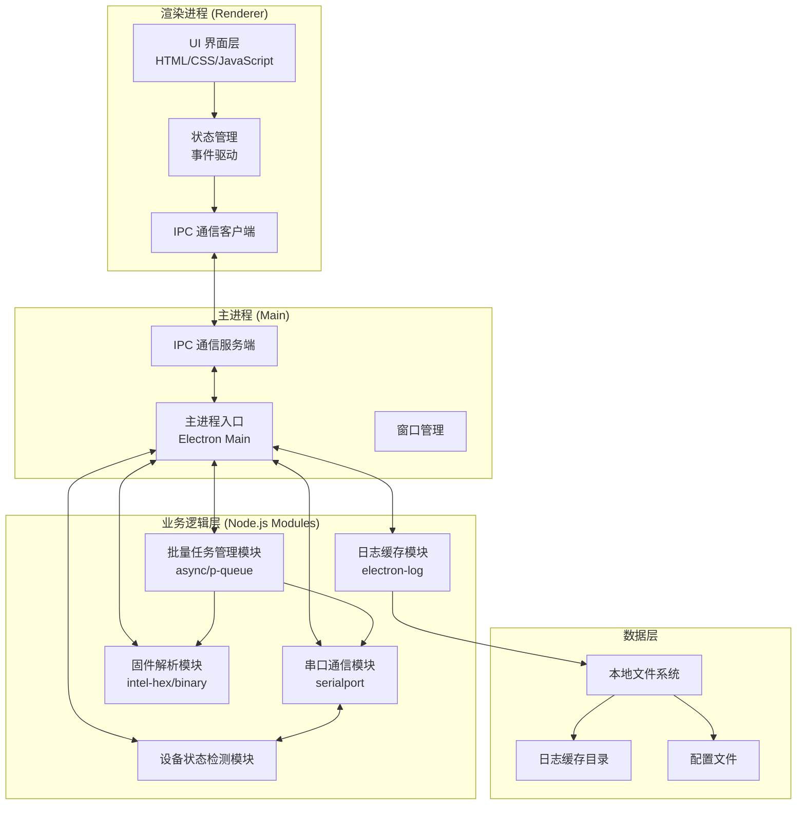
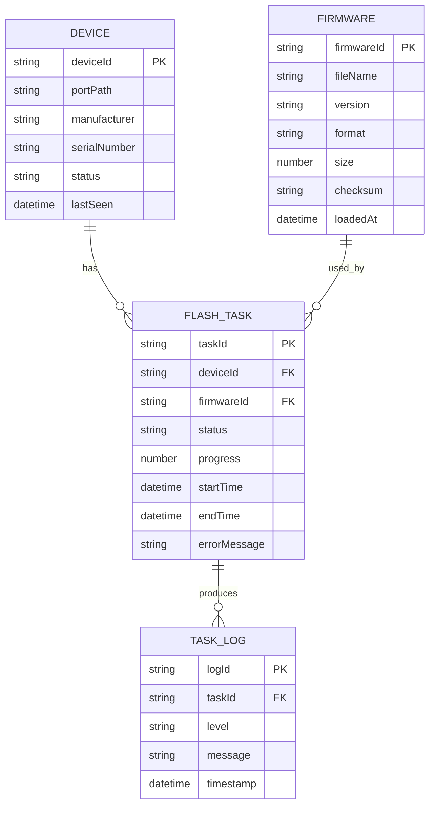

## 1. 架构设计



## 2. 技术栈描述

- **桌面框架**：Electron@28 - 跨平台桌面应用框架，支持 Windows/macOS
- **运行时**：Node.js@18 - 原生模块支持，串口通信能力
- **串口通信**：serialport@12 - Node.js 串口通信库，跨平台支持
- **固件解析**：intel-hex@1 - Intel HEX 格式解析，自定义二进制解析
- **任务调度**：p-queue@7 - 并发任务队列管理，控制并行刷写数量
- **日志管理**：electron-log@5 - 跨平台日志记录，文件滚动存储
- **UI 框架**：原生 HTML5 + CSS3 + JavaScript ES6+ - 轻量无依赖，性能最优
- **图标库**：Lucide - 高质量 SVG 线性图标
- **构建工具**：electron-builder@24 - 打包构建 Windows NSIS 和 macOS DMG

## 3. 目录结构定义

```
firmware-flasher/
├── package.json                  # 项目配置与依赖
├── electron-builder.yml          # 构建配置
├── src/
│   ├── main/                     # 主进程
│   │   ├── index.js              # 主进程入口
│   │   ├── window.js             # 窗口管理
│   │   └── ipc.js                # IPC 通信处理
│   ├── renderer/                 # 渲染进程
│   │   ├── index.html            # UI 页面
│   │   ├── css/
│   │   │   ├── main.css          # 主样式
│   │   │   └── variables.css     # 主题变量
│   │   └── js/
│   │       ├── app.js            # UI 主逻辑
│   │       ├── ui-components.js  # UI 组件
│   │       └── ipc-client.js     # IPC 客户端
│   └── modules/                  # 业务模块
│       ├── serialport/           # 串口通信模块
│       │   ├── index.js
│       │   └── SerialManager.js
│       ├── firmware/             # 固件解析模块
│       │   ├── index.js
│       │   ├── FirmwareParser.js
│       │   └── formats/
│       │       ├── BinParser.js
│       │       ├── HexParser.js
│       │       └── ElfParser.js
│       ├── task-manager/         # 批量任务管理模块
│       │   ├── index.js
│       │   ├── TaskManager.js
│       │   └── FlashTask.js
│       ├── device-monitor/       # 设备状态检测模块
│       │   ├── index.js
│       │   └── DeviceMonitor.js
│       └── logger/               # 日志管理模块
│           ├── index.js
│           └── Logger.js
└── logs/                         # 运行时日志目录
```

## 4. 核心模块接口定义

### 4.1 串口通信模块 (SerialManager)

```javascript
// 类型定义
interface SerialPortInfo {
  path: string;
  manufacturer?: string;
  serialNumber?: string;
  pnpId?: string;
  vendorId?: string;
  productId?: string;
}

interface SerialConnection {
  port: SerialPort;
  isOpen: boolean;
  deviceId: string;
}

interface ISerialManager {
  listPorts(): Promise<SerialPortInfo[]>;
  connect(portPath: string, options: SerialPortOptions): Promise<SerialConnection>;
  disconnect(deviceId: string): Promise<void>;
  write(deviceId: string, data: Buffer): Promise<void>;
  onData(deviceId: string, callback: (data: Buffer) => void): void;
  onError(deviceId: string, callback: (error: Error) => void): void;
}
```

### 4.2 固件解析模块 (FirmwareParser)

```javascript
interface FirmwareInfo {
  fileName: string;
  filePath: string;
  format: 'bin' | 'hex' | 'elf';
  version: string;
  size: number;
  checksum: string;
  data: Buffer;
  loadAddress: number;
  entryPoint?: number;
  segments: FirmwareSegment[];
}

interface FirmwareSegment {
  address: number;
  length: number;
  data: Buffer;
}

interface IFirmwareParser {
  parse(filePath: string): Promise<FirmwareInfo>;
  validate(firmware: FirmwareInfo): boolean;
  getChecksum(data: Buffer): string;
}
```

### 4.3 批量任务管理模块 (TaskManager)

```javascript
type TaskStatus = 'pending' | 'running' | 'success' | 'failed' | 'cancelled';

interface FlashTaskConfig {
  taskId: string;
  deviceId: string;
  portPath: string;
  firmware: FirmwareInfo;
  baudRate: number;
}

interface FlashTaskProgress {
  taskId: string;
  deviceId: string;
  status: TaskStatus;
  progress: number;
  elapsed: number;
  error?: string;
}

interface ITaskManager {
  createTask(config: FlashTaskConfig): FlashTask;
  startBatch(taskIds: string[], concurrency: number): Promise<void>;
  cancelTask(taskId: string): void;
  cancelAll(): void;
  onProgress(callback: (progress: FlashTaskProgress) => void): void;
  getTaskStatus(taskId: string): FlashTaskProgress;
  getAllTasks(): FlashTask[];
}
```

### 4.4 设备状态检测模块 (DeviceMonitor)

```javascript
type DeviceStatus = 'offline' | 'online' | 'flashing' | 'success' | 'error';

interface DeviceInfo {
  deviceId: string;
  portPath: string;
  status: DeviceStatus;
  manufacturer?: string;
  serialNumber?: string;
  firmwareVersion?: string;
  lastSeen: Date;
}

interface IDeviceMonitor {
  start(pollInterval: number): void;
  stop(): void;
  getDevices(): DeviceInfo[];
  getDevice(deviceId: string): DeviceInfo | undefined;
  updateDeviceStatus(deviceId: string, status: DeviceStatus): void;
  onDeviceAdded(callback: (device: DeviceInfo) => void): void;
  onDeviceRemoved(callback: (device: DeviceInfo) => void): void;
  onDeviceChanged(callback: (device: DeviceInfo) => void): void;
}
```

### 4.5 IPC 通信通道定义

```javascript
// IPC 通道常量
const IPC_CHANNELS = {
  DEVICE_LIST: 'device:list',
  DEVICE_REFRESH: 'device:refresh',
  DEVICE_CHANGED: 'device:changed',
  
  FIRMWARE_LOAD: 'firmware:load',
  FIRMWARE_PARSED: 'firmware:parsed',
  
  TASK_CREATE: 'task:create',
  TASK_START: 'task:start',
  TASK_CANCEL: 'task:cancel',
  TASK_PROGRESS: 'task:progress',
  TASK_COMPLETE: 'task:complete',
  
  LOG_QUERY: 'log:query',
  LOG_EXPORT: 'log:export',
  LOG_CLEAR: 'log:clear',
  
  APP_MINIMIZE: 'app:minimize',
  APP_MAXIMIZE: 'app:maximize',
  APP_CLOSE: 'app:close',
};
```

## 5. 数据模型

### 5.1 实体关系图



### 5.2 本地存储配置

- **日志存储**：`logs/` 目录，按日期分文件，保留最近 30 天
- **配置文件**：`%APPDATA%/FirmwareFlasher/config.json` 存储用户偏好设置
- **任务记录**：`logs/tasks.json` 存储历史任务列表，最多 1000 条
- **固件缓存**：不缓存固件原始文件，仅记录解析元数据
