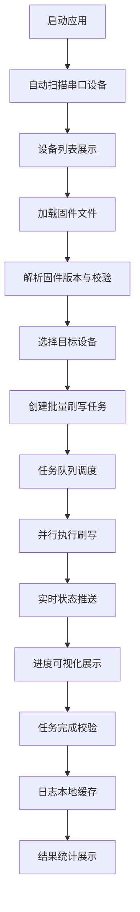

## 1. 产品概述

硬件固件批量刷写桌面管理工具，基于 Electron + Node.js 开发，运行于 Windows/macOS 双平台。解决多设备固件批量升级效率低下的问题，为嵌入式开发工程师、硬件测试人员提供一站式设备管理与刷写解决方案。

核心价值：实现设备检测 - 固件加载 - 批量刷写全流程自动化，支持多串口设备并行操作，实时监控设备状态，本地缓存任务日志，大幅提升固件升级效率。

## 2. 核心功能

### 2.1 用户角色
| 角色 | 使用场景 | 核心权限 |
|------|----------|----------|
| 研发工程师 | 固件开发阶段批量验证 | 全部功能权限 |
| 测试工程师 | 硬件测试阶段固件刷写 | 刷写操作、日志查看 |
| 产线操作人员 | 批量生产固件烧录 | 刷写操作、状态监控 |

### 2.2 功能模块
1. **设备管理面板**：串口设备扫描、连接状态显示、设备信息识别
2. **固件管理面板**：固件文件解析、版本校验、多版本管理
3. **任务管理面板**：批量刷写任务创建、进度监控、任务队列
4. **状态监控面板**：设备运行状态实时展示、刷写进度可视化
5. **日志管理面板**：任务日志本地缓存、历史记录查询、导出

### 2.3 页面详情
| 页面名称 | 模块名称 | 功能描述 |
|---------|----------|----------|
| 主窗口 | 设备管理 | 自动扫描串口设备，手动刷新，显示设备 COM 口、厂商信息、连接状态 |
| 主窗口 | 固件管理 | 拖拽/选择固件文件，解析固件版本、大小、校验和，支持 .bin/.hex/.elf 格式 |
| 主窗口 | 任务管理 | 创建批量刷写任务，选择目标设备和固件，支持并发数配置 |
| 主窗口 | 状态监控 | 实时显示每个设备刷写进度、当前状态、成功/失败统计 |
| 主窗口 | 日志管理 | 本地存储任务执行日志，支持按时间、设备、状态筛选和导出 |

## 3. 核心流程

用户启动应用后，系统自动扫描可用串口设备；用户加载并解析固件文件，选择目标设备创建批量刷写任务；系统按队列并行执行刷写，实时推送进度和状态更新；任务完成后自动保存日志，支持后续追溯。

## 4. 用户界面设计

### 4.1 设计风格
- 主色调：深蓝色 (#165DFF) 作为科技感主色，配合深灰色 (#1D2129) 背景
- 辅助色：绿色 (#00B42A) 表示成功，红色 (#F53F3F) 表示失败，橙色 (#FF7D00) 表示进行中
- 按钮风格：扁平化直角设计，4px 圆角，hover 状态有轻微浮起效果
- 字体：JetBrains Mono 作为等宽字体用于设备信息展示，思源黑体作为界面字体
- 布局：左侧导航栏 + 右侧内容区的经典桌面应用布局，卡片式信息展示
- 图标风格：线性图标，统一 16px 尺寸，使用 Lucide 图标库

### 4.2 页面设计概述
| 页面名称 | 模块名称 | UI 元素 |
|---------|----------|----------|
| 主窗口 | 设备列表 | 表格布局，每行显示设备图标、COM 口、描述、状态、操作按钮 |
| 主窗口 | 固件信息卡 | 卡片式布局，显示文件名、版本号、大小、校验和、加载时间 |
| 主窗口 | 任务进度区 | 进度条网格布局，每个设备对应一个进度卡片，显示百分比和状态 |
| 主窗口 | 日志面板 | 底部可折叠面板，时间戳 + 级别 + 内容的列表展示 |
| 主窗口 | 统计概览 | 顶部数据卡片，显示在线设备数、待刷写数、成功数、失败数 |

### 4.3 响应性
- 桌面端优先设计，支持窗口最小尺寸 1280x800
- 内容区域支持自适应缩放，表格支持横向滚动
- 日志面板支持高度拖拽调整
- 跨平台统一交互体验，Windows/macOS 适配各自系统标题栏风格

### 4.4 动效设计
- 页面加载：内容区从下向上淡入，延迟 50ms 逐级显示
- 状态变化：设备状态切换时有颜色过渡动画（300ms ease）
- 刷写进度：进度条平滑增长，百分比数字跳动更新
- 操作反馈：按钮点击有缩放反馈，成功/失败状态有轻量震动效果
- 设备连接：新设备检测到时从右侧滑入动画
