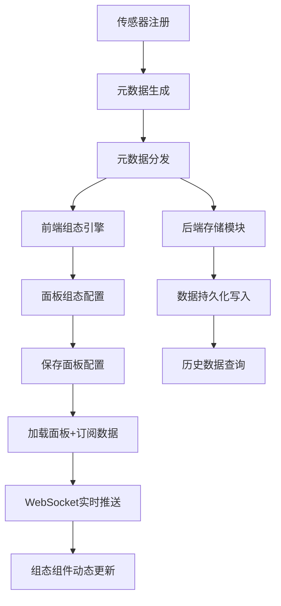

## 1. 产品概述

工业传感器智能监控平台，面向海量工业传感器的元数据管理、实时数据订阅、面板动态组态与数据持久化存储的一体化解决方案。解决工业场景下传感器类型繁杂、数据实时性要求高、组态配置灵活性不足的痛点。

- 目标用户：工厂运维工程师、设备管理人员、工业数据分析师
- 核心价值：降低传感器接入成本，实现零代码面板组态，保障数据实时可靠落地

## 2. 核心功能

### 2.1 用户角色

| 角色 | 注册方式 | 核心权限 |
|------|----------|----------|
| 运维工程师 | 管理员分配账号 | 传感器管理、面板组态、数据查看 |
| 数据分析师 | 管理员分配账号 | 数据查询、报表导出、实时监控 |
| 系统管理员 | 系统内置 | 全部权限、用户管理、系统配置 |

### 2.2 功能模块

1. **传感器元数据管理页**：传感器注册、分类、属性定义、元数据分发
2. **实时监控仪表盘**：传感器数据实时展示、告警状态、趋势图表
3. **组态面板设计器**：拖拽式组件布局、组件属性配置、数据绑定、面板保存/加载
4. **数据存储与查询页**：历史数据查询、数据导出、存储策略配置

### 2.3 页面详情

| 页面名称 | 模块名称 | 功能描述 |
|----------|----------|----------|
| 传感器元数据管理页 | 传感器列表 | 展示已注册传感器，支持搜索/筛选/分页 |
| 传感器元数据管理页 | 传感器注册表单 | 新增传感器：名称、类型、协议、采集频率、标签等 |
| 传感器元数据管理页 | 元数据分发状态 | 显示元数据向各节点的分发状态和同步进度 |
| 实时监控仪表盘 | 实时数据卡片 | 展示传感器最新值、状态标识、更新时间 |
| 实时监控仪表盘 | 趋势图表 | 传感器数据实时折线图，支持多传感器对比 |
| 实时监控仪表盘 | 告警面板 | 告警列表、告警等级标识、告警确认 |
| 组态面板设计器 | 组件面板 | 可拖拽组件库：仪表盘、图表、指示灯、按钮、文本等 |
| 组态面板设计器 | 画布区域 | 拖拽布局画布，支持网格对齐、缩放 |
| 组态面板设计器 | 属性配置面板 | 选中组件的属性编辑：样式、数据绑定、交互事件 |
| 组态面板设计器 | 面板管理 | 面板保存、加载、列表管理 |
| 数据存储与查询页 | 历史数据查询 | 按传感器/时间范围查询历史数据，表格展示 |
| 数据存储与查询页 | 数据导出 | 支持CSV/JSON格式导出 |
| 数据存储与查询页 | 存储策略配置 | 数据保留周期、压缩策略、分片规则 |

## 3. 核心流程

### 3.1 传感器接入与元数据分发流程
1. 运维工程师在元数据管理页注册新传感器，填写类型、协议、采集频率等属性
2. 系统生成传感器元数据定义（包含数据结构、单位、量程等）
3. 元数据通过分发模块推送到前端组态引擎和后端存储模块
4. 前端组态引擎自动生成可用组件绑定选项
5. 后端存储模块自动创建对应的数据表/集合

### 3.2 面板组态流程
1. 工程师在组态设计器中从组件面板拖拽组件到画布
2. 配置组件属性，绑定传感器数据源
3. 保存面板配置到服务端
4. 面板加载时，根据配置动态渲染组件并订阅实时数据

### 3.3 实时数据订阅流程
1. 前端通过WebSocket连接到服务端数据订阅中心
2. 订阅指定传感器或传感器组的数据流
3. 服务端接收到传感器数据后，根据订阅关系推送到对应前端
4. 前端组态组件接收数据并实时更新显示
5. 同时数据写入持久化存储模块

## 4. 用户界面设计

### 4.1 设计风格
- **主色调**：深色工业风（深灰 #1a1a2e 为底色，钢蓝 #0f3460 为辅助色，亮青 #00d2ff 为强调色）
- **辅助色**：告警红 #ff4757、正常绿 #2ed573、警告橙 #ffa502
- **按钮风格**：圆角4px，微阴影，hover时发光边框效果
- **字体**：标题使用 JetBrains Mono（工业/技术感），正文使用 Noto Sans SC
- **布局风格**：左侧导航栏 + 顶部工具栏 + 主内容区，深色主题
- **图标风格**：线性图标（lucide-react），1.5px线宽

### 4.2 页面设计概览

| 页面名称 | 模块名称 | UI元素 |
|----------|----------|--------|
| 传感器元数据管理页 | 传感器列表 | 深色表格、状态指示灯、搜索栏、筛选下拉 |
| 传感器元数据管理页 | 注册表单 | 侧滑抽屉、分组表单、协议选择器 |
| 传感器元数据管理页 | 分发状态 | 节点卡片、进度条、同步状态图标 |
| 实时监控仪表盘 | 实时数据卡片 | 网格布局卡片、数值跳动动画、状态色块 |
| 实时监控仪表盘 | 趋势图表 | 深色背景折线图、多色曲线、时间轴滑块 |
| 实时监控仪表盘 | 告警面板 | 告警列表、等级色标、闪烁动画 |
| 组态面板设计器 | 组件面板 | 左侧分类列表、组件缩略图、拖拽手柄 |
| 组态面板设计器 | 画布区域 | 网格背景、组件占位框、选中高亮、缩放控件 |
| 组态面板设计器 | 属性面板 | 右侧表单、颜色选择器、数据源下拉绑定 |
| 数据存储与查询页 | 历史查询 | 时间范围选择器、传感器多选、数据表格 |
| 数据存储与查询页 | 数据导出 | 导出按钮、格式选择、进度提示 |
| 数据存储与查询页 | 存储策略 | 策略卡片、配置表单、开关控件 |

### 4.3 响应式设计
- 桌面优先设计，1920x1080为基准分辨率
- 侧边栏在窄屏下可收起为图标模式
- 组态画布支持全屏模式
- 数据表格在窄屏下支持横向滚动

### 4.4 动效设计
- 页面加载：组件交错渐入（stagger fade-in）
- 数据更新：数值变化时平滑过渡动画
- 告警触发：告警卡片边框闪烁脉冲
- 组态拖拽：拖拽时组件半透明+阴影跟随
- 传感器在线状态：在线绿点呼吸灯效果
