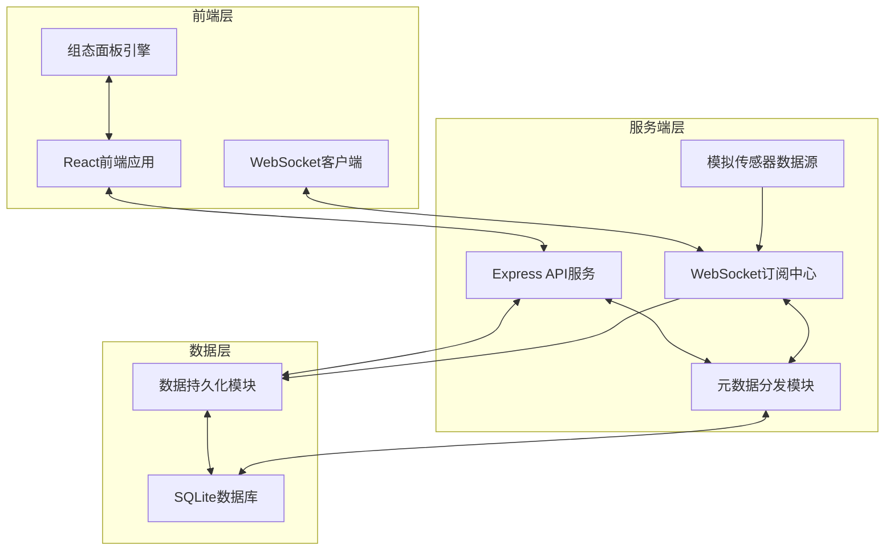
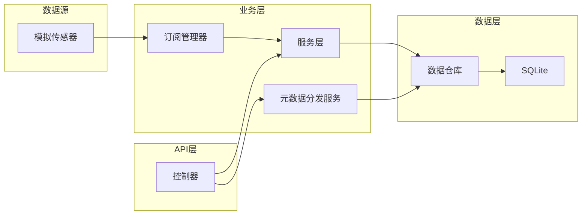
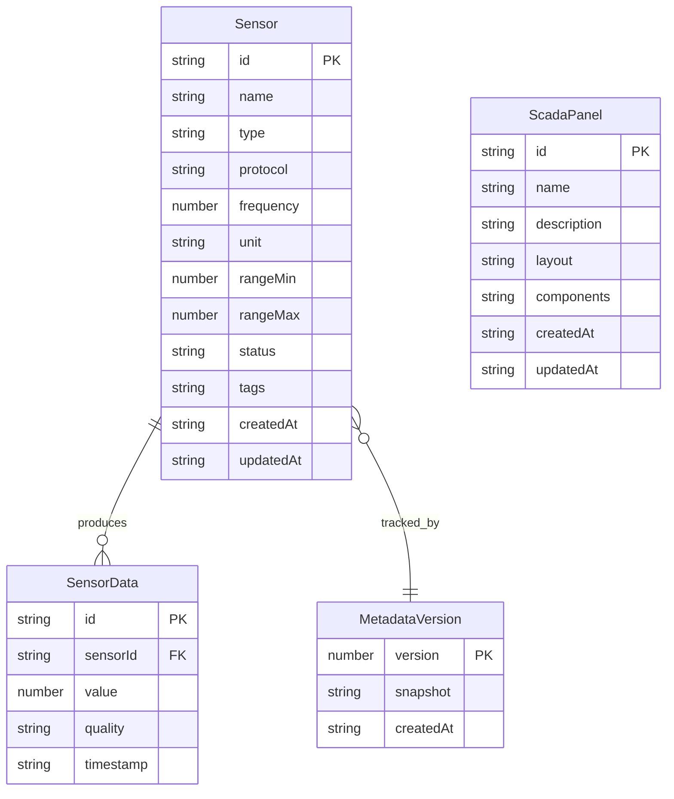

## 1. 架构设计



## 2. 技术说明

- **前端**：React@18 + TypeScript + Tailwind CSS@3 + Vite
- **初始化工具**：vite-init（react-express-ts模板）
- **状态管理**：Zustand
- **后端**：Express@4 + TypeScript（ESM格式）
- **数据库**：SQLite（better-sqlite3），零配置嵌入式数据库
- **实时通信**：ws库实现WebSocket双向通信
- **图表**：Recharts实现数据可视化
- **图标**：lucide-react

## 3. 路由定义

| 路由 | 用途 |
|------|------|
| / | 首页仪表盘，传感器实时数据总览 |
| /sensors | 传感器元数据管理，注册/编辑/查看传感器 |
| /scada | 组态面板设计器，拖拽式面板配置 |
| /scada/:id | 组态面板运行时，加载指定面板并订阅数据 |
| /data | 数据存储与查询，历史数据检索和导出 |

## 4. API定义

### 4.1 传感器元数据API

```typescript
interface Sensor {
  id: string;
  name: string;
  type: string;
  protocol: string;
  frequency: number;
  unit: string;
  rangeMin: number;
  rangeMax: number;
  tags: string[];
  status: "online" | "offline" | "alarm";
  createdAt: string;
  updatedAt: string;
}

// GET /api/sensors - 获取传感器列表（支持分页、搜索、筛选）
// GET /api/sensors/:id - 获取传感器详情
// POST /api/sensors - 注册新传感器
// PUT /api/sensors/:id - 更新传感器信息
// DELETE /api/sensors/:id - 删除传感器
```

### 4.2 组态面板API

```typescript
interface ScadaPanel {
  id: string;
  name: string;
  description: string;
  layout: PanelLayout;
  components: PanelComponent[];
  createdAt: string;
  updatedAt: string;
}

interface PanelComponent {
  id: string;
  type: "gauge" | "chart" | "indicator" | "button" | "text" | "valve" | "pipe";
  x: number;
  y: number;
  width: number;
  height: number;
  props: Record<string, unknown>;
  sensorBindings: string[];
}

interface PanelLayout {
  cols: number;
  rows: number;
  gridGap: number;
}

// GET /api/panels - 获取面板列表
// GET /api/panels/:id - 获取面板详情（含布局和组件配置）
// POST /api/panels - 创建新面板
// PUT /api/panels/:id - 更新面板配置
// DELETE /api/panels/:id - 删除面板
```

### 4.3 数据查询API

```typescript
interface SensorData {
  sensorId: string;
  timestamp: string;
  value: number;
  quality: "good" | "uncertain" | "bad";
}

// GET /api/data/query?sensorIds=...&startTime=...&endTime=... - 查询历史数据
// GET /api/data/export?sensorIds=...&startTime=...&endTime=...&format=csv|json - 导出数据
// GET /api/data/stats?sensorId=...&period=1h|6h|24h|7d - 获取统计信息
```

### 4.4 元数据分发API

```typescript
interface MetadataSnapshot {
  version: number;
  sensors: Sensor[];
  timestamp: string;
}

// GET /api/metadata/snapshot - 获取元数据快照
// GET /api/metadata/version - 获取当前元数据版本号
// POST /api/metadata/sync - 触发元数据同步
```

### 4.5 WebSocket消息协议

```typescript
// 客户端 -> 服务端
type ClientMessage =
  | { type: "subscribe"; sensorIds: string[] }
  | { type: "unsubscribe"; sensorIds: string[] }
  | { type: "ping" };

// 服务端 -> 客户端
type ServerMessage =
  | { type: "data"; sensorId: string; value: number; timestamp: string }
  | { type: "status"; sensorId: string; status: "online" | "offline" | "alarm" }
  | { type: "metadata_updated"; version: number }
  | { type: "pong" };
```

## 5. 服务端架构图



## 6. 数据模型

### 6.1 数据模型定义



### 6.2 数据定义语言

```sql
CREATE TABLE IF NOT EXISTS sensors (
  id TEXT PRIMARY KEY,
  name TEXT NOT NULL,
  type TEXT NOT NULL,
  protocol TEXT NOT NULL DEFAULT 'MQTT',
  frequency INTEGER NOT NULL DEFAULT 1000,
  unit TEXT NOT NULL DEFAULT '',
  range_min REAL NOT NULL DEFAULT 0,
  range_max REAL NOT NULL DEFAULT 100,
  status TEXT NOT NULL DEFAULT 'offline',
  tags TEXT NOT NULL DEFAULT '[]',
  created_at TEXT NOT NULL DEFAULT (datetime('now')),
  updated_at TEXT NOT NULL DEFAULT (datetime('now'))
);

CREATE TABLE IF NOT EXISTS sensor_data (
  id INTEGER PRIMARY KEY AUTOINCREMENT,
  sensor_id TEXT NOT NULL,
  value REAL NOT NULL,
  quality TEXT NOT NULL DEFAULT 'good',
  timestamp TEXT NOT NULL DEFAULT (datetime('now')),
  FOREIGN KEY (sensor_id) REFERENCES sensors(id)
);

CREATE INDEX IF NOT EXISTS idx_sensor_data_sensor_id ON sensor_data(sensor_id);
CREATE INDEX IF NOT EXISTS idx_sensor_data_timestamp ON sensor_data(timestamp);

CREATE TABLE IF NOT EXISTS scada_panels (
  id TEXT PRIMARY KEY,
  name TEXT NOT NULL,
  description TEXT NOT NULL DEFAULT '',
  layout TEXT NOT NULL DEFAULT '{}',
  components TEXT NOT NULL DEFAULT '[]',
  created_at TEXT NOT NULL DEFAULT (datetime('now')),
  updated_at TEXT NOT NULL DEFAULT (datetime('now'))
);

CREATE TABLE IF NOT EXISTS metadata_versions (
  version INTEGER PRIMARY KEY AUTOINCREMENT,
  snapshot TEXT NOT NULL DEFAULT '{}',
  created_at TEXT NOT NULL DEFAULT (datetime('now'))
);

-- 初始示例数据
INSERT INTO sensors (id, name, type, protocol, frequency, unit, range_min, range_max, status, tags)
VALUES
  ('sensor-001', '温度传感器-A1', 'temperature', 'MQTT', 2000, '°C', -40, 120, 'online', '["产线A","温控"]'),
  ('sensor-002', '压力传感器-B2', 'pressure', 'MQTT', 1000, 'MPa', 0, 10, 'online', '["产线B","压力"]'),
  ('sensor-003', '流量传感器-C1', 'flow', 'Modbus', 3000, 'm³/h', 0, 500, 'online', '["产线C","流量"]'),
  ('sensor-004', '振动传感器-A2', 'vibration', 'MQTT', 500, 'mm/s', 0, 50, 'alarm', '["产线A","振动"]'),
  ('sensor-005', '液位传感器-D1', 'level', 'OPC-UA', 2000, 'm', 0, 15, 'offline', '["产线D","液位"]'),
  ('sensor-006', '湿度传感器-A3', 'humidity', 'MQTT', 2000, '%RH', 0, 100, 'online', '["产线A","环境"]');

INSERT INTO scada_panels (id, name, description, layout, components)
VALUES
  ('panel-001', '产线A监控面板', '产线A温控与振动监控', '{"cols":12,"rows":8,"gridGap":8}', '[{"id":"comp-1","type":"gauge","x":0,"y":0,"width":3,"height":4,"props":{"title":"温度","min":-40,"max":120,"unit":"°C"},"sensorBindings":["sensor-001"]},{"id":"comp-2","type":"gauge","x":3,"y":0,"width":3,"height":4,"props":{"title":"振动","min":0,"max":50,"unit":"mm/s"},"sensorBindings":["sensor-004"]},{"id":"comp-3","type":"chart","x":0,"y":4,"width":6,"height":4,"props":{"title":"温度趋势","chartType":"line"},"sensorBindings":["sensor-001"]}]');
```
