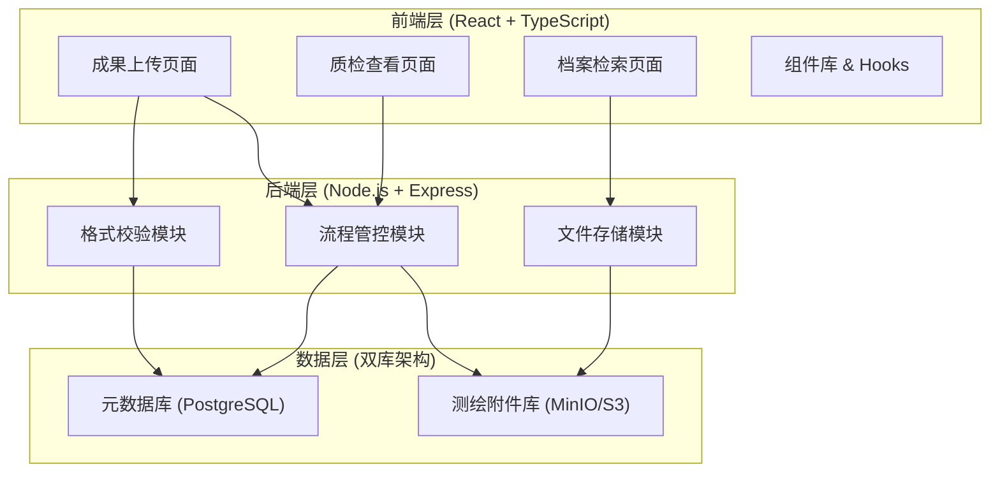
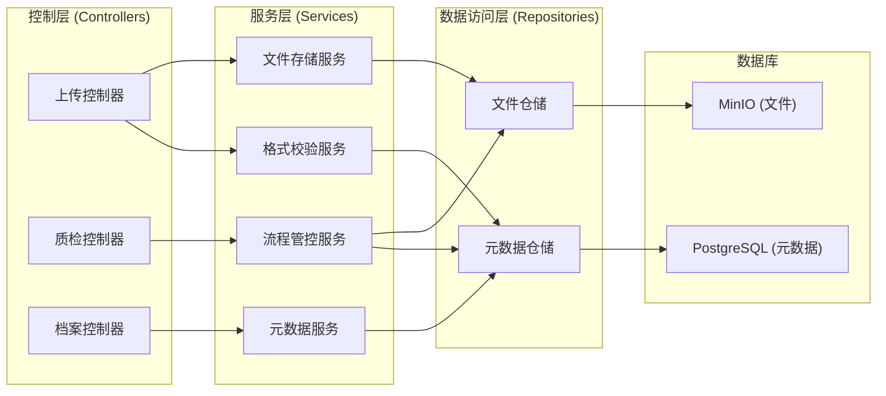
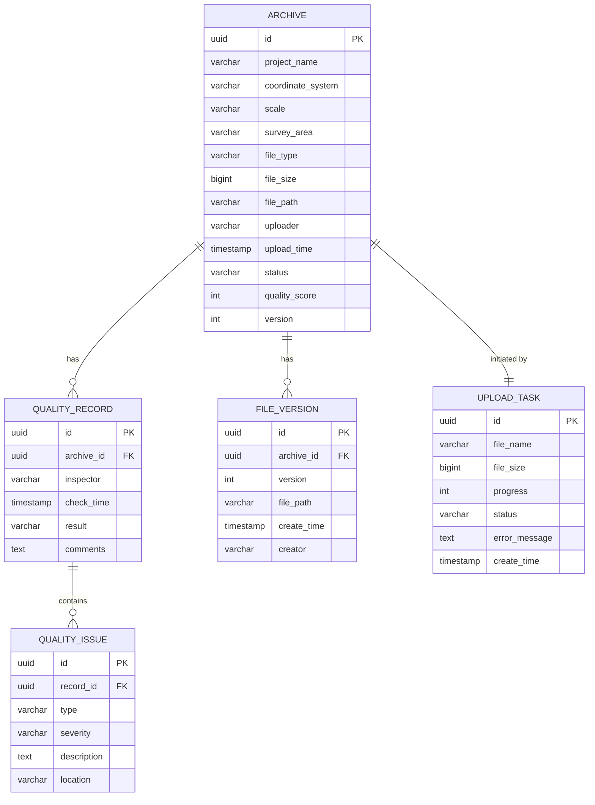

## 1. 架构设计



## 2. 技术栈说明

### 2.1 前端技术栈
- **框架**: React 18 + TypeScript 5
- **构建工具**: Vite 5
- **样式方案**: Tailwind CSS 3
- **状态管理**: Zustand
- **路由**: React Router 6
- **UI 组件**: Ant Design 5
- **文件上传**: react-dropzone
- **地图预览**: @antv/l7 (可选)

### 2.2 后端技术栈
- **运行时**: Node.js 20
- **框架**: Express 4
- **类型安全**: TypeScript
- **文件处理**: multer, archiver
- **格式校验**: 自定义测绘格式校验器
- **日志**: winston

### 2.3 数据存储
- **元数据库**: PostgreSQL 16 (存储项目信息、元数据、流程状态)
- **文件存储**: MinIO (对象存储，保存测绘成果文件)

## 3. 路由定义

| 路由路径 | 页面名称 | 权限要求 |
|----------|---------|----------|
| /upload | 成果上传页面 | 上传员、管理员 |
| /quality | 质检查看页面 | 质检员、管理员 |
| /archive | 档案检索页面 | 所有登录用户 |
| /login | 登录页面 | 公开 |

## 4. API 接口定义

### 4.1 TypeScript 类型定义

```typescript
// 测绘成果元数据
interface ArchiveMetadata {
  id: string;
  projectName: string;
  coordinateSystem: string;
  scale: string;
  surveyArea: string;
  fileType: 'DWG' | 'SHP' | 'GDB' | 'TIF' | 'OTHER';
  fileSize: number;
  uploader: string;
  uploadTime: string;
  status: 'UPLOADING' | 'VALIDATING' | 'PENDING' | 'QUALITY_CHECKING' | 'APPROVED' | 'REJECTED';
  qualityScore?: number;
  version: number;
}

// 质检记录
interface QualityRecord {
  id: string;
  archiveId: string;
  inspector: string;
  checkTime: string;
  result: 'PASS' | 'FAIL';
  comments: string;
  issues: QualityIssue[];
}

// 质检问题
interface QualityIssue {
  id: string;
  type: 'FORMAT' | 'CONTENT' | 'METADATA' | 'OTHER';
  severity: 'CRITICAL' | 'MAJOR' | 'MINOR';
  description: string;
  location?: string;
}

// 上传任务
interface UploadTask {
  id: string;
  fileName: string;
  fileSize: number;
  progress: number;
  status: 'PENDING' | 'UPLOADING' | 'VALIDATING' | 'SUCCESS' | 'FAILED';
  errorMessage?: string;
}
```

### 4.2 API 接口列表

| 方法 | 路径 | 描述 | 请求体 | 响应体 |
|------|------|------|--------|--------|
| POST | /api/upload/init | 初始化上传任务 | `{ fileName, fileSize, fileType }` | `{ taskId, uploadUrl }` |
| POST | /api/upload/chunk | 上传文件分片 | FormData | `{ chunkIndex, received }` |
| POST | /api/upload/complete | 完成上传 | `{ taskId }` | `{ archiveId }` |
| GET | /api/archives | 获取档案列表 | Query params | `{ list: ArchiveMetadata[], total }` |
| GET | /api/archives/:id | 获取档案详情 | - | `ArchiveMetadata` |
| GET | /api/archives/:id/download | 下载档案 | - | 文件流 |
| GET | /api/quality/pending | 获取待检列表 | Query params | `{ list: ArchiveMetadata[], total }` |
| POST | /api/quality/:id/check | 提交质检结果 | `QualityRecord` | `{ success: boolean }` |
| GET | /api/quality/:id/records | 获取质检历史 | - | `QualityRecord[]` |
| GET | /api/search | 档案检索 | Query params | `{ list: ArchiveMetadata[], total }` |

## 5. 后端架构图



## 6. 数据模型

### 6.1 ER 图



### 6.2 DDL 语句

```sql
-- 档案表
CREATE TABLE archives (
    id UUID PRIMARY KEY DEFAULT gen_random_uuid(),
    project_name VARCHAR(255) NOT NULL,
    coordinate_system VARCHAR(100),
    scale VARCHAR(50),
    survey_area TEXT,
    file_type VARCHAR(20) NOT NULL,
    file_size BIGINT NOT NULL,
    file_path VARCHAR(500) NOT NULL,
    uploader VARCHAR(100) NOT NULL,
    upload_time TIMESTAMP DEFAULT CURRENT_TIMESTAMP,
    status VARCHAR(50) NOT NULL DEFAULT 'UPLOADING',
    quality_score INT,
    version INT DEFAULT 1,
    created_at TIMESTAMP DEFAULT CURRENT_TIMESTAMP,
    updated_at TIMESTAMP DEFAULT CURRENT_TIMESTAMP
);

CREATE INDEX idx_archives_status ON archives(status);
CREATE INDEX idx_archives_project_name ON archives(project_name);
CREATE INDEX idx_archives_upload_time ON archives(upload_time);

-- 质检记录表
CREATE TABLE quality_records (
    id UUID PRIMARY KEY DEFAULT gen_random_uuid(),
    archive_id UUID REFERENCES archives(id) ON DELETE CASCADE,
    inspector VARCHAR(100) NOT NULL,
    check_time TIMESTAMP DEFAULT CURRENT_TIMESTAMP,
    result VARCHAR(20) NOT NULL,
    comments TEXT,
    created_at TIMESTAMP DEFAULT CURRENT_TIMESTAMP
);

CREATE INDEX idx_quality_records_archive ON quality_records(archive_id);

-- 质检问题表
CREATE TABLE quality_issues (
    id UUID PRIMARY KEY DEFAULT gen_random_uuid(),
    record_id UUID REFERENCES quality_records(id) ON DELETE CASCADE,
    type VARCHAR(50) NOT NULL,
    severity VARCHAR(20) NOT NULL,
    description TEXT NOT NULL,
    location VARCHAR(500),
    created_at TIMESTAMP DEFAULT CURRENT_TIMESTAMP
);

-- 文件版本表
CREATE TABLE file_versions (
    id UUID PRIMARY KEY DEFAULT gen_random_uuid(),
    archive_id UUID REFERENCES archives(id) ON DELETE CASCADE,
    version INT NOT NULL,
    file_path VARCHAR(500) NOT NULL,
    creator VARCHAR(100) NOT NULL,
    create_time TIMESTAMP DEFAULT CURRENT_TIMESTAMP
);

CREATE INDEX idx_file_versions_archive ON file_versions(archive_id, version);

-- 上传任务表
CREATE TABLE upload_tasks (
    id UUID PRIMARY KEY DEFAULT gen_random_uuid(),
    file_name VARCHAR(255) NOT NULL,
    file_size BIGINT NOT NULL,
    progress INT DEFAULT 0,
    status VARCHAR(50) NOT NULL DEFAULT 'PENDING',
    error_message TEXT,
    create_time TIMESTAMP DEFAULT CURRENT_TIMESTAMP,
    update_time TIMESTAMP DEFAULT CURRENT_TIMESTAMP
);
```
