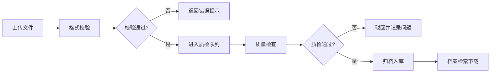

## 1. 产品概述

测绘成果档案管理系统，提供测绘成果上传、质量检查、档案检索全流程管理。

- 主要目的：解决测绘成果归档、质检、检索全流程数字化管理问题
- 目标用户：测绘机构、数据管理部门、档案管理员
- 产品价值：提高测绘成果管理效率，确保数据质量，实现档案规范化管理

## 2. 核心功能

### 2.1 用户角色

| 角色 | 注册方式 | 核心权限 |
|------|----------|----------|
| 数据上传员 | 系统分配 | 上传测绘成果，查看上传进度 |
| 质检员 | 系统分配 | 质量检查，审核通过/驳回 |
| 档案管理员 | 系统分配 | 档案检索，数据导出，系统管理 |

### 2.2 功能模块

1. **成果上传页面**：文件上传，格式校验，进度显示，元数据填写
2. **质检查看页面**：待检列表，质检详情，审核操作，问题记录
3. **档案检索页面**：条件检索，结果列表，详情查看，文件下载

### 2.3 页面详情

| 页面名称 | 模块名称 | 功能描述 |
|-----------|-------------|---------------------|
| 成果上传页面 | 文件上传区 | 拖拽上传，多文件支持，大文件分片上传 |
| 成果上传页面 | 格式校验 | 实时校验文件格式，支持DWG、SHP、GDB等测绘格式 |
| 成果上传页面 | 元数据表单 | 项目名称、坐标系、比例尺、测区范围等信息填写 |
| 成果上传页面 | 上传进度 | 实时进度条，上传状态显示，错误重试 |
| 质检查看页面 | 待检列表 | 按时间、项目筛选，分页显示 |
| 质检查看页面 | 质检详情 | 文件预览，质检项检查，问题标注 |
| 质检查看页面 | 审核操作 | 通过/驳回，填写审核意见 |
| 质检查看页面 | 质检记录 | 历史质检记录查询，统计分析 |
| 档案检索页面 | 高级检索 | 多条件组合检索，空间范围检索 |
| 档案检索页面 | 结果列表 | 卡片式展示，排序，筛选 |
| 档案检索页面 | 详情查看 | 元数据展示，文件预览，版本记录 |
| 档案检索页面 | 下载导出 | 文件下载，元数据导出 |

## 3. 核心流程

### 3.1 测绘成果归档流程

数据上传员上传测绘成果文件 → 系统自动进行格式校验 → 校验通过后进入质检队列 → 质检员进行质量检查 → 质检通过后归档入库 → 档案管理员可检索下载

## 4. 用户界面设计

### 4.1 设计风格

- **主色调**：深蓝色系 (#165DFF)，体现专业、稳重的企业级应用风格
- **辅助色**：青色 (#0FC6C2) 用于成功状态，橙色 (#FF7D00) 用于警告，红色 (#F53F3F) 用于错误
- **按钮风格**：圆角矩形 (8px)，主按钮渐变效果，悬停时有轻微上浮动画
- **字体**：Inter 作为主要字体，标题字号 18-24px，正文字号 14px
- **布局风格**：顶部导航 + 侧边栏 + 内容区，卡片式模块布局
- **图标风格**：线性图标，统一 24px 尺寸，简洁专业

### 4.2 页面设计概览

| 页面名称 | 模块名称 | UI 元素 |
|-----------|-------------|-------------|
| 成果上传页面 | 文件上传区 | 拖拽区域，虚线边框，悬停高亮，上传按钮 |
| 成果上传页面 | 进度展示 | 进度条动画，百分比数字，状态图标 |
| 质检查看页面 | 列表卡片 | 卡片阴影，状态标签，操作按钮组 |
| 质检查看页面 | 详情面板 | 左右分栏，左侧文件预览，右侧质检项 |
| 档案检索页面 | 检索栏 | 展开/收起高级选项，标签式条件选择 |
| 档案检索页面 | 结果网格 | 响应式网格布局，悬停放大效果 |

### 4.3 响应式设计

- 桌面优先设计，适配 1440px 及以上分辨率
- 平板端：侧边栏可收起，内容区自适应宽度
- 移动端：顶部导航折叠为汉堡菜单，列表转为单列布局

### 4.4 交互效果

- 页面加载：元素淡入动画，0.3s 延迟错开
- 按钮交互：悬停时 translateY(-2px)，点击时缩放 0.98
- 表单验证：实时反馈，错误信息滑入动画
- 文件上传：拖拽进入时边框变色并放大
