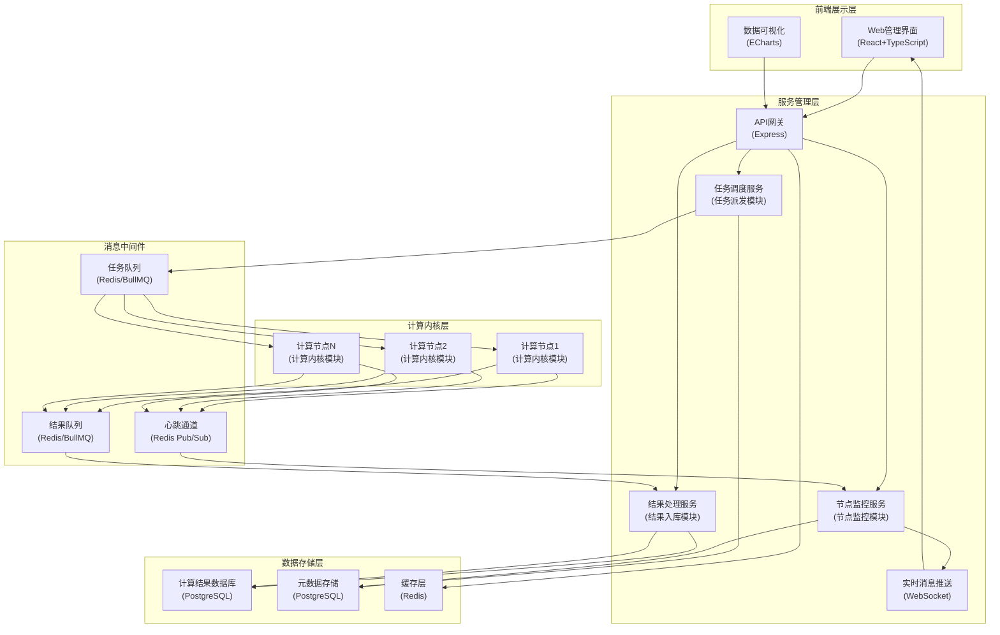
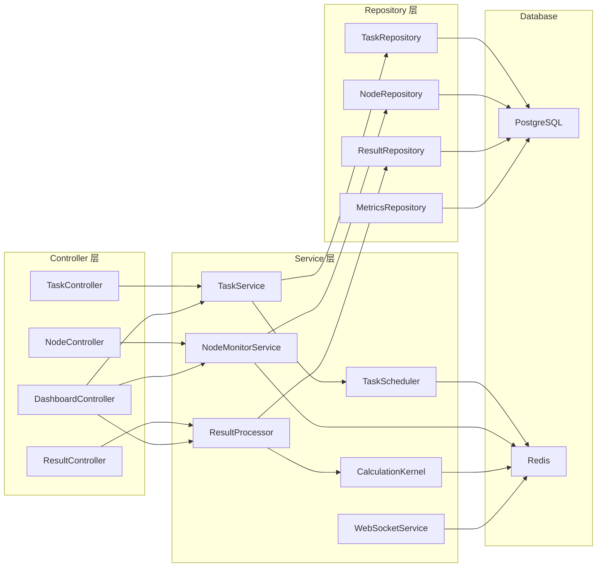
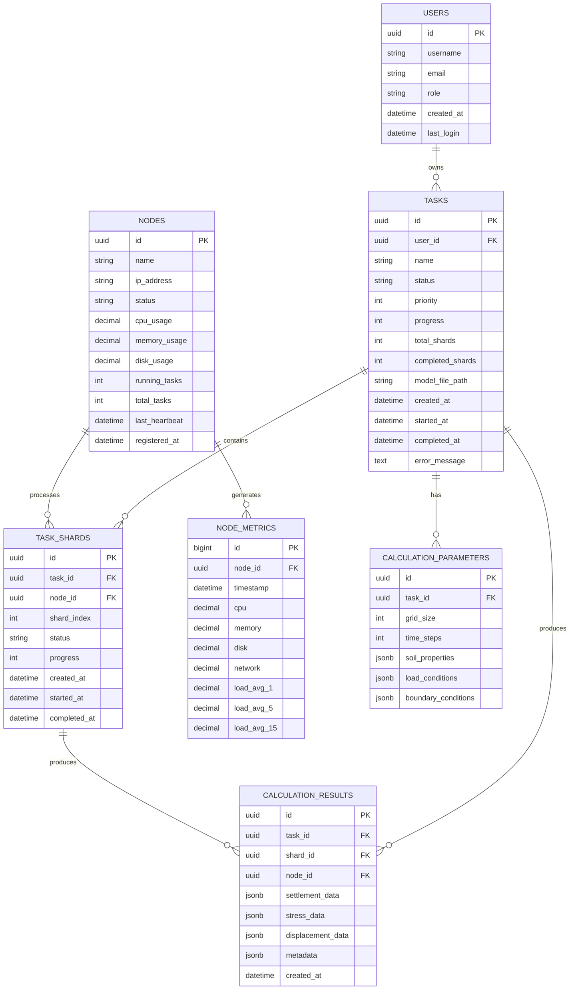

## 1. 架构设计

本系统采用分层分布式架构，包含前端展示层、服务管理层、计算内核层和数据存储层。通过消息队列实现任务的异步派发和结果收集，通过WebSocket实现节点状态的实时监控。



## 2. 技术描述

### 2.1 技术栈选型

| 层级 | 技术选型 | 版本 | 用途说明 |
|------|----------|------|----------|
| 前端 | React | 18.x | 前端框架 |
| 前端 | TypeScript | 5.x | 类型安全 |
| 前端 | Vite | 5.x | 构建工具 |
| 前端 | TailwindCSS | 3.x | 样式框架 |
| 前端 | Zustand | 4.x | 状态管理 |
| 前端 | React Router | 6.x | 路由管理 |
| 前端 | ECharts | 5.x | 数据可视化 |
| 前端 | lucide-react | 0.x | 图标库 |
| 后端 | Express | 4.x | Web框架 |
| 后端 | Node.js | 20.x | 运行环境 |
| 后端 | BullMQ | 5.x | 分布式任务队列 |
| 后端 | Socket.IO | 4.x | 实时通信 |
| 数据库 | PostgreSQL | 15.x | 关系型数据库 |
| 数据库 | Redis | 7.x | 缓存和消息队列 |
| ORM | TypeORM | 0.3.x | 数据库映射 |
| 通信 | RESTful API | - | 接口规范 |
| 通信 | WebSocket | - | 实时推送 |

### 2.2 核心模块设计

#### 2.2.1 任务派发模块
- 负责任务的接收、校验、分片和队列管理
- 采用加权轮询和最小负载优先的调度策略
- 支持任务优先级、超时控制和失败重试
- 任务分片算法：根据计算模型的网格数量和复杂度进行自适应分片

#### 2.2.2 计算内核模块
- 实现岩土沉降数值计算算法（基于有限元法）
- 支持并行计算，利用多核CPU资源
- 计算过程中实时上报进度和状态
- 支持计算中断和恢复

#### 2.2.3 节点监控模块
- 节点心跳检测（5秒间隔）
- 实时采集节点性能指标（CPU、内存、磁盘、网络）
- 节点健康度评估和异常告警
- 节点自动上下线管理

#### 2.2.4 结果入库模块
- 计算结果的完整性校验
- 数据格式转换和标准化
- 批量入库优化
- 结果索引和查询优化

## 3. 路由定义

| 路由 | 方法 | 模块 | 用途 |
|------|------|------|------|
| / | GET | 仪表盘 | 系统概览页面 |
| /dashboard | GET | 仪表盘 | 仪表盘详情 |
| /tasks | GET | 任务管理 | 任务列表 |
| /tasks/new | GET | 任务管理 | 创建新任务 |
| /tasks/:id | GET | 任务管理 | 任务详情 |
| /nodes | GET | 节点监控 | 节点列表 |
| /nodes/:id | GET | 节点监控 | 节点详情 |
| /results | GET | 结果查询 | 结果列表 |
| /results/:id | GET | 结果查询 | 结果详情 |
| /api/v1/tasks | POST | 任务API | 提交任务 |
| /api/v1/tasks | GET | 任务API | 获取任务列表 |
| /api/v1/tasks/:id | GET | 任务API | 获取任务详情 |
| /api/v1/tasks/:id/cancel | PUT | 任务API | 取消任务 |
| /api/v1/nodes | GET | 节点API | 获取节点列表 |
| /api/v1/nodes/:id/metrics | GET | 节点API | 获取节点监控数据 |
| /api/v1/results | GET | 结果API | 查询计算结果 |
| /api/v1/results/:id/download | GET | 结果API | 下载计算结果 |

## 4. API 定义

### 4.1 类型定义

```typescript
// 任务状态枚举
enum TaskStatus {
  PENDING = 'pending',
  QUEUED = 'queued',
  RUNNING = 'running',
  COMPLETED = 'completed',
  FAILED = 'failed',
  CANCELLED = 'cancelled'
}

// 节点状态枚举
enum NodeStatus {
  ONLINE = 'online',
  OFFLINE = 'offline',
  BUSY = 'busy',
  ERROR = 'error'
}

// 任务接口
interface Task {
  id: string;
  name: string;
  userId: string;
  modelFile: string;
  parameters: CalculationParameters;
  priority: number;
  status: TaskStatus;
  progress: number;
  totalShards: number;
  completedShards: number;
  createdAt: Date;
  startedAt: Date | null;
  completedAt: Date | null;
  errorMessage?: string;
}

// 计算参数接口
interface CalculationParameters {
  gridSize: number;
  timeSteps: number;
  soilProperties: SoilProperties;
  loadConditions: LoadCondition[];
  boundaryConditions: BoundaryCondition[];
}

// 节点接口
interface Node {
  id: string;
  name: string;
  ipAddress: string;
  status: NodeStatus;
  cpuUsage: number;
  memoryUsage: number;
  diskUsage: number;
  networkUsage: number;
  runningTasks: number;
  totalTasks: number;
  lastHeartbeat: Date;
  registeredAt: Date;
}

// 计算结果接口
interface CalculationResult {
  id: string;
  taskId: string;
  nodeId: string;
  shardIndex: number;
  settlementData: number[][];
  stressData: number[][];
  displacementData: number[][];
  metadata: ResultMetadata;
  createdAt: Date;
}

// 监控指标接口
interface NodeMetrics {
  nodeId: string;
  timestamp: Date;
  cpu: number;
  memory: number;
  disk: number;
  network: number;
  loadAverage: number[];
}
```

### 4.2 请求响应示例

```typescript
// POST /api/v1/tasks 请求
interface CreateTaskRequest {
  name: string;
  modelFile: File;
  parameters: CalculationParameters;
  priority: number;
}

// POST /api/v1/tasks 响应
interface CreateTaskResponse {
  taskId: string;
  status: TaskStatus;
  estimatedTime: number;
  message: string;
}

// GET /api/v1/tasks 响应
interface TaskListResponse {
  total: number;
  items: Task[];
  page: number;
  pageSize: number;
}
```

## 5. 服务器架构图



## 6. 数据模型

### 6.1 数据模型定义



### 6.2 数据定义语言

```sql
-- 创建用户表
CREATE TABLE users (
    id UUID PRIMARY KEY DEFAULT gen_random_uuid(),
    username VARCHAR(50) NOT NULL UNIQUE,
    email VARCHAR(100) NOT NULL UNIQUE,
    password_hash VARCHAR(255) NOT NULL,
    role VARCHAR(20) NOT NULL DEFAULT 'user',
    created_at TIMESTAMP WITH TIME ZONE DEFAULT CURRENT_TIMESTAMP,
    last_login TIMESTAMP WITH TIME ZONE
);

-- 创建任务表
CREATE TABLE tasks (
    id UUID PRIMARY KEY DEFAULT gen_random_uuid(),
    user_id UUID NOT NULL REFERENCES users(id),
    name VARCHAR(200) NOT NULL,
    status VARCHAR(20) NOT NULL DEFAULT 'pending',
    priority INT NOT NULL DEFAULT 5,
    progress INT NOT NULL DEFAULT 0,
    total_shards INT NOT NULL DEFAULT 1,
    completed_shards INT NOT NULL DEFAULT 0,
    model_file_path VARCHAR(500),
    error_message TEXT,
    created_at TIMESTAMP WITH TIME ZONE DEFAULT CURRENT_TIMESTAMP,
    started_at TIMESTAMP WITH TIME ZONE,
    completed_at TIMESTAMP WITH TIME ZONE
);

CREATE INDEX idx_tasks_status ON tasks(status);
CREATE INDEX idx_tasks_user_id ON tasks(user_id);
CREATE INDEX idx_tasks_created_at ON tasks(created_at DESC);

-- 创建节点表
CREATE TABLE nodes (
    id UUID PRIMARY KEY DEFAULT gen_random_uuid(),
    name VARCHAR(100) NOT NULL,
    ip_address VARCHAR(45) NOT NULL UNIQUE,
    status VARCHAR(20) NOT NULL DEFAULT 'offline',
    cpu_usage DECIMAL(5,2) DEFAULT 0,
    memory_usage DECIMAL(5,2) DEFAULT 0,
    disk_usage DECIMAL(5,2) DEFAULT 0,
    network_usage DECIMAL(5,2) DEFAULT 0,
    running_tasks INT DEFAULT 0,
    total_tasks INT DEFAULT 0,
    last_heartbeat TIMESTAMP WITH TIME ZONE,
    registered_at TIMESTAMP WITH TIME ZONE DEFAULT CURRENT_TIMESTAMP
);

CREATE INDEX idx_nodes_status ON nodes(status);

-- 创建任务分片表
CREATE TABLE task_shards (
    id UUID PRIMARY KEY DEFAULT gen_random_uuid(),
    task_id UUID NOT NULL REFERENCES tasks(id) ON DELETE CASCADE,
    node_id UUID REFERENCES nodes(id),
    shard_index INT NOT NULL,
    status VARCHAR(20) NOT NULL DEFAULT 'pending',
    progress INT NOT NULL DEFAULT 0,
    created_at TIMESTAMP WITH TIME ZONE DEFAULT CURRENT_TIMESTAMP,
    started_at TIMESTAMP WITH TIME ZONE,
    completed_at TIMESTAMP WITH TIME ZONE
);

CREATE INDEX idx_task_shards_task_id ON task_shards(task_id);
CREATE INDEX idx_task_shards_node_id ON task_shards(node_id);
CREATE INDEX idx_task_shards_status ON task_shards(status);

-- 创建节点监控数据表
CREATE TABLE node_metrics (
    id BIGSERIAL PRIMARY KEY,
    node_id UUID NOT NULL REFERENCES nodes(id) ON DELETE CASCADE,
    timestamp TIMESTAMP WITH TIME ZONE DEFAULT CURRENT_TIMESTAMP,
    cpu DECIMAL(5,2) NOT NULL,
    memory DECIMAL(5,2) NOT NULL,
    disk DECIMAL(5,2) NOT NULL,
    network DECIMAL(5,2) NOT NULL,
    load_avg_1 DECIMAL(6,2),
    load_avg_5 DECIMAL(6,2),
    load_avg_15 DECIMAL(6,2)
);

CREATE INDEX idx_node_metrics_node_time ON node_metrics(node_id, timestamp DESC);
CREATE INDEX idx_node_metrics_timestamp ON node_metrics(timestamp DESC);

-- 创建计算参数表
CREATE TABLE calculation_parameters (
    id UUID PRIMARY KEY DEFAULT gen_random_uuid(),
    task_id UUID NOT NULL REFERENCES tasks(id) ON DELETE CASCADE UNIQUE,
    grid_size INT NOT NULL,
    time_steps INT NOT NULL,
    soil_properties JSONB NOT NULL,
    load_conditions JSONB NOT NULL,
    boundary_conditions JSONB NOT NULL
);

-- 创建计算结果表
CREATE TABLE calculation_results (
    id UUID PRIMARY KEY DEFAULT gen_random_uuid(),
    task_id UUID NOT NULL REFERENCES tasks(id) ON DELETE CASCADE,
    shard_id UUID NOT NULL REFERENCES task_shards(id) ON DELETE CASCADE UNIQUE,
    node_id UUID NOT NULL REFERENCES nodes(id),
    settlement_data JSONB NOT NULL,
    stress_data JSONB NOT NULL,
    displacement_data JSONB NOT NULL,
    metadata JSONB,
    created_at TIMESTAMP WITH TIME ZONE DEFAULT CURRENT_TIMESTAMP
);

CREATE INDEX idx_calculation_results_task_id ON calculation_results(task_id);
CREATE INDEX idx_calculation_results_created_at ON calculation_results(created_at DESC);

-- 插入初始数据
INSERT INTO users (username, email, password_hash, role) VALUES
('admin', 'admin@example.com', '$2b$10$N9qo8uLOickgx2ZMRZoMyeIjZAgcfl7p92ldGxad68LJZdL17lhWy', 'admin'),
('user1', 'user1@example.com', '$2b$10$N9qo8uLOickgx2ZMRZoMyeIjZAgcfl7p92ldGxad68LJZdL17lhWy', 'user');

INSERT INTO nodes (name, ip_address, status) VALUES
('compute-node-01', '192.168.1.101', 'online'),
('compute-node-02', '192.168.1.102', 'online'),
('compute-node-03', '192.168.1.103', 'offline');
```
