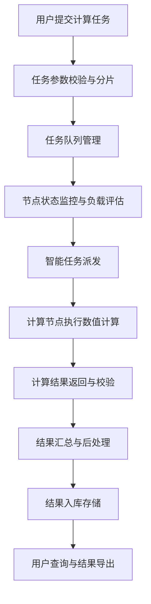

## 1. 产品概述

本项目是一个多文件分布式计算平台，依托算力集群完成岩土沉降数值计算任务。系统实现任务的智能派发、并行计算、节点状态实时监控以及计算结果的自动化入库存储，为岩土工程领域提供高效、可靠的数值计算解决方案。

- 主要解决岩土沉降数值计算中单机算力不足、计算效率低下、任务管理混乱等问题
- 目标用户为岩土工程研究人员、设计院工程师、高校科研团队
- 产品核心价值在于通过分布式计算技术大幅提升复杂数值计算的效率，实现计算资源的优化调度和计算结果的规范化管理

## 2. 核心功能

### 2.1 用户角色

| 角色 | 注册方式 | 核心权限 |
|------|----------|----------|
| 系统管理员 | 后台创建 | 节点管理、用户管理、系统配置、权限分配 |
| 普通用户 | 账号注册 | 提交计算任务、查看任务状态、下载计算结果、个人数据管理 |
| 节点运维 | 后台创建 | 节点注册、节点状态监控、节点维护操作 |

### 2.2 功能模块

1. **系统仪表盘**：集群概览、任务统计、资源利用率、实时告警
2. **任务管理**：任务提交、任务列表、任务详情、任务调度、任务取消
3. **节点监控**：节点列表、节点状态、性能指标、告警信息
4. **结果查询**：计算结果列表、结果详情、数据可视化、结果导出
5. **计算内核**：岩土沉降数值计算引擎、并行计算支持、任务分片处理

### 2.3 页面详情

| 页面名称 | 模块名称 | 功能描述 |
|----------|----------|----------|
| 系统仪表盘 | 集群概览 | 展示集群总节点数、在线节点数、CPU/内存利用率、当前运行任务数 |
| 系统仪表盘 | 任务统计 | 任务完成率、失败率、平均计算时长、今日任务趋势图 |
| 系统仪表盘 | 实时告警 | 节点异常告警、任务失败告警、资源阈值告警 |
| 任务管理 | 任务提交 | 上传计算模型文件、配置计算参数、选择计算队列、提交任务 |
| 任务管理 | 任务列表 | 任务状态筛选、批量操作、任务进度展示、优先级调整 |
| 任务管理 | 任务详情 | 任务基本信息、计算日志、分片状态、结果预览 |
| 节点监控 | 节点列表 | 节点ID、IP地址、状态、CPU/内存/磁盘使用率、运行任务数 |
| 节点监控 | 节点详情 | 节点性能趋势图、历史任务记录、节点配置信息 |
| 结果查询 | 结果列表 | 按任务/时间筛选、结果元数据展示、结果状态标识 |
| 结果查询 | 结果详情 | 沉降数据可视化、应力云图、数据导出、报告生成 |

## 3. 核心流程

用户提交岩土沉降计算任务后，系统将任务分解为多个计算分片，根据节点负载情况智能派发到可用计算节点。计算节点执行数值计算内核，完成后将结果返回主节点，主节点进行结果汇总并入库存储。用户可实时监控任务进度，计算完成后可查询和导出结果数据。

## 4. 用户界面设计

### 4.1 设计风格

- **主色调**：深空蓝 (#165DFF) 作为主色，代表科技感和可靠性；辅助色采用警示橙 (#FF7D00) 和成功绿 (#00B42A)
- **设计语言**：工业科技风，强调数据可视化和监控面板的专业性
- **布局风格**：卡片式布局，顶部导航+侧边栏+主内容区的经典后台管理结构
- **字体**：采用 JetBrains Mono 作为等宽字体展示代码和日志，Inter 作为界面字体
- **图标风格**：采用线性风格图标，统一使用 lucide-react 图标库
- **数据可视化**：使用 ECharts 实现复杂图表，包括折线图、柱状图、热力图、云图等

### 4.2 页面设计概述

| 页面名称 | 模块名称 | UI 元素 |
|----------|----------|----------|
| 系统仪表盘 | 集群概览 | 统计卡片、环形进度图、实时数据刷新动画 |
| 系统仪表盘 | 任务统计 | 折线趋势图、柱状对比图、数据标签悬停效果 |
| 任务管理 | 任务列表 | 数据表格、状态标签、进度条、操作按钮组 |
| 任务管理 | 任务提交 | 表单组件、文件上传拖拽区、参数配置面板 |
| 节点监控 | 节点列表 | 状态指示灯、资源使用率进度条、节点健康度评分 |
| 节点监控 | 节点详情 | 性能监控仪表盘、趋势曲线图、历史记录时间线 |
| 结果查询 | 结果可视化 | 沉降曲线图表、云图渲染、3D模型展示（可选） |

### 4.3 响应式设计

- 采用桌面端优先设计，适配 1920×1080 及以上分辨率
- 侧边栏支持折叠，在小屏幕设备上自动转为汉堡菜单
- 数据表格支持水平滚动，确保在各种屏幕尺寸下数据完整性
- 图表组件自适应容器宽度，窗口大小变化时自动重绘

### 4.4 交互设计

- 页面加载采用骨架屏占位，提升感知速度
- 数据刷新采用增量更新和平滑过渡动画
- 节点状态变化时采用颜色渐变和微动画提示
- 任务进度条采用实时更新和缓动效果
- 鼠标悬停显示详细数据tooltip
