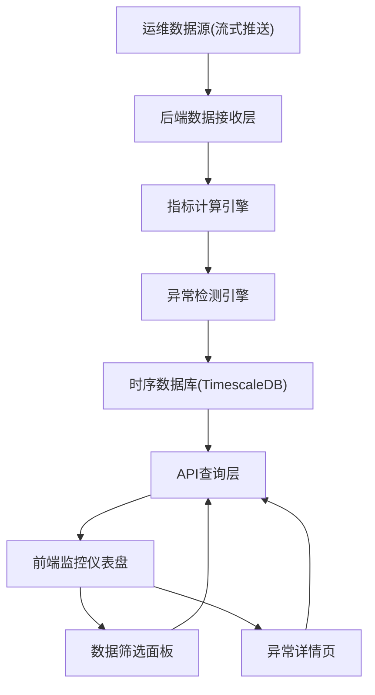

## 1. 产品概述

运维指标监控平台——面向DevOps/SRE团队的全栈实时运维监控系统，接收流式运维数据，自动计算关键指标并识别异常，通过交互式图表呈现运维态势，帮助团队快速定位和响应故障。

- 核心价值：实时洞察运维健康度，异常秒级告警，降低MTTR（平均恢复时间）
- 目标用户：运维工程师、SRE、开发团队负责人

## 2. 核心功能

### 2.1 用户角色

| 角色 | 注册方式 | 核心权限 |
|------|----------|----------|
| 运维工程师 | 管理员分配账号 | 查看仪表盘、筛选数据、确认异常 |
| 管理员 | 系统初始化 | 全部权限 + 配置告警规则 + 管理用户 |

### 2.2 功能模块

1. **监控仪表盘**：实时指标图表、异常告警列表、系统健康概览
2. **数据筛选面板**：时间范围选择、指标类型过滤、服务/节点筛选
3. **异常详情页**：异常时间线、关联指标、根因分析建议

### 2.3 页面详情

| 页面名称 | 模块名称 | 功能描述 |
|----------|----------|----------|
| 监控仪表盘 | 健康概览卡片 | 显示CPU/内存/磁盘/网络四大核心指标当前值与状态 |
| 监控仪表盘 | 实时指标折线图 | 多指标时序折线图，支持缩放和拖拽查看历史 |
| 监控仪表盘 | 异常告警列表 | 按时间倒序展示已识别异常，标记严重程度 |
| 监控仪表盘 | 服务拓扑概览 | 展示服务节点健康状态概览 |
| 数据筛选面板 | 时间范围选择器 | 支持快捷时间（近1h/6h/24h/7d）和自定义范围 |
| 数据筛选面板 | 指标类型过滤 | 按CPU/内存/磁盘/网络/自定义指标分类筛选 |
| 数据筛选面板 | 服务/节点筛选 | 下拉多选目标服务或节点 |
| 异常详情页 | 异常时间线 | 异常事件时间轴，标注触发和恢复时间 |
| 异常详情页 | 关联指标图 | 展示异常发生时段的多指标联动变化 |
| 异常详情页 | 根因分析建议 | 基于规则给出异常可能原因和处理建议 |

## 3. 核心流程

**数据流转流程**：运维数据源通过流式推送 → 后端接收并解析 → 指标计算引擎实时计算 → 异常检测引擎识别异常 → 结果写入时序数据库 → 前端通过API查询并以图表呈现。

**用户操作流程**：用户打开监控仪表盘 → 查看实时指标和异常告警 → 使用筛选面板缩小查看范围 → 点击异常条目进入详情页 → 查看关联指标和根因建议 → 确认或标记异常。

## 4. 用户界面设计

### 4.1 设计风格

- **主色调**：深色科技风 — 深蓝灰 (#0f172a) 背景，青绿 (#06d6a0) 作为主要强调色，琥珀 (#f59e0b) 用于告警，红色 (#ef4444) 用于严重异常
- **次色调**：冷灰层次（#1e293b / #334155 / #64748b）
- **按钮风格**：圆角8px，轻微发光效果，hover时亮度提升
- **字体**：JetBrains Mono（数据/代码），Noto Sans SC（中文正文）
- **布局风格**：左侧固定导航栏 + 顶部状态条 + 主内容区网格卡片布局
- **图标风格**：线条图标（Lucide），一致2px描边
- **动效**：数据流入时数字跳动动画，图表绘制平滑过渡，异常告警脉冲闪烁

### 4.2 页面设计概览

| 页面名称 | 模块名称 | UI元素 |
|----------|----------|--------|
| 监控仪表盘 | 健康概览卡片 | 4列网格卡片，大号数字+迷你趋势图，颜色随状态变化 |
| 监控仪表盘 | 实时指标折线图 | 全宽图表区域，平滑曲线，渐变填充，支持鼠标悬停查看数值 |
| 监控仪表盘 | 异常告警列表 | 右侧面板，时间倒序，严重程度色标，点击展开详情 |
| 监控仪表盘 | 服务拓扑概览 | 节点圆形图标，连线表示依赖，颜色表示健康状态 |
| 数据筛选面板 | 时间范围选择器 | 日期选择器+快捷按钮组，与图表联动刷新 |
| 数据筛选面板 | 指标类型过滤 | 胶囊按钮组，支持多选，选中态发光 |
| 数据筛选面板 | 服务/节点筛选 | 搜索+下拉多选，选中项标签化展示 |
| 异常详情页 | 异常时间线 | 垂直时间轴，节点标记关键事件，连线渐变色 |
| 异常详情页 | 关联指标图 | 多子图布局，共享X轴时间范围，异常区间高亮底色 |
| 异常详情页 | 根因分析建议 | 卡片式建议列表，图标+文字，可展开详情 |

### 4.3 响应式设计

- 桌面优先设计，大屏(≥1440px)充分利用4列网格
- 中等屏幕(1024-1440px)缩为2列网格
- 小屏(<1024px)单列堆叠，图表全宽

### 4.4 3D场景指引

不适用
