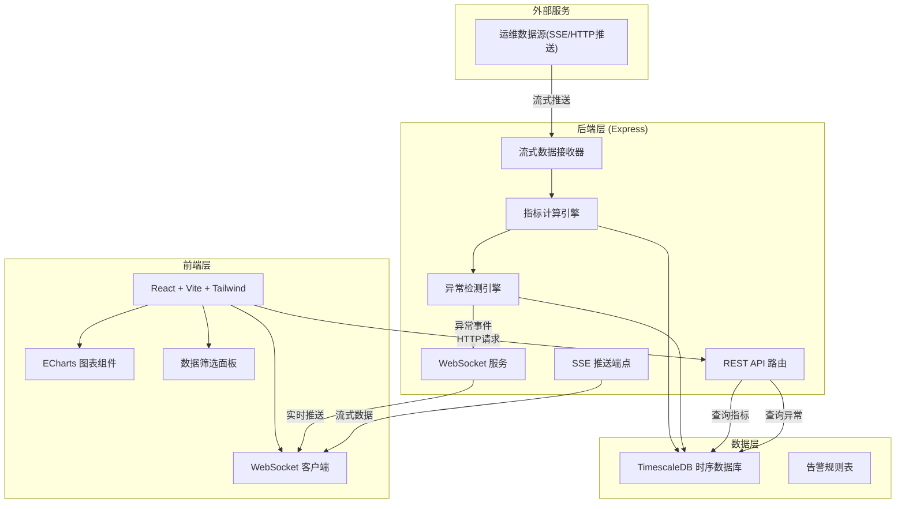
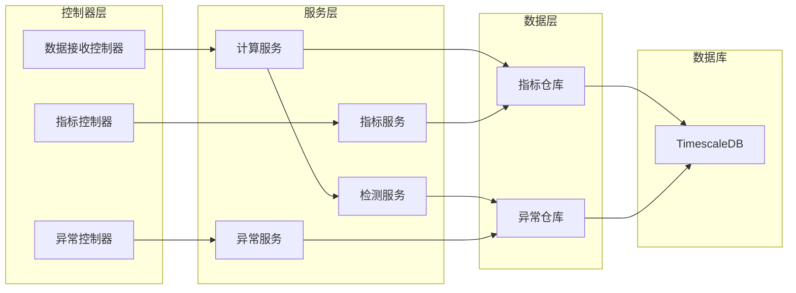
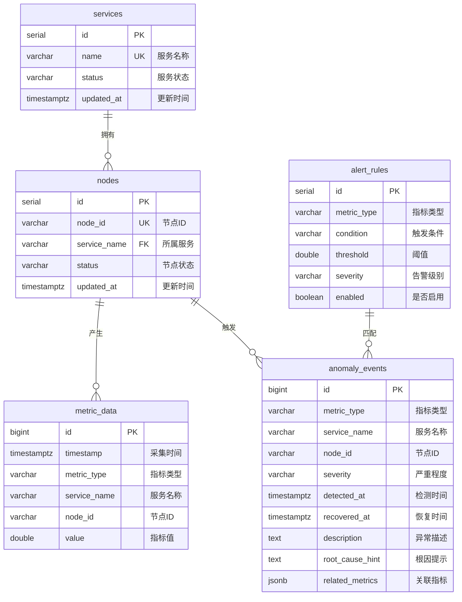

## 1. 架构设计



## 2. 技术说明

- **前端**：React@18 + TypeScript + Tailwind CSS@3 + Vite
- **初始化工具**：vite-init (react-express-ts 模板)
- **图表库**：ECharts (echarts + echarts-for-react) — 适合时序数据展示
- **后端**：Express@4 + TypeScript (ESM)
- **时序数据库**：TimescaleDB (PostgreSQL扩展) — 通过 pg 驱动连接
- **实时通信**：WebSocket (ws库) 用于异常推送 + SSE 用于流式数据模拟
- **状态管理**：Zustand

## 3. 路由定义

| 路由 | 用途 |
|------|------|
| `/` | 监控仪表盘主页，展示实时指标、异常告警 |
| `/anomaly/:id` | 异常详情页，展示异常时间线、关联指标、根因建议 |

## 4. API 定义

### 4.1 查询指标数据

```typescript
interface MetricQuery {
  metricTypes: ("cpu" | "memory" | "disk" | "network")[];
  serviceNames?: string[];
  nodeIds?: string[];
  startTime: string;
  endTime: string;
  interval?: "1m" | "5m" | "15m" | "1h";
}

interface MetricDataPoint {
  timestamp: string;
  value: number;
}

interface MetricSeries {
  metricType: string;
  serviceName: string;
  nodeId: string;
  data: MetricDataPoint[];
}

// GET /api/metrics
// Request: QueryParams from MetricQuery
// Response: { series: MetricSeries[] }
```

### 4.2 查询异常列表

```typescript
interface AnomalyQuery {
  severity?: "low" | "medium" | "high" | "critical";
  metricType?: string;
  serviceName?: string;
  startTime?: string;
  endTime?: string;
  limit?: number;
  offset?: number;
}

interface AnomalyRecord {
  id: string;
  metricType: string;
  serviceName: string;
  nodeId: string;
  severity: "low" | "medium" | "high" | "critical";
  detectedAt: string;
  recoveredAt: string | null;
  description: string;
  rootCauseHint: string;
  relatedMetrics: string[];
}

// GET /api/anomalies
// Request: QueryParams from AnomalyQuery
// Response: { anomalies: AnomalyRecord[]; total: number }
```

### 4.3 查询异常详情

```typescript
// GET /api/anomalies/:id
// Response: AnomalyRecord & { timeline: AnomalyEvent[]; relatedSeries: MetricSeries[] }

interface AnomalyEvent {
  timestamp: string;
  event: string;
  type: "trigger" | "escalate" | "mitigate" | "resolve";
}
```

### 4.4 服务/节点列表

```typescript
// GET /api/services
// Response: { services: { name: string; nodes: { id: string; status: string }[] }[] }
```

### 4.5 WebSocket 推送

```typescript
// WS /ws
// 服务端推送消息类型：
interface WSMessage {
  type: "metric_update" | "anomaly_detected" | "anomaly_resolved";
  payload: MetricDataPoint | AnomalyRecord;
}
```

### 4.6 SSE 流式数据入口

```typescript
// POST /api/data/push
// 外部数据源推送单条数据
interface DataPoint {
  metricType: "cpu" | "memory" | "disk" | "network";
  serviceName: string;
  nodeId: string;
  value: number;
  timestamp?: string;
}
```

## 5. 服务端架构图



## 6. 数据模型

### 6.1 数据模型定义



### 6.2 数据定义语言

```sql
-- 启用 TimescaleDB 扩展
CREATE EXTENSION IF NOT EXISTS timescaledb;

-- 服务表
CREATE TABLE services (
    id SERIAL PRIMARY KEY,
    name VARCHAR(100) UNIQUE NOT NULL,
    status VARCHAR(20) DEFAULT 'healthy',
    updated_at TIMESTAMPTZ DEFAULT NOW()
);

-- 节点表
CREATE TABLE nodes (
    id SERIAL PRIMARY KEY,
    node_id VARCHAR(100) UNIQUE NOT NULL,
    service_name VARCHAR(100) REFERENCES services(name),
    status VARCHAR(20) DEFAULT 'healthy',
    updated_at TIMESTAMPTZ DEFAULT NOW()
);

-- 指标数据表 (时序超表)
CREATE TABLE metric_data (
    id BIGSERIAL,
    timestamp TIMESTAMPTZ NOT NULL,
    metric_type VARCHAR(50) NOT NULL,
    service_name VARCHAR(100) NOT NULL,
    node_id VARCHAR(100) NOT NULL,
    value DOUBLE PRECISION NOT NULL
);
SELECT create_hypertable('metric_data', 'timestamp');
CREATE INDEX idx_metric_type ON metric_data (metric_type, timestamp DESC);
CREATE INDEX idx_metric_service ON metric_data (service_name, timestamp DESC);
CREATE INDEX idx_metric_node ON metric_data (node_id, timestamp DESC);

-- 异常事件表
CREATE TABLE anomaly_events (
    id BIGSERIAL PRIMARY KEY,
    metric_type VARCHAR(50) NOT NULL,
    service_name VARCHAR(100) NOT NULL,
    node_id VARCHAR(100) NOT NULL,
    severity VARCHAR(20) NOT NULL,
    detected_at TIMESTAMPTZ NOT NULL,
    recovered_at TIMESTAMPTZ,
    description TEXT,
    root_cause_hint TEXT,
    related_metrics JSONB DEFAULT '[]'::jsonb
);
CREATE INDEX idx_anomaly_detected ON anomaly_events (detected_at DESC);
CREATE INDEX idx_anomaly_severity ON anomaly_events (severity, detected_at DESC);

-- 告警规则表
CREATE TABLE alert_rules (
    id SERIAL PRIMARY KEY,
    metric_type VARCHAR(50) NOT NULL,
    condition VARCHAR(20) NOT NULL DEFAULT 'gt',
    threshold DOUBLE PRECISION NOT NULL,
    severity VARCHAR(20) NOT NULL DEFAULT 'medium',
    enabled BOOLEAN DEFAULT TRUE
);

-- 初始数据
INSERT INTO services (name, status) VALUES
    ('api-gateway', 'healthy'),
    ('user-service', 'healthy'),
    ('order-service', 'healthy'),
    ('payment-service', 'healthy');

INSERT INTO nodes (node_id, service_name, status) VALUES
    ('node-gw-01', 'api-gateway', 'healthy'),
    ('node-gw-02', 'api-gateway', 'healthy'),
    ('node-user-01', 'user-service', 'healthy'),
    ('node-order-01', 'order-service', 'healthy'),
    ('node-order-02', 'order-service', 'healthy'),
    ('node-pay-01', 'payment-service', 'healthy');

INSERT INTO alert_rules (metric_type, condition, threshold, severity) VALUES
    ('cpu', 'gt', 85, 'high'),
    ('cpu', 'gt', 95, 'critical'),
    ('memory', 'gt', 90, 'high'),
    ('memory', 'gt', 95, 'critical'),
    ('disk', 'gt', 85, 'medium'),
    ('disk', 'gt', 95, 'high'),
    ('network', 'gt', 80, 'medium'),
    ('network', 'gt', 95, 'high');
```
