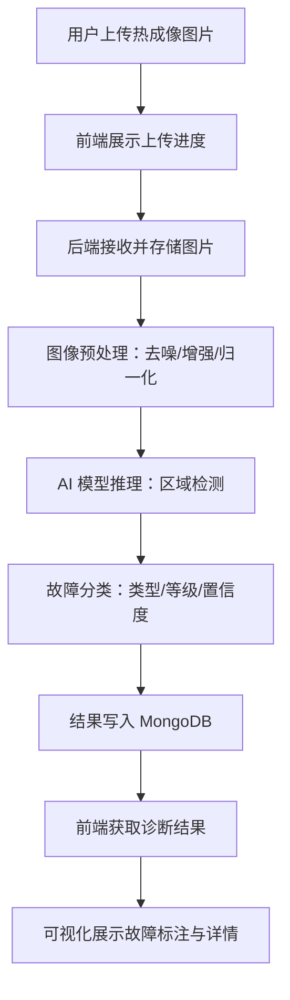

## 1. 产品概述

热成像智能故障诊断平台——面向电力、工业设备运维人员，通过上传热成像图片，由后端 AI 模型自动完成图像预处理、故障推理与分类，并将结果可视化展示，数据持久化存入文档数据库，实现热成像检测的全流程数字化。

- 解决传统热成像检测依赖人工判读、效率低、误判率高的问题
- 目标用户：电力巡检工程师、设备运维人员、工业质检人员

## 2. 核心功能

### 2.1 用户角色

| 角色 | 注册方式 | 核心权限 |
|------|----------|----------|
| 运维工程师 | 账号密码注册 | 上传图片、查看诊断结果、导出报告 |
| 管理员 | 管理员创建 | 全部权限 + 用户管理 + 模型参数配置 |

### 2.2 功能模块

1. **检测工作台**：图片上传、实时诊断进度、结果展示
2. **历史记录**：历史检测列表、筛选查询、详情回看
3. **仪表盘**：故障统计概览、趋势图表、高危预警

### 2.3 页面详情

| 页面名称 | 模块名称 | 功能描述 |
|----------|----------|----------|
| 检测工作台 | 图片上传区 | 支持拖拽/点击上传热成像图片，支持批量上传，显示上传进度 |
| 检测工作台 | 诊断进度条 | 展示预处理→推理→分类三阶段进度 |
| 检测工作台 | 结果可视化 | 在热成像图上标注故障区域，显示故障类型、置信度、严重等级 |
| 检测工作台 | 故障详情面板 | 故障类型说明、维修建议、历史同类故障参考 |
| 历史记录 | 检测列表 | 表格展示历史检测记录，支持按时间/类型/状态筛选 |
| 历史记录 | 详情回看 | 点击记录查看原始图片、诊断结果、故障标注 |
| 仪表盘 | 统计概览 | 今日检测数、故障率、高危预警数 |
| 仪表盘 | 趋势图表 | 近7/30天故障趋势折线图、故障类型分布饼图 |
| 仪表盘 | 高危预警 | 严重故障实时预警列表 |

## 3. 核心流程

用户上传热成像图片 → 前端展示上传进度 → 后端接收图片并存储 → 图像预处理（去噪/增强/归一化）→ AI 模型推理（区域检测）→ 故障分类（类型/等级/置信度）→ 结果写入 MongoDB → 前端轮询/WebSocket 获取结果 → 可视化展示故障标注与详情

## 4. 用户界面设计

### 4.1 设计风格

- **主色调**：深色工业风底色（#0f172a 深蓝灰）+ 热力图渐变强调色（#f97316 橙 → #ef4444 红）
- **辅助色**：#3b82f6 信息蓝、#22c55e 安全绿、#a3a3a3 中性灰
- **按钮风格**：圆角矩形，主操作用热力橙色填充，次操作用描边样式
- **字体**：JetBrains Mono 用于数据/代码展示，Noto Sans SC 用于正文
- **布局风格**：左侧导航栏 + 右侧内容区，卡片式模块布局
- **图标风格**：线性图标（Lucide），与工业科技感匹配

### 4.2 页面设计概览

| 页面名称 | 模块名称 | UI 元素 |
|----------|----------|---------|
| 检测工作台 | 图片上传区 | 虚线拖拽区、热力渐变边框、上传进度环、缩略图预览 |
| 检测工作台 | 诊断进度条 | 三段式进度指示（预处理→推理→分类）、动画过渡 |
| 检测工作台 | 结果可视化 | 图片叠加热力色标注框、悬停显示故障信息浮层 |
| 检测工作台 | 故障详情面板 | 右侧滑出面板、故障类型标签、置信度进度条、维修建议卡片 |
| 历史记录 | 检测列表 | 表格行悬停高亮、状态徽章（正常/警告/危险）、时间戳 |
| 历史记录 | 详情回看 | 模态弹窗、图片对比展示 |
| 仪表盘 | 统计概览 | 大数字卡片、同比/环比指标 |
| 仪表盘 | 趋势图表 | 折线图+面积图、饼图 |
| 仪表盘 | 高危预警 | 红色脉冲动画预警条目 |

### 4.3 响应式设计

- 桌面优先设计，1920×1080 为主要适配分辨率
- 平板端：侧边栏收起为图标模式
- 移动端：隐藏侧边栏，使用底部导航，表格改为卡片列表

### 4.4 3D 场景

不适用
