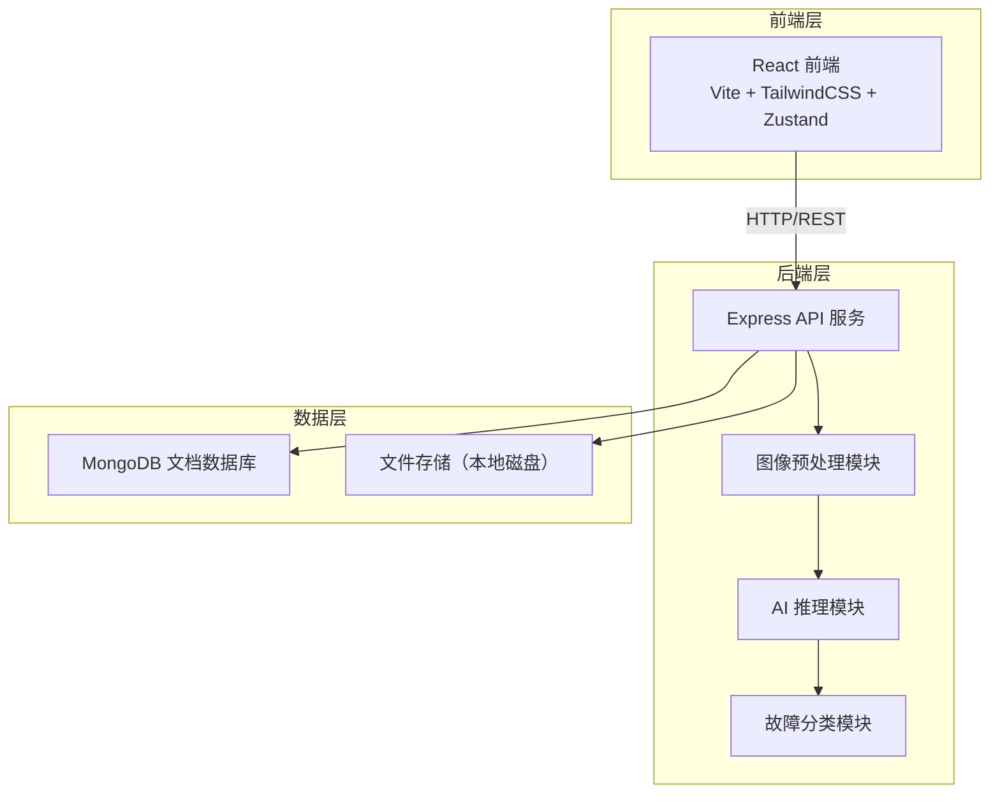
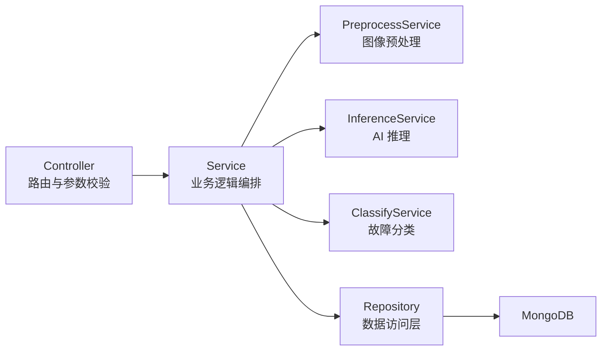
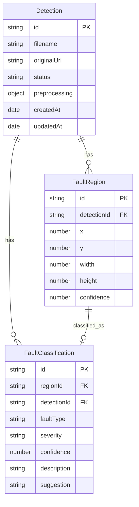

## 1. 架构设计



## 2. 技术说明

- **前端**：React@18 + TailwindCSS@3 + Vite + Zustand
- **初始化工具**：vite-init（react-express-ts 模板）
- **后端**：Express@4 + TypeScript（ESM 模式）
- **数据库**：MongoDB（文档数据库，通过 Mongoose ODM 访问）
- **AI 推理**：模拟推理引擎（可替换为 TensorFlow.js / ONNX Runtime）
- **文件存储**：本地磁盘存储上传图片，MongoDB 存储元数据与诊断结果

## 3. 路由定义

| 路由 | 用途 |
|------|------|
| `/` | 仪表盘 - 故障统计概览与趋势图表 |
| `/detect` | 检测工作台 - 上传图片、实时诊断、结果展示 |
| `/history` | 历史记录 - 检测记录列表与详情回看 |

## 4. API 定义

### 4.1 图片上传与诊断

```typescript
// POST /api/detect/upload
// Content-Type: multipart/form-data
interface UploadRequest {
  images: File[];
}

interface DetectionResult {
  id: string;
  filename: string;
  status: "processing" | "completed" | "failed";
  preprocessing: {
    denoised: boolean;
    enhanced: boolean;
    normalized: boolean;
  };
  inference: {
    regions: Array<{
      id: string;
      bbox: [number, number, number, number];
      confidence: number;
    }>;
  };
  classification: Array<{
    regionId: string;
    faultType: "overheating" | "connection_loose" | "insulation_failure" | "load_unbalance" | "normal";
    severity: "low" | "medium" | "high" | "critical";
    confidence: number;
    description: string;
    suggestion: string;
  }>;
  createdAt: string;
}
```

### 4.2 查询诊断结果

```typescript
// GET /api/detect/:id
interface DetectionDetail extends DetectionResult {}

// GET /api/detect/list?page=1&pageSize=20&status=&faultType=&startDate=&endDate=
interface DetectionListResponse {
  total: number;
  page: number;
  pageSize: number;
  items: Array<{
    id: string;
    filename: string;
    thumbnailUrl: string;
    faultCount: number;
    maxSeverity: string;
    status: string;
    createdAt: string;
  }>;
}
```

### 4.3 仪表盘统计

```typescript
// GET /api/dashboard/stats
interface DashboardStats {
  todayCount: number;
  todayFaultRate: number;
  criticalAlerts: number;
  totalCount: number;
  faultDistribution: Array<{ faultType: string; count: number }>;
  trend: Array<{ date: string; total: number; faultCount: number }>;
  recentCritical: Array<{
    id: string;
    filename: string;
    faultType: string;
    severity: string;
    createdAt: string;
  }>;
}
```

## 5. 服务端架构图



## 6. 数据模型

### 6.1 数据模型定义



### 6.2 数据定义语言

```javascript
// MongoDB Collections (Mongoose Schemas)

// detections 集合
{
  _id: ObjectId,
  filename: String,
  originalUrl: String,
  processedUrl: String,
  status: { type: String, enum: ["processing", "completed", "failed"] },
  preprocessing: {
    denoised: Boolean,
    enhanced: Boolean,
    normalized: Boolean
  },
  createdAt: Date,
  updatedAt: Date
}

// fault_regions 集合
{
  _id: ObjectId,
  detectionId: ObjectId,
  x: Number,
  y: Number,
  width: Number,
  height: Number,
  confidence: Number
}

// fault_classifications 集合
{
  _id: ObjectId,
  regionId: ObjectId,
  detectionId: ObjectId,
  faultType: { type: String, enum: ["overheating", "connection_loose", "insulation_failure", "load_unbalance", "normal"] },
  severity: { type: String, enum: ["low", "medium", "high", "critical"] },
  confidence: Number,
  description: String,
  suggestion: String
}
```
