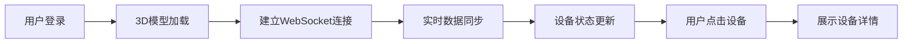

## 1. 产品概述

本项目是一套全栈3D机组监控系统，旨在通过3D可视化技术展示工业机组的实时运行状态。系统前端加载3D机组模型，支持交互式设备查询，后端对接现场数据网关和实时数据库，实现设备运行参数的实时同步与展示。

- **核心目标**：实现工业设备的数字化孪生监控，提升运维效率，降低设备故障风险
- **目标用户**：工厂运维人员、设备工程师、生产管理人员

## 2. 核心功能

### 2.1 用户角色

| 角色 | 注册方式 | 核心权限 |
|------|---------|---------|
| 运维人员 | 账号登录 | 查看3D模型、实时数据、设备详情 |
| 管理员 | 管理员账号 | 全部权限 + 设备配置 |

### 2.2 功能模块

1. **3D监控面板**：机组3D模型展示、交互控制、设备选中高亮
2. **实时数据面板**：设备参数展示、数据趋势图表、告警提示
3. **设备详情**：设备列表、设备信息查询、历史数据查询
4. **系统设置**：数据网关配置、告警阈值设置

### 2.3 页面详情

| 页面名称 | 模块名称 | 功能描述 |
|---------|---------|----------|
| 3D监控主页面 | 3D场景模块 | 加载并渲染机组3D模型，支持旋转、缩放、平移操作 |
| 3D监控主页面 | 设备交互模块 | 点击设备组件查看详情，设备状态颜色编码 |
| 3D监控主页面 | 实时数据面板 | 右侧悬浮展示关键运行参数 |
| 设备详情页 | 参数趋势图 | 展示设备历史数据趋势图表 |
| 设备列表页 | 设备管理模块 | 设备列表展示、筛选、搜索 |

## 3. 核心流程

用户登录系统 → 进入3D监控主页面 → 3D模型加载完成 → 后端实时数据推送 → 设备状态实时更新 → 用户点击设备组件 → 查看设备详细参数

## 4. 用户界面设计

### 4.1 设计风格

- **主色调**：深蓝(#0F172A）科技感深色主题，符合工业监控场景
- **辅助色**：青色(#06B6D4）状态指示
- **状态色**：绿色(#10B981）正常、黄色(#F59E0B）警告、红色(#EF4444）异常
- **字体**：JetBrains Mono 等宽字体展示数据，Roboto 作为界面字体
- **布局风格**：深色玻璃拟态面板，科技感边框发光效果
- **图标风格**：线性图标，科技风

### 4.2 页面设计概览

| 页面名称 | 模块名称 | UI元素 |
|---------|---------|--------|
| 3D监控主页面 | 3D场景 | 全屏3D渲染区域，背景使用暗色工业风 |
| 3D监控主页面 | 数据面板 | 右侧悬浮玻璃面板，半透明效果 |
| 3D监控主页面 | 顶部导航 | 深色导航栏，系统标题、菜单 |
| 设备详情页 | 参数卡片 | 玻璃拟态卡片，数据高亮展示 |

### 4.3 响应式设计

- 桌面端优先设计
- 数据面板在移动端调整布局
- 3D场景自适应窗口大小

### 4.4 3D场景设计

- **环境**：深色工业环境，模拟控制室氛围
- **光照**：主光源 + 环境光，突出设备轮廓
- **相机**：透视相机，支持轨道控制
- **交互**：鼠标悬停高亮，点击选中
- **后期处理**：泛光效果，边缘发光
- **性能**：模型优化，保证60fps流畅运行
