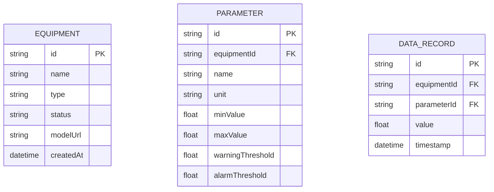

## 1. 架构设计

```mermaid
flowchart TB
    subgraph 前端层
        A["React 18 + Vite
        B["Three.js / @react-three/fiber"]
        C["3D模型渲染"]
        D["实时数据面板"]
        E["WebSocket客户端"]
    end
    
    subgraph 后端层
        F["Express 4"]
        G["WebSocket服务"]
        H["数据网关适配器"]
        I["数据同步服务"]
    end
    
    subgraph 数据层
        J["实时数据库 (InfluxDB/Redis"]
        K["历史数据库 (PostgreSQL)"]
    end
    
    subgraph 外部服务
        L["现场设备网关 (OPC UA/Modbus"]
    end
    
    E --> G
    H --> L
    I --> J
    I --> K
```

## 2. 技术描述

### 2.1 前端技术栈

- **前端框架**: React@18 + TypeScript
- **构建工具**: Vite@5
- **3D引擎**: Three.js + @react-three/fiber + @react-three/drei
- **状态管理**: Zustand
- **样式方案**: TailwindCSS@3
- **图表库**: ECharts
- **实时通信**: Socket.io-client

### 2.2 后端技术栈

- **后端框架**: Express@4
- **实时通信**: Socket.io
- **数据库**: SQLite (开发环境) / PostgreSQL + Redis (生产环境)
- **数据网关**: OPC UA 客户端
- **任务调度**: node-cron

## 3. 目录结构

```
project/
├── frontend/
│   ├── src/
│   │   ├── components/
│   │   │   ├── scene/
│   │   │   │   ├── Scene3D.tsx
│   │   │   │   ├── EquipmentModel.tsx
│   │   │   │   └── Equipment.tsx
│   │   │   ├── panels/
│   │   │   │   ├── DataPanel.tsx
│   │   │   │   └── EquipmentDetail.tsx
│   │   │   └── layout/
│   │   │   └── common/
│   │   ├── store/
│   │   ├── hooks/
│   │   ├── services/
│   │   ├── types/
│   │   └── App.tsx
│   └── package.json
│   └── vite.config.ts
│   └── tailwind.config.js
├── backend/
│   ├── src/
│   │   ├── controllers/
│   │   ├── services/
│   │   ├── models/
│   │   ├── gateway/
│   │   ├── websocket/
│   │   └── server.ts
│   └── package.json
└── README.md
```

## 4. 路由定义

| 路由 | 页面 | 功能 |
|------|------|------|
| /dashboard | 3D监控主页面 | 3D场景 + 实时数据 |
| /equipment | 设备列表 | 设备列表页 |
| /equipment/:id | 设备详情页 |
| /settings | 系统设置 |

## 5. API 定义

### 5.1 WebSocket 消息类型

```typescript
// 前端 -> 后端
interface WSMessage {
  type: 'subscribe' | 'unsubscribe' | 'query_history';
  payload: {
    equipmentId?: string;
    timeRange?: { start: string; end: string };
  };
}

// 后端 -> 前端
interface WSDataMessage {
  type: 'equipment_data';
  payload: {
    equipmentId: string;
    parameters: {
      name: string;
      value: number;
      unit: string;
      status: 'normal' | 'warning' | 'alarm';
    }[];
    timestamp: string;
  };
}
```

### 5.2 REST API

```typescript
// 获取设备列表
GET /api/equipment
Response: {
  id: string;
  name: string;
  type: string;
  status: 'normal' | 'warning' | 'alarm';
  location: string;
}[]

// 获取设备详情
GET /api/equipment/:id
Response: {
  id: string;
  parameters: {
    id: string;
    name: string;
    value: number;
    unit: string;
    status: string;
  }
}

// 获取历史数据
GET /api/equipment/:id/history?start=&end=
Response: {
  timestamp: string;
  values: Record<string, number>;
}[]
```

## 6. 数据模型

### 6.1 数据模型定义



### 6.2 设备数据结构

```typescript
interface Equipment {
  id: string;
  name: string;
  type: 'pump' | 'motor' | 'compressor' | 'valve' | 'sensor';
  status: 'normal' | 'warning' | 'alarm';
  position: { x: number; y: number; z: number };
  modelUrl?: string;
}

interface EquipmentParameter {
  equipmentId: string;
  name: string;
  value: number;
  unit: string;
  status: 'normal' | 'warning' | 'alarm';
  timestamp: Date;
}
```
