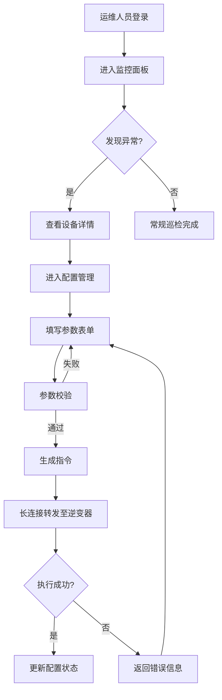

## 1. 产品概述

逆变器集群监控管理系统——面向光伏电站运维人员，通过长连接实时对接逆变器集群，提供参数监控、配置下发、指令转发与数据存储的一站式管控平台。解决传统逆变器管理中"设备分散、数据滞后、配置低效"的核心痛点。

## 2. 核心功能

### 2.1 用户角色

| 角色 | 注册方式 | 核心权限 |
|------|----------|----------|
| 运维工程师 | 管理员分配账号 | 查看监控数据、修改配置、下发指令 |
| 系统管理员 | 系统内置 | 全部权限，含设备管理、用户管理 |

### 2.2 功能模块

1. **监控面板页**：实时参数总览、设备状态矩阵、告警概览、趋势图表
2. **设备详情页**：单台逆变器详细参数、历史曲线、运行日志
3. **配置管理页**：参数配置表单、批量下发、配置模板管理
4. **告警中心页**：实时告警列表、历史告警查询、告警规则配置

### 2.3 页面详情

| 页面名称 | 模块名称 | 功能描述 |
|----------|----------|----------|
| 监控面板页 | 设备状态矩阵 | 网格展示所有逆变器在线/离线/告警状态，点击跳转详情 |
| 监控面板页 | 关键参数总览 | 实时显示总发电功率、日发电量、设备在线率等核心指标 |
| 监控面板页 | 趋势图表 | 功率/电压/电流趋势折线图，支持1h/6h/24h/7d切换 |
| 监控面板页 | 告警概览 | 最近告警滚动列表，按严重程度颜色标记 |
| 设备详情页 | 实时参数面板 | 交流侧/直流侧电气参数实时刷新显示 |
| 设备详情页 | 历史曲线 | 可选参数的历史趋势图，支持时间范围选择 |
| 设备详情页 | 运行日志 | 设备级操作与事件日志时间线 |
| 配置管理页 | 参数配置表单 | 电气参数/通信参数/保护参数分组表单，含范围校验 |
| 配置管理页 | 批量下发 | 选择多台设备批量下发相同配置 |
| 配置管理页 | 配置模板 | 保存/加载配置模板，快速复用 |
| 告警中心页 | 实时告警 | WebSocket推送的实时告警列表，支持确认/忽略操作 |
| 告警中心页 | 历史告警 | 按时间/设备/等级查询历史告警 |
| 告警中心页 | 告警规则 | 配置告警阈值与触发条件 |

## 3. 核心流程

### 3.1 设备监控流程

运维人员打开监控面板 → 系统通过WebSocket连接获取设备实时数据 → 前端展示设备状态矩阵与关键参数 → 点击设备进入详情页查看深度参数与历史曲线 → 发现异常进入告警中心处理

### 3.2 配置下发流程

运维人员进入配置管理页 → 选择目标设备 → 填写参数表单 → 系统进行参数校验（范围/类型/互斥） → 校验通过后生成指令 → 通过长连接转发至目标逆变器 → 逆变器返回执行结果 → 更新界面状态

### 3.3 流程图

## 4. 用户界面设计

### 4.1 设计风格

- **主色调**：深空蓝 (#0F172A) 为底色，电力绿 (#22C55E) 为在线状态色，琥珀黄 (#F59E0B) 为告警色，危险红 (#EF4444) 为故障色
- **辅助色**：青蓝 (#06B6D4) 用于数据图表，灰蓝系用于卡片与面板
- **按钮风格**：圆角6px，主操作使用实色填充，次操作使用描边样式
- **字体**：数字使用 JetBrains Mono 等宽字体提升可读性，中文使用思源黑体
- **布局风格**：左侧导航 + 顶部状态栏 + 内容区卡片网格
- **图标风格**：线性图标，2px描边，与 lucide-react 图标库风格统一

### 4.2 页面设计概览

| 页面名称 | 模块名称 | UI 元素 |
|----------|----------|---------|
| 监控面板页 | 设备状态矩阵 | 深色卡片网格，每格含设备名+状态指示灯，hover显示摘要浮层 |
| 监控面板页 | 关键参数总览 | 4列指标卡片，大数字+趋势小箭头，微动画刷新 |
| 监控面板页 | 趋势图表 | 深色背景折线图，渐变填充区域，悬停显示具体值 |
| 监控面板页 | 告警概览 | 左侧红/黄竖条的列表项，滚动动画 |
| 设备详情页 | 实时参数面板 | 分组卡片，参数名+值+单位，值变化时闪烁高亮 |
| 设备详情页 | 历史曲线 | 带时间轴选择器的图表区域 |
| 配置管理页 | 参数配置表单 | 分组折叠面板，输入框含范围提示，实时校验反馈 |
| 配置管理页 | 批量下发 | 设备多选网格 + 配置表单 + 下发进度条 |
| 告警中心页 | 实时告警 | 表格+状态标签，新告警插入时行闪烁动画 |

### 4.3 响应式策略

- 桌面优先设计，最小支持1280px宽度
- 1280-1920px：标准两栏/三栏布局
- 大屏(>1920px)：扩展卡片网格列数，图表区域加宽
- 不做移动端适配（工业监控场景以桌面为主）

### 4.4 动效设计

- 页面加载：骨架屏占位，数据就绪后渐入
- 数据刷新：数值变化时短暂高亮（绿色上升/红色下降）
- 告警出现：新行插入时滑入+闪烁，3秒后恢复正常
- 设备状态切换：状态指示灯颜色过渡动画
- 图表更新：折线图数据点平滑过渡
