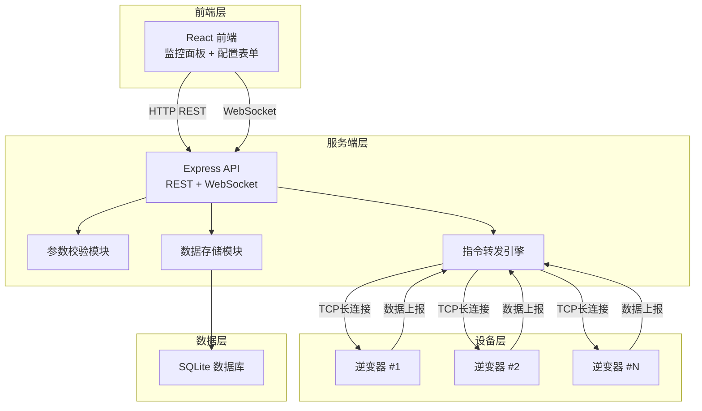
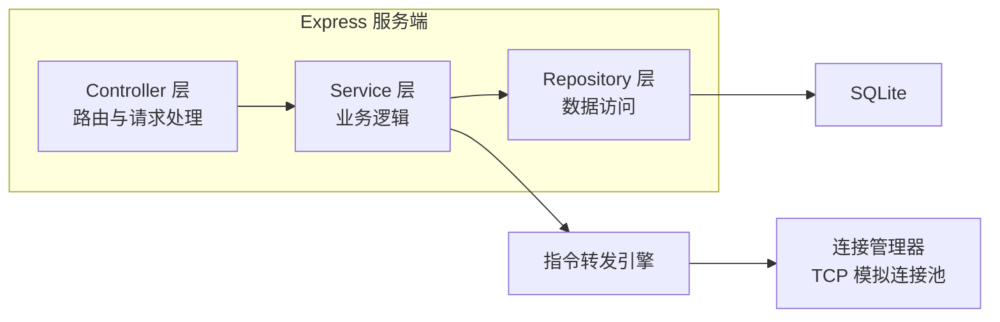
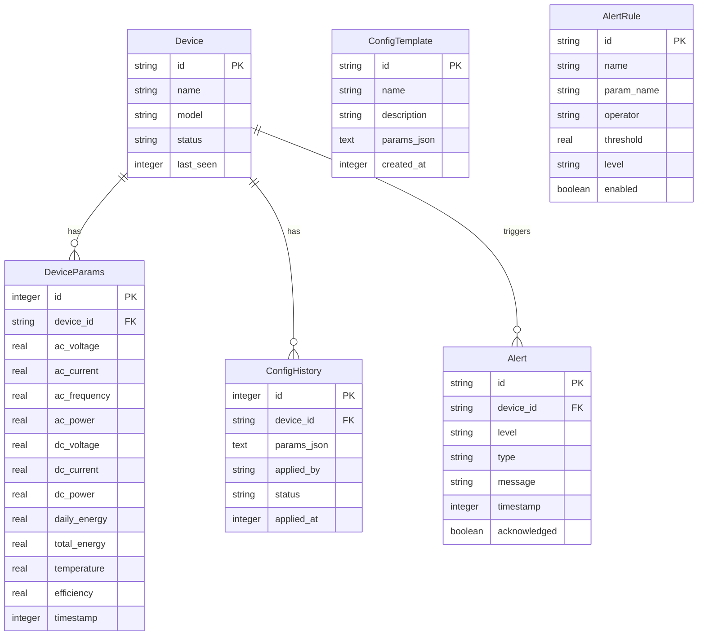

## 1. 架构设计



## 2. 技术说明

- **前端**：React@18 + TypeScript + TailwindCSS@3 + Vite
- **状态管理**：Zustand
- **图表**：Recharts
- **初始化工具**：vite-init (react-express-ts 模板)
- **后端**：Express@4 + TypeScript (ESM)
- **数据库**：SQLite (better-sqlite3)
- **长连接**：ws (WebSocket 服务端) + 模拟 TCP 连接管理器
- **实时通信**：前端↔服务端 WebSocket，服务端↔逆变器 TCP 模拟

## 3. 路由定义

| 路由 | 用途 |
|------|------|
| `/` | 监控面板页 - 设备状态矩阵、关键参数、趋势图、告警概览 |
| `/device/:id` | 设备详情页 - 单台逆变器深度监控 |
| `/config` | 配置管理页 - 参数表单、批量下发、模板管理 |
| `/alerts` | 告警中心页 - 实时/历史告警、规则配置 |

## 4. API 定义

### 4.1 REST API

```typescript
// 设备相关
interface Device {
  id: string
  name: string
  model: string
  status: "online" | "offline" | "fault" | "warning"
  lastSeen: number
  params: DeviceParams
}

interface DeviceParams {
  // 交流侧
  acVoltage: number       // V
  acCurrent: number       // A
  acFrequency: number     // Hz
  acPower: number         // kW
  // 直流侧
  dcVoltage: number       // V
  dcCurrent: number       // A
  dcPower: number         // kW
  // 统计
  dailyEnergy: number     // kWh
  totalEnergy: number     // MWh
  temperature: number     // °C
  efficiency: number      // %
}

// GET /api/devices - 获取设备列表
interface GetDevicesResponse {
  devices: Device[]
  total: number
  onlineCount: number
}

// GET /api/devices/:id - 获取设备详情
interface GetDeviceResponse {
  device: Device
  history: HistoryRecord[]
}

// GET /api/devices/:id/history - 获取历史数据
interface HistoryRecord {
  timestamp: number
  params: Partial<DeviceParams>
}

// 配置相关
interface ConfigTemplate {
  id: string
  name: string
  description: string
  params: ConfigParams
  createdAt: number
}

interface ConfigParams {
  // 电气参数
  ratedPower: number        // kW
  acVoltageMax: number      // V
  acVoltageMin: number      // V
  // 保护参数
  overVoltageThreshold: number  // V
  underVoltageThreshold: number // V
  overFreqThreshold: number     // Hz
  underFreqThreshold: number    // Hz
  overTempThreshold: number     // °C
  // 通信参数
  heartbeatInterval: number     // s
  reportInterval: number        // s
}

// POST /api/config/apply - 下发配置
interface ApplyConfigRequest {
  deviceIds: string[]
  params: ConfigParams
  templateId?: string
}

interface ApplyConfigResponse {
  taskId: string
  results: Record<string, "success" | "failed" | "pending">
}

// POST /api/config/templates - 保存配置模板
// GET /api/config/templates - 获取模板列表

// 告警相关
interface Alert {
  id: string
  deviceId: string
  deviceName: string
  level: "critical" | "warning" | "info"
  type: string
  message: string
  timestamp: number
  acknowledged: boolean
}

// GET /api/alerts - 获取告警列表
interface GetAlertsRequest {
  level?: string
  deviceId?: string
  startTime?: number
  endTime?: number
  acknowledged?: boolean
  page?: number
  pageSize?: number
}

// POST /api/alerts/:id/acknowledge - 确认告警
// GET /api/alerts/rules - 获取告警规则
// POST /api/alerts/rules - 创建告警规则
```

### 4.2 WebSocket 事件

```typescript
// 服务端 → 前端
interface WSServerEvents {
  "device:status": (data: { deviceId: string; status: Device["status"] }) => void
  "device:params": (data: { deviceId: string; params: Partial<DeviceParams> }[]) => void
  "device:alert": (data: Alert) => void
  "config:progress": (data: { taskId: string; deviceId: string; status: "success" | "failed" }) => void
}

// 前端 → 服务端
interface WSClientEvents {
  "subscribe:device": (deviceId: string) => void
  "unsubscribe:device": (deviceId: string) => void
}
```

## 5. 服务端架构图



## 6. 数据模型

### 6.1 数据模型定义



### 6.2 数据定义语言

```sql
CREATE TABLE device (
  id TEXT PRIMARY KEY,
  name TEXT NOT NULL,
  model TEXT NOT NULL,
  status TEXT NOT NULL DEFAULT 'offline',
  last_seen INTEGER NOT NULL
);

CREATE TABLE device_params (
  id INTEGER PRIMARY KEY AUTOINCREMENT,
  device_id TEXT NOT NULL REFERENCES device(id),
  ac_voltage REAL,
  ac_current REAL,
  ac_frequency REAL,
  ac_power REAL,
  dc_voltage REAL,
  dc_current REAL,
  dc_power REAL,
  daily_energy REAL,
  total_energy REAL,
  temperature REAL,
  efficiency REAL,
  timestamp INTEGER NOT NULL
);

CREATE INDEX idx_device_params_device_id ON device_params(device_id);
CREATE INDEX idx_device_params_timestamp ON device_params(timestamp);

CREATE TABLE config_template (
  id TEXT PRIMARY KEY,
  name TEXT NOT NULL,
  description TEXT,
  params_json TEXT NOT NULL,
  created_at INTEGER NOT NULL
);

CREATE TABLE config_history (
  id INTEGER PRIMARY KEY AUTOINCREMENT,
  device_id TEXT NOT NULL REFERENCES device(id),
  params_json TEXT NOT NULL,
  applied_by TEXT NOT NULL,
  status TEXT NOT NULL DEFAULT 'pending',
  applied_at INTEGER NOT NULL
);

CREATE INDEX idx_config_history_device_id ON config_history(device_id);

CREATE TABLE alert (
  id TEXT PRIMARY KEY,
  device_id TEXT NOT NULL REFERENCES device(id),
  level TEXT NOT NULL,
  type TEXT NOT NULL,
  message TEXT NOT NULL,
  timestamp INTEGER NOT NULL,
  acknowledged INTEGER NOT NULL DEFAULT 0
);

CREATE INDEX idx_alert_device_id ON alert(device_id);
CREATE INDEX idx_alert_timestamp ON alert(timestamp);
CREATE INDEX idx_alert_level ON alert(level);

CREATE TABLE alert_rule (
  id TEXT PRIMARY KEY,
  name TEXT NOT NULL,
  param_name TEXT NOT NULL,
  operator TEXT NOT NULL,
  threshold REAL NOT NULL,
  level TEXT NOT NULL,
  enabled INTEGER NOT NULL DEFAULT 1
);
```
