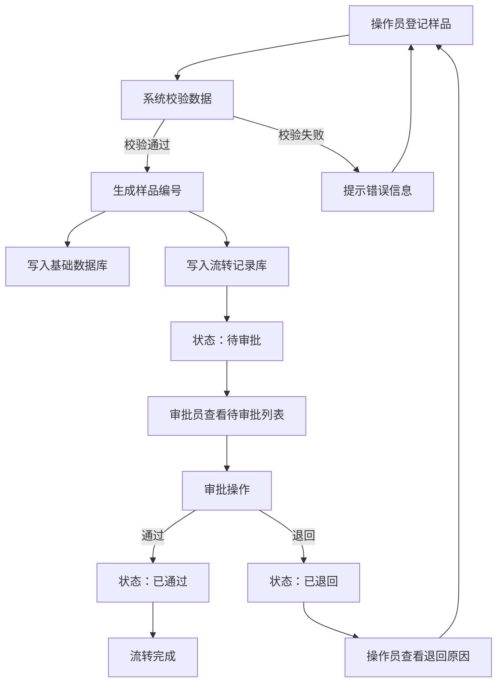

## 1. 产品概述

样品流转管理系统——面向实验室/检测机构，实现样品从登记、流转到审批的全生命周期数字化管理。
- 解决传统纸质流转效率低、易丢失、难追溯的问题，目标用户为实验室操作员与审批人员
- 提升样品管理合规性与可追溯性，降低人为差错，缩短流转周期

## 2. 核心功能

### 2.1 用户角色

| 角色 | 注册方式 | 核心权限 |
|------|----------|----------|
| 操作员 | 管理员分配账号 | 登记样品、查询流转记录、上传附件 |
| 审批员 | 管理员分配账号 | 审批样品流转、退回/通过操作 |
| 管理员 | 系统预设 | 用户管理、流程配置、数据导出 |

### 2.2 功能模块

1. **样品登记页面**：样品信息录入、附件上传、提交登记
2. **流转查询页面**：样品流转状态查询、流转历史追踪、筛选过滤
3. **审批页面**：待审批列表、审批操作（通过/退回）、审批意见填写

### 2.3 页面详情

| 页面名称 | 模块名称 | 功能描述 |
|----------|----------|----------|
| 样品登记 | 基本信息表单 | 录入样品名称、类型、来源、规格、数量等必填项 |
| 样品登记 | 附件上传 | 支持拖拽上传文档/图片，预览已上传文件列表 |
| 样品登记 | 提交确认 | 信息校验后提交至待审批队列，生成样品编号 |
| 流转查询 | 搜索筛选栏 | 按样品编号/名称/状态/日期范围组合查询 |
| 流转查询 | 流转列表 | 展示样品当前状态、节点、处理人、时间轴 |
| 流转查询 | 流转详情 | 点击展开完整流转轨迹与附件记录 |
| 审批 | 待审批列表 | 分页展示待审批样品，标识优先级与等待时长 |
| 审批 | 审批操作面板 | 填写审批意见，选择通过或退回，退回需填写原因 |
| 审批 | 审批历史 | 查看已处理审批记录及结果 |

## 3. 核心流程

用户（操作员）在样品登记页面填写样品信息并上传附件，提交后系统生成唯一样品编号，流转记录写入流转库，状态变为"待审批"。审批员在审批页面查看待审批列表，可查看详情并通过或退回。通过后样品状态更新为"已通过"，退回则状态变为"已退回"并附带退回原因。操作员可在流转查询页面按条件查询任何样品的完整流转轨迹。

## 4. 用户界面设计

### 4.1 设计风格

- 主色调：深海蓝 (#0F4C75) + 琥珀橙 (#E8A838) 作为强调色
- 辅助色：浅灰 (#F5F7FA) 背景 + 中灰 (#E2E8F0) 卡片边框
- 按钮风格：圆角矩形 (8px)，主按钮实色填充，次要按钮描边
- 字体：标题使用 Noto Sans SC Bold，正文使用 Noto Sans SC Regular
- 布局风格：左侧导航栏 + 右侧内容区，卡片式布局
- 图标风格：线性图标 (Lucide)，2px 描边，与文字对齐

### 4.2 页面设计概览

| 页面名称 | 模块名称 | UI要素 |
|----------|----------|--------|
| 样品登记 | 基本信息表单 | 白色卡片内表单，分组标题，输入框左侧标签，必填项红色星号标记 |
| 样品登记 | 附件上传 | 虚线边框拖拽区域，上传进度条，文件列表带删除按钮 |
| 样品登记 | 提交确认 | 底部固定操作栏，取消/提交按钮，提交时弹窗二次确认 |
| 流转查询 | 搜索筛选栏 | 顶部水平筛选条，下拉选择+日期选择器+搜索按钮 |
| 流转查询 | 流转列表 | 表格布局，状态列带彩色标签，行点击展开详情 |
| 流转查询 | 流转详情 | 侧边抽屉展示时间轴，节点图标+描述+时间 |
| 审批 | 待审批列表 | 表格布局，高亮等待时长超限行，批量操作复选框 |
| 审批 | 审批操作面板 | 右侧滑出面板，通过/退回按钮，退回原因必填文本域 |
| 审批 | 审批历史 | Tab 切换已通过/已退回，表格展示历史记录 |

### 4.3 响应式设计

- 桌面优先设计，最小宽度 1024px
- 平板适配：侧边栏折叠为图标模式，表格列精简
- 移动端暂不作为主要适配目标

### 4.4 3D 场景指导

不适用
