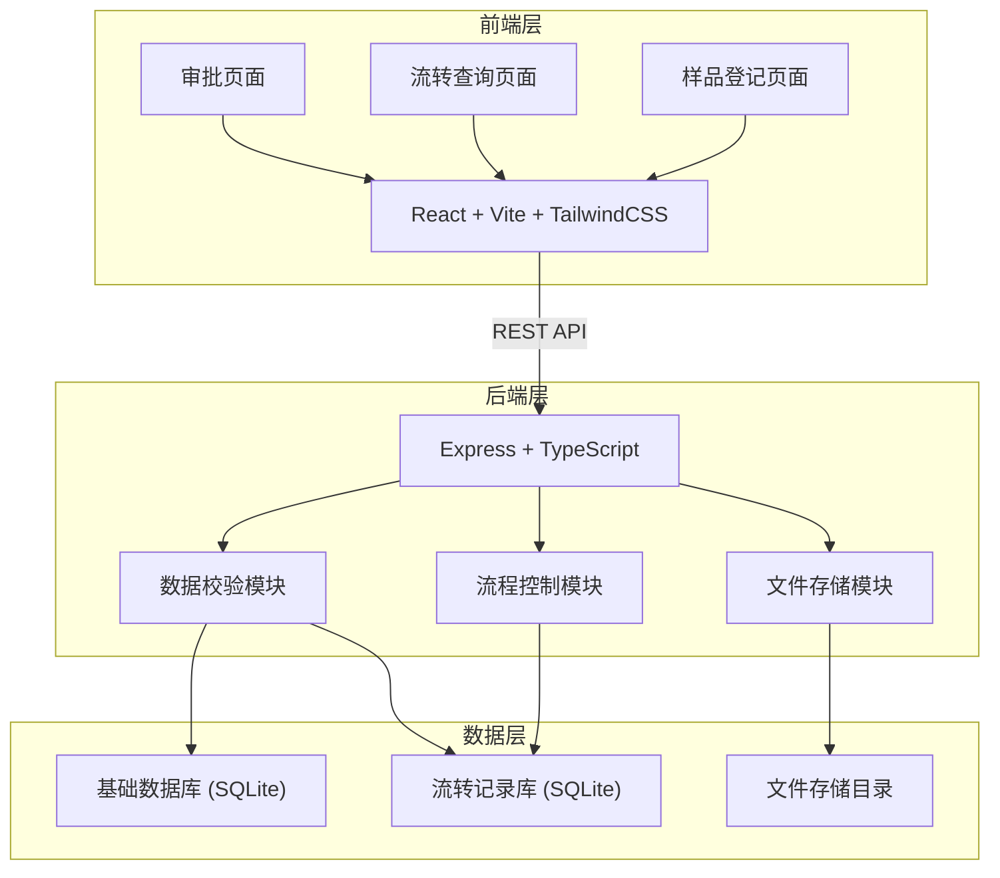
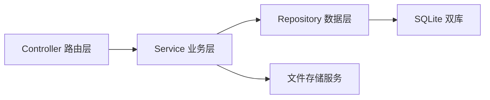
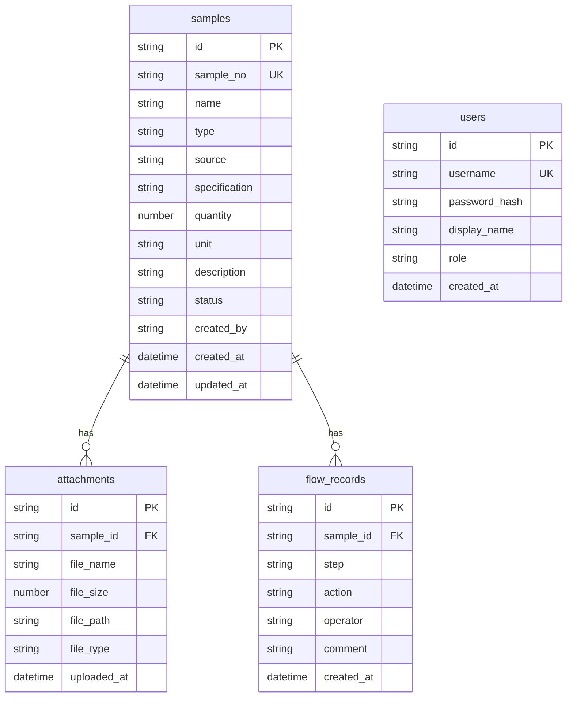

## 1. 架构设计



## 2. 技术说明

- 前端：React@18 + TailwindCSS@3 + Vite + Zustand
- 初始化工具：vite-init
- 后端：Express@4 + TypeScript (ESM)
- 数据库：SQLite (双库——基础数据库 + 流转记录库)
- 文件存储：本地文件系统 (uploads 目录)
- 状态管理：Zustand

## 3. 路由定义

| 路由 | 用途 |
|------|------|
| / | 首页仪表盘，展示统计数据和快捷入口 |
| /register | 样品登记页面 |
| /query | 流转查询页面 |
| /approval | 审批页面 |

## 4. API 定义

### 4.1 样品登记

```typescript
// POST /api/samples
interface CreateSampleRequest {
  name: string;
  type: string;
  source: string;
  specification: string;
  quantity: number;
  unit: string;
  description?: string;
}

interface CreateSampleResponse {
  id: string;
  sampleNo: string;
  status: "pending";
  createdAt: string;
}
```

### 4.2 附件上传

```typescript
// POST /api/samples/:id/attachments (multipart/form-data)
interface AttachmentResponse {
  id: string;
  fileName: string;
  fileSize: number;
  fileUrl: string;
  uploadedAt: string;
}
```

### 4.3 流转查询

```typescript
// GET /api/samples?page=1&pageSize=10&keyword=&status=&startDate=&endDate=
interface SampleListResponse {
  total: number;
  page: number;
  pageSize: number;
  items: SampleItem[];
}

interface SampleItem {
  id: string;
  sampleNo: string;
  name: string;
  type: string;
  status: "pending" | "approved" | "rejected";
  currentStep: string;
  handler: string;
  createdAt: string;
  updatedAt: string;
}
```

### 4.4 流转详情

```typescript
// GET /api/samples/:id/flow-records
interface FlowRecordListResponse {
  sampleId: string;
  sampleNo: string;
  records: FlowRecord[];
}

interface FlowRecord {
  id: string;
  step: string;
  action: "submit" | "approve" | "reject" | "resubmit";
  operator: string;
  comment?: string;
  createdAt: string;
}
```

### 4.5 审批操作

```typescript
// POST /api/samples/:id/approve
interface ApproveRequest {
  action: "approve" | "reject";
  comment: string;
}

interface ApproveResponse {
  id: string;
  status: "approved" | "rejected";
  updatedAt: string;
}
```

### 4.6 仪表盘统计

```typescript
// GET /api/dashboard/stats
interface DashboardStats {
  totalSamples: number;
  pendingCount: number;
  approvedCount: number;
  rejectedCount: number;
  recentActivities: RecentActivity[];
}

interface RecentActivity {
  sampleNo: string;
  action: string;
  operator: string;
  timestamp: string;
}
```

## 5. 服务端架构图



## 6. 数据模型

### 6.1 数据模型定义



### 6.2 数据定义语言

**基础数据库 (base.db):**

```sql
CREATE TABLE users (
  id TEXT PRIMARY KEY,
  username TEXT UNIQUE NOT NULL,
  password_hash TEXT NOT NULL,
  display_name TEXT NOT NULL,
  role TEXT NOT NULL CHECK(role IN ('operator', 'reviewer', 'admin')),
  created_at TEXT NOT NULL DEFAULT (datetime('now'))
);

CREATE TABLE samples (
  id TEXT PRIMARY KEY,
  sample_no TEXT UNIQUE NOT NULL,
  name TEXT NOT NULL,
  type TEXT NOT NULL,
  source TEXT NOT NULL,
  specification TEXT NOT NULL,
  quantity INTEGER NOT NULL,
  unit TEXT NOT NULL,
  description TEXT,
  status TEXT NOT NULL DEFAULT 'pending' CHECK(status IN ('pending', 'approved', 'rejected')),
  created_by TEXT NOT NULL,
  created_at TEXT NOT NULL DEFAULT (datetime('now')),
  updated_at TEXT NOT NULL DEFAULT (datetime('now')),
  FOREIGN KEY (created_by) REFERENCES users(id)
);

CREATE TABLE attachments (
  id TEXT PRIMARY KEY,
  sample_id TEXT NOT NULL,
  file_name TEXT NOT NULL,
  file_size INTEGER NOT NULL,
  file_path TEXT NOT NULL,
  file_type TEXT NOT NULL,
  uploaded_at TEXT NOT NULL DEFAULT (datetime('now')),
  FOREIGN KEY (sample_id) REFERENCES samples(id) ON DELETE CASCADE
);

CREATE INDEX idx_samples_status ON samples(status);
CREATE INDEX idx_samples_created_at ON samples(created_at);
CREATE INDEX idx_attachments_sample_id ON attachments(sample_id);
```

**流转记录库 (flow.db):**

```sql
CREATE TABLE flow_records (
  id TEXT PRIMARY KEY,
  sample_id TEXT NOT NULL,
  step TEXT NOT NULL,
  action TEXT NOT NULL CHECK(action IN ('submit', 'approve', 'reject', 'resubmit')),
  operator TEXT NOT NULL,
  comment TEXT,
  created_at TEXT NOT NULL DEFAULT (datetime('now'))
);

CREATE INDEX idx_flow_records_sample_id ON flow_records(sample_id);
CREATE INDEX idx_flow_records_created_at ON flow_records(created_at);
CREATE INDEX idx_flow_records_action ON flow_records(action);
```

**初始数据:**

```sql
INSERT INTO users (id, username, password_hash, display_name, role) VALUES
  ('u001', 'admin', 'hashed_admin_123', '系统管理员', 'admin'),
  ('u002', 'operator01', 'hashed_op_123', '张操作', 'operator'),
  ('u003', 'reviewer01', 'hashed_rev_123', '李审批', 'reviewer');
```
