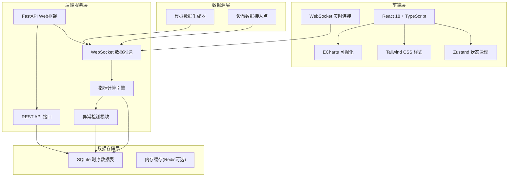
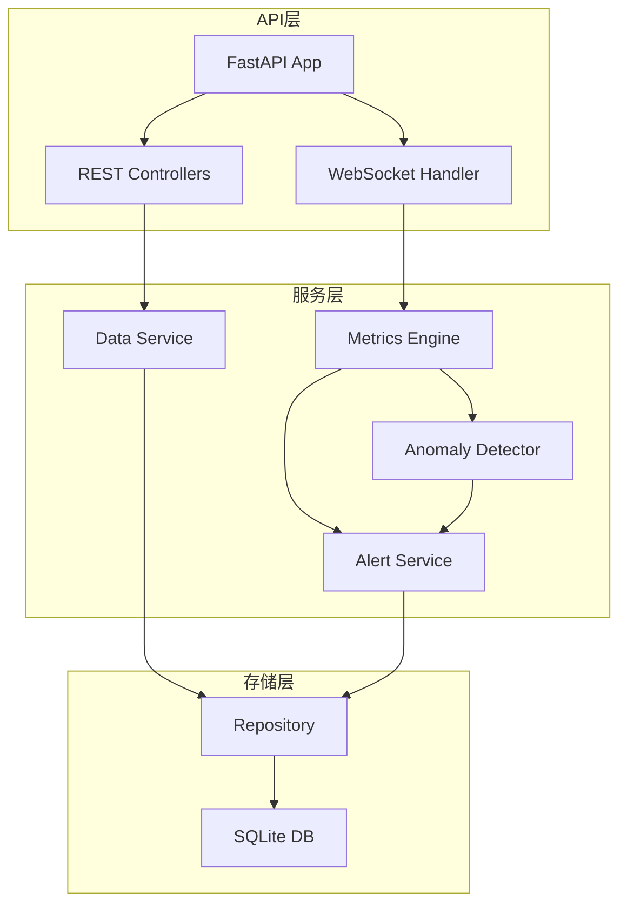
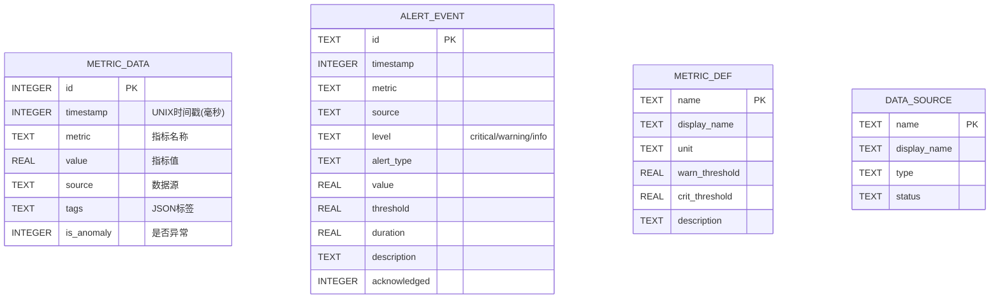

## 1. 架构设计



## 2. 技术描述

- **前端**：React 18 + TypeScript + Vite + Tailwind CSS 3 + ECharts 5 + Zustand + lucide-react
- **后端**：Python 3.10 + FastAPI + Uvicorn(ASGI) + NumPy + Pandas
- **数据库**：SQLite 3（带时序表设计和索引优化）
- **实时通信**：WebSocket 全双工通信
- **数据格式**：JSON

## 3. 路由定义

| 路由 | 页面/用途 |
|------|----------|
| `/` | 监测面板 - 实时概览 |
| `/charts` | 图表分析 - 多维度数据可视化 |
| `/alerts` | 异常告警 - 告警列表和统计 |
| `/metrics` | 指标详情 - 单个指标深度分析 |

## 4. API 定义

```typescript
// 通用类型
interface MetricData {
  timestamp: number;
  metric: string;
  value: number;
  source: string;
  tags?: Record<string, string>;
}

interface AlertEvent {
  id: string;
  timestamp: number;
  metric: string;
  source: string;
  level: 'critical' | 'warning' | 'info';
  type: string;
  value: number;
  threshold: number;
  duration?: number;
  description: string;
}

interface MetricStats {
  metric: string;
  count: number;
  min: number;
  max: number;
  avg: number;
  std: number;
  p50: number;
  p95: number;
  p99: number;
}

// API 请求
interface QueryParams {
  startTime: number;
  endTime: number;
  metrics?: string[];
  sources?: string[];
  aggregation?: 'raw' | '1m' | '5m' | '15m' | '1h';
  onlyAnomalies?: boolean;
}

// API 响应
interface ApiResponse<T> {
  code: number;
  message: string;
  data: T;
}
```

**REST API 接口**：
- `GET /api/health` - 健康检查
- `GET /api/metrics/list` - 获取指标列表
- `GET /api/sources/list` - 获取数据源列表
- `POST /api/data/query` - 按条件查询数据
- `GET /api/data/latest?metric={name}` - 获取最新数据
- `GET /api/alerts?startTime=&endTime=&level=` - 查询告警
- `GET /api/alerts/stats` - 告警统计
- `GET /api/stats/metrics` - 指标统计
- `WebSocket /ws/stream` - 实时数据推送

## 5. 服务器架构图



## 6. 数据模型

### 6.1 数据模型定义



### 6.2 数据定义语言

```sql
-- 时序数据表
CREATE TABLE IF NOT EXISTS metric_data (
    id INTEGER PRIMARY KEY AUTOINCREMENT,
    timestamp INTEGER NOT NULL,
    metric TEXT NOT NULL,
    value REAL NOT NULL,
    source TEXT NOT NULL,
    tags TEXT,
    is_anomaly INTEGER DEFAULT 0,
    created_at INTEGER DEFAULT (strftime('%s', 'now') * 1000)
);

CREATE INDEX IF NOT EXISTS idx_metric_data_time ON metric_data(timestamp DESC);
CREATE INDEX IF NOT EXISTS idx_metric_data_metric ON metric_data(metric, timestamp DESC);
CREATE INDEX IF NOT EXISTS idx_metric_data_source ON metric_data(source, timestamp DESC);
CREATE INDEX IF NOT EXISTS idx_metric_data_anomaly ON metric_data(is_anomaly, timestamp DESC);

-- 告警事件表
CREATE TABLE IF NOT EXISTS alert_event (
    id TEXT PRIMARY KEY,
    timestamp INTEGER NOT NULL,
    metric TEXT NOT NULL,
    source TEXT NOT NULL,
    level TEXT NOT NULL,
    alert_type TEXT NOT NULL,
    value REAL NOT NULL,
    threshold REAL NOT NULL,
    duration REAL,
    description TEXT,
    acknowledged INTEGER DEFAULT 0,
    created_at INTEGER DEFAULT (strftime('%s', 'now') * 1000)
);

CREATE INDEX IF NOT EXISTS idx_alert_time ON alert_event(timestamp DESC);
CREATE INDEX IF NOT EXISTS idx_alert_level ON alert_event(level, timestamp DESC);
CREATE INDEX IF NOT EXISTS idx_alert_metric ON alert_event(metric, timestamp DESC);

-- 指标定义表
CREATE TABLE IF NOT EXISTS metric_def (
    name TEXT PRIMARY KEY,
    display_name TEXT NOT NULL,
    unit TEXT,
    warn_threshold REAL,
    crit_threshold REAL,
    description TEXT
);

-- 数据源表
CREATE TABLE IF NOT EXISTS data_source (
    name TEXT PRIMARY KEY,
    display_name TEXT NOT NULL,
    type TEXT NOT NULL,
    status TEXT DEFAULT 'active'
);

-- 初始数据
INSERT OR IGNORE INTO metric_def (name, display_name, unit, warn_threshold, crit_threshold, description) VALUES
    ('cpu_usage', 'CPU使用率', '%', 80, 95, '服务器CPU使用率'),
    ('memory_usage', '内存使用率', '%', 85, 95, '服务器内存使用率'),
    ('disk_io', '磁盘IO', 'MB/s', 100, 200, '磁盘读写速率'),
    ('network_latency', '网络延迟', 'ms', 100, 300, '网络响应延迟'),
    ('temperature', '温度', '°C', 70, 85, '设备温度'),
    ('error_rate', '错误率', '%', 5, 15, '请求错误率');

INSERT OR IGNORE INTO data_source (name, display_name, type, status) VALUES
    ('server_01', '应用服务器-01', 'server', 'active'),
    ('server_02', '应用服务器-02', 'server', 'active'),
    ('db_01', '数据库服务器', 'database', 'active'),
    ('gateway_01', '网关设备', 'network', 'active');
```
