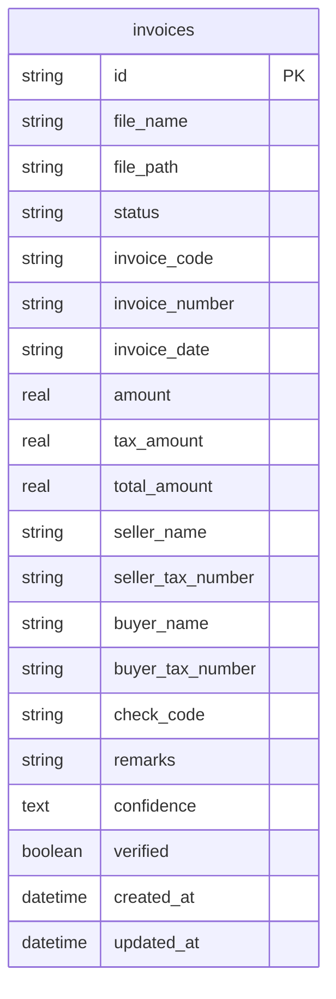

## 1. 架构设计

```mermaid
graph TB
    subgraph "前端层"
        "FE[React 前端应用]"
    end
    subgraph "后端层"
        "API[Express API 服务]" --> "SEG[图像分割模块]"
        "API" --> "EXT[信息抽取模块]"
        "API" --> "FILE[文件处理模块]"
    end
    subgraph "数据层"
        "DB[SQLite 票据数据库]"
        "FS[本地文件存储]"
    end
    subgraph "AI 服务层"
        "AI[AI 识别引擎]"
    end
    "FE" -->|"HTTP/REST"| "API"
    "SEG" --> "AI"
    "EXT" --> "AI"
    "FILE" --> "FS"
    "API" --> "DB"
```

## 2. 技术说明

- **前端**：React@18 + TailwindCSS@3 + Vite
- **初始化工具**：Vite
- **后端**：Express@4 + Multer（文件上传）+ better-sqlite3（数据库）
- **数据库**：SQLite（零配置，文件级数据库，适合单机部署）
- **AI 识别**：基于 Tesseract.js（OCR）+ 自定义规则引擎做字段提取，纯 Node.js 实现，无需外部 AI 服务依赖
- **文件存储**：本地磁盘存储上传图像，数据库仅存路径引用

## 3. 路由定义

| 路由 | 用途 |
|------|------|
| `/` | 票据上传页，拖拽上传与预览 |
| `/result/:id` | 识别结果页，展示提取字段与原图对照 |
| `/records` | 票据管理页，数据列表与筛选导出 |

## 4. API 定义

### 4.1 TypeScript 类型定义

```typescript
interface Invoice {
  id: string
  fileName: string
  filePath: string
  status: "pending" | "processing" | "completed" | "failed"
  invoiceCode: string | null
  invoiceNumber: string | null
  invoiceDate: string | null
  amount: number | null
  taxAmount: number | null
  totalAmount: number | null
  sellerName: string | null
  sellerTaxNumber: string | null
  buyerName: string | null
  buyerTaxNumber: string | null
  checkCode: string | null
  remarks: string | null
  confidence: Record<string, number>
  verified: boolean
  createdAt: string
  updatedAt: string
}

interface UploadResponse {
  id: string
  fileName: string
  status: Invoice["status"]
}

interface ExtractResult {
  id: string
  fields: Invoice
  segments: Array<{
    label: string
    bbox: [number, number, number, number]
    text: string
    confidence: number
  }>
}
```

### 4.2 API 端点

| 方法 | 路径 | 请求 | 响应 | 说明 |
|------|------|------|------|------|
| POST | `/api/invoices/upload` | `multipart/form-data` 文件 | `UploadResponse[]` | 上传票据图像 |
| GET | `/api/invoices` | `?page=&limit=&status=&keyword=&dateFrom=&dateTo=` | `{ data: Invoice[], total: number }` | 查询票据列表 |
| GET | `/api/invoices/:id` | - | `ExtractResult` | 获取识别详情含分割区域 |
| PUT | `/api/invoices/:id` | `Partial<Invoice>` | `Invoice` | 修正票据字段 |
| DELETE | `/api/invoices/:id` | - | `{ success: boolean }` | 删除票据记录 |
| GET | `/api/invoices/export` | `?format=csv\|xlsx` | 文件流 | 导出票据数据 |
| GET | `/api/invoices/:id/image` | - | 图片文件流 | 获取原始图像 |

## 5. 服务端架构图

```mermaid
graph LR
    "C[Controller 路由层]" --> "S[Service 业务层]"
    "S" --> "R[Repository 数据层]"
    "R" --> "DB[(SQLite 数据库)]"
    "S" --> "AI[AI 识别引擎]"
    "S" --> "FS[文件存储]"
```

- **Controller 层**：处理 HTTP 请求、参数校验、响应格式化
- **Service 层**：业务逻辑编排，调用 AI 引擎与数据层
- **Repository 层**：数据库 CRUD 操作，SQL 查询封装
- **AI 引擎**：图像分割（区域检测）+ OCR 文字识别 + 规则抽取

## 6. 数据模型

### 6.1 数据模型定义



### 6.2 数据定义语言

```sql
CREATE TABLE IF NOT EXISTS invoices (
    id TEXT PRIMARY KEY,
    file_name TEXT NOT NULL,
    file_path TEXT NOT NULL,
    status TEXT NOT NULL DEFAULT 'pending' CHECK(status IN ('pending', 'processing', 'completed', 'failed')),
    invoice_code TEXT,
    invoice_number TEXT,
    invoice_date TEXT,
    amount REAL,
    tax_amount REAL,
    total_amount REAL,
    seller_name TEXT,
    seller_tax_number TEXT,
    buyer_name TEXT,
    buyer_tax_number TEXT,
    check_code TEXT,
    remarks TEXT,
    confidence TEXT,
    verified INTEGER NOT NULL DEFAULT 0,
    created_at TEXT NOT NULL DEFAULT (datetime('now', 'localtime')),
    updated_at TEXT NOT NULL DEFAULT (datetime('now', 'localtime'))
);

CREATE INDEX IF NOT EXISTS idx_invoices_status ON invoices(status);
CREATE INDEX IF NOT EXISTS idx_invoices_date ON invoices(invoice_date);
CREATE INDEX IF NOT EXISTS idx_invoices_number ON invoices(invoice_number);
CREATE INDEX IF NOT EXISTS idx_invoices_created ON invoices(created_at);
```
