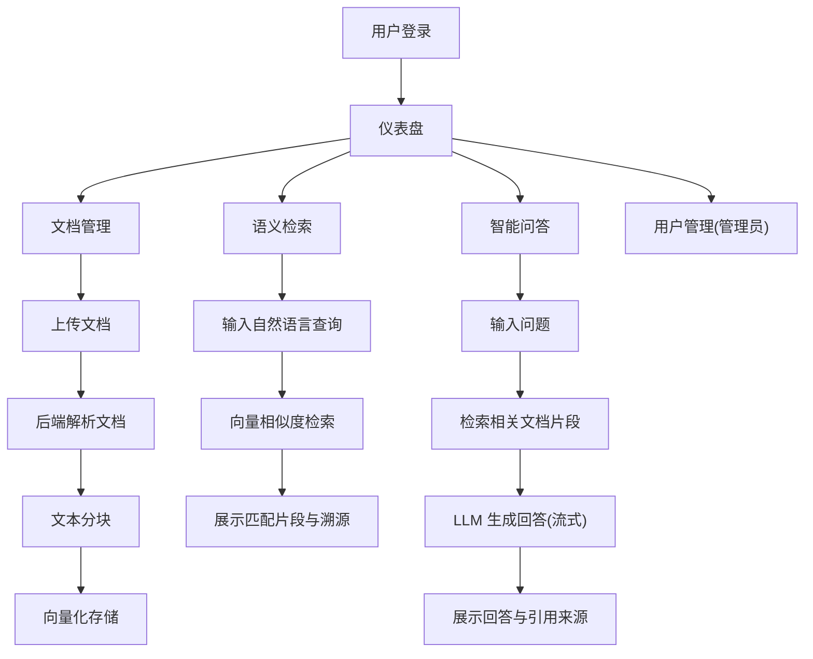

## 1. 产品概述

私有化文档语义检索 AI 应用——面向企业内网环境的一站式智能文档检索与问答平台，支持多格式文档上传解析、文本向量化存储、自然语言语义检索与问答，检索结果可溯源至原文段落。

- 目标用户：企业内网知识工作者、研发团队、文档管理员
- 核心价值：将散落在各文档中的知识通过 AI 语义理解能力快速定位，大幅提升信息检索效率

## 2. 核心功能

### 2.1 用户角色

| 角色 | 注册方式 | 核心权限 |
|------|----------|----------|
| 管理员 | 系统预设 | 用户管理、文档库管理、系统配置 |
| 普通用户 | 管理员创建 | 文档上传、语义检索、问答交互 |

### 2.2 功能模块

1. **登录页**：用户认证、JWT 令牌管理
2. **仪表盘页**：文档库概览、检索统计、最近活动
3. **文档管理页**：多格式文档上传、解析状态跟踪、文档列表管理
4. **语义检索页**：自然语言输入、语义匹配结果展示、结果溯源
5. **智能问答页**：基于检索上下文的 AI 问答、流式输出、对话历史
6. **用户管理页**（管理员）：用户增删改查、角色分配

### 2.3 页面详情

| 页面名称 | 模块名称 | 功能描述 |
|----------|----------|----------|
| 登录页 | 认证表单 | 用户名/密码登录，JWT 令牌签发与存储 |
| 仪表盘页 | 统计卡片 | 文档总数、向量数、本月查询数、活跃用户数 |
| 仪表盘页 | 最近活动 | 最近上传的文档和最近的检索记录 |
| 文档管理页 | 文档上传 | 拖拽上传 PDF/Word/TXT/Markdown 文件，显示解析进度 |
| 文档管理页 | 文档列表 | 分页展示已上传文档，支持搜索、删除、重新解析 |
| 语义检索页 | 检索输入 | 自然语言查询输入框，检索参数配置（Top-K、相似度阈值） |
| 语义检索页 | 结果展示 | 匹配文档片段卡片，高亮关键词，来源文档与页码溯源链接 |
| 智能问答页 | 对话界面 | 类 ChatGPT 对话式交互，流式输出 AI 回答 |
| 智能问答页 | 上下文溯源 | AI 回答中标注引用来源，可点击跳转至原文片段 |
| 用户管理页 | 用户列表 | 用户增删改查、角色分配、启用/禁用 |

## 3. 核心流程

用户上传文档 → 后端解析文档提取文本 → 文本分块向量化存入向量库 → 用户输入自然语言查询 → 语义检索匹配相关片段 → AI 基于检索结果生成回答 → 展示回答与溯源引用

## 4. 用户界面设计

### 4.1 设计风格

- 主色调：深靛蓝 (#1e293b) + 电光蓝 (#3b82f6) 作为品牌色，搭配暖琥珀 (#f59e0b) 作为强调色
- 按钮风格：圆角 (rounded-lg)、微阴影、hover 渐变过渡
- 字体：标题使用 Noto Sans SC（粗体），正文使用 Noto Sans SC（常规）
- 布局：左侧导航栏 + 右侧内容区，卡片式内容组织
- 图标风格：Lucide Icons 线性图标

### 4.2 页面设计概览

| 页面名称 | 模块名称 | UI 元素 |
|----------|----------|---------|
| 登录页 | 认证表单 | 居中卡片布局，深色背景渐变，毛玻璃效果表单容器 |
| 仪表盘页 | 统计卡片 | 4 列网格统计卡片，带图标与趋势指示 |
| 仪表盘页 | 最近活动 | 双栏列表，文档与检索记录分列 |
| 文档管理页 | 文档上传 | 拖拽区域，虚线边框，上传进度条 |
| 文档管理页 | 文档列表 | 表格布局，状态徽章，操作按钮组 |
| 语义检索页 | 检索输入 | 大搜索框，高级配置折叠面板 |
| 语义检索页 | 结果展示 | 卡片列表，关键词高亮，来源标签 |
| 智能问答页 | 对话界面 | 居中对话气泡布局，用户/AI 区分样式，流式打字效果 |
| 智能问答页 | 上下文溯源 | 内联引用卡片，可展开原文 |
| 用户管理页 | 用户列表 | 表格布局，角色选择器，状态切换 |

### 4.3 响应式设计

- 桌面优先设计，侧边导航栏在 1024px 以下折叠为汉堡菜单
- 统计卡片在小屏幕下从 4 列切换为 2 列
- 对话界面在移动端全屏展示

## 5. 技术约束

- 部署环境：内网私有化，无外网访问
- AI 模型：支持本地部署的大语言模型（如 Qwen、ChatGLM 等 OpenAI 兼容 API）
- 向量数据库：ChromaDB（轻量级本地部署）
- 文档格式：PDF、Word (.docx)、TXT、Markdown
- 存储：本地文件系统
