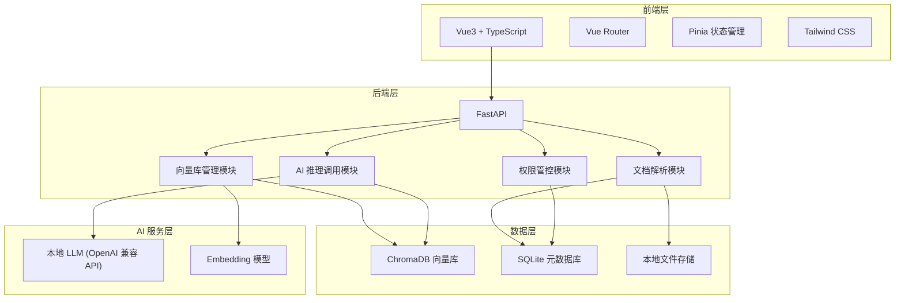
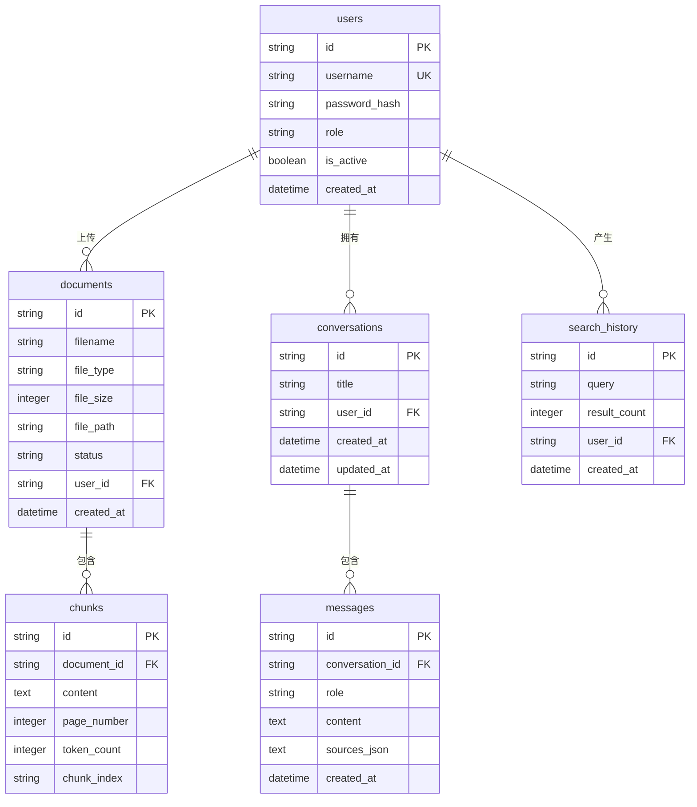

## 1. 架构设计



## 2. 技术说明

- 前端：Vue3 + TypeScript + Vite + Tailwind CSS + Vue Router + Pinia
- 前端初始化工具：vite-init (vue-ts 模板)
- 后端：FastAPI + Uvicorn + LangChain
- 数据库：SQLite（元数据） + ChromaDB（向量存储）
- AI 推理：LangChain + 本地 LLM（OpenAI 兼容 API）
- Embedding：通过 LangChain 调用本地 Embedding 服务

## 3. 路由定义

| 路由 | 用途 |
|------|------|
| /login | 用户登录页 |
| /dashboard | 仪表盘首页 |
| /documents | 文档管理页 |
| /search | 语义检索页 |
| /chat | 智能问答页 |
| /users | 用户管理页（管理员） |

## 4. API 定义

### 4.1 认证 API

```typescript
POST /api/auth/login
  Request:  { username: string; password: string }
  Response: { access_token: string; token_type: string; user: UserInfo }

GET /api/auth/me
  Response: UserInfo

POST /api/auth/change-password
  Request:  { old_password: string; new_password: string }
  Response: { message: string }
```

### 4.2 文档 API

```typescript
POST /api/documents/upload
  Request:  FormData { file: File }
  Response: { document_id: string; filename: string; status: string }

GET /api/documents
  Query:    { page?: number; page_size?: number; keyword?: string }
  Response: { items: DocumentInfo[]; total: number }

GET /api/documents/{document_id}
  Response: DocumentDetail

DELETE /api/documents/{document_id}
  Response: { message: string }

POST /api/documents/{document_id}/reparse
  Response: { message: string; status: string }
```

### 4.3 检索 API

```typescript
POST /api/search
  Request:  { query: string; top_k?: number; threshold?: number }
  Response: { results: SearchResult[] }

GET /api/search/history
  Query:    { page?: number; page_size?: number }
  Response: { items: SearchHistory[]; total: number }
```

### 4.4 问答 API

```typescript
POST /api/chat
  Request:  { question: string; conversation_id?: string }
  Response: Stream[SSE] { answer: string; sources: Source[] }

GET /api/chat/conversations
  Response: Conversation[]

GET /api/chat/conversations/{conversation_id}
  Response: Message[]

DELETE /api/chat/conversations/{conversation_id}
  Response: { message: string }
```

### 4.5 用户管理 API

```typescript
GET /api/users
  Query:    { page?: number; page_size?: number }
  Response: { items: UserInfo[]; total: number }

POST /api/users
  Request:  { username: string; password: string; role: string }
  Response: UserInfo

PUT /api/users/{user_id}
  Request:  { username?: string; role?: string; is_active?: boolean }
  Response: UserInfo

DELETE /api/users/{user_id}
  Response: { message: string }
```

### 4.6 统计 API

```typescript
GET /api/stats/overview
  Response: { document_count: number; vector_count: number; query_count: number; active_users: number }
```

### 4.7 数据类型定义

```typescript
interface UserInfo {
  id: string
  username: string
  role: "admin" | "user"
  is_active: boolean
  created_at: string
}

interface DocumentInfo {
  id: string
  filename: string
  file_type: string
  file_size: number
  status: "uploading" | "parsing" | "completed" | "failed"
  chunk_count: number
  created_at: string
}

interface DocumentDetail extends DocumentInfo {
  chunks: ChunkInfo[]
}

interface ChunkInfo {
  id: string
  content: string
  page_number?: number
  token_count: number
}

interface SearchResult {
  chunk_id: string
  document_id: string
  filename: string
  content: string
  score: number
  page_number?: number
}

interface Source {
  chunk_id: string
  document_id: string
  filename: string
  content: string
  page_number?: number
  score: number
}

interface Conversation {
  id: string
  title: string
  created_at: string
  updated_at: string
}

interface Message {
  id: string
  role: "user" | "assistant"
  content: string
  sources?: Source[]
  created_at: string
}

interface SearchHistory {
  id: string
  query: string
  result_count: number
  created_at: string
}
```

## 5. 后端架构图

```mermaid
flowchart LR
    subgraph API["API 层"]
        AuthRouter["auth.py"]
        DocRouter["documents.py"]
        SearchRouter["search.py"]
        ChatRouter["chat.py"]
        UserRouter["users.py"]
        StatsRouter["stats.py"]
    end

    subgraph Service["服务层"]
        AuthService["认证服务"]
        DocService["文档服务"]
        VectorService["向量服务"]
        ChatService["问答服务"]
        UserService["用户服务"]
    end

    subgraph Core["核心层"]
        Parser["文档解析器"]
        Chunker["文本分块器"]
        Embedder["向量化器"]
        Retriever["检索器"]
        LLMChain["LLM 链"]
    end

    API --> Service
    Service --> Core
```



## 6. 数据模型

### 6.1 数据模型定义



### 6.2 数据定义语言

```sql
CREATE TABLE users (
    id TEXT PRIMARY KEY,
    username TEXT UNIQUE NOT NULL,
    password_hash TEXT NOT NULL,
    role TEXT NOT NULL DEFAULT 'user',
    is_active INTEGER NOT NULL DEFAULT 1,
    created_at TEXT NOT NULL DEFAULT (datetime('now'))
);

CREATE TABLE documents (
    id TEXT PRIMARY KEY,
    filename TEXT NOT NULL,
    file_type TEXT NOT NULL,
    file_size INTEGER NOT NULL,
    file_path TEXT NOT NULL,
    status TEXT NOT NULL DEFAULT 'uploading',
    user_id TEXT NOT NULL REFERENCES users(id),
    created_at TEXT NOT NULL DEFAULT (datetime('now'))
);

CREATE TABLE chunks (
    id TEXT PRIMARY KEY,
    document_id TEXT NOT NULL REFERENCES documents(id) ON DELETE CASCADE,
    content TEXT NOT NULL,
    page_number INTEGER,
    token_count INTEGER NOT NULL DEFAULT 0,
    chunk_index TEXT NOT NULL,
    created_at TEXT NOT NULL DEFAULT (datetime('now'))
);

CREATE TABLE conversations (
    id TEXT PRIMARY KEY,
    title TEXT NOT NULL,
    user_id TEXT NOT NULL REFERENCES users(id),
    created_at TEXT NOT NULL DEFAULT (datetime('now')),
    updated_at TEXT NOT NULL DEFAULT (datetime('now'))
);

CREATE TABLE messages (
    id TEXT PRIMARY KEY,
    conversation_id TEXT NOT NULL REFERENCES conversations(id) ON DELETE CASCADE,
    role TEXT NOT NULL,
    content TEXT NOT NULL,
    sources_json TEXT,
    created_at TEXT NOT NULL DEFAULT (datetime('now'))
);

CREATE TABLE search_history (
    id TEXT PRIMARY KEY,
    query TEXT NOT NULL,
    result_count INTEGER NOT NULL DEFAULT 0,
    user_id TEXT NOT NULL REFERENCES users(id),
    created_at TEXT NOT NULL DEFAULT (datetime('now'))
);

-- 初始管理员账户（密码: admin123）
INSERT INTO users (id, username, password_hash, role, is_active)
VALUES ('admin-001', 'admin', '$2b$12$LJ3m4ys3Hz0JeVN5UxCE/.WmGBjHCFzrG1vXhqqLz.EEqlFmzDIXi', 'admin', 1);

CREATE INDEX idx_documents_user_id ON documents(user_id);
CREATE INDEX idx_documents_status ON documents(status);
CREATE INDEX idx_chunks_document_id ON chunks(document_id);
CREATE INDEX idx_conversations_user_id ON conversations(user_id);
CREATE INDEX idx_messages_conversation_id ON messages(conversation_id);
CREATE INDEX idx_search_history_user_id ON search_history(user_id);
```

## 7. 项目文件结构

```
project/
├── frontend/                    # Vue3 前端
│   ├── src/
│   │   ├── components/          # 公共组件
│   │   ├── composables/         # 组合式函数
│   │   ├── pages/               # 页面组件
│   │   ├── stores/              # Pinia 状态管理
│   │   ├── router/              # 路由配置
│   │   ├── utils/               # 工具函数
│   │   ├── types/               # 类型定义
│   │   ├── App.vue
│   │   └── main.ts
│   ├── package.json
│   ├── vite.config.ts
│   └── tailwind.config.js
├── backend/                     # FastAPI 后端
│   ├── app/
│   │   ├── routers/             # 路由模块
│   │   │   ├── auth.py
│   │   │   ├── documents.py
│   │   │   ├── search.py
│   │   │   ├── chat.py
│   │   │   ├── users.py
│   │   │   └── stats.py
│   │   ├── services/            # 业务服务
│   │   │   ├── auth_service.py
│   │   │   ├── document_service.py
│   │   │   ├── vector_service.py
│   │   │   ├── chat_service.py
│   │   │   └── user_service.py
│   │   ├── core/                # 核心模块
│   │   │   ├── parser/          # 文档解析模块
│   │   │   │   ├── __init__.py
│   │   │   │   ├── pdf_parser.py
│   │   │   │   ├── docx_parser.py
│   │   │   │   ├── txt_parser.py
│   │   │   │   └── markdown_parser.py
│   │   │   ├── chunker.py       # 文本分块器
│   │   │   ├── embedder.py      # 向量化模块
│   │   │   ├── retriever.py     # 检索器
│   │   │   └── llm_chain.py     # LLM 链
│   │   ├── models/              # 数据模型
│   │   │   └── schemas.py
│   │   ├── middleware/          # 中间件
│   │   │   └── auth.py
│   │   ├── config.py            # 配置
│   │   └── main.py              # 入口
│   ├── requirements.txt
│   └── init_db.py               # 数据库初始化
└── .trae/
    └── documents/
```
