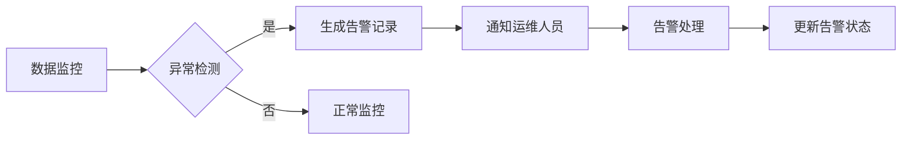

# 水表终端运维管理系统 - 产品需求文档 (PRD)

## 1. 产品概述

水表终端运维管理系统是一套面向水务公司的全栈运维解决方案，实现对海量智能水表终端设备的实时监控、数据采集、异常告警和运维管理。系统通过对接海量水表终端与业务数据库，提供可视化运维看板，支持多维度数据筛选分析，帮助运维人员高效管理水表设备。

- 解决问题：解决海量水表设备统一管理难、数据监控不及时、异常发现滞后等问题
- 目标用户：水务公司运维管理人员、数据分析人员、系统管理员
- 产品价值：提升运维效率、降低运营成本、优化决策支持

## 2. 核心功能

### 2.1 用户角色

| 角色 | 注册方式 | 核心权限 |
|------|---------|---------|
| 系统管理员 | 后台创建 | 全系统管理、用户权限配置、系统设置 |
| 运维人员 | 管理员创建 | 设备监控、异常处理、工单管理、数据查看 |
| 数据分析员 | 管理员创建 | 数据报表、统计分析、导出功能 |

### 2.2 功能模块

1. **运维看板首页**：设备概览、实时数据、异常告警、关键指标
2. **设备管理**：设备列表、设备详情、设备状态、设备配置
3. **数据筛选分析**：多维度筛选、时间范围选择、区域筛选、状态筛选
4. **告警管理**：告警列表、告警详情、告警处理、告警统计
5. **数据统计报表**：用水统计、设备在线率、异常分析、导出报表

### 2.3 页面详情

| 页面名称 | 模块名称 | 功能描述 |
|---------|---------|---------|
| 运维看板首页 | 指标概览卡片 | 显示设备总数、在线率、今日告警数、用水总量等关键指标 |
| 运维看板首页 | 实时数据图表 | 折线图展示24小时用水量、柱状图展示设备状态分布 |
| 运维看板首页 | 告警列表 | 展示最新异常告警，支持快速处理 |
| 设备管理页 | 设备列表 | 分页展示所有水表设备，支持搜索和排序 |
| 设备管理页 | 设备详情 | 展示单设备详细信息、历史数据、告警记录 |
| 数据筛选组件 | 多条件筛选 | 支持时间范围、区域、设备类型、状态等多维度筛选 |
| 告警管理页 | 告警列表 | 展示所有告警记录，支持筛选和批量处理 |
| 统计报表页 | 数据可视化 | 多维度统计图表，支持数据导出 |

## 3. 核心流程

### 3.1 数据采集流程

水表终端定时上报用水数据，服务端接收并验证数据，进行聚合计算后持久化存储，前端看板实时展示最新数据。

### 3.2 异常告警流程

系统实时监控设备状态和用水数据，发现异常时自动生成告警记录，通知运维人员处理，处理完成后更新告警状态。

## 4. 用户界面设计

### 4.1 设计风格

- **主色调**：科技蓝 (#165DFF) - 代表专业、可信赖
- **辅助色**：成功绿 (#00B42A)、告警橙 (#FF7D00)、危险红 (#F53F3F)
- **中性色**：深灰 (#1D2129)、中灰 (#4E5969)、浅灰 (#C9CDD4)、背景 (#F2F3F5)
- **按钮风格**：圆角 8px，主按钮蓝色填充，次要按钮边框样式
- **字体**：Inter 字体族，标题 16-24px，正文 14px，辅助文字 12px
- **布局风格**：卡片式布局，左侧导航 + 顶部标题栏 + 主内容区
- **图标风格**：线性图标，统一 16px/20px 尺寸

### 4.2 页面设计概览

| 页面名称 | 模块名称 | UI元素 |
|---------|---------|--------|
| 运维看板首页 | 指标卡片 | 渐变背景、数值动画、图标装饰、悬浮效果 |
| 运维看板首页 | 图表区域 | ECharts 折线图/柱状图、响应式布局、交互动效 |
| 运维看板首页 | 告警列表 | 状态标签、优先级标识、时间轴样式 |
| 数据筛选组件 | 筛选面板 | 下拉选择器、日期范围、标签式筛选、折叠展开动画 |
| 设备管理页 | 数据表格 | 斑马纹、悬停高亮、状态色标、分页控件 |

### 4.3 响应式设计

- 桌面优先设计，支持 1920px、1440px、1024px 屏幕
- 平板端：导航栏折叠为图标模式，图表自适应调整
- 移动端：底部标签导航，单列布局，简化交互

## 5. 非功能需求

### 5.1 性能要求
- 支持 10万+ 水表终端并发接入
- 数据上报延迟 < 1秒
- 页面加载时间 < 2秒
- 图表渲染流畅，无卡顿

### 5.2 可靠性要求
- 系统可用率 > 99.9%
- 数据持久化不丢失
- 支持断点续传

### 5.3 安全性要求
- 用户身份认证
- 数据传输加密
- 操作日志审计
