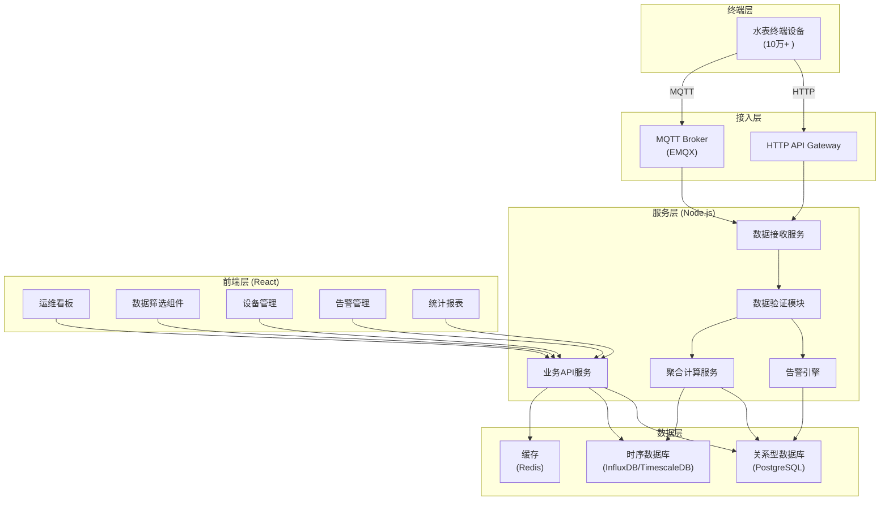
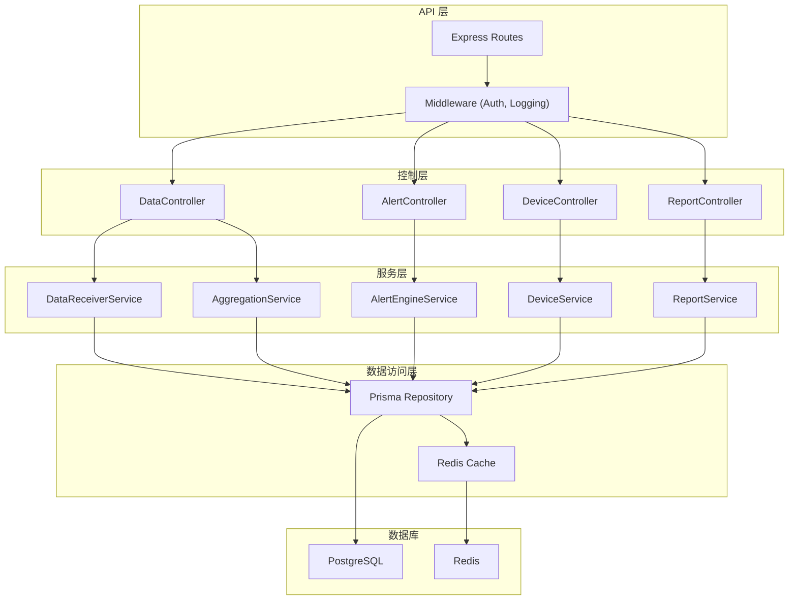
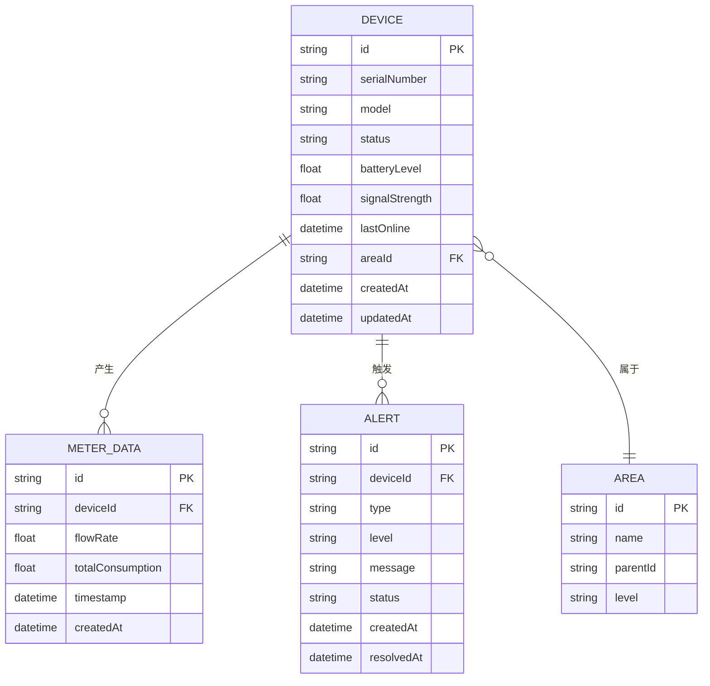

# 水表终端运维管理系统 - 技术架构文档

## 1. 架构设计

### 1.1 系统整体架构



## 2. 技术选型

### 2.1 前端技术栈
- **框架**: React 18 + TypeScript
- **构建工具**: Vite 5
- **UI 组件库**: Ant Design 5
- **图表库**: ECharts 5
- **状态管理**: Zustand
- **路由**: React Router 6
- **HTTP 客户端**: Axios
- **样式方案**: Tailwind CSS 3 + CSS Modules
- **代码规范**: ESLint + Prettier

### 2.2 后端技术栈
- **运行时**: Node.js 20+
- **Web 框架**: Express 4
- **TypeScript**: 全程类型安全
- **数据库**: 
  - PostgreSQL 15 (关系型数据)
  - Redis 7 (缓存、会话)
- **ORM**: Prisma
- **消息队列**: BullMQ (异步任务)
- **认证**: JWT
- **API 文档**: Swagger/OpenAPI

### 2.3 部署与运维
- **容器化**: Docker + Docker Compose
- **进程管理**: PM2
- **日志**: Winston
- **监控**: Prometheus + Grafana

## 3. 目录结构

### 3.1 前端目录结构
```
client/
├── src/
│   ├── components/          # 公共组件
│   │   ├── Dashboard/       # 看板组件
│   │   ├── DataFilter/      # 数据筛选组件
│   │   ├── Charts/          # 图表组件
│   │   └── Common/          # 通用组件
│   ├── pages/               # 页面组件
│   │   ├── Dashboard/
│   │   ├── Devices/
│   │   ├── Alerts/
│   │   └── Reports/
│   ├── stores/              # 状态管理
│   ├── services/            # API 服务
│   ├── types/               # TypeScript 类型定义
│   ├── utils/               # 工具函数
│   ├── hooks/               # 自定义 Hooks
│   ├── styles/              # 全局样式
│   ├── router/              # 路由配置
│   ├── App.tsx
│   └── main.tsx
├── public/
├── package.json
├── tsconfig.json
├── vite.config.ts
└── tailwind.config.js
```

### 3.2 后端目录结构
```
server/
├── src/
│   ├── controllers/         # 控制器层
│   ├── services/            # 业务逻辑层
│   │   ├── dataReceiver.ts  # 数据接收服务
│   │   ├── aggregation.ts   # 聚合计算服务
│   │   └── alertEngine.ts   # 告警引擎
│   ├── repositories/        # 数据访问层
│   ├── routes/              # 路由定义
│   ├── middleware/          # 中间件
│   ├── models/              # 数据模型
│   ├── types/               # TypeScript 类型
│   ├── utils/               # 工具函数
│   ├── config/              # 配置文件
│   ├── jobs/                # 定时任务
│   └── index.ts             # 入口文件
├── prisma/                  # Prisma Schema
├── test/                    # 测试文件
├── package.json
├── tsconfig.json
└── Dockerfile
```

## 4. 路由定义

### 4.1 前端路由
| 路由路径 | 页面名称 | 说明 |
|---------|---------|------|
| / | 运维看板首页 | 设备概览、实时数据、告警信息 |
| /devices | 设备管理 | 设备列表、设备详情 |
| /alerts | 告警管理 | 告警列表、告警处理 |
| /reports | 统计报表 | 数据统计、报表导出 |
| /settings | 系统设置 | 系统配置、用户管理 |

### 4.2 后端 API 路由
| 方法 | 路由 | 说明 |
|-----|------|------|
| POST | /api/v1/data/receive | 接收水表终端上报数据 |
| GET | /api/v1/devices | 获取设备列表 |
| GET | /api/v1/devices/:id | 获取设备详情 |
| GET | /api/v1/data/overview | 获取看板概览数据 |
| GET | /api/v1/data/history | 获取历史数据 |
| GET | /api/v1/alerts | 获取告警列表 |
| PUT | /api/v1/alerts/:id/handle | 处理告警 |
| GET | /api/v1/reports/statistics | 获取统计数据 |

## 5. API 定义

### 5.1 数据上报接口

**请求类型**: `POST /api/v1/data/receive`

**请求体**:
```typescript
interface MeterDataRequest {
  deviceId: string;
  timestamp: number;
  flowRate: number;
  totalConsumption: number;
  batteryLevel: number;
  signalStrength: number;
  status: 'normal' | 'warning' | 'error' | 'offline';
}
```

**响应体**:
```typescript
interface ApiResponse<T> {
  code: number;
  message: string;
  data: T;
}

interface ReceiveResponse {
  success: boolean;
  receivedAt: number;
}
```

### 5.2 看板概览接口

**请求类型**: `GET /api/v1/data/overview`

**响应体**:
```typescript
interface DashboardOverview {
  totalDevices: number;
  onlineDevices: number;
  offlineDevices: number;
  todayAlerts: number;
  todayConsumption: number;
  deviceStatusDistribution: {
    normal: number;
    warning: number;
    error: number;
    offline: number;
  };
  hourlyConsumption: {
    hour: number;
    consumption: number;
  }[];
  recentAlerts: Alert[];
}
```

## 6. 服务端架构图



## 7. 数据模型

### 7.1 ER 图



### 7.2 Prisma Schema

```prisma
model Device {
  id              String    @id @default(uuid())
  serialNumber    String    @unique
  model           String
  status          String    @default("online")
  batteryLevel    Float?
  signalStrength  Float?
  lastOnline      DateTime?
  areaId          String?
  area            Area?     @relation(fields: [areaId], references: [id])
  meterData       MeterData[]
  alerts          Alert[]
  createdAt       DateTime  @default(now())
  updatedAt       DateTime  @updatedAt

  @@index([serialNumber])
  @@index([status])
  @@index([areaId])
}

model MeterData {
  id                String    @id @default(uuid())
  deviceId          String
  device            Device    @relation(fields: [deviceId], references: [id], onDelete: Cascade)
  flowRate          Float
  totalConsumption  Float
  timestamp         DateTime  @default(now())
  createdAt         DateTime  @default(now())

  @@index([deviceId])
  @@index([timestamp])
}

model Alert {
  id          String    @id @default(uuid())
  deviceId    String
  device      Device    @relation(fields: [deviceId], references: [id], onDelete: Cascade)
  type        String
  level       String
  message     String
  status      String    @default("pending")
  createdAt   DateTime  @default(now())
  resolvedAt  DateTime?

  @@index([deviceId])
  @@index([status])
  @@index([createdAt])
}

model Area {
  id        String   @id @default(uuid())
  name      String
  parentId  String?
  level     Int
  children  Area[]   @relation("AreaHierarchy")
  parent    Area?    @relation("AreaHierarchy", fields: [parentId], references: [id])
  devices   Device[]

  @@index([parentId])
}
```
