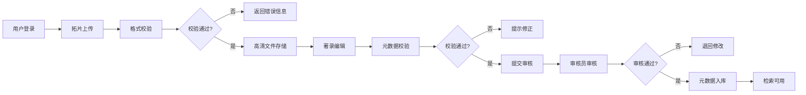

## 1. 产品概述

拓片数字化管理系统是面向文博机构的专业数字资产管理平台，实现拓片文物的全生命周期数字化管理，解决传统拓片管理中存储分散、检索困难、著录不规范等问题。

- **核心目标**：建立标准化的拓片数字化流程，实现高清拓片图像的安全存储与智能检索
- **目标用户**：博物馆馆员、文物研究者、档案管理员
- **市场价值**：助力文化遗产数字化保护，提升文物资源利用效率

## 2. 核心功能

### 2.1 用户角色

| 角色 | 注册方式 | 核心权限 |
|------|----------|----------|
| 系统管理员 | 后台创建 | 用户管理、系统配置、数据备份 |
| 录入员 | 管理员分配 | 拓片上传、著录编辑、草稿管理 |
| 审核员 | 管理员分配 | 著录审核、流程管控、质量检查 |
| 检索用户 | 管理员分配 | 数据检索、拓片浏览、导出申请 |

### 2.2 功能模块

1. **拓片上传页面**：文件拖拽上传、格式校验、上传进度、批量处理
2. **著录编辑页面**：元数据录入、字段校验、版本管理、提交审核
3. **检索查询页面**：高级检索、全文检索、结果展示、详情浏览

### 2.3 页面详情

| 页面名称 | 模块名称 | 功能描述 |
|----------|----------|----------|
| 拓片上传 | 上传区域 | 支持拖拽上传，支持TIFF/JPEG/PNG/PDF格式，单文件最大2GB |
| 拓片上传 | 格式校验 | 实时校验文件格式、分辨率、色彩空间，生成校验报告 |
| 拓片上传 | 批量管理 | 多文件队列管理、断点续传、上传状态追踪 |
| 著录编辑 | 元数据表单 | 包含基本信息、拓印信息、收藏信息、著录信息四大类字段 |
| 著录编辑 | 字段校验 | 必填项校验、格式校验、数据规范校验 |
| 著录编辑 | 版本管理 | 编辑历史记录、版本对比、回滚功能 |
| 著录编辑 | 流程提交 | 提交审核、草稿保存、审核状态跟踪 |
| 检索查询 | 高级检索 | 多条件组合检索、时间范围筛选、模糊匹配 |
| 检索查询 | 全文检索 | 基于元数据的全文搜索、关键词高亮 |
| 检索查询 | 结果展示 | 列表视图、缩略图视图、分页排序 |
| 检索查询 | 详情浏览 | 高清图像预览、元数据详情、关联数据展示 |

## 3. 核心流程

用户上传拓片文件后，系统先进行格式校验，通过后存入高清附件库；录入员完善元数据并提交审核，审核通过后元数据正式入库，即可通过检索功能查询。

## 4. 用户界面设计

### 4.1 设计风格

- **设计理念**：典雅厚重的文博风格，融合现代简洁的交互设计
- **主色调**：深棕色 `#5D4037` - 代表古籍文物的厚重感
- **辅助色**：米金色 `#D4AF37` - 象征拓片的金石质感
- **背景色**：米白色 `#F5F1E8` - 仿古纸张色调，减少视觉疲劳
- **字体**：标题使用「思源宋体」体现文化底蕴，正文使用「思源黑体」保证可读性
- **布局**：三栏式布局，左侧导航、中间内容区、右侧详情面板
- **图标**：线性图标风格，融入印章、拓印等文化元素

### 4.2 页面设计概述

| 页面名称 | 模块名称 | UI设计元素 |
|----------|----------|------------|
| 拓片上传 | 上传区域 | 虚线边框拖拽区，仿古印章样式的上传按钮，进度条采用水墨晕染动画 |
| 拓片上传 | 校验报告 | 卡片式布局，绿/红圆点标识校验项，展开查看详细参数 |
| 著录编辑 | 元数据表单 | 分组标签页，字段采用仿古边框，必填项用金色星号标注 |
| 著录编辑 | 版本历史 | 时间轴样式展示编辑记录，对比视图采用左右分栏 |
| 检索查询 | 检索条件 | 折叠式筛选面板，搜索框采用古籍卷轴样式 |
| 检索查询 | 结果展示 | 卡片式网格布局，悬停时展示缩略图动效，分页采用竹简样式 |

### 4.3 响应式设计

- **桌面优先**：1920px宽度优化，三栏布局充分利用大屏空间
- **平板适配**：1024px切换为两栏布局，详情面板改为底部抽屉
- **移动端**：768px以下单栏布局，导航改为底部Tab，上传支持移动端相机直接拍摄

### 4.4 交互动效

- 页面加载：采用卷轴展开动画，从顶部向下渐显内容
- 表单提交：按钮点击后呈现水墨晕染扩散效果
- 图像预览：双指缩放支持，平移查看高清细节
- 状态切换：标签页切换采用书页翻动过渡效果
