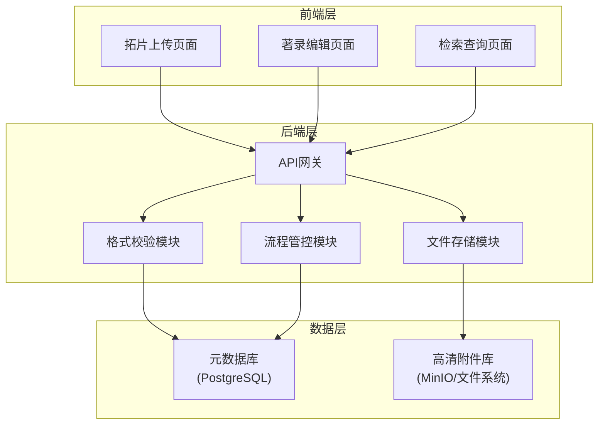
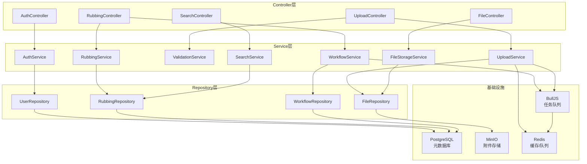
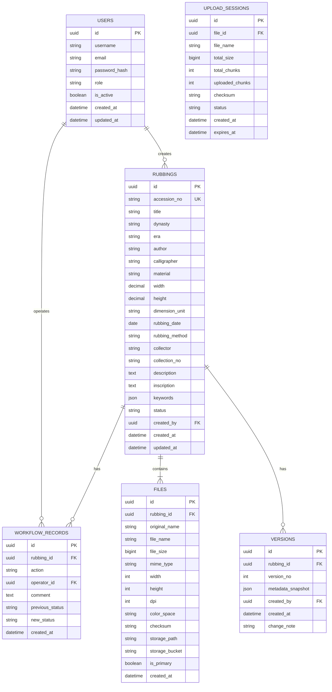

## 1. 架构设计



## 2. 技术栈说明

### 2.1 前端技术栈
- **框架**: React@18 + TypeScript
- **构建工具**: Vite@5
- **样式方案**: TailwindCSS@3 + CSS Modules
- **路由管理**: React Router@6
- **状态管理**: Zustand@4
- **UI组件库**: Ant Design@5 (定制化主题)
- **文件上传**: react-dropzone + axios (分片上传)
- **图像预览**: react-image-magnify + OpenSeadragon (高清缩放)
- **表单校验**: react-hook-form + zod

### 2.2 后端技术栈
- **运行环境**: Node.js@20
- **框架**: NestJS@10 (模块化架构)
- **API协议**: RESTful API + WebSocket (上传进度)
- **文件处理**: sharp (图像处理) + multer (文件上传)
- **格式校验**: file-type + exifreader (元数据提取)
- **工作流引擎**: @nestjs/bull + Redis (异步任务队列)

### 2.3 数据存储方案
- **元数据库**: PostgreSQL@16 - 存储拓片元数据、用户信息、流程状态
- **高清附件库**: MinIO (对象存储) - 存储高清拓片图像文件，支持大文件分片上传
- **缓存层**: Redis@7 - 缓存热点数据、管理上传会话、任务队列

## 3. 路由定义

| 路由路径 | 页面组件 | 功能说明 |
|----------|----------|----------|
| `/` | 首页仪表盘 | 系统概览、快捷入口、统计数据 |
| `/upload` | 拓片上传页面 | 拖拽上传、格式校验、批量管理 |
| `/catalog/:id` | 著录编辑页面 | 元数据录入、版本管理、提交审核 |
| `/catalog/list` | 著录列表页面 | 草稿列表、审核中列表、已发布列表 |
| `/search` | 检索查询页面 | 高级检索、结果展示、详情浏览 |
| `/login` | 登录页面 | 用户认证、权限校验 |

## 4. API 接口定义

### 4.1 TypeScript 类型定义

```typescript
// 拓片元数据
interface RubbingMetadata {
  id: string;
  accessionNo: string; //  accession number
  title: string;
  dynasty: string;
  era: string;
  author: string;
  calligrapher: string;
  material: string;
  dimensions: {
    width: number;
    height: number;
    unit: string;
  };
  rubbingDate: string;
  rubbingMethod: string;
  collector: string;
  collectionNo: string;
  description: string;
  inscription: string;
  keywords: string[];
  status: 'draft' | 'pending' | 'approved' | 'rejected';
  createdAt: string;
  updatedAt: string;
}

// 上传文件信息
interface UploadFile {
  id: string;
  originalName: string;
  fileName: string;
  fileSize: number;
  fileType: string;
  mimeType: string;
  width: number;
  height: number;
  dpi: number;
  colorSpace: string;
  checksum: string;
  storagePath: string;
  uploadStatus: 'uploading' | 'completed' | 'failed';
  progress: number;
}

// 校验结果
interface ValidationResult {
  valid: boolean;
  errors: ValidationError[];
  warnings: ValidationWarning[];
}

interface ValidationError {
  field: string;
  message: string;
  code: string;
}

// 流程记录
interface WorkflowRecord {
  id: string;
  rubbingId: string;
  action: 'submit' | 'approve' | 'reject' | 'modify';
  operator: string;
  comment: string;
  timestamp: string;
  previousStatus: string;
  newStatus: string;
}

// 检索条件
interface SearchQuery {
  keyword?: string;
  dynasty?: string;
  era?: string;
  author?: string;
  dateRange?: [string, string];
  status?: string[];
  page: number;
  pageSize: number;
  sortBy: string;
  sortOrder: 'asc' | 'desc';
}

interface SearchResult<T> {
  total: number;
  items: T[];
  page: number;
  pageSize: number;
}
```

### 4.2 API 接口列表

| 方法 | 路径 | 功能描述 |
|------|------|----------|
| POST | `/api/auth/login` | 用户登录 |
| GET | `/api/auth/me` | 获取当前用户信息 |
| POST | `/api/upload/init` | 初始化上传会话 |
| POST | `/api/upload/chunk` | 上传分片 |
| POST | `/api/upload/complete` | 完成上传并合并分片 |
| POST | `/api/upload/validate` | 格式校验 |
| GET | `/api/upload/progress/:sessionId` | 获取上传进度 (WebSocket) |
| GET | `/api/rubbings` | 获取拓片列表 |
| GET | `/api/rubbings/:id` | 获取拓片详情 |
| POST | `/api/rubbings` | 创建拓片记录 |
| PUT | `/api/rubbings/:id` | 更新拓片元数据 |
| DELETE | `/api/rubbings/:id` | 删除拓片记录 |
| GET | `/api/rubbings/:id/versions` | 获取版本历史 |
| POST | `/api/rubbings/:id/submit` | 提交审核 |
| POST | `/api/rubbings/:id/approve` | 审核通过 |
| POST | `/api/rubbings/:id/reject` | 审核驳回 |
| GET | `/api/rubbings/:id/workflow` | 获取流程记录 |
| POST | `/api/search` | 高级检索 |
| GET | `/api/files/:id/preview` | 获取预览图 |
| GET | `/api/files/:id/tiles` | 获取高清切片 (OpenSeadragon) |
| GET | `/api/files/:id/download` | 下载原文件 |

## 5. 后端服务架构



## 6. 数据模型

### 6.1 ER图



### 6.2 DDL 语句

```sql
-- 扩展
CREATE EXTENSION IF NOT EXISTS "uuid-ossp";
CREATE EXTENSION IF NOT EXISTS "pg_trgm";

-- 用户表
CREATE TABLE users (
    id UUID PRIMARY KEY DEFAULT uuid_generate_v4(),
    username VARCHAR(50) UNIQUE NOT NULL,
    email VARCHAR(100) UNIQUE NOT NULL,
    password_hash VARCHAR(255) NOT NULL,
    role VARCHAR(20) NOT NULL CHECK (role IN ('admin', 'operator', 'auditor', 'viewer')),
    is_active BOOLEAN DEFAULT true,
    created_at TIMESTAMP WITH TIME ZONE DEFAULT CURRENT_TIMESTAMP,
    updated_at TIMESTAMP WITH TIME ZONE DEFAULT CURRENT_TIMESTAMP
);

-- 拓片主表
CREATE TABLE rubbings (
    id UUID PRIMARY KEY DEFAULT uuid_generate_v4(),
    accession_no VARCHAR(50) UNIQUE NOT NULL,
    title VARCHAR(255) NOT NULL,
    dynasty VARCHAR(50),
    era VARCHAR(50),
    author VARCHAR(100),
    calligrapher VARCHAR(100),
    material VARCHAR(50),
    width DECIMAL(10,2),
    height DECIMAL(10,2),
    dimension_unit VARCHAR(10) DEFAULT 'cm',
    rubbing_date DATE,
    rubbing_method VARCHAR(50),
    collector VARCHAR(100),
    collection_no VARCHAR(50),
    description TEXT,
    inscription TEXT,
    keywords JSONB DEFAULT '[]',
    status VARCHAR(20) NOT NULL DEFAULT 'draft' CHECK (status IN ('draft', 'pending', 'approved', 'rejected')),
    created_by UUID REFERENCES users(id),
    created_at TIMESTAMP WITH TIME ZONE DEFAULT CURRENT_TIMESTAMP,
    updated_at TIMESTAMP WITH TIME ZONE DEFAULT CURRENT_TIMESTAMP
);

-- 全文检索索引
CREATE INDEX idx_rubbings_fts ON rubbings 
USING GIN (to_tsvector('chinese', title || ' ' || coalesce(description, '') || ' ' || coalesce(inscription, '')));

CREATE INDEX idx_rubbings_keywords ON rubbings USING GIN (keywords);
CREATE INDEX idx_rubbings_status ON rubbings(status);
CREATE INDEX idx_rubbings_dynasty ON rubbings(dynasty);

-- 文件表
CREATE TABLE files (
    id UUID PRIMARY KEY DEFAULT uuid_generate_v4(),
    rubbing_id UUID REFERENCES rubbings(id) ON DELETE CASCADE,
    original_name VARCHAR(255) NOT NULL,
    file_name VARCHAR(255) NOT NULL,
    file_size BIGINT NOT NULL,
    mime_type VARCHAR(100) NOT NULL,
    width INTEGER,
    height INTEGER,
    dpi INTEGER,
    color_space VARCHAR(20),
    checksum VARCHAR(64) NOT NULL,
    storage_path VARCHAR(500) NOT NULL,
    storage_bucket VARCHAR(50) NOT NULL,
    is_primary BOOLEAN DEFAULT false,
    created_at TIMESTAMP WITH TIME ZONE DEFAULT CURRENT_TIMESTAMP
);

CREATE INDEX idx_files_rubbing_id ON files(rubbing_id);

-- 版本历史表
CREATE TABLE versions (
    id UUID PRIMARY KEY DEFAULT uuid_generate_v4(),
    rubbing_id UUID REFERENCES rubbings(id) ON DELETE CASCADE,
    version_no INTEGER NOT NULL,
    metadata_snapshot JSONB NOT NULL,
    created_by UUID REFERENCES users(id),
    created_at TIMESTAMP WITH TIME ZONE DEFAULT CURRENT_TIMESTAMP,
    change_note TEXT,
    UNIQUE(rubbing_id, version_no)
);

-- 流程记录表
CREATE TABLE workflow_records (
    id UUID PRIMARY KEY DEFAULT uuid_generate_v4(),
    rubbing_id UUID REFERENCES rubbings(id) ON DELETE CASCADE,
    action VARCHAR(20) NOT NULL CHECK (action IN ('submit', 'approve', 'reject', 'modify')),
    operator_id UUID REFERENCES users(id),
    comment TEXT,
    previous_status VARCHAR(20),
    new_status VARCHAR(20) NOT NULL,
    created_at TIMESTAMP WITH TIME ZONE DEFAULT CURRENT_TIMESTAMP
);

CREATE INDEX idx_workflow_rubbing_id ON workflow_records(rubbing_id);
CREATE INDEX idx_workflow_created_at ON workflow_records(created_at DESC);

-- 上传会话表
CREATE TABLE upload_sessions (
    id UUID PRIMARY KEY DEFAULT uuid_generate_v4(),
    file_id UUID,
    file_name VARCHAR(255) NOT NULL,
    total_size BIGINT NOT NULL,
    total_chunks INTEGER NOT NULL,
    uploaded_chunks INTEGER DEFAULT 0,
    checksum VARCHAR(64),
    status VARCHAR(20) NOT NULL DEFAULT 'active' CHECK (status IN ('active', 'completed', 'failed', 'expired')),
    created_at TIMESTAMP WITH TIME ZONE DEFAULT CURRENT_TIMESTAMP,
    expires_at TIMESTAMP WITH TIME ZONE NOT NULL
);

-- 初始化管理员账号
INSERT INTO users (username, email, password_hash, role) VALUES 
('admin', 'admin@rubbing-system.com', '$2b$10$default_admin_password_hash', 'admin');
```
