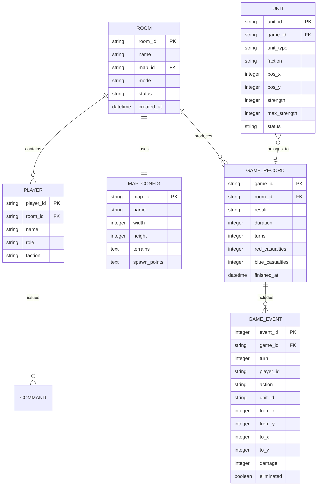

## 1. 架构设计

```mermaid
graph TB
    subgraph "客户端 (React + Vite)"
        "战情大厅" --> "阵地视图"
        "阵地视图" --> "指挥面板"
        "指挥面板" --> "WebSocket 客户端"
        "阵地视图" --> "Canvas 渲染引擎"
    end

    subgraph "服务端 (Express + WebSocket)"
        "WebSocket 服务" --> "推演引擎"
        "推演引擎" --> "状态管理器"
        "状态管理器" --> "操作日志"
        "WebSocket 服务" --> "状态管理器"
        "状态管理器" --> "存档服务"
    end

    subgraph "数据层"
        "存档服务" --> "SQLite 数据库"
        "对局配置" --> "SQLite 数据库"
    end

    "WebSocket 客户端" -->|"实时通信"| "WebSocket 服务"
```

## 2. 技术说明

- **前端**：React@18 + TypeScript + TailwindCSS@3 + Vite
- **地图渲染**：HTML5 Canvas 2D API + 自定义渲染引擎
- **状态管理**：Zustand（轻量级，适合实时同步场景）
- **实时通信**：WebSocket (ws 库)
- **初始化工具**：Vite
- **后端**：Express@4 + TypeScript + ws
- **数据库**：SQLite (better-sqlite3)，零配置嵌入式数据库，适合单机部署
- **数据验证**：Zod（前后端共享 Schema）

## 3. 路由定义

| 路由 | 用途 |
|------|------|
| `/` | 战情大厅 - 对局列表、创建房间、战绩统计 |
| `/battle/:roomId` | 阵地视图 - 战术地图、指挥面板、推演控制 |
| `/replay/:gameId` | 回放视图 - 历史对局回放、战报查看 |

## 4. API 定义

### 4.1 REST API

```typescript
// 对局管理
interface CreateRoomRequest {
  mapId: string;
  mode: "turn-based" | "realtime";
  maxPlayers: number;
  timeLimit: number;
  factionBalance: { red: number; blue: number };
}

interface CreateRoomResponse {
  roomId: string;
  createdAt: string;
}

interface Room {
  roomId: string;
  name: string;
  mapId: string;
  mode: "turn-based" | "realtime";
  status: "waiting" | "playing" | "finished";
  players: Player[];
  createdAt: string;
}

interface Player {
  playerId: string;
  name: string;
  role: "commander" | "staff" | "observer";
  faction: "red" | "blue" | "none";
}

// 地图配置
interface MapConfig {
  mapId: string;
  name: string;
  width: number;
  height: number;
  terrains: TerrainCell[];
  spawnPoints: { red: Position[]; blue: Position[] };
}

interface TerrainCell {
  x: number;
  y: number;
  type: "plain" | "mountain" | "water" | "urban" | "forest" | "road";
  defenseBonus: number;
  movementCost: number;
}

interface Position {
  x: number;
  y: number;
}

// 对局存档
interface GameRecord {
  gameId: string;
  roomId: string;
  result: "red_win" | "blue_win" | "draw";
  duration: number;
  turns: number;
  events: GameEvent[];
  redCasualties: number;
  blueCasualties: number;
}

interface GameEvent {
  turn: number;
  timestamp: string;
  playerId: string;
  action: "deploy" | "move" | "attack" | "defend";
  unitId: string;
  from: Position;
  to: Position;
  result?: { damage: number; eliminated: boolean };
}
```

### 4.2 WebSocket 消息协议

```typescript
// 客户端 → 服务端
type ClientMessage =
  | { type: "join"; roomId: string; playerId: string; faction: "red" | "blue" }
  | { type: "deploy"; units: DeployUnit[] }
  | { type: "command"; commands: UnitCommand[] }
  | { type: "confirm_turn"; turn: number }
  | { type: "ready" }
  | { type: "chat"; message: string };

// 服务端 → 客户端
type ServerMessage =
  | { type: "room_state"; state: RoomState }
  | { type: "game_start"; config: GameConfig }
  | { type: "turn_result"; turn: number; events: GameEvent[]; state: GameState }
  | { type: "sync"; state: GameState }
  | { type: "player_joined"; player: Player }
  | { type: "log"; entry: LogEntry }
  | { type: "game_over"; result: GameResult }
  | { type: "error"; message: string };

interface DeployUnit {
  unitId: string;
  unitType: "infantry" | "armor" | "artillery" | "recon" | "supply";
  position: Position;
  strength: number;
}

interface UnitCommand {
  unitId: string;
  action: "move" | "attack" | "defend" | "hold";
  target?: Position;
  targetUnitId?: string;
}

interface GameState {
  turn: number;
  phase: "deploy" | "command" | "resolving" | "finished";
  units: UnitState[];
  redScore: number;
  blueScore: number;
}

interface UnitState {
  unitId: string;
  unitType: string;
  faction: "red" | "blue";
  position: Position;
  strength: number;
  maxStrength: number;
  status: "active" | "suppressed" | "destroyed";
  defenseBonus: number;
}

interface LogEntry {
  timestamp: string;
  playerId: string;
  playerName: string;
  faction: "red" | "blue";
  content: string;
}
```

## 5. 服务端架构图

```mermaid
graph LR
    "路由控制器" --> "房间服务"
    "路由控制器" --> "存档服务"
    "房间服务" --> "推演引擎"
    "房间服务" --> "状态管理器"
    "推演引擎" --> "战损计算器"
    "推演引擎" --> "移动验证器"
    "状态管理器" --> "WebSocket 广播器"
    "存档服务" --> "数据仓库"
    "数据仓库" --> "SQLite"
```

## 6. 数据模型

### 6.1 数据模型定义



### 6.2 数据定义语言

```sql
CREATE TABLE map_config (
  map_id TEXT PRIMARY KEY,
  name TEXT NOT NULL,
  width INTEGER NOT NULL,
  height INTEGER NOT NULL,
  terrains TEXT NOT NULL,
  spawn_points TEXT NOT NULL
);

CREATE TABLE room (
  room_id TEXT PRIMARY KEY,
  name TEXT NOT NULL,
  map_id TEXT NOT NULL REFERENCES map_config(map_id),
  mode TEXT NOT NULL CHECK(mode IN ('turn-based', 'realtime')),
  status TEXT NOT NULL DEFAULT 'waiting' CHECK(status IN ('waiting', 'playing', 'finished')),
  created_at DATETIME DEFAULT CURRENT_TIMESTAMP
);

CREATE TABLE player (
  player_id TEXT PRIMARY KEY,
  room_id TEXT NOT NULL REFERENCES room(room_id),
  name TEXT NOT NULL,
  role TEXT NOT NULL CHECK(role IN ('commander', 'staff', 'observer')),
  faction TEXT NOT NULL CHECK(faction IN ('red', 'blue', 'none'))
);

CREATE TABLE game_record (
  game_id TEXT PRIMARY KEY,
  room_id TEXT NOT NULL REFERENCES room(room_id),
  result TEXT NOT NULL CHECK(result IN ('red_win', 'blue_win', 'draw')),
  duration INTEGER NOT NULL,
  turns INTEGER NOT NULL,
  red_casualties INTEGER DEFAULT 0,
  blue_casualties INTEGER DEFAULT 0,
  finished_at DATETIME DEFAULT CURRENT_TIMESTAMP
);

CREATE TABLE game_event (
  event_id INTEGER PRIMARY KEY AUTOINCREMENT,
  game_id TEXT NOT NULL REFERENCES game_record(game_id),
  turn INTEGER NOT NULL,
  player_id TEXT NOT NULL,
  action TEXT NOT NULL CHECK(action IN ('deploy', 'move', 'attack', 'defend')),
  unit_id TEXT NOT NULL,
  from_x INTEGER,
  from_y INTEGER,
  to_x INTEGER,
  to_y INTEGER,
  damage INTEGER DEFAULT 0,
  eliminated BOOLEAN DEFAULT FALSE
);

CREATE TABLE unit (
  unit_id TEXT PRIMARY KEY,
  game_id TEXT NOT NULL REFERENCES game_record(game_id),
  unit_type TEXT NOT NULL CHECK(unit_type IN ('infantry', 'armor', 'artillery', 'recon', 'supply')),
  faction TEXT NOT NULL CHECK(faction IN ('red', 'blue')),
  pos_x INTEGER NOT NULL,
  pos_y INTEGER NOT NULL,
  strength INTEGER NOT NULL,
  max_strength INTEGER NOT NULL,
  status TEXT NOT NULL DEFAULT 'active' CHECK(status IN ('active', 'suppressed', 'destroyed'))
);

CREATE INDEX idx_game_event_game_id ON game_event(game_id);
CREATE INDEX idx_game_event_turn ON game_event(game_id, turn);
CREATE INDEX idx_unit_game_id ON unit(game_id);
CREATE INDEX idx_player_room_id ON player(room_id);
CREATE INDEX idx_game_record_room_id ON game_record(room_id);

-- 初始地图数据
INSERT INTO map_config (map_id, name, width, height, terrains, spawn_points) VALUES
('map_01', '河谷要塞', 20, 16,
 '[{"x":0,"y":0,"type":"plain","defenseBonus":0,"movementCost":1},{"x":1,"y":0,"type":"forest","defenseBonus":2,"movementCost":2}]',
 '{"red":[{"x":2,"y":2},{"x":3,"y":2},{"x":2,"y":3}],"blue":[{"x":17,"y":13},{"x":16,"y":13},{"x":17,"y":12}]}'),
('map_02', '城镇争夺', 24, 18,
 '[{"x":0,"y":0,"type":"urban","defenseBonus":4,"movementCost":2},{"x":1,"y":0,"type":"road","defenseBonus":0,"movementCost":0.5}]',
 '{"red":[{"x":2,"y":2},{"x":3,"y":2},{"x":2,"y":3}],"blue":[{"x":21,"y":15},{"x":20,"y":15},{"x":21,"y":14}]}');
```
